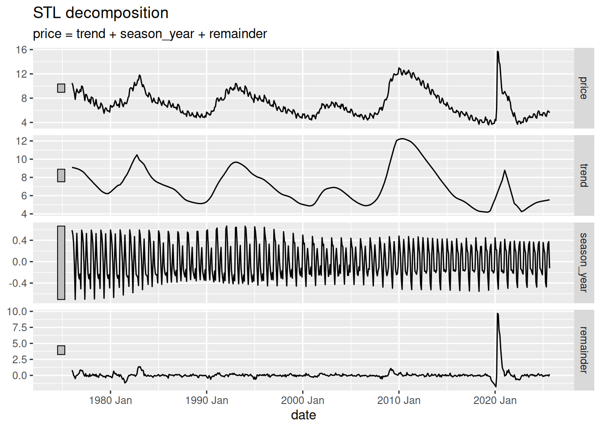

# Descomposición de series de tiempo

Code

- [Show All Code](javascript:void(0))

- [Hide All Code](javascript:void(0))

- 

  ------------------------------------------------------------------------

- [View Source](javascript:void(0))

Intro a la descomposición STL usando `fable`

Author

Pablo Benavides Herrera

Published

February 4, 2026

Modified

June 3, 2026

## 1 pkgs

Code

``` r
library(tidyverse)
library(fpp3)
```

## 2 Descarga de datos del FRED usando `tidyquant`

Code

``` r
ur_cal <- tidyquant::tq_get(
  x    = "CAURN",
  get  = "economic.data",
  from = "1976-01-01",
  to   = "2025-09-01"
)
```

    Registered S3 method overwritten by 'quantmod':
      method            from
      as.zoo.data.frame zoo 

Code

``` r
ur_cal
```

### 2.1 exportar a csv

Code

``` r
ur_cal |> # se pone el pipe con CTRL/CMD + SHIFT + M
  write_csv("ur_cal.csv")
```

## 3 Descomposición STL

Code

``` r
ur_cal
```

### 3.1 Convertir la tabla a `tsibble`

La tabla es una `tibble` y necesitamos que sea una `tsibble`. Podemos convertirla utilizando la función `as_tsibble()`, y especificando el `index` (variable temporal). En caso de que la tabla contenga más de una serie de tiempo, es necesario especificar también el `key` (columna(s) que le indican a R cómo distinguir a cada serie).

Code

``` r
ur_cal_tsb <- ur_cal |>
  as_tsibble(index = date)

ur_cal_tsb
```

La `tsibble` está mal porque R cree que la serie tiene una periodicidad diaria y no mensual. Esto se controla con el **formato** de la fecha. Vamos a convertir la fecha a formato año-mes (*yearmonth*).

Code

``` r
ur_cal_tsb <- ur_cal |>
  mutate(date = yearmonth(date)) |> #<1>
  as_tsibble(index = date)          #<2>

ur_cal_tsb
```

1.  Convertimos la columna `date` a formato `yearmonth`. también existen funciones como `yearquarter()` y `yearweek()`.
2.  Convertimos la tabla a `tsibble`, especificando la columna `date` como índice temporal.

Ahora sí, podemos hacer la descomposición STL utilizando la función `model()` y la función `STL()`.

### 3.2 Descomposición STL

Code

``` r
ur_cal_dcmp <- ur_cal_tsb |>
  model(
    stl = STL(price, robust = TRUE) #<1>
  )

ur_cal_dcmp |> 
  components() |>      #<2>
  autoplot()           #<3>
```

1.  Especificamos que queremos hacer una descomposición STL de la variable `price`.
2.  Extraemos los componentes de la descomposición utilizando la función `components()`.
3.  Graficamos los componentes utilizando la función `autoplot()`.

[](26-02-04---ts_dcmp_files/figure-html/unnamed-chunk-7-1.png)

Back to top
