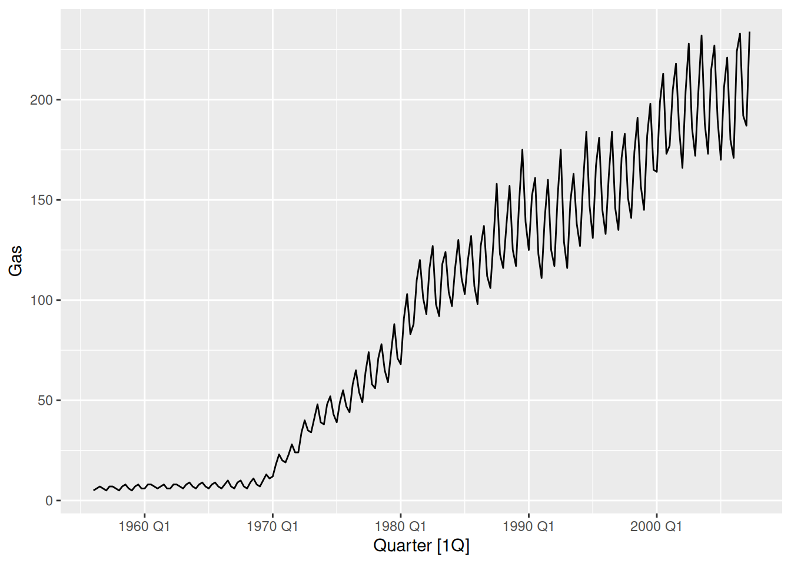
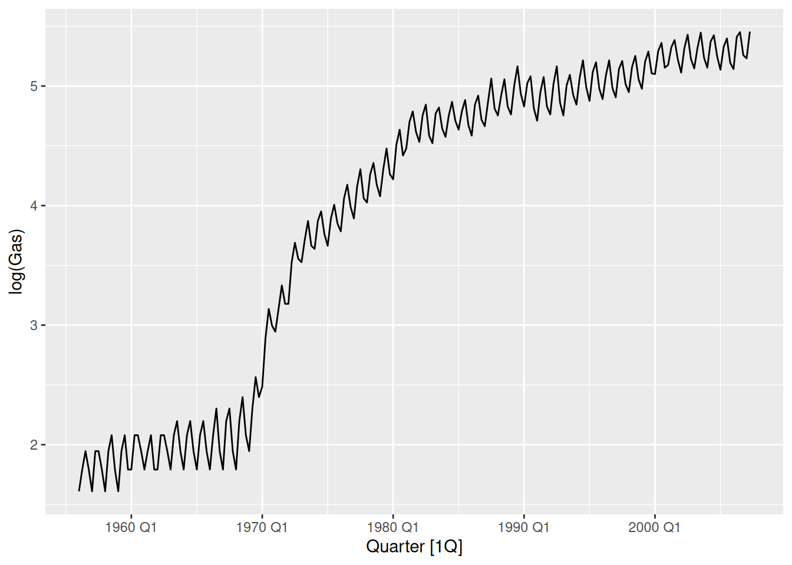
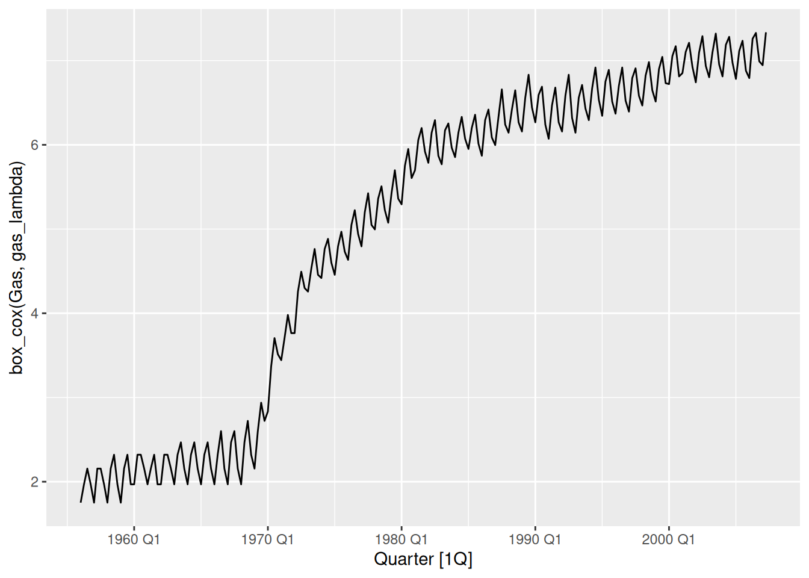
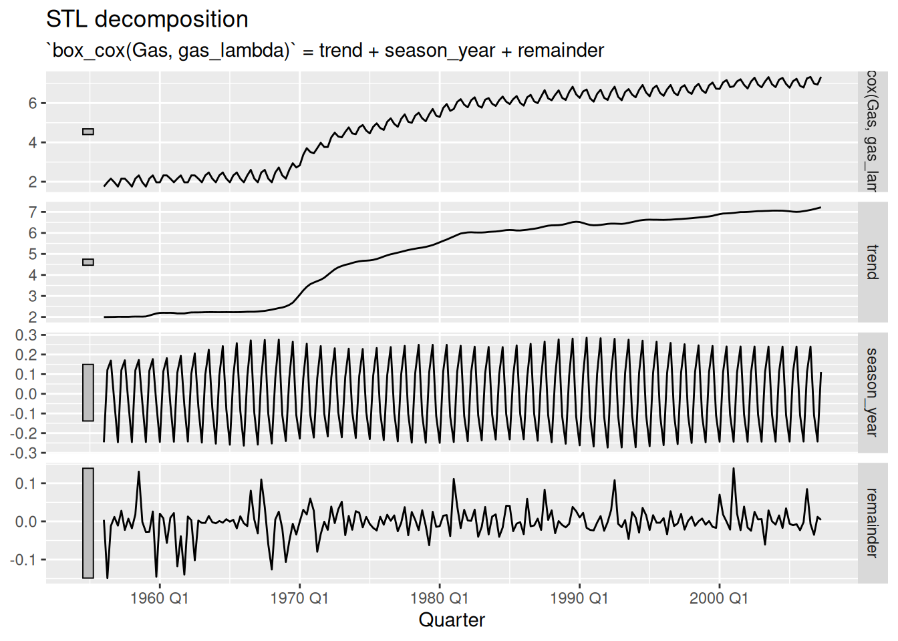
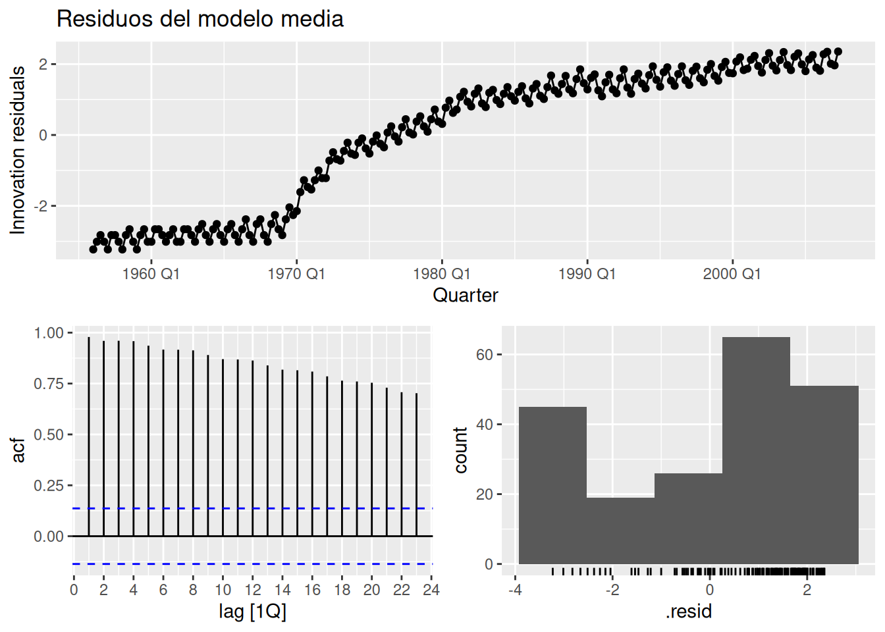
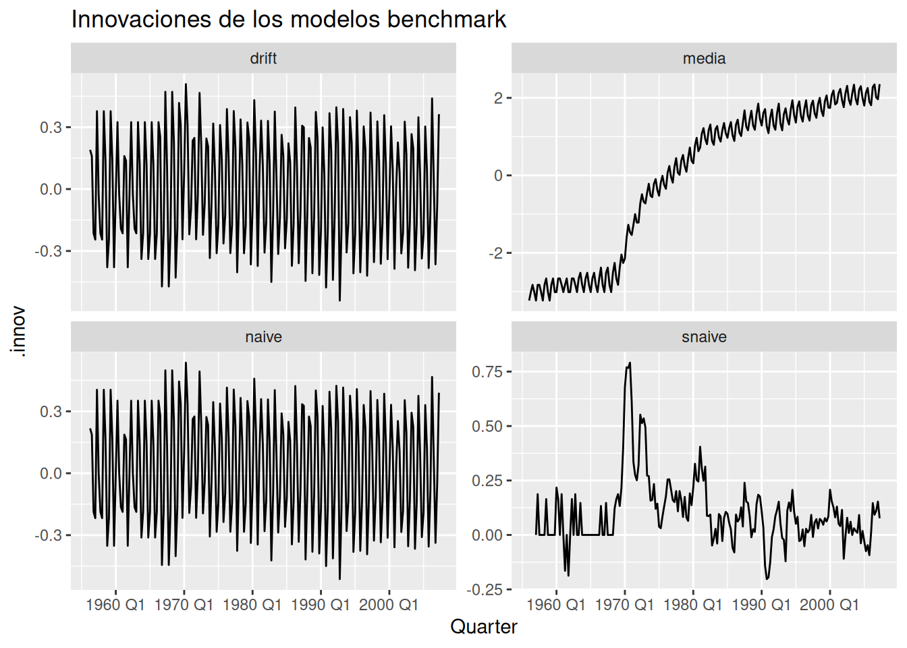
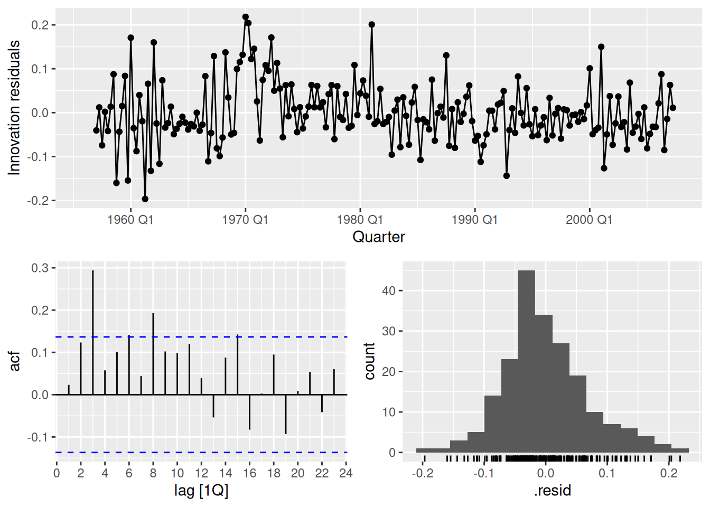
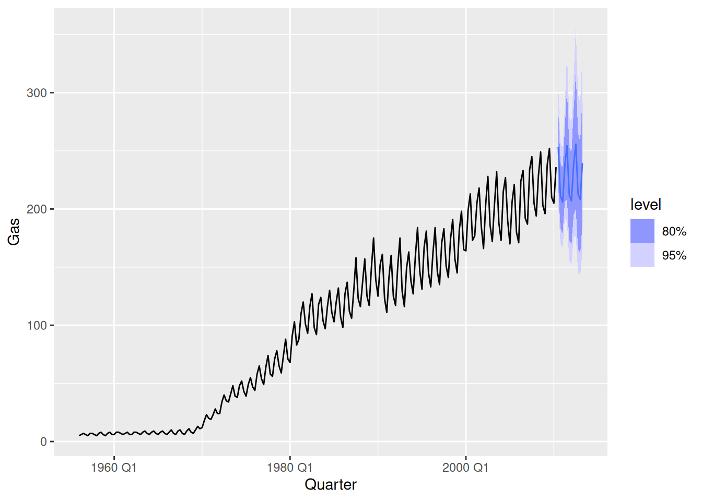
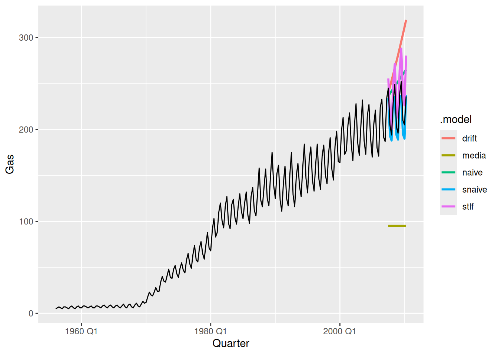

# Pronósticos con métodos benchmark

Code

- [Show All Code](javascript:void(0))

- [Hide All Code](javascript:void(0))

- 

  ------------------------------------------------------------------------

- [View Source](javascript:void(0))

Modified

June 1, 2026

Code

``` r
library(tidyverse)
library(fpp3)
```

## 1 Train/test

Vamos a hacer pronósticos a 3 años, por lo que necesitamos dejar los últimos 3 años como el conjunto de test.

Code

``` r
gas_train <- aus_production |> 
  filter_index(. ~ "2007 Q2")

gas_train
```

## 2 Visualize

Code

``` r
gas_train |> 
  autoplot(Gas)
```

[](26-02-11---fcst_files/figure-html/unnamed-chunk-4-1.png)

Intentamos estabilizar la varianza con logaritmos.

Code

``` r
gas_train |> 
  autoplot(log(Gas))
```

[](26-02-11---fcst_files/figure-html/unnamed-chunk-5-1.png)

Parece que todavía no es completamente estable (ahora al inicio la varianza es mayor).

Probemos con Box-Cox:

Code

``` r
gas_lambda <- gas_train |> 
  features(Gas, guerrero) |> 
  pull()

gas_lambda
```

    [1] 0.1037006

Code

``` r
gas_train |> 
  autoplot(box_cox(Gas, gas_lambda))
```

[](26-02-11---fcst_files/figure-html/unnamed-chunk-6-1.png)

Parece que mejora un poco.

### 2.1 Descomposición STL

Vamos a separar la serie transformada usando STL.

Code

``` r
gas_train |> 
  model(
    stl = STL(box_cox(Gas, gas_lambda), robust = TRUE)
  ) |> 
    components() |> 
  autoplot()
```

[](26-02-11---fcst_files/figure-html/unnamed-chunk-7-1.png)

## 3 Especificación de modelos

Primero vamos a probar los 4 modelos benchmark por separado, y posteriormente vamos a crear un modelo a partir de la descomposición que hicimos arriba.

Code

``` r
gas_fit <- gas_train |> 
  model(
    media = MEAN(box_cox(Gas, gas_lambda)),
    naive = NAIVE(box_cox(Gas, gas_lambda)),
    snaive = SNAIVE(box_cox(Gas, gas_lambda)),
    drift = RW(box_cox(Gas, gas_lambda) ~ drift())
  )

gas_fit
```

## 4 Evaluación

Code

``` r
gas_aug <- gas_fit |> 
  augment()

gas_fit |> 
  select(media) |>
  gg_tsresiduals() +
  labs(
    title = "Residuos del modelo media"
  )
```

[](26-02-11---fcst_files/figure-html/unnamed-chunk-9-1.png)

Code

``` r
gas_aug |> 
  ggplot(aes(x = Quarter, y = .innov)) + 
  geom_line() +
  facet_wrap(vars(.model), scales = "free_y") + 
  labs(
    title = "Innovaciones de los modelos benchmark"
  )
```

[](26-02-11---fcst_files/figure-html/unnamed-chunk-9-2.png)

#### 4.0.1 Tests de Portmanteau de autocorrelación

La prueba de Box-Pierce:

Code

``` r
gas_aug |> 
  features(.innov, box_pierce, lag = 8, dof = 0)
```

La prueba de Ljung-Box

Code

``` r
gas_aug |> 
  features(.innov, ljung_box, lag = 8, dof = 0) |> 
  mutate(decision = if_else(lb_pvalue < 0.05, "Rechazar H0: Residuos autocorrelacionados", "No rechazar H0: Residuos no autocorrelacionados"))
```

### 4.1 Pronóstico a partir de descomposición

Code

``` r
gas_fit_stl <- gas_train |> 
  model(
    stlf = decomposition_model(
      STL(box_cox(Gas, gas_lambda), robust = TRUE),
      SNAIVE(season_year),
      RW(season_adjust ~ drift())
    )
  )

gas_fit_stl
```

Code

``` r
gas_fit_stl |> 
  gg_tsresiduals()
```

[](26-02-11---fcst_files/figure-html/unnamed-chunk-13-1.png)

Code

``` r
gas_fit_stl |> 
  augment() |> 
  features(.innov, ljung_box, lag = 8, dof = 0)
```

Code

``` r
gas_fit_todos <- gas_train |> 
  model(
    media = MEAN(box_cox(Gas, gas_lambda)),
    naive = NAIVE(box_cox(Gas, gas_lambda)),
    snaive = SNAIVE(box_cox(Gas, gas_lambda)),
    drift = RW(box_cox(Gas, gas_lambda) ~ drift()),
    stlf = decomposition_model(
      STL(box_cox(Gas, gas_lambda), robust = TRUE),
      SNAIVE(season_year),
      RW(season_adjust ~ drift())
    )
  )
```

## 5 Pronóstico

Code

``` r
gas_fc_todos <- gas_fit_todos |> 
  forecast(h = "3 years")

gas_fc_todos
```

Code

``` r
gas_fc_todos |> 
  autoplot(aus_production) +
  facet_wrap(vars(.model), scales = "free_y")
```

[](26-02-11---fcst_files/figure-html/unnamed-chunk-15-1.png)

Code

``` r
gas_fc_todos |> 
  autoplot(aus_production, level = NULL, linewidth = 1)
```

[](26-02-11---fcst_files/figure-html/unnamed-chunk-15-2.png)

### 5.1 Métricas de error (Accuracy)

Code

``` r
gas_fc_todos |> 
  accuracy(aus_production) |> 
  arrange(RMSE)
```

El mejor modelo parece ser el SNAIVE. Vamos a utilizar este para hacer el pronóstico final.

Code

``` r
aus_production |> 
  model(
    snaive = SNAIVE(box_cox(Gas, gas_lambda))
  ) |> 
    forecast(h = "3 years") |>
    autoplot(aus_production)
```

[](26-02-11---fcst_files/figure-html/unnamed-chunk-17-1.png)

Back to top
