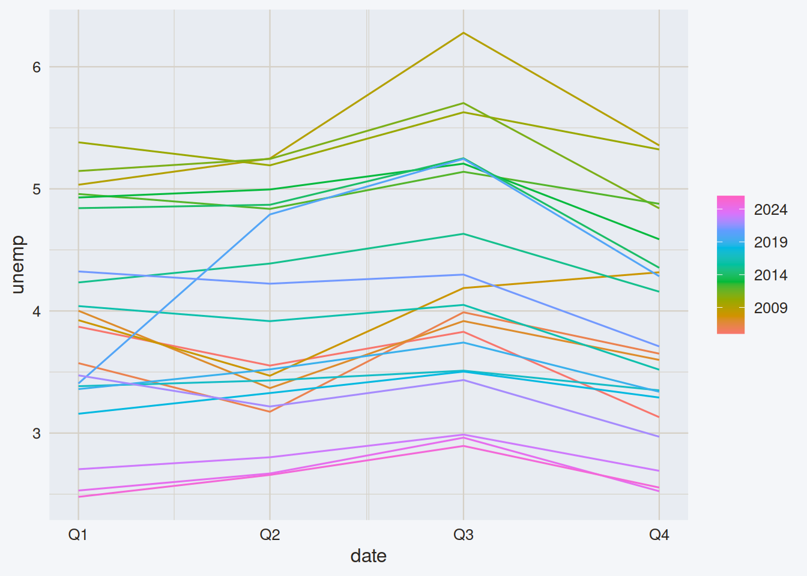
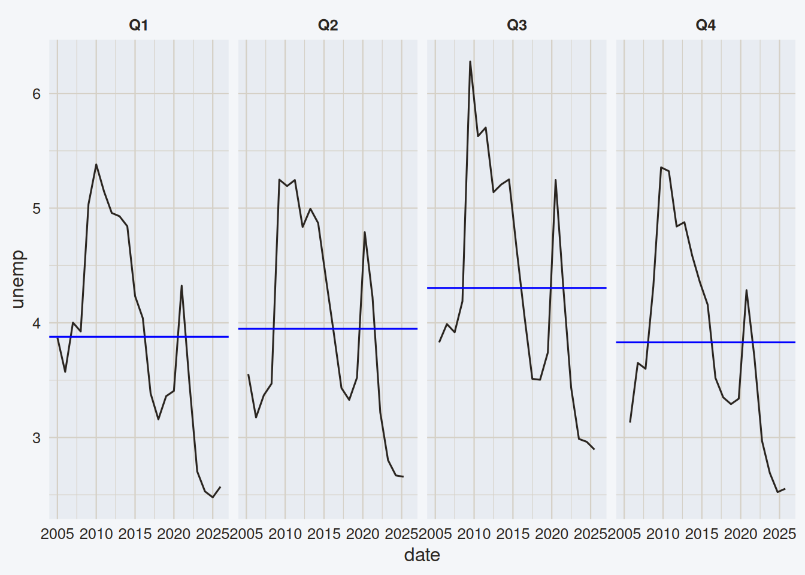
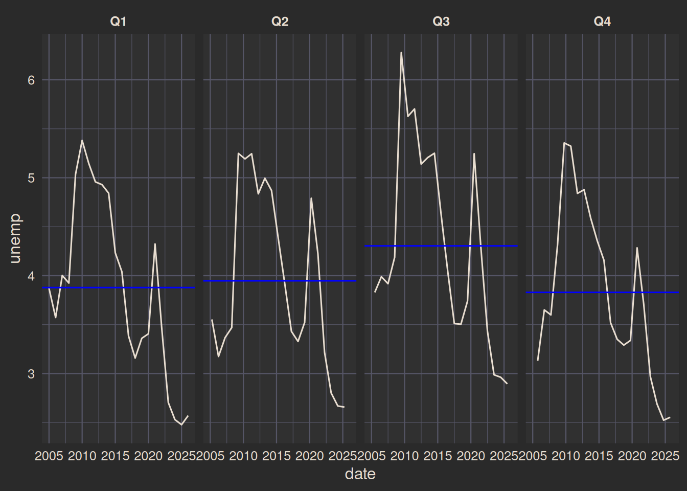
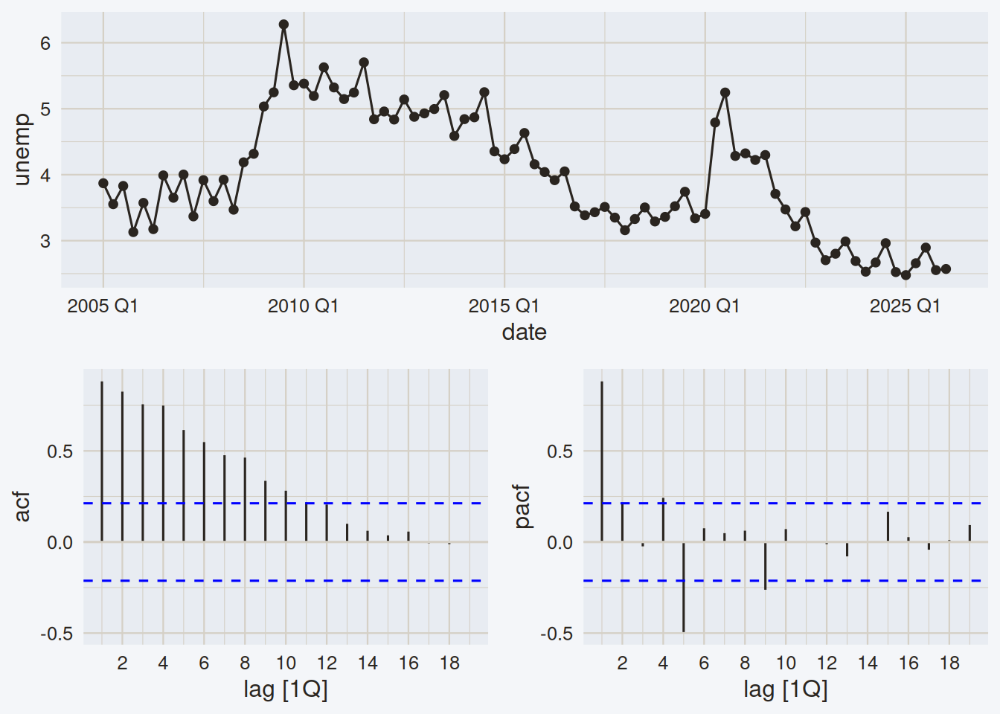

# Module 2 Review: Full Forecasting Pipeline

Code

- [Show All Code](javascript:void(0))

- [Hide All Code](javascript:void(0))

- 

  ------------------------------------------------------------------------

- [View Source](javascript:void(0))

topic-exercise

module-review

module-2

End-of-module exercise covering the complete Module 2 toolkit — baseline, ETS, ARIMA/SARIMA, and mixed decomposition models — applied to Mexico’s unemployment rate.

Published

June 17, 2025

Modified

June 17, 2026

Code

``` r
library(tidyverse)
library(fpp3)
library(tidyquant)
library(plotly)
```

## 0.1 Introduction

This exercise brings together everything covered in Module 2. You will apply the full forecasting pipeline — from EDA through model comparison — to a new series: Mexico’s quarterly unemployment rate. Your goal is to build all model families covered in Module 2, evaluate them against the Module 1 baseline, and identify which approach performs best on this series.

## 0.2 The Series: Mexico Unemployment Rate

Mexico’s harmonized unemployment rate (FRED ticker `LRHUTTTTMXQ156N`) is a quarterly series published by the OECD. It measures the percentage of the labor force that is unemployed and actively seeking work.

Code

``` r
unemp <- tq_get(
  "LRHUTTTTMXQ156N",
  get = "economic.data",
  from = "2005-01-01"
) |>
  mutate(date = yearquarter(date)) |>
  as_tsibble(index = date) |>
  rename(unemp = price)

unemp
```

## 0.3 Exploratory Data Analysis

Before fitting any model, take time to understand the series. The plots below cover the four standard views.

Code

``` r
unemp |>
  autoplot(unemp) +
  labs(
    title = "Mexico unemployment rate",
    y     = "Unemployment rate (%)",
    x     = ""
  )
```

Note the sharp spike around 2020 Q2 — the COVID-19 shock. Keep this in mind when interpreting model diagnostics and accuracy.

Code

``` r
unemp |> gg_season(unemp)
```

[](ex_module2_full_review_files/figure-html/season-render-1.png)

[](ex_module2_full_review_files/figure-html/season-render-2.png)

Code

``` r
unemp |> gg_subseries(unemp)
```

[](ex_module2_full_review_files/figure-html/subseries-render-1.png)

[](ex_module2_full_review_files/figure-html/subseries-render-2.png)

Code

``` r
unemp |> gg_tsdisplay(unemp, plot_type = "partial")
```

[](ex_module2_full_review_files/figure-html/tsdisplay-render-1.png)

> **NOTE:**
>
> - **Trend**: Is there a long-run level shift, or does the series return to a stable mean after shocks?
> - **Seasonality**: Is there a repeating quarterly pattern? How stable is it across years?
> - **ACF/PACF**: What correlation structure would you expect in the residuals? Does the series look stationary?

## 0.4 Train/Test Split

Code

``` r
h <- 8 # 2 years ahead

unemp_train <- unemp |> slice_head(n = nrow(unemp) - h)
unemp_test  <- unemp |> slice_tail(n = h)
```

The test set covers the most recent 8 quarters (2 years). All model fitting is done on `unemp_train`; accuracy is evaluated against the full `unemp` tsibble.

------------------------------------------------------------------------

# 1 Exercise

This is a full-pipeline exercise. Work through each section in order — later sections depend on the objects you build earlier.

## 1.1 Exercise 1 — Module 1 baseline

Re-estimate the Module 1 baseline model on `unemp_train`. This is your benchmark: every model you build in this exercise must be compared against it.

The baseline uses:

- STL decomposition (choose sensible `trend(window)` and `season(window)` values for a quarterly series)
- Drift on the seasonally adjusted component
- SNAIVE on the seasonal component

Save the spec as `baseline_spec` and fit it inside a `mable` called `unemp_fit`. Then:

1.  Produce forecasts for `h = 8` quarters.
2.  Plot the forecast (overlay, `level = NULL`).
3.  Inspect residual diagnostics with `gg_tsresiduals()`. Do the residuals look like white noise? Is the COVID spike visible?
4.  Compute test-set accuracy using `accuracy(unemp_fc, unemp)`.

> **TIP:**
>
> Remember that `accuracy()` requires the **full** tsibble — not just the test set — so that MASE and RMSSE denominators are computed correctly.

## 1.2 Exercise 2 — ETS models

Add at least two ETS-based approaches to `unemp_fit`:

1.  **STL + ETS**: Use `decomposition_model()` with an ETS model on `season_adjust`. Suppress seasonality in the ETS spec (`season("N")`). The seasonal component defaults to SNAIVE.
2.  **Full ETS**: Fit `ETS(unemp)` directly, without explicit decomposition. Let R select the best error/trend/season structure automatically.

For each model:

- Add it to the same `mable` as the baseline (a single `model()` call with all specs).
- Check residual diagnostics for the STL + ETS model.
- Include both in the accuracy comparison at the end.

## 1.3 Exercise 3 — ARIMA and SARIMA

Add at least two ARIMA-based approaches:

1.  **STL + ARIMA**: Use `decomposition_model()` with `ARIMA(season_adjust ~ PDQ(0,0,0))`. The seasonal component defaults to SNAIVE.
2.  **Automatic SARIMA**: Fit a full seasonal ARIMA directly — `ARIMA(unemp, stepwise = FALSE, approximation = FALSE)` — without explicit decomposition.

For each model:

- Add it to the same `mable`.
- Check residual diagnostics for the STL + ARIMA model.
- Include both in the accuracy comparison.

> **NOTE:**
>
> Use `gg_tsdisplay()` on the differenced series to identify a candidate ARIMA order manually, then add it as a third model (`sarima_manual`). Compare it against the automatic selection.

## 1.4 Exercise 4 — Mixed decomposition models

This section connects directly to the [Modular Forecasting](../../modules/module_2/04_modular_forecasting/modular_forecasting.qmd) class document.

Add the two mixed combinations to your `mable`:

1.  **STL + ETS + ARIMA**: ETS models the seasonally adjusted component (`season_adjust`); ARIMA models the seasonal component (`season_year`).
2.  **STL + ARIMA + ETS**: ARIMA models the seasonally adjusted component (`season_adjust ~ PDQ(0,0,0)`); ETS models the seasonal component (`season_year ~ trend("N")`).

Recall the constraint logic for each component:

| Component       | What it contains          | What to suppress |
|:----------------|:--------------------------|:-----------------|
| `season_adjust` | trend + cycle + remainder | seasonality      |
| `season_year`   | seasonal pattern only     | trend            |

After fitting:

- Produce a single forecast plot with all models overlaid (`level = NULL`).
- Compute a final accuracy table with all models, sorted by RMSE.
- Answer: which approach performs best on this series? Does the winner make intuitive sense given what you observed in the EDA?

## 1.5 Exercise 5 — Reflection (graduate students)

Write a short paragraph (5–8 sentences) addressing the following:

1.  The COVID-19 spike in 2020 Q2 is a clear outlier. How does it affect model diagnostics and accuracy metrics? Which models appear most sensitive to it?
2.  The baseline was designed in Module 1 for a different series (`mexretail`). Is it still a competitive benchmark here, or does the unemployment series favor a different model family? What characteristics of the series drive your answer?
3.  Would you expect the same model ranking to hold on a different country’s unemployment series? What would you check first before deciding?

Back to top
