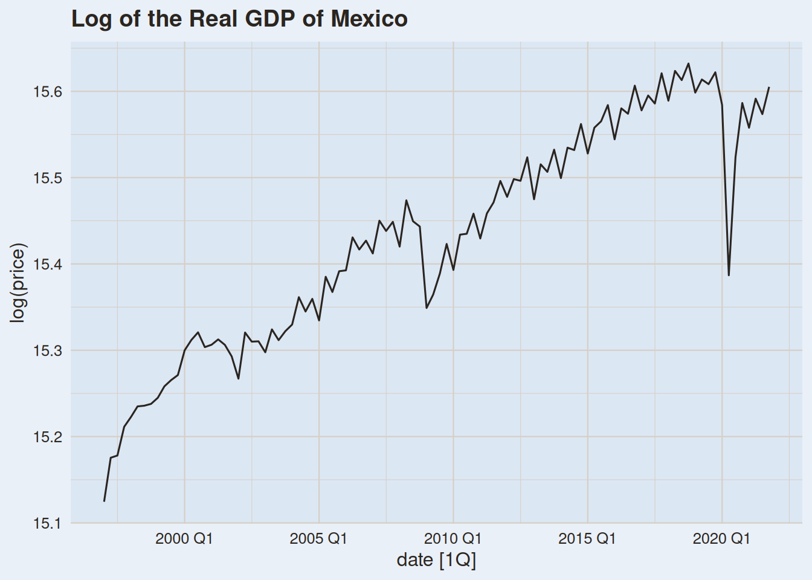
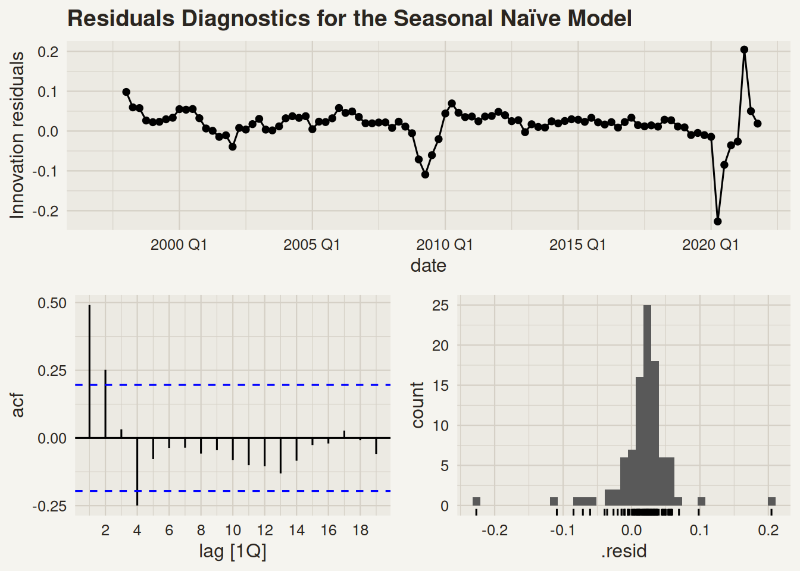
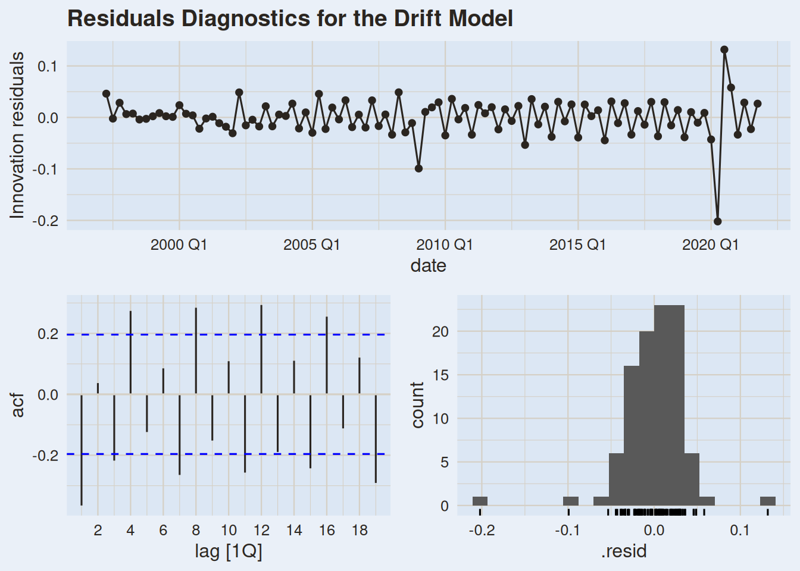
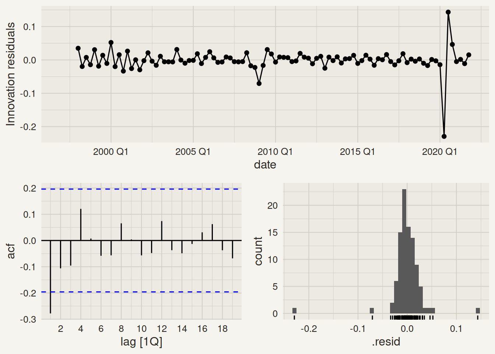
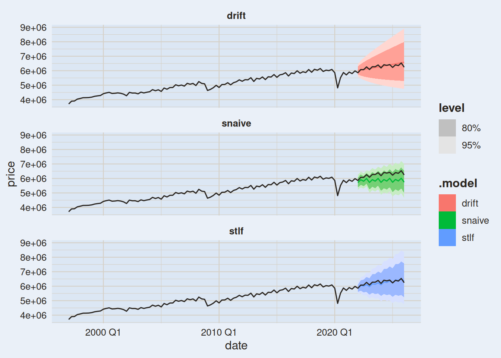
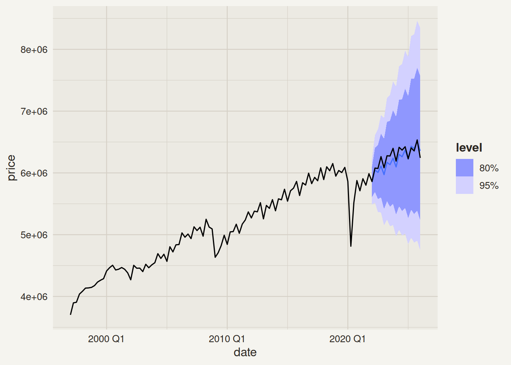
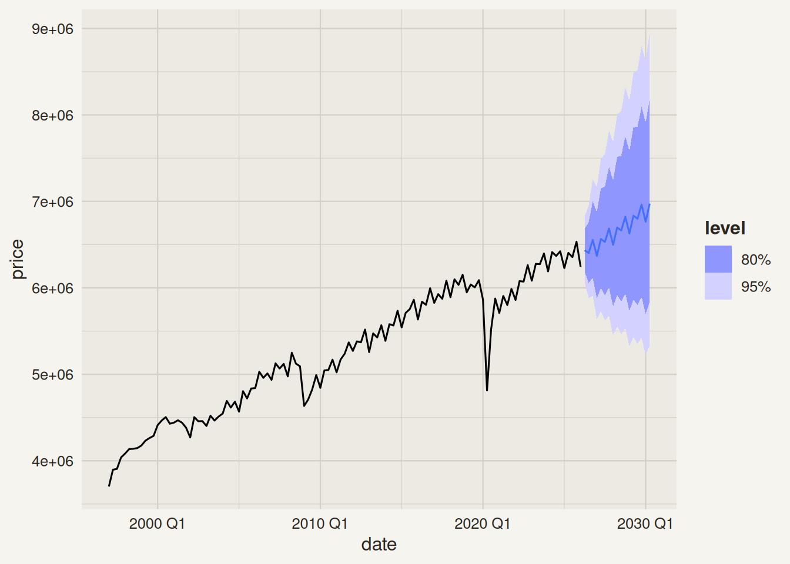

# The Forecasting Workflow using `fable`

Author

Pablo Benavides

Published

September 30, 2022

Modified

June 3, 2026

[](https://tidyverts.org/images/fable.png)

# Introduction

## 0.1 Packages

It is recommended to load all the packages at the beginning of your file. We will be using the `tidyverts` ecosystem for the whole forecasting workflow.

Code

``` r
library(tidyverse)
library(fpp3)
library(plotly)
```

> **WARNING:**
>
> Do not load unnecesary packages into your environment. It could lead to conflicts between functions and unwanted results.

# 1 Forecasting Workflow

## 1.1 Data

We will work with the Real Gross Domestic Product (GDP) for Mexico. The data is downloaded from [FRED](https://fred.stlouisfed.org/series/NGDPRNSAXDCMXQ). The time series id is `NGDPRNSAXDCMXQ`.

### 1.1.1 Import data

Code

``` r
gdp <- tidyquant::tq_get(
  x    = "NGDPRNSAXDCMXQ",
  get  = "economic.data",
  from = "1997-01-01"
)

gdp
```

    # A tibble: 116 × 3
       symbol         date          price
       <chr>          <date>        <dbl>
     1 NGDPRNSAXDCMXQ 1997-01-01 3702398.
     2 NGDPRNSAXDCMXQ 1997-04-01 3896084.
     3 NGDPRNSAXDCMXQ 1997-07-01 3906063 
     4 NGDPRNSAXDCMXQ 1997-10-01 4038358.
     5 NGDPRNSAXDCMXQ 1998-01-01 4084304.
     6 NGDPRNSAXDCMXQ 1998-04-01 4134899.
     7 NGDPRNSAXDCMXQ 1998-07-01 4138200.
     8 NGDPRNSAXDCMXQ 1998-10-01 4146841.
     9 NGDPRNSAXDCMXQ 1999-01-01 4176243.
    10 NGDPRNSAXDCMXQ 1999-04-01 4232280.
    # ℹ 106 more rows

### 1.1.2 Wrangle data

There are some issues with our data:

1.  It is loaded into a `tibble` object. We need to convert it to a **`tsibble`**.

> **TIP:**
>
> We can use `as_tsibble()` to do so.

2.  Our data is **quarterly**, but it is loaded in a `YYYY-MM-DD` format. We need to change it to a `YYYY QQ` format.

> **TIP:**
>
> There are some functions that help us achieve this, such as
>
> - `yearquarter()`
> - `yearmonth()`
> - `yearweek()`
> - `year()`
>
> depending on the time series’ period.

We will overwrite our data:

Code

``` r
gdp <- gdp |> 
  mutate(date = yearquarter(date)) |> 
  as_tsibble(
    index = date,
    key   = symbol
  )

gdp
```

> **TIP:**
>
> - We always need to specify the `index` argument, as it is our **date** variable.
>
> - The `key` argument is necessary whenever we have more than one time series in our data frame and is made up of **one or more columns** that uniquely identify each time series .

## 1.2 Train/Test Split

We will split our data in two sets: a training set, and a test set, in order to evaluate our forecasts’ accuracy.

Code

``` r
gdp_train <- gdp |> 
  filter_index(. ~ "2021 Q4")

gdp_train
```

> **NOTE:**
>
> For all our variables, it is strongly recommended to follow the same notation process, and write our code using [**snake_case**](https://en.wikipedia.org/wiki/Snake_case). Here, we called our data `gdp`, therefore, all the following variables will be called starting with **`gdp_`**[^1], such as `gdp_train` for our training set.

## 1.3 Visualization and EDA

When performing time series analysis/forecasting, one of the first things to do is to create a time series plot.

Code

``` r
p <- gdp_train |> 
  autoplot(price) +
  labs(
    title = "Time series plot of the Real GDP for Mexico",
    y = "GDP"
  )
 
ggplotly(p, dynamicTicks = TRUE) |> 
  rangeslider()
```

> **IMPORTANT:**
>
> Our data exhibits an upward *linear trend* (with some economic cycles), and strong *yearly seasonality*.

We will explore it further with a season plot.

Code

``` r
gdp_train |> 
  gg_season(price) |> 
  ggplotly()
```

### 1.3.1 TS Decomposition

Code

``` r
gdp_train |> 
  model(stl = STL(price, robust = TRUE)) |> 
  components() |> 
  autoplot() |> 
  ggplotly()
```

> **IMPORTANT:**
>
> The STL decomposition shows that the variance of the seasonal component has been increasing. We could try using a **log transformation** to counter this.

Code

``` r
gdp_train |> 
  autoplot(log(price)) +
  ggtitle("Log of the Real GDP of Mexico")
```

[](forecasting_workflow_files/figure-html/unnamed-chunk-10-1.png)

Code

``` r
gdp_train |> 
  model(stl = STL(log(price) ~ season(window = "periodic"), robust = TRUE)) |> 
  components() |> 
  autoplot() |> 
  ggplotly()
```

## 1.4 Model Specification

We will **fit** two models to our time series: *Seasonal Naïve*, and the *Drift* model. We will also use the log transformation.

Code

``` r
gdp_fit <- gdp_train |> 
  model(
    snaive = SNAIVE(log(price)),
    drift  = RW(log(price) ~ drift())
  )
```

> **TIP:**
>
> We have four different benchmark models that we’ll use to compare against the rest of the more complex models:
>
> - Mean (`MEAN( <.y> )`)
> - Naïve (`NAIVE( <.y> )`)
> - Seasonal Naïve (`SNAIVE( <.y> )`)
> - Drift (`RW( <.y> ~ drift())`)
>
> where `<.y>` is just a placeholder for the variable to model.
>
> Choose wisely which of these to use in each case, according to the exploratory analysis performed.

## 1.5 Residuals Diagnostics

### 1.5.1 Visual analysis

Code

``` r
gdp_fit |> 
  select(snaive) |> 
  gg_tsresiduals() +
  ggtitle("Residuals Diagnostics for the Seasonal Naïve Model")
```

[](forecasting_workflow_files/figure-html/unnamed-chunk-13-1.png)

Code

``` r
gdp_fit |> 
  select(drift) |> 
  gg_tsresiduals() +
  ggtitle("Residuals Diagnostics for the Drift Model")
```

[](forecasting_workflow_files/figure-html/unnamed-chunk-13-2.png)

> **TIP:**
>
> Here we expect to see:
>
> - A time series with no apparent patterns (no trend and/or seasonality), with a mean close to zero.
> - In the **ACF**, we’d expect no lags with significant autocorrelation.
> - Normally distributed residuals.

### 1.5.2 Portmanteau tests of autocorrelation

Code

``` r
gdp_fit |> 
  augment() |> 
  features(.innov, ljung_box, lag = 24, dof = 0)
```

> **CAUTION:**
>
> Both models produce sub optimal residuals:
>
> - The SNAIVE correctly detects the seasonality, however, its residuals are still autocorrelated. Moreover, the residuals are not normally distributed.
>
> - The drift model doesn’t account for the seasonality, and their distribution is a little bit skewed.
>
> Hence, we will perform our forecasts using the **bootstrapping** method.

We can compute some error metrics on the training set using the `accuracy()` function:

Code

``` r
gdp_train_accu <- accuracy(gdp_fit) |> 
  arrange(MAPE)
gdp_train_accu |> 
  select(symbol:.type, MAPE, RMSE, MAE, MASE)
```

> **TIP:**
>
> The `accuracy()` function can be used to compute error metrics in the training data, or in the test set. What differs is the data that is given to it:
>
> - For the training metrics, you need to use the **`mable`** (the table of models, that we usually store in `_fit`).
>
> - For the forecasting error metrics, we need the **`fable`** (the forecasts table, usually stored as `_fc` or `_fcst`), and the **complete set of data** (both the training and test set together).
>
> [](https://media.tenor.com/dp_hQBGT0rIAAAAM/think-smart.gif)

> **IMPORTANT:**
>
> For this analysis, we are focusing on the **MAPE**[^2] metric. The drift model **(2.47%)** seems to have a better fit with the training set than the snaive model **(3.24%)**.

## 1.6 Modeling using decomposition

We will perform a forecast using decomposition, to see if we can improve our results so far.

Code

``` r
gdp_fit_dcmp <- gdp_train |> 
      model(
        stlf = decomposition_model(
          STL(log(price) ~ season(window = "periodic"), robust = TRUE),
          RW(season_adjust ~ drift())
        )
      )

gdp_fit_dcmp
```

> **NOTE:**
>
> Remember, when using decomposition models, we need to do the following:
>
> 1.  Specify what type of decomposition we want to use and customize it as needed.
>
> 2.  Fit a model for the seasonally adjusted data; `season_adjust`.
>
> 3.  Fit a model for the seasonal component. **R** uses a `SNAIVE()` model by default to model the seasonality. If you wish to model it using a different model, you have specify it.
>
> - The name of the seasonal component depends on the type of seasonality present in the time series. If it has a yearly seasonality, the component is called `season_year`. It could also be called `season_week`, `season_day`, and so on.

We can join this new model with the models we trained before. This way we can have them all in the same `mable`.

Code

``` r
gdp_fit <- gdp_fit |> 
  left_join(gdp_fit_dcmp)
```

### 1.6.1 Residuals diagnostics

Code

``` r
gdp_fit |> 
  accuracy() |> 
  select(symbol:.type, MAPE, RMSE, MAE, MASE) |> 
  arrange(MAPE)
```

Code

``` r
gdp_fit |> 
  select(stlf) |> 
  gg_tsresiduals()
```

[](forecasting_workflow_files/figure-html/unnamed-chunk-20-1.png)

Code

``` r
gdp_fit |> 
  augment() |> 
  features(.innov, ljung_box)
```

> **IMPORTANT:**
>
> The MAPE seems to improve with this decomposition model. Also, the residual diagnostics do not show any seasonality present in them. However, the residuals are still autocorrelated, as the *Ljung-Box* test suggests.

## 1.7 Forecasting on the test set

Once we have our models, we can produce forecasts. We will forecast our test data and check our forecasts’ performance.

Code

``` r
gdp_fc <- gdp_fit |> 
  forecast(h = gdp_h_fc) 

gdp_fc
```

Code

``` r
gdp_fc |> 
  autoplot(gdp) +
  facet_wrap(~.model, ncol = 1)
```

[](forecasting_workflow_files/figure-html/unnamed-chunk-23-1.png)

Code

``` r
gdp_fc |> 
  filter(.model == "stlf") |> 
  autoplot(gdp)
```

[](forecasting_workflow_files/figure-html/unnamed-chunk-23-2.png)

We now estimate the forecast errors:

Code

``` r
gdp_fc |> 
  accuracy(gdp) |> 
  select(.model:.type, MAPE, RMSE, MAE, MASE) |> 
  arrange(MAPE)
```

## 1.8 Forecasting the future

We now refit our model using the whole dataset. We will only model the STL decomposition model, because the other two didn’t get a strong fit.

Code

``` r
gdp_fit2 <- gdp |> 
  model(
    stlf = decomposition_model(
          STL(log(price) ~ season(window = "periodic"), robust = TRUE),
          RW(season_adjust ~ drift())
        )
  )
gdp_fit2
```

Code

``` r
gdp_fc_fut <- gdp_fit2 |> 
  forecast(h = gdp_h_fc)
gdp_fc_fut
```

Code

``` r
gdp_fc_fut |> 
  autoplot(gdp)
```

[](forecasting_workflow_files/figure-html/unnamed-chunk-26-1.png)

Code

``` r
# save(gdp_fc_fut, file = "equipo1.RData")
```

Back to top

## Footnotes

[^1]: This will make it very convenient when calling your variables. RStudio will display all the options starting with `gdp_`. We will usually use the following suffixes:

    - `_train`: training set
    - `_fit`: the `mable` (table of models)
    - `_aug`: the augmented table with fitted values and residuals
    - `_dcmp`: for the `dable` (decomposition table), containing the components and the seasonally adjusted series of a TS decomposition.
    - `_fc` or `_fcst`: for the `fable` (forecasts table) that has our forecasts. 

[^2]: The Mean Absolute Percentage Error is a percentage error metric widely used in professional environments.

    Let

    e_t = y_t - \hat{y}\_t

    be the error or residual.

    Then the MAPE would be computed as

    MAPE = \frac{1}{T}\sum\_{t=1}^T\|\frac{e_t}{y_t}\| .

    [](https://media.tenor.com/tqERWt8lBYEAAAAM/calculating-puzzled.gif)
