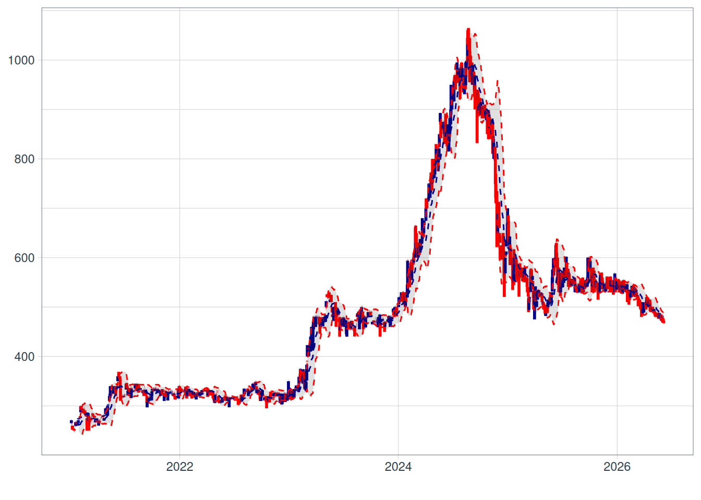
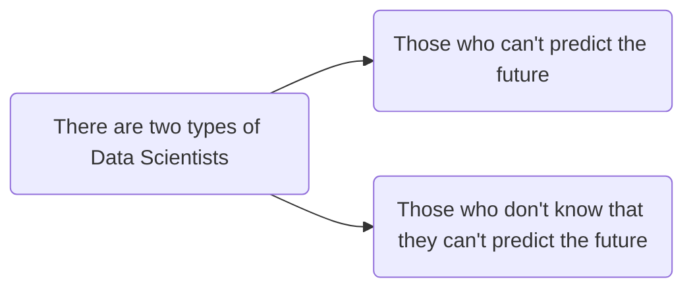
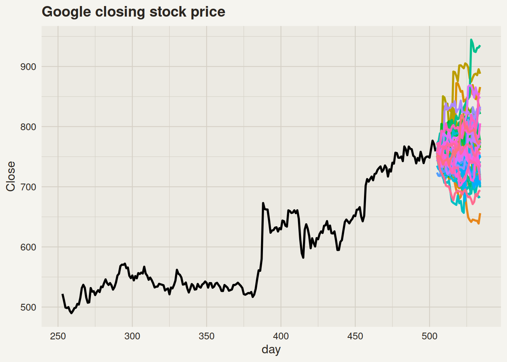
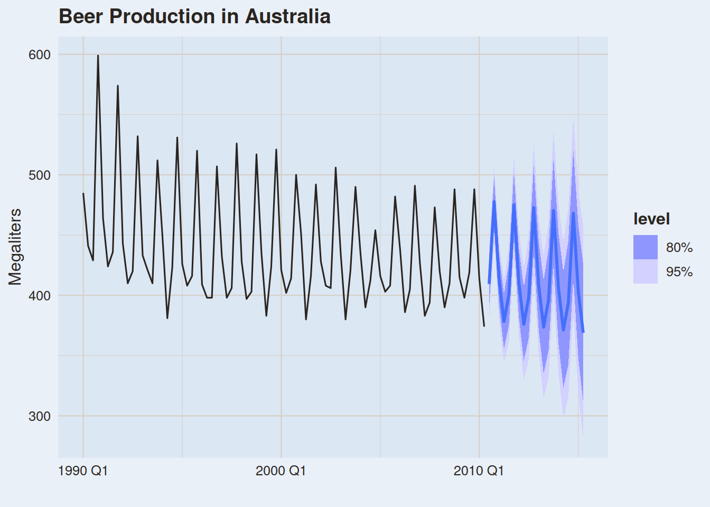
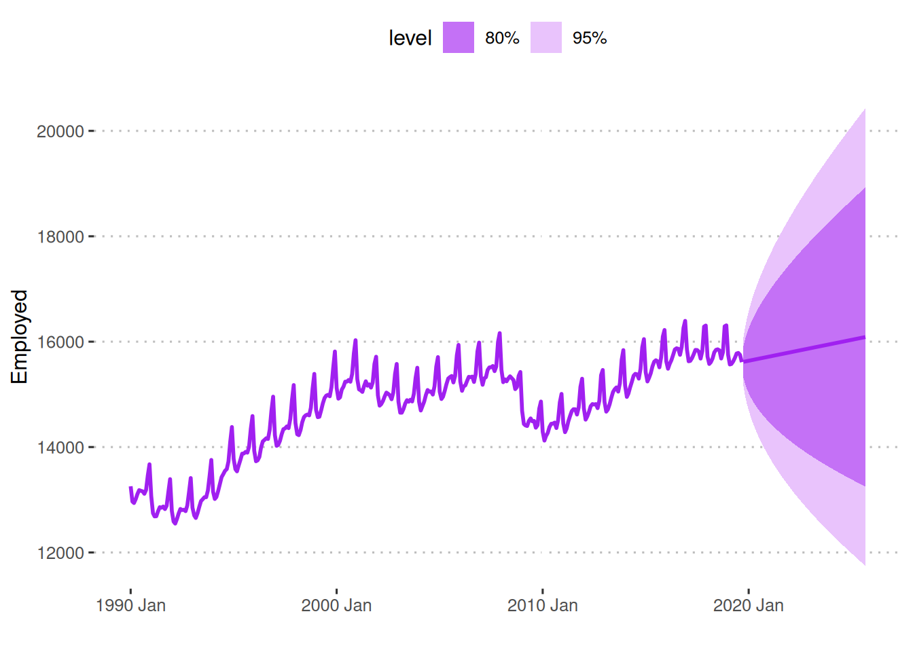
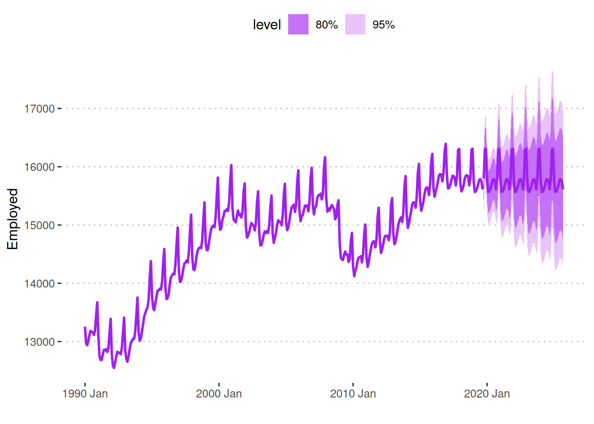
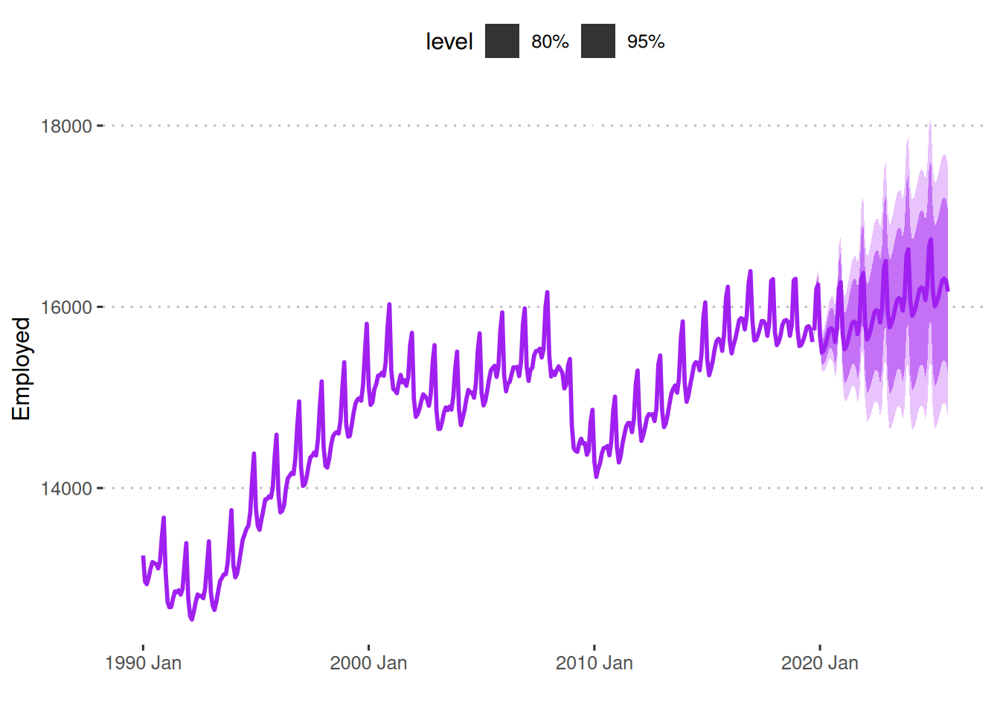

# Time Series Forecasting

Modified

June 8, 2026

# What is a time series?

## Is this a time series?

If we focus solely on the regular plot, we wouldn’t have any time series. However, when we map each variable through time, we now have multiple time series: one for each country regarding life exp., GDP per capita, and population.

# Financial Series

## Stocks

Stocks, FX, … are all time series

## Cryptos

Crypto currencies are also time series

Any variable that is measured through time is a time series.

# What are forecasts?

## 

No one, except for sorcerers and wizards, can predict the future.

## 

What was Dr. Strange doing here?

## 

Dr. Strange didn’t have the Time stone. He was using a high-tech gamer PC to run millions of simulations.

# Can all variables be predicted with the same accuracy?

## Eclipses

We can predict eclipses with complete certainty.

## 

It’s not so easy to predict stock prices

Other variables can’t be predicted that easily. What does it depend on?

## 

## Electricity Demand

# Forecasts

## Beer Production Forecasts

Can you observe any strange patterns?

## Which US Employment forecast works best?

Forecasting US Retail Employment using the Drift method

Forecasting US Retail Employment using the Seasonal Naive method

## 

Forecasting US Retail Employment using ARIMA

Back to top
