# RStudio, R, and Time Series

Modified

June 10, 2026

# 1 Packages

## 1.1 The `tidyverse`

Code

``` r
library(tidyverse)
```

    ── Attaching core tidyverse packages ──────────────────────── tidyverse 2.0.0 ──
    ✔ dplyr     1.2.1     ✔ readr     2.2.0
    ✔ forcats   1.0.1     ✔ stringr   1.6.0
    ✔ ggplot2   4.0.2     ✔ tibble    3.3.1
    ✔ lubridate 1.9.5     ✔ tidyr     1.3.2
    ✔ purrr     1.2.2     
    ── Conflicts ────────────────────────────────────────── tidyverse_conflicts() ──
    ✖ dplyr::filter() masks stats::filter()
    ✖ dplyr::lag()    masks stats::lag()
    ℹ Use the conflicted package (<http://conflicted.r-lib.org/>) to force all conflicts to become errors

Code

``` r
source(here::here("R/narsil_theme.R"))
theme_set(theme_narsil())
```

- `tidyverse` is a meta-package that loads the core packages of the [tidyverse](https://tidyverse.org/).

We will always load all the required packages a the beginning of the document. When loading the `tidyverse`, it shows which packages are being attached, as well as any conflicts with previously loaded packages.

> **NOTE:**
>
> - [`dplyr`](https://dplyr.tidyverse.org/) is the core package for **data transformation**. It is paired up with the following packages for specific column types:
>   - [`stringr`](https://stringr.tidyverse.org/) for strings.
>   - [`forcats`](https://forcats.tidyverse.org/) for **factors** (R’s categorical data type).
>   - [`lubridate`](https://lubridate.tidyverse.org/) for dates and date-times.
> - [`ggplot2`](https://ggplot2.tidyverse.org/) is the primary package for visualization.
> - [`readr`](https://readr.tidyverse.org/) is used to **import data** from delimited files (CSV, TSV, …).
> - [`tibble`](https://tibble.tidyverse.org/) is a modern reimagining of the data frame, keeping what time has proven to be effective, and throwing out what is not.
> - [`tidyr`](https://tidyr.tidyverse.org/) is used to **tidy** data, i.e. to ensure that each variable is in its own column, each observation is in its own row, and each value is in its own cell.
> - [`purrr`](https://purrr.tidyverse.org/) is used for functional programming with R.

## 1.2 The `tidyverts`

Code

``` r
library(fpp3)
```

    ── Attaching packages ──────────────────────────────────────────── fpp3 1.0.3 ──

    ✔ tsibble     1.2.0     ✔ feasts      0.5.0
    ✔ tsibbledata 0.4.1     ✔ fable       0.5.0
    ✔ ggtime      0.2.0     

    ── Conflicts ───────────────────────────────────────────────── fpp3_conflicts ──
    ✖ lubridate::date()    masks base::date()
    ✖ dplyr::filter()      masks stats::filter()
    ✖ tsibble::intersect() masks base::intersect()
    ✖ tsibble::interval()  masks lubridate::interval()
    ✖ dplyr::lag()         masks stats::lag()
    ✖ tsibble::setdiff()   masks base::setdiff()
    ✖ tsibble::union()     masks base::union()

- `fpp3` is also a meta-package that load the [tidyverts](https://tidyverts.org/) ecosystem for time series analysis and forecasting.

The `tidyverts` packages are made to work seamlessly with the `tidyverse`.

> **NOTE:**
>
> - [`tsibble`](https://tsibble.tidyverts.org/) is the main data structure we will use to analyze and model time series. It is a **t**ime **series** t**ibble**.
> - [`feasts`](https://feasts.tidyverts.org/) provides many functions and tools for feature and statistics extraction for time series.
> - [`fable`](https://fable.tidyverts.org/) is the core package for modeling and foreasting time series.

# 2 Time Series

## 2.1 `tsibble` objects

Let’s take a look at tourism in Australia:

Code

``` r
tourism
```

    # A tsibble: 24,320 x 5 [1Q]
    # Key:       Region, State, Purpose [304]
       Quarter Region   State           Purpose  Trips
         <qtr> <chr>    <chr>           <chr>    <dbl>
     1 1998 Q1 Adelaide South Australia Business  135.
     2 1998 Q2 Adelaide South Australia Business  110.
     3 1998 Q3 Adelaide South Australia Business  166.
     4 1998 Q4 Adelaide South Australia Business  127.
     5 1999 Q1 Adelaide South Australia Business  137.
     6 1999 Q2 Adelaide South Australia Business  200.
     7 1999 Q3 Adelaide South Australia Business  169.
     8 1999 Q4 Adelaide South Australia Business  134.
     9 2000 Q1 Adelaide South Australia Business  154.
    10 2000 Q2 Adelaide South Australia Business  169.
    # ℹ 24,310 more rows

A `tsibble` is a modified version of a [`tibble`](https://tibble.tidyverse.org/index.html) as to

Code

``` r
key_vars(tourism)
```

    [1] "Region"  "State"   "Purpose"

Code

``` r
key_data(tourism)
```

The `tsibble` has 24320 rows and 5 columns. It shows quarterly data[^1] on tourism across Australia. It’s divided by Region, State, and purspose of the trip[^2]. How many different states are there?

## 2.2 Australian States

Code

``` r
distinct(tourism, State)
```

## 2.3 Which regions are located in Tasmania?

Code

``` r
distinct(filter(tourism, State == "Tasmania"),Region)
```

## 2.4 Data Transformation: Average trips

To get the average trips by purpose, we need to do the following:

1.  Filter the original `tsibble` to get only the data from East Coast, Tasmania.
2.  Convert the data to a `tibble`.
3.  Group by purpose.
4.  Summarise by getting the mean of the trips.

## 2.5

With traditional code, this would look something like:

Code

``` r
summarise(group_by(as_tibble(filter(tourism, State == "Tasmania", 
                                    Region == "East Coast")), Purpose),
          mean_trips = mean(Trips))
```

> **NOTE:**
>
> Note that this code must be read inside-out. This makes it harder to understand, and also harder to debug.

## 2.6

Using the native pipe operator; `|>`, we can improve the same code:

Code

``` r
tourism |>                            # <1>
  filter(State == "Tasmania",         # <2>
         Region == "East Coast") |>   # <2>
  as_tibble() |>                      # <3>
  group_by(Purpose) |>                # <4>
  summarise(mean_trips = mean(Trips)) # <5>
```

1.  Take the tsibble `tourism`, *then*
2.  filter by State and Region, *then*
3.  convert to a `tibble`, *then*
4.  group the tibble by purpose, *then*
5.  summarise by taking the mean trips

> **TIP:**
>
> The pipe is read as “**then**”, and it allows us to write code in the order it’s supposed to be run.
>
> It also helps to debug code easier, because you can run each function in order and see where the error is.

# 3 TS Visualization

## 3.1 Plotting tourism across time

Code

``` r
tourism_p <- tourism |>
  filter(State == "Tasmania",
         Region == "East Coast") |>
  autoplot(Trips) +                             # <1>
  facet_wrap(vars(Purpose), scale = "free_y") + # <2>
  theme(legend.position = "none")               # <3>
```

1.  `autoplot()` detects the data automatically and proposes a plot accordingly.
2.  `facet_wrap()` Divides a plot into subplots (facets).
3.  you can customize endless feautres using `theme()`. Here, we remove the legend, as it’s redudant.

[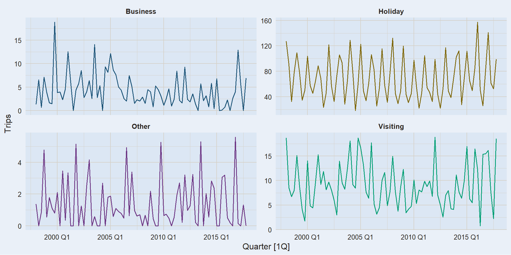](r_time_series_files/figure-revealjs/ts_viz_full_render-1.png)

[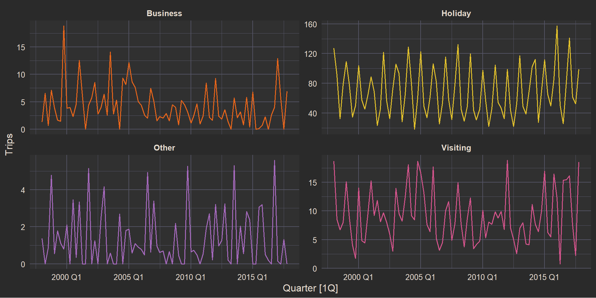](r_time_series_files/figure-revealjs/ts_viz_full_render-2.png)

## 3.2 Time plots

Code

``` numberSource
gas_p <- aus_production |>
  autoplot(Gas)
```

[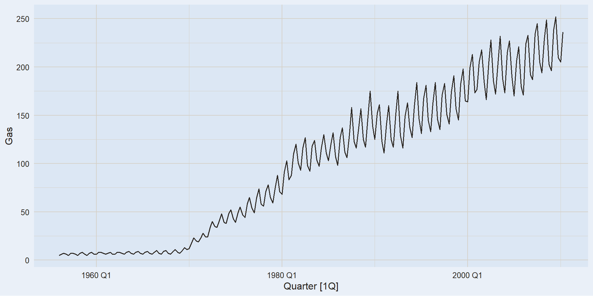](r_time_series_files/figure-revealjs/time_plot_1_render-1.png)

[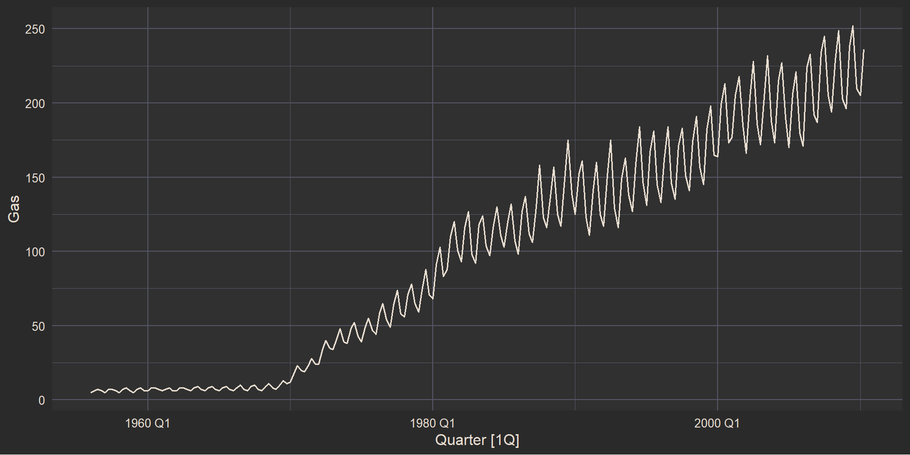](r_time_series_files/figure-revealjs/time_plot_1_render-2.png)

Code

``` numberSource
gas_points_p <- aus_production |>
  autoplot(Gas) +
  geom_point()
```

[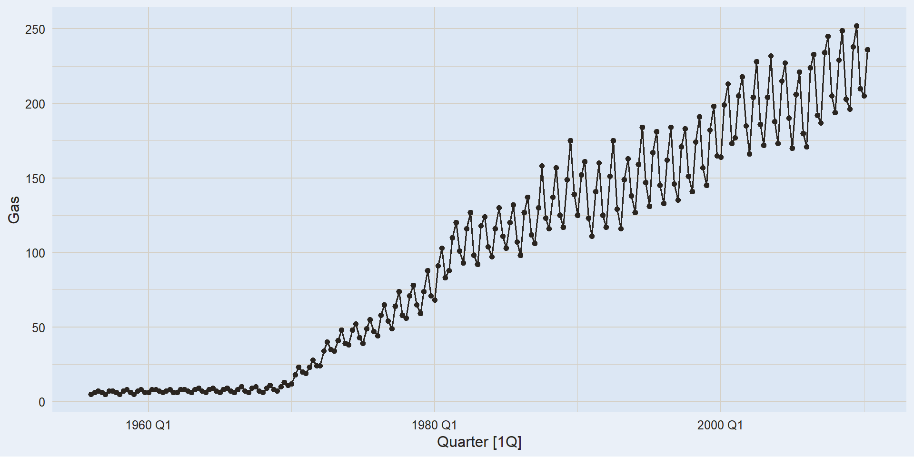](r_time_series_files/figure-revealjs/time_plot_2_render-1.png)

[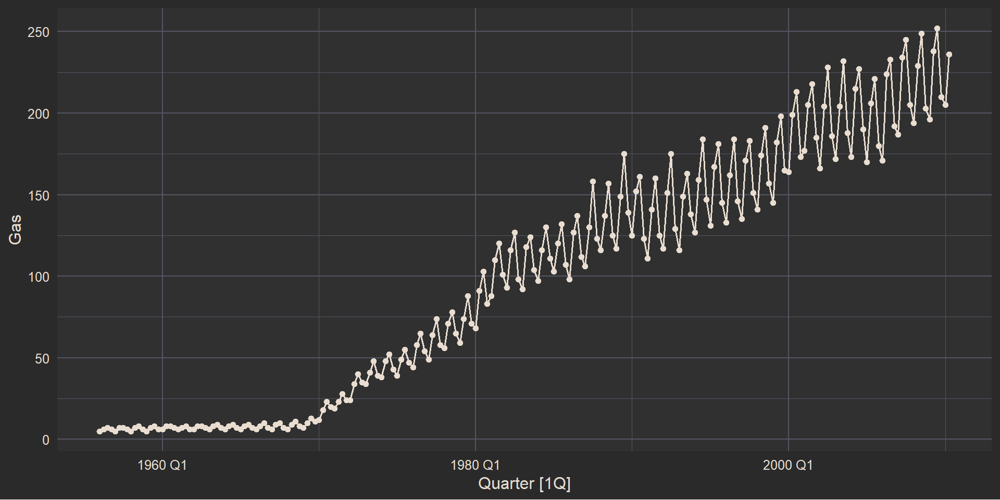](r_time_series_files/figure-revealjs/time_plot_2_render-2.png)

These are the most basic type of plots. We have the time variable in the x-axis, and our forecast variable in the y-axis. Time plots should be line plots, and can include or not points.

## 3.3 Seasonal Plots

Code

``` numberSource
gas_season_p <- aus_production |>
  gg_season(Gas)
```

[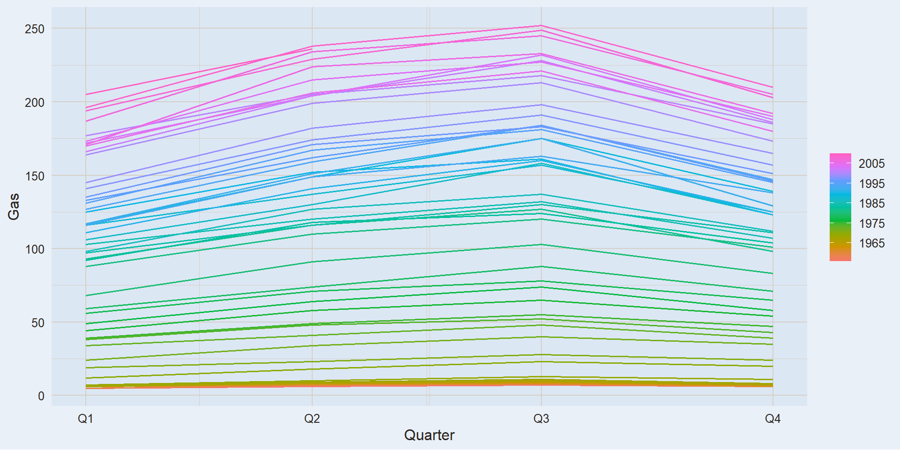](r_time_series_files/figure-revealjs/gg_season_render-1.png)

[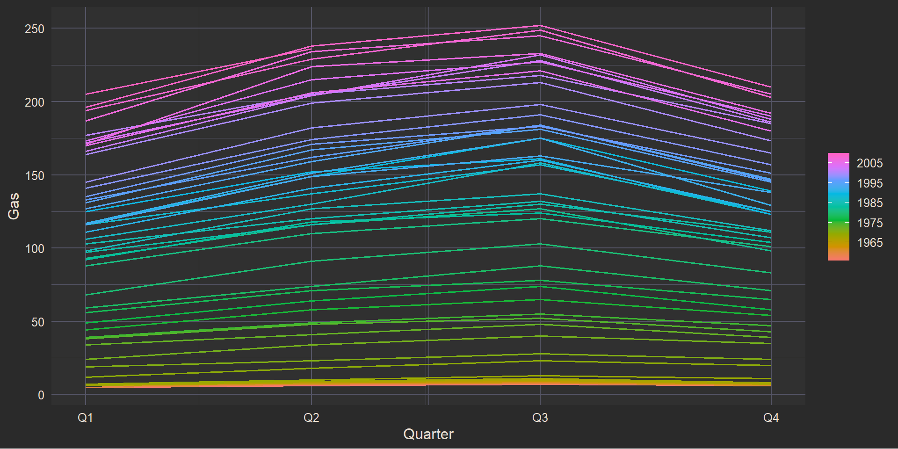](r_time_series_files/figure-revealjs/gg_season_render-2.png)

The data here are plotted against a single “season”. It’s useful in identifying years with changes in patterns.

Removing the trend from the data:

[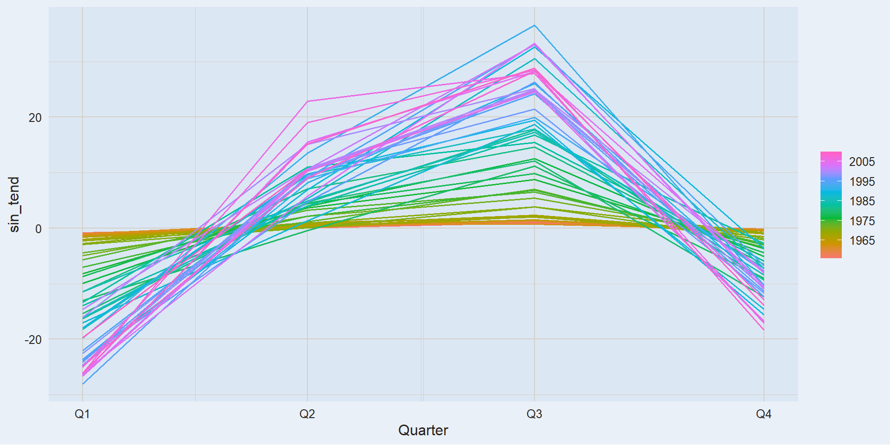](r_time_series_files/figure-revealjs/gg_season2_render-1.png)

[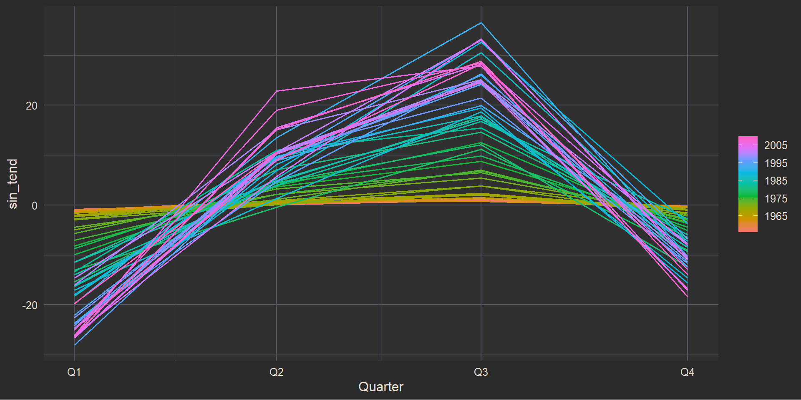](r_time_series_files/figure-revealjs/gg_season2_render-2.png)

## 3.4 Seasonal Subseries Plots

Code

``` numberSource
gas_subseries_p <- aus_production |>
  gg_subseries(Gas)
```

[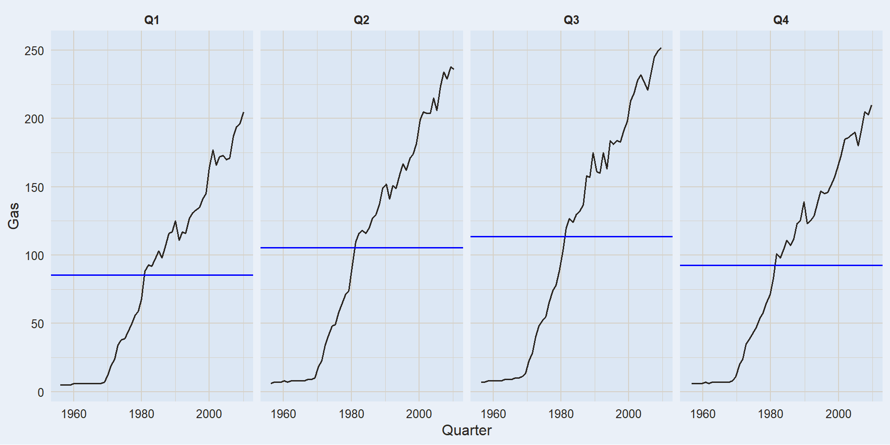](r_time_series_files/figure-revealjs/gg_subseries_render-1.png)

[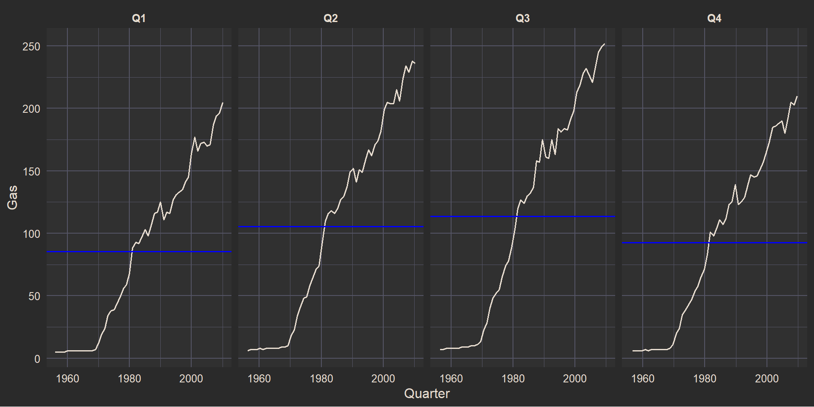](r_time_series_files/figure-revealjs/gg_subseries_render-2.png)

Here we split the plot into many subplots, one for each season. This helps us see clearly the underlying seasonal pattern. The mean for each season is represented as the blue horizontal line.

## 3.5 `gg_tsdisplay()`

Code

``` numberSource
theme_narsil()
```

    <theme> List of 144
     $ line                            : <ggplot2::element_line>
      ..@ colour       : chr "black"
      ..@ linewidth    : num 0.545
      ..@ linetype     : num 1
      ..@ lineend      : chr "butt"
      ..@ linejoin     : chr "round"
      ..@ arrow        : logi FALSE
      ..@ arrow.fill   : chr "black"
      ..@ inherit.blank: logi TRUE
     $ rect                            : <ggplot2::element_rect>
      ..@ fill         : chr "white"
      ..@ colour       : chr "black"
      ..@ linewidth    : num 0.545
      ..@ linetype     : num 1
      ..@ linejoin     : chr "round"
      ..@ inherit.blank: logi TRUE
     $ text                            : <ggplot2::element_text>
      ..@ family       : chr ""
      ..@ face         : chr "plain"
      ..@ italic       : chr NA
      ..@ fontweight   : num NA
      ..@ fontwidth    : num NA
      ..@ colour       : chr "#2A2520"
      ..@ size         : num 12
      ..@ hjust        : num 0.5
      ..@ vjust        : num 0.5
      ..@ angle        : num 0
      ..@ lineheight   : num 0.9
      ..@ margin       : <ggplot2::margin> num [1:4] 0 0 0 0
      ..@ debug        : logi FALSE
      ..@ inherit.blank: logi FALSE
     $ title                           : <ggplot2::element_text>
      ..@ family       : NULL
      ..@ face         : NULL
      ..@ italic       : chr NA
      ..@ fontweight   : num NA
      ..@ fontwidth    : num NA
      ..@ colour       : NULL
      ..@ size         : NULL
      ..@ hjust        : NULL
      ..@ vjust        : NULL
      ..@ angle        : NULL
      ..@ lineheight   : NULL
      ..@ margin       : NULL
      ..@ debug        : NULL
      ..@ inherit.blank: logi TRUE
     $ point                           : <ggplot2::element_point>
      ..@ colour       : chr "black"
      ..@ shape        : num 19
      ..@ size         : num 1.64
      ..@ fill         : chr "white"
      ..@ stroke       : num 0.545
      ..@ inherit.blank: logi TRUE
     $ polygon                         : <ggplot2::element_polygon>
      ..@ fill         : chr "white"
      ..@ colour       : chr "black"
      ..@ linewidth    : num 0.545
      ..@ linetype     : num 1
      ..@ linejoin     : chr "round"
      ..@ inherit.blank: logi TRUE
     $ geom                            : <ggplot2::element_geom>
      ..@ ink        : chr "black"
      ..@ paper      : chr "white"
      ..@ accent     : chr "#3366FF"
      ..@ linewidth  : num 0.545
      ..@ borderwidth: num 0.545
      ..@ linetype   : int 1
      ..@ bordertype : int 1
      ..@ family     : chr ""
      ..@ fontsize   : num 4.22
      ..@ pointsize  : num 1.64
      ..@ pointshape : num 19
      ..@ colour     : NULL
      ..@ fill       : NULL
     $ spacing                         : 'simpleUnit' num 6points
      ..- attr(*, "unit")= int 8
     $ margins                         : <ggplot2::margin> num [1:4] 6 6 6 6
     $ aspect.ratio                    : NULL
     $ axis.title                      : <ggplot2::element_text>
      ..@ family       : NULL
      ..@ face         : NULL
      ..@ italic       : chr NA
      ..@ fontweight   : num NA
      ..@ fontwidth    : num NA
      ..@ colour       : chr "#2A2520"
      ..@ size         : NULL
      ..@ hjust        : NULL
      ..@ vjust        : NULL
      ..@ angle        : NULL
      ..@ lineheight   : NULL
      ..@ margin       : NULL
      ..@ debug        : NULL
      ..@ inherit.blank: logi FALSE
     $ axis.title.x                    : <ggplot2::element_text>
      ..@ family       : NULL
      ..@ face         : NULL
      ..@ italic       : chr NA
      ..@ fontweight   : num NA
      ..@ fontwidth    : num NA
      ..@ colour       : NULL
      ..@ size         : NULL
      ..@ hjust        : NULL
      ..@ vjust        : num 1
      ..@ angle        : NULL
      ..@ lineheight   : NULL
      ..@ margin       : <ggplot2::margin> num [1:4] 3 0 0 0
      ..@ debug        : NULL
      ..@ inherit.blank: logi TRUE
     $ axis.title.x.top                : <ggplot2::element_text>
      ..@ family       : NULL
      ..@ face         : NULL
      ..@ italic       : chr NA
      ..@ fontweight   : num NA
      ..@ fontwidth    : num NA
      ..@ colour       : NULL
      ..@ size         : NULL
      ..@ hjust        : NULL
      ..@ vjust        : num 0
      ..@ angle        : NULL
      ..@ lineheight   : NULL
      ..@ margin       : <ggplot2::margin> num [1:4] 0 0 3 0
      ..@ debug        : NULL
      ..@ inherit.blank: logi TRUE
     $ axis.title.x.bottom             : NULL
     $ axis.title.y                    : <ggplot2::element_text>
      ..@ family       : NULL
      ..@ face         : NULL
      ..@ italic       : chr NA
      ..@ fontweight   : num NA
      ..@ fontwidth    : num NA
      ..@ colour       : NULL
      ..@ size         : NULL
      ..@ hjust        : NULL
      ..@ vjust        : num 1
      ..@ angle        : num 90
      ..@ lineheight   : NULL
      ..@ margin       : <ggplot2::margin> num [1:4] 0 3 0 0
      ..@ debug        : NULL
      ..@ inherit.blank: logi TRUE
     $ axis.title.y.left               : NULL
     $ axis.title.y.right              : <ggplot2::element_text>
      ..@ family       : NULL
      ..@ face         : NULL
      ..@ italic       : chr NA
      ..@ fontweight   : num NA
      ..@ fontwidth    : num NA
      ..@ colour       : NULL
      ..@ size         : NULL
      ..@ hjust        : NULL
      ..@ vjust        : num 1
      ..@ angle        : num -90
      ..@ lineheight   : NULL
      ..@ margin       : <ggplot2::margin> num [1:4] 0 0 0 3
      ..@ debug        : NULL
      ..@ inherit.blank: logi TRUE
     $ axis.text                       : <ggplot2::element_text>
      ..@ family       : NULL
      ..@ face         : NULL
      ..@ italic       : chr NA
      ..@ fontweight   : num NA
      ..@ fontwidth    : num NA
      ..@ colour       : chr "#2A2520"
      ..@ size         : 'rel' num 0.8
      ..@ hjust        : NULL
      ..@ vjust        : NULL
      ..@ angle        : NULL
      ..@ lineheight   : NULL
      ..@ margin       : NULL
      ..@ debug        : NULL
      ..@ inherit.blank: logi FALSE
     $ axis.text.x                     : <ggplot2::element_text>
      ..@ family       : NULL
      ..@ face         : NULL
      ..@ italic       : chr NA
      ..@ fontweight   : num NA
      ..@ fontwidth    : num NA
      ..@ colour       : NULL
      ..@ size         : NULL
      ..@ hjust        : NULL
      ..@ vjust        : num 1
      ..@ angle        : NULL
      ..@ lineheight   : NULL
      ..@ margin       : <ggplot2::margin> num [1:4] 2.4 0 0 0
      ..@ debug        : NULL
      ..@ inherit.blank: logi TRUE
     $ axis.text.x.top                 : <ggplot2::element_text>
      ..@ family       : NULL
      ..@ face         : NULL
      ..@ italic       : chr NA
      ..@ fontweight   : num NA
      ..@ fontwidth    : num NA
      ..@ colour       : NULL
      ..@ size         : NULL
      ..@ hjust        : NULL
      ..@ vjust        : NULL
      ..@ angle        : NULL
      ..@ lineheight   : NULL
      ..@ margin       : <ggplot2::margin> num [1:4] 0 0 5.4 0
      ..@ debug        : NULL
      ..@ inherit.blank: logi TRUE
     $ axis.text.x.bottom              : <ggplot2::element_text>
      ..@ family       : NULL
      ..@ face         : NULL
      ..@ italic       : chr NA
      ..@ fontweight   : num NA
      ..@ fontwidth    : num NA
      ..@ colour       : NULL
      ..@ size         : NULL
      ..@ hjust        : NULL
      ..@ vjust        : NULL
      ..@ angle        : NULL
      ..@ lineheight   : NULL
      ..@ margin       : <ggplot2::margin> num [1:4] 5.4 0 0 0
      ..@ debug        : NULL
      ..@ inherit.blank: logi TRUE
     $ axis.text.y                     : <ggplot2::element_text>
      ..@ family       : NULL
      ..@ face         : NULL
      ..@ italic       : chr NA
      ..@ fontweight   : num NA
      ..@ fontwidth    : num NA
      ..@ colour       : NULL
      ..@ size         : NULL
      ..@ hjust        : num 1
      ..@ vjust        : NULL
      ..@ angle        : NULL
      ..@ lineheight   : NULL
      ..@ margin       : <ggplot2::margin> num [1:4] 0 2.4 0 0
      ..@ debug        : NULL
      ..@ inherit.blank: logi TRUE
     $ axis.text.y.left                : <ggplot2::element_text>
      ..@ family       : NULL
      ..@ face         : NULL
      ..@ italic       : chr NA
      ..@ fontweight   : num NA
      ..@ fontwidth    : num NA
      ..@ colour       : NULL
      ..@ size         : NULL
      ..@ hjust        : NULL
      ..@ vjust        : NULL
      ..@ angle        : NULL
      ..@ lineheight   : NULL
      ..@ margin       : <ggplot2::margin> num [1:4] 0 5.4 0 0
      ..@ debug        : NULL
      ..@ inherit.blank: logi TRUE
     $ axis.text.y.right               : <ggplot2::element_text>
      ..@ family       : NULL
      ..@ face         : NULL
      ..@ italic       : chr NA
      ..@ fontweight   : num NA
      ..@ fontwidth    : num NA
      ..@ colour       : NULL
      ..@ size         : NULL
      ..@ hjust        : NULL
      ..@ vjust        : NULL
      ..@ angle        : NULL
      ..@ lineheight   : NULL
      ..@ margin       : <ggplot2::margin> num [1:4] 0 0 0 5.4
      ..@ debug        : NULL
      ..@ inherit.blank: logi TRUE
     $ axis.text.theta                 : NULL
     $ axis.text.r                     : <ggplot2::element_text>
      ..@ family       : NULL
      ..@ face         : NULL
      ..@ italic       : chr NA
      ..@ fontweight   : num NA
      ..@ fontwidth    : num NA
      ..@ colour       : NULL
      ..@ size         : NULL
      ..@ hjust        : num 0.5
      ..@ vjust        : NULL
      ..@ angle        : NULL
      ..@ lineheight   : NULL
      ..@ margin       : <ggplot2::margin> num [1:4] 0 2.4 0 2.4
      ..@ debug        : NULL
      ..@ inherit.blank: logi TRUE
     $ axis.ticks                      : <ggplot2::element_blank>
     $ axis.ticks.x                    : NULL
     $ axis.ticks.x.top                : NULL
     $ axis.ticks.x.bottom             : NULL
     $ axis.ticks.y                    : NULL
     $ axis.ticks.y.left               : NULL
     $ axis.ticks.y.right              : NULL
     $ axis.ticks.theta                : NULL
     $ axis.ticks.r                    : NULL
     $ axis.minor.ticks.x.top          : NULL
     $ axis.minor.ticks.x.bottom       : NULL
     $ axis.minor.ticks.y.left         : NULL
     $ axis.minor.ticks.y.right        : NULL
     $ axis.minor.ticks.theta          : NULL
     $ axis.minor.ticks.r              : NULL
     $ axis.ticks.length               : 'rel' num 0.5
     $ axis.ticks.length.x             : NULL
     $ axis.ticks.length.x.top         : NULL
     $ axis.ticks.length.x.bottom      : NULL
     $ axis.ticks.length.y             : NULL
     $ axis.ticks.length.y.left        : NULL
     $ axis.ticks.length.y.right       : NULL
     $ axis.ticks.length.theta         : NULL
     $ axis.ticks.length.r             : NULL
     $ axis.minor.ticks.length         : 'rel' num 0.75
     $ axis.minor.ticks.length.x       : NULL
     $ axis.minor.ticks.length.x.top   : NULL
     $ axis.minor.ticks.length.x.bottom: NULL
     $ axis.minor.ticks.length.y       : NULL
     $ axis.minor.ticks.length.y.left  : NULL
     $ axis.minor.ticks.length.y.right : NULL
     $ axis.minor.ticks.length.theta   : NULL
     $ axis.minor.ticks.length.r       : NULL
     $ axis.line                       : <ggplot2::element_blank>
     $ axis.line.x                     : NULL
     $ axis.line.x.top                 : NULL
     $ axis.line.x.bottom              : NULL
     $ axis.line.y                     : NULL
     $ axis.line.y.left                : NULL
     $ axis.line.y.right               : NULL
     $ axis.line.theta                 : NULL
     $ axis.line.r                     : NULL
     $ legend.background               : <ggplot2::element_blank>
     $ legend.margin                   : NULL
     $ legend.spacing                  : 'rel' num 2
     $ legend.spacing.x                : NULL
     $ legend.spacing.y                : NULL
     $ legend.key                      : <ggplot2::element_blank>
     $ legend.key.size                 : 'simpleUnit' num 1.2lines
      ..- attr(*, "unit")= int 3
     $ legend.key.height               : NULL
     $ legend.key.width                : NULL
     $ legend.key.spacing              : NULL
     $ legend.key.spacing.x            : NULL
     $ legend.key.spacing.y            : NULL
     $ legend.key.justification        : NULL
     $ legend.frame                    : NULL
     $ legend.ticks                    : NULL
     $ legend.ticks.length             : 'rel' num 0.2
     $ legend.axis.line                : NULL
     $ legend.text                     : <ggplot2::element_text>
      ..@ family       : NULL
      ..@ face         : NULL
      ..@ italic       : chr NA
      ..@ fontweight   : num NA
      ..@ fontwidth    : num NA
      ..@ colour       : chr "#2A2520"
      ..@ size         : 'rel' num 0.8
      ..@ hjust        : NULL
      ..@ vjust        : NULL
      ..@ angle        : NULL
      ..@ lineheight   : NULL
      ..@ margin       : NULL
      ..@ debug        : NULL
      ..@ inherit.blank: logi FALSE
     $ legend.text.position            : NULL
     $ legend.title                    : <ggplot2::element_text>
      ..@ family       : NULL
      ..@ face         : chr "bold"
      ..@ italic       : chr NA
      ..@ fontweight   : num NA
      ..@ fontwidth    : num NA
      ..@ colour       : chr "#2A2520"
      ..@ size         : NULL
      ..@ hjust        : num 0
      ..@ vjust        : NULL
      ..@ angle        : NULL
      ..@ lineheight   : NULL
      ..@ margin       : NULL
      ..@ debug        : NULL
      ..@ inherit.blank: logi FALSE
     $ legend.title.position           : NULL
     $ legend.position                 : chr "right"
     $ legend.position.inside          : NULL
     $ legend.direction                : NULL
     $ legend.byrow                    : NULL
     $ legend.justification            : chr "center"
     $ legend.justification.top        : NULL
     $ legend.justification.bottom     : NULL
     $ legend.justification.left       : NULL
     $ legend.justification.right      : NULL
     $ legend.justification.inside     : NULL
      [list output truncated]
     @ complete: logi TRUE
     @ validate: logi TRUE

Code

``` numberSource
aus_production |>
  gg_tsdisplay(Gas, plot_type = "season")
```

[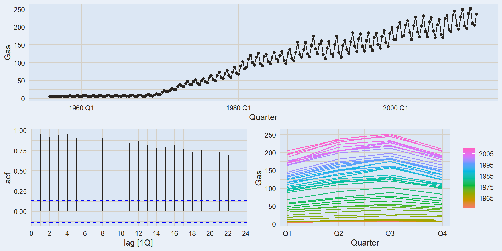](r_time_series_files/figure-revealjs/gg_tsdisplay-1.png)

This function provides a convenient way to have 3 plots: a time plot, an ACF plot, and a third option that can be customized with one of the following plot types:

> **TIP:**
>
> - “auto”,
> - “partial”,
> - “season”,
> - “histogram”,
> - “scatter”,
> - “spectrum”

## 3.6 Exporting data to .csv

Code

``` numberSource
tourism |> 
  filter(State == "Tasmania",
         Region == "East Coast") |> 
  mutate(Quarter = as.Date(Quarter)) |> 
  write_csv("./datos/tasmania.csv")
```

You can export to .csv by providing a `tsibble` or `tibble` (or any other type of data frame), by calling **`write_csv()`**, and specifying the output file’s name.

Back to top

## Footnotes

[^1]: shown besides the tsibble dimension as `[1Q]`

[^2]: these are specified in the `key` argument. This tsibble contains
