# R, tsibble, and Time Series

Modified

August 21, 2026

# 1 Packages

## 1.1 The `tidyverse`

Code

``` r
library(tidyverse)
```

    ── Attaching core tidyverse packages ──────────────────────── tidyverse 2.0.0 ──
    ✔ dplyr     1.2.1     ✔ readr     2.2.0
    ✔ forcats   1.0.1     ✔ stringr   1.6.0
    ✔ ggplot2   4.0.2     ✔ tibble    3.3.1
    ✔ lubridate 1.9.5     ✔ tidyr     1.3.2
    ✔ purrr     1.2.2     
    ── Conflicts ────────────────────────────────────────── tidyverse_conflicts() ──
    ✖ dplyr::filter() masks stats::filter()
    ✖ dplyr::lag()    masks stats::lag()
    ℹ Use the conflicted package (<http://conflicted.r-lib.org/>) to force all conflicts to become errors

- `tidyverse` is a meta-package that loads the core packages of the [tidyverse](https://tidyverse.org/).

We will always load all the required packages a the beginning of the document. When loading the `tidyverse`, it shows which packages are being attached, as well as any conflicts with previously loaded packages.

> **NOTE:**
>
> - [`dplyr`](https://dplyr.tidyverse.org/) is the core package for **data transformation**. It is paired up with the following packages for specific column types:
>   - [`stringr`](https://stringr.tidyverse.org/) for strings.
>   - [`forcats`](https://forcats.tidyverse.org/) for **factors** (R’s categorical data type).
>   - [`lubridate`](https://lubridate.tidyverse.org/) for dates and date-times.
> - [`ggplot2`](https://ggplot2.tidyverse.org/) is the primary package for visualization.
> - [`readr`](https://readr.tidyverse.org/) is used to **import data** from delimited files (CSV, TSV, …).
> - [`tibble`](https://tibble.tidyverse.org/) is a modern reimagining of the data frame, keeping what time has proven to be effective, and throwing out what is not.
> - [`tidyr`](https://tidyr.tidyverse.org/) is used to **tidy** data, i.e. to ensure that each variable is in its own column, each observation is in its own row, and each value is in its own cell.
> - [`purrr`](https://purrr.tidyverse.org/) is used for functional programming with R.

## 1.2 The `tidyverts`

Code

``` r
library(fpp3)
```

    ── Attaching packages ──────────────────────────────────────────── fpp3 1.0.3 ──

    ✔ tsibble     1.2.0     ✔ feasts      0.5.0
    ✔ tsibbledata 0.4.1     ✔ fable       0.5.0
    ✔ ggtime      0.2.0     

    ── Conflicts ───────────────────────────────────────────────── fpp3_conflicts ──
    ✖ lubridate::date()    masks base::date()
    ✖ dplyr::filter()      masks stats::filter()
    ✖ tsibble::intersect() masks base::intersect()
    ✖ tsibble::interval()  masks lubridate::interval()
    ✖ dplyr::lag()         masks stats::lag()
    ✖ tsibble::setdiff()   masks base::setdiff()
    ✖ tsibble::union()     masks base::union()

- `fpp3` is also a meta-package that load the [tidyverts](https://tidyverts.org/) ecosystem for time series analysis and forecasting.

The `tidyverts` packages are made to work seamlessly with the `tidyverse`.

> **NOTE:**
>
> - [`tsibble`](https://tsibble.tidyverts.org/) is the main data structure we will use to analyze and model time series. It is a **t**ime **series** t**ibble**.
> - [`feasts`](https://feasts.tidyverts.org/) provides many functions and tools for feature and statistics extraction for time series.
> - [`fable`](https://fable.tidyverts.org/) is the core package for modeling and foreasting time series.

# 2 Time Series

## 2.1 `tsibble` objects

A `tsibble` is a [`tibble`](https://tibble.tidyverse.org/index.html) that also records which column measures time and which columns identify each series.

Let’s take a look at tourism in Australia:

Code

``` r
tourism
```

    # A tsibble: 24,320 x 5 [1Q]
    # Key:       Region, State, Purpose [304]
       Quarter Region   State           Purpose  Trips
         <qtr> <chr>    <chr>           <chr>    <dbl>
     1 1998 Q1 Adelaide South Australia Business  135.
     2 1998 Q2 Adelaide South Australia Business  110.
     3 1998 Q3 Adelaide South Australia Business  166.
     4 1998 Q4 Adelaide South Australia Business  127.
     5 1999 Q1 Adelaide South Australia Business  137.
     6 1999 Q2 Adelaide South Australia Business  200.
     7 1999 Q3 Adelaide South Australia Business  169.
     8 1999 Q4 Adelaide South Australia Business  134.
     9 2000 Q1 Adelaide South Australia Business  154.
    10 2000 Q2 Adelaide South Australia Business  169.
    # ℹ 24,310 more rows

The `tsibble` has 24320 rows and 5 columns. It shows quarterly data[^1] on tourism across Australia.

Because the time structure belongs to the object rather than to our code, the `tidyverts` functions never have to guess where time lives: `autoplot()`, `model()`, and `forecast()` all read it from the tsibble. It also makes the object checkable — a tsibble refuses to be created if the same series has two observations at the same time point.

## 2.2 Index and key

Code

``` r
index_var(tourism) # <1>
key_vars(tourism)  # <2>
key_data(tourism)  # <3>
```

1.  The **index** is the column along which time moves forward.
2.  The **key** is the set of columns that distinguish one series from another. A tsibble can have no key at all (a single series), one key column, or several.
3.  `key_data()` lists every distinct combination of the key columns, along with the rows belonging to each.

    [1] "Quarter"
    [1] "Region"  "State"   "Purpose"
    # A tibble: 304 × 4
       Region         State              Purpose        .rows
     * <chr>          <chr>              <chr>    <list<int>>
     1 Adelaide       South Australia    Business        [80]
     2 Adelaide       South Australia    Holiday         [80]
     3 Adelaide       South Australia    Other           [80]
     4 Adelaide       South Australia    Visiting        [80]
     5 Adelaide Hills South Australia    Business        [80]
     6 Adelaide Hills South Australia    Holiday         [80]
     7 Adelaide Hills South Australia    Other           [80]
     8 Adelaide Hills South Australia    Visiting        [80]
     9 Alice Springs  Northern Territory Business        [80]
    10 Alice Springs  Northern Territory Holiday         [80]
    # ℹ 294 more rows

Index and key together define what one observation is: one point on the index, for one combination of the key. That pair is what a tsibble keeps unique, and those two arguments are all you need in order to build one.

`tourism` is divided by Region, State, and purpose of the trip[^2]. How many different states are there?

## 2.3 Australian States

Code

``` r
distinct(tourism, State)
```

## 2.4 Which regions are located in Tasmania?

Code

``` r
distinct(filter(tourism, State == "Tasmania"),Region)
```

## 2.5 Building a tsibble

Most data does not arrive as a tsibble. `as_tsibble()` builds one from a data frame by naming the index and the key:

Code

``` r
sales <- tibble(
  month = yearmonth(c("2024 Jan", "2024 Feb", "2024 Mar",   # <1>
                      "2024 Jan", "2024 Feb", "2024 Apr")),
  store = c("North", "North", "North", "South", "South", "South"),
  units = c(120, 135, 128, 98, 105, 111)
)

sales
```

1.  `yearmonth()` turns text into a monthly time class. The index has to be a time class; a plain number or a string will not do.

    # A tibble: 6 × 3
          month store units
          <mth> <chr> <dbl>
    1 2024 ene. North   120
    2 2024 feb. North   135
    3 2024 mar. North   128
    4 2024 ene. South    98
    5 2024 feb. South   105
    6 2024 abr. South   111

Code

``` r
sales_ts <- sales |>
  as_tsibble(index = month, key = store) # <1>

sales_ts
```

1.  `month` is the index and `store` is the key. The header now reports `[1M]` for the monthly interval and `store [2]` for the two series it found.

    # A tsibble: 6 x 3 [1M]
    # Key:       store [2]
          month store units
          <mth> <chr> <dbl>
    1 2024 ene. North   120
    2 2024 feb. North   135
    3 2024 mar. North   128
    4 2024 ene. South    98
    5 2024 feb. South   105
    6 2024 abr. South   111

`as_tsibble()` declares structure rather than changing values: the numbers are untouched, but the object now knows what time is. It also checks the declaration and fails immediately if a key–index pair is duplicated or if the index cannot be ordered. Getting that error at construction time is far cheaper than discovering the problem after fitting a model.

The interval `[1M]` is inferred, not declared. `tsibble` looks at the distances between consecutive index values and reports the finest regular interval that fits them.

## 2.6 Gaps and missing values

Code

``` r
has_gaps(sales_ts) # <1>
```

1.  `South` jumps from February to April, so March is absent as a *row* rather than present with a missing value.

    # A tibble: 2 × 2
      store .gaps
      <chr> <lgl>
    1 North FALSE
    2 South TRUE 

Code

``` r
sales_ts |>
  fill_gaps() # <1>
```

1.  `fill_gaps()` inserts the missing row and marks `units` as `NA`, turning the implicit gap into an explicit missing value.

    # A tsibble: 7 x 3 [1M]
    # Key:       store [2]
          month store units
          <mth> <chr> <dbl>
    1 2024 ene. North   120
    2 2024 feb. North   135
    3 2024 mar. North   128
    4 2024 ene. South    98
    5 2024 feb. South   105
    6 2024 mar. South    NA
    7 2024 abr. South   111

A missing value is a row that exists with `NA` in it. A gap is a row that does not exist at all. The distinction matters because a series with an invisible hole in it will be read as if February were followed by April with nothing in between, so lags, seasonal periods, and differences all shift by one position from that point onward.

`fill_gaps()` is what makes the problem visible. Once the gap is an `NA`, you can decide what to do about it: interpolate it, drop the affected span, or leave it and let the model handle it.

## 2.7 Data Transformation: Average trips

To get the average trips by purpose, we need to do the following:

1.  Filter the original `tsibble` to get only the data from East Coast, Tasmania.
2.  Convert the data to a `tibble`.
3.  Group by purpose.
4.  Summarise by getting the mean of the trips.

## 2.8

With traditional code, this would look something like:

Code

``` r
summarise(group_by(as_tibble(filter(tourism, State == "Tasmania", 
                                    Region == "East Coast")), Purpose),
          mean_trips = mean(Trips))
```

> **NOTE:**
>
> Note that this code must be read inside-out. This makes it harder to understand, and also harder to debug.

## 2.9

Using the native pipe operator; `|>`, we can improve the same code:

Code

``` r
tourism |>                            # <1>
  filter(State == "Tasmania",         # <2>
         Region == "East Coast") |>   # <2>
  as_tibble() |>                      # <3>
  group_by(Purpose) |>                # <4>
  summarise(mean_trips = mean(Trips)) # <5>
```

1.  Take the tsibble `tourism`, *then*
2.  filter by State and Region, *then*
3.  convert to a `tibble`, *then*
4.  group the tibble by purpose, *then*
5.  summarise by taking the mean trips

> **TIP:**
>
> The pipe is read as “**then**”, and it allows us to write code in the order it’s supposed to be run.
>
> It also helps to debug code easier, because you can run each function in order and see where the error is.

# 3 TS Visualization

## 3.1 Plotting tourism across time

Code

``` r
tourism_p <- tourism |>
  filter(State == "Tasmania",
         Region == "East Coast") |>
  autoplot(Trips) +                             # <1>
  facet_wrap(vars(Purpose), scale = "free_y") + # <2>
  theme(legend.position = "none")               # <3>
```

1.  `autoplot()` detects the data automatically and proposes a plot accordingly.
2.  `facet_wrap()` Divides a plot into subplots (facets).
3.  you can customize endless feautres using `theme()`. Here, we remove the legend, as it’s redudant.

[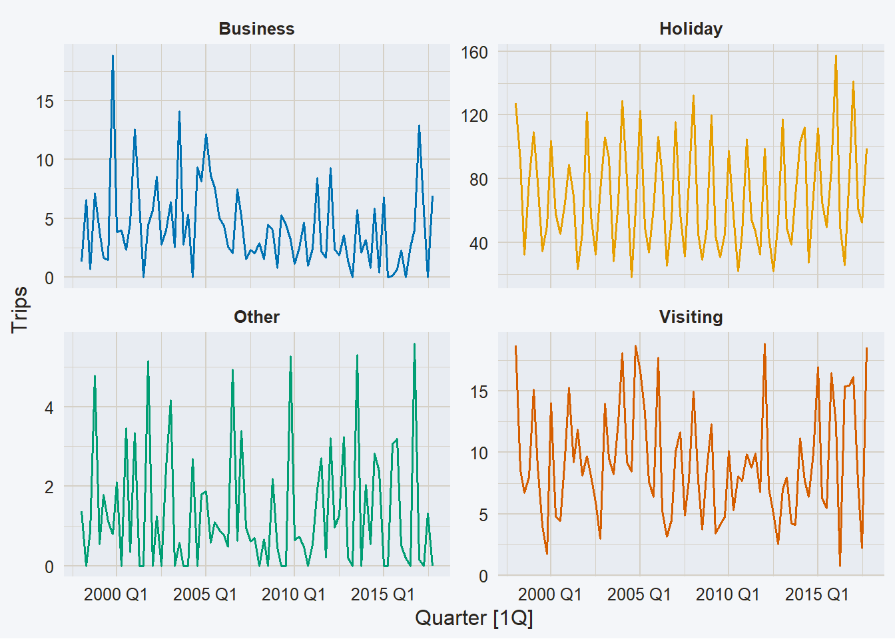](r_time_series_files/figure-html/ts_viz_full_render-1.png)

[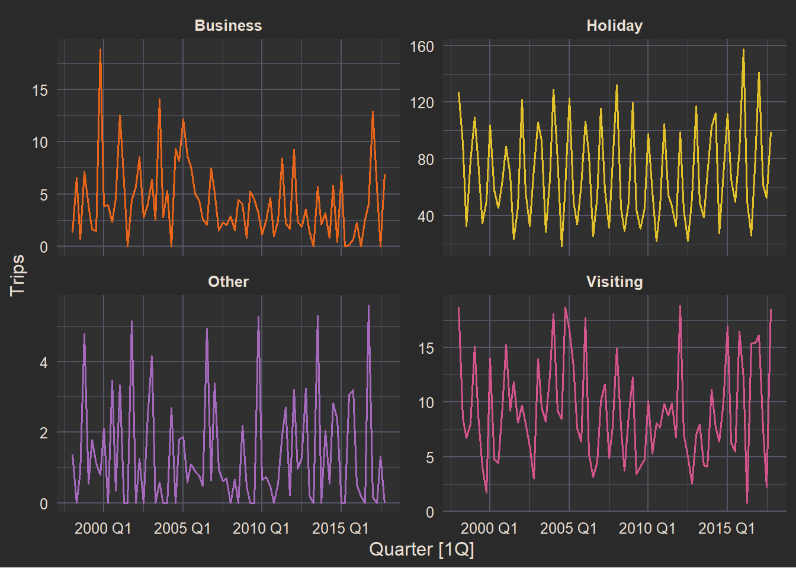](r_time_series_files/figure-html/ts_viz_full_render-2.png)

## 3.2 Time plots

Code

``` numberSource
gas_p <- aus_production |>
  autoplot(Gas)
```

[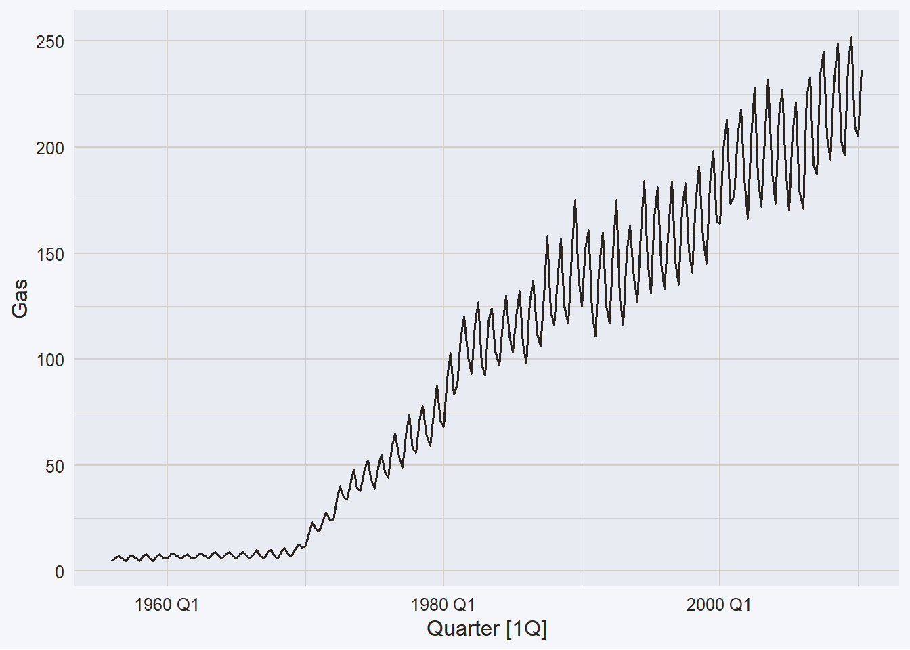](r_time_series_files/figure-html/time_plot_1_render-1.png)

[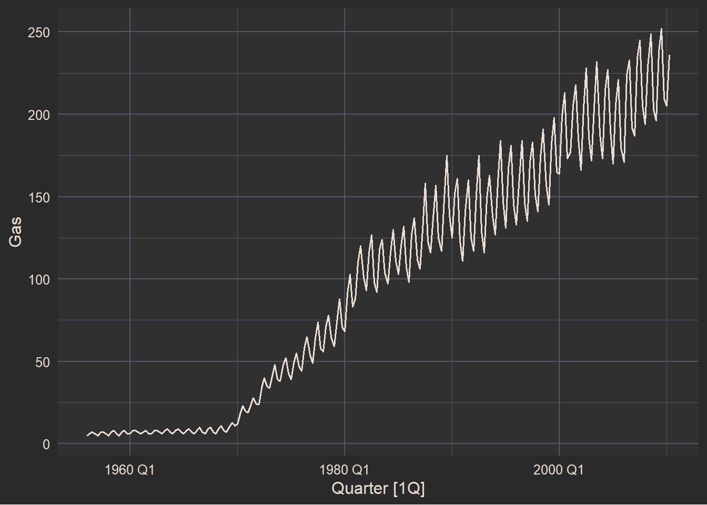](r_time_series_files/figure-html/time_plot_1_render-2.png)

Code

``` numberSource
gas_points_p <- aus_production |>
  autoplot(Gas) +
  geom_point()
```

[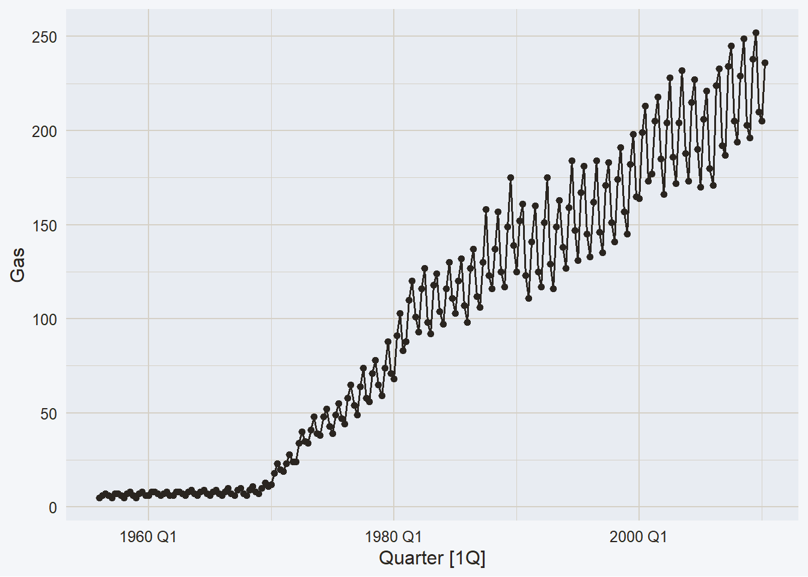](r_time_series_files/figure-html/time_plot_2_render-1.png)

[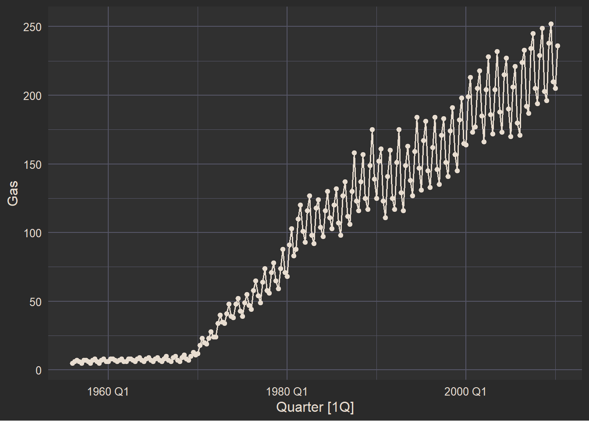](r_time_series_files/figure-html/time_plot_2_render-2.png)

These are the most basic type of plots. We have the time variable in the x-axis, and our forecast variable in the y-axis. Time plots should be line plots, and can include or not points.

## 3.3 Seasonal Plots

Code

``` numberSource
gas_season_p <- aus_production |>
  gg_season(Gas)
```

[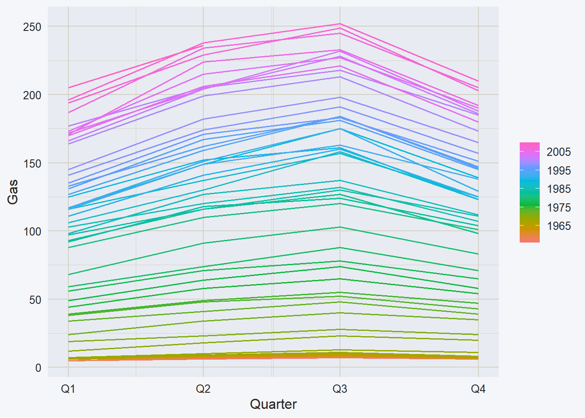](r_time_series_files/figure-html/gg_season_render-1.png)

[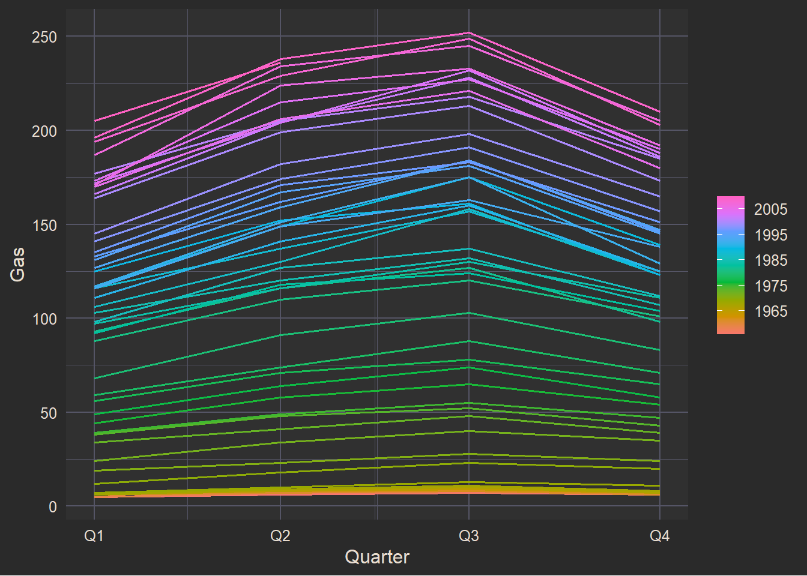](r_time_series_files/figure-html/gg_season_render-2.png)

The data here are plotted against a single “season”. It’s useful in identifying years with changes in patterns.

Removing the trend from the data:

[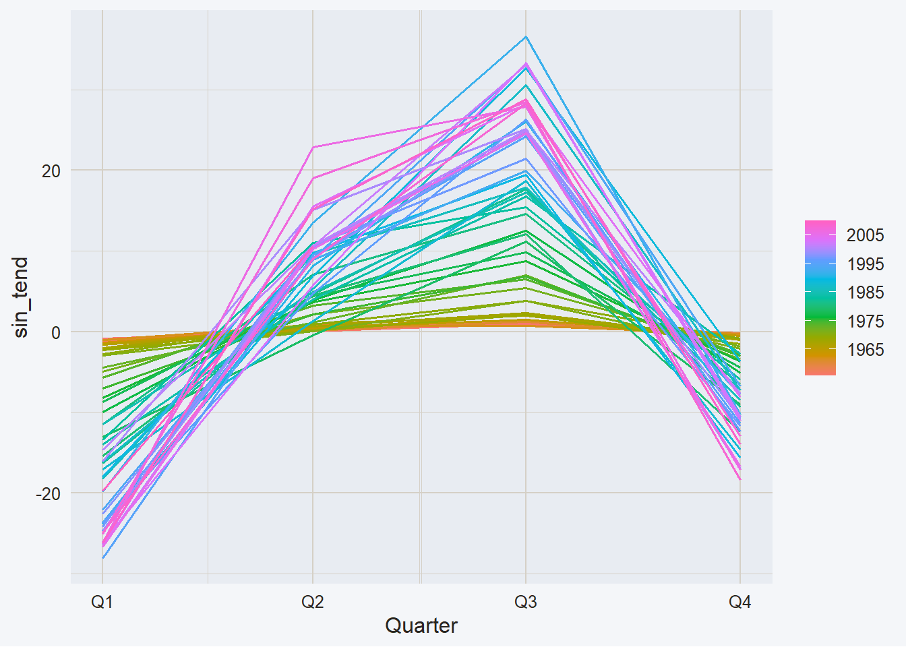](r_time_series_files/figure-html/gg_season2_render-1.png)

[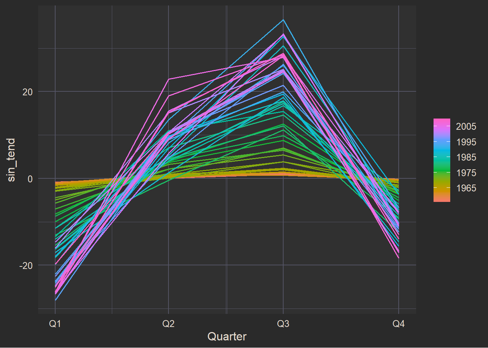](r_time_series_files/figure-html/gg_season2_render-2.png)

## 3.4 Seasonal Subseries Plots

Code

``` numberSource
gas_subseries_p <- aus_production |>
  gg_subseries(Gas)
```

[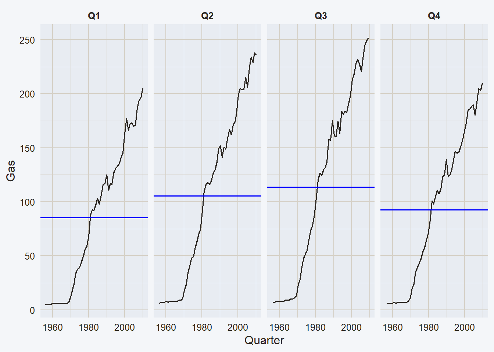](r_time_series_files/figure-html/gg_subseries_render-1.png)

[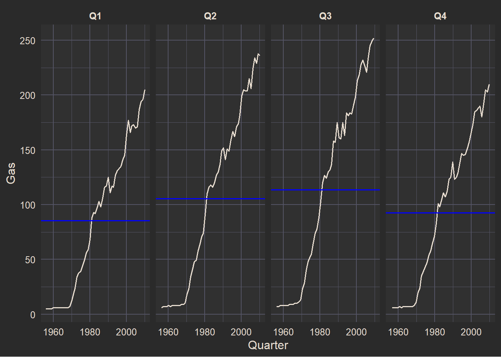](r_time_series_files/figure-html/gg_subseries_render-2.png)

Here we split the plot into many subplots, one for each season. This helps us see clearly the underlying seasonal pattern. The mean for each season is represented as the blue horizontal line.

## 3.5 `gg_tsdisplay()`

Code

``` numberSource
theme_narsil()
aus_production |>
  gg_tsdisplay(Gas, plot_type = "season")
```

[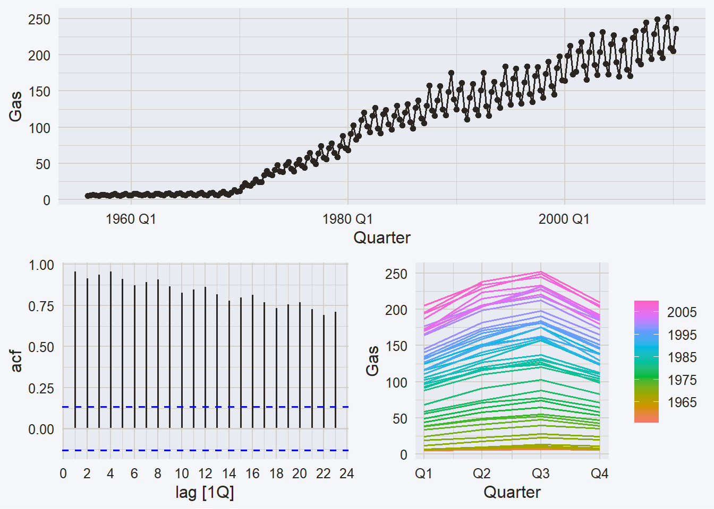](r_time_series_files/figure-html/gg_tsdisplay-1.png)

This function provides a convenient way to have 3 plots: a time plot, an ACF plot, and a third option that can be customized with one of the following plot types:

> **TIP:**
>
> - “auto”,
> - “partial”,
> - “season”,
> - “histogram”,
> - “scatter”,
> - “spectrum”

## 3.6 Exporting data to .csv

Code

``` numberSource
tourism |> 
  filter(State == "Tasmania",
         Region == "East Coast") |> 
  mutate(Quarter = as.Date(Quarter)) |> 
  write_csv("./datos/tasmania.csv")
```

You can export to .csv by providing a `tsibble` or `tibble` (or any other type of data frame), by calling **`write_csv()`**, and specifying the output file’s name.

Back to top

## Footnotes

[^1]: shown besides the tsibble dimension as `[1Q]`

[^2]: these are specified in the `key` argument, and each distinct combination of them is one series. This tsibble contains 304 of them.
