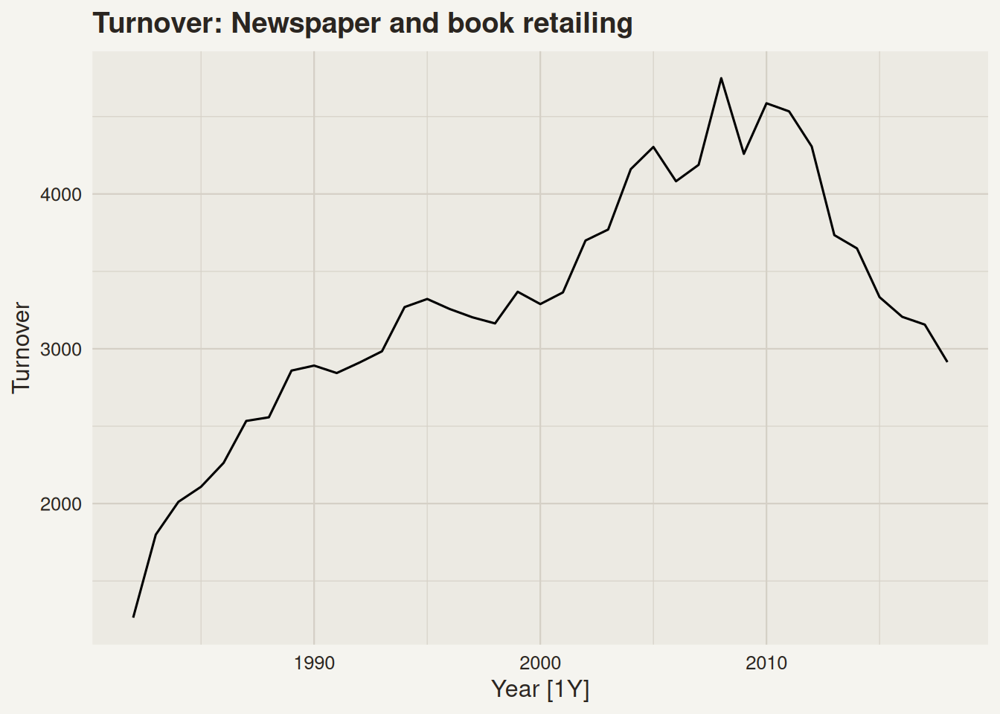
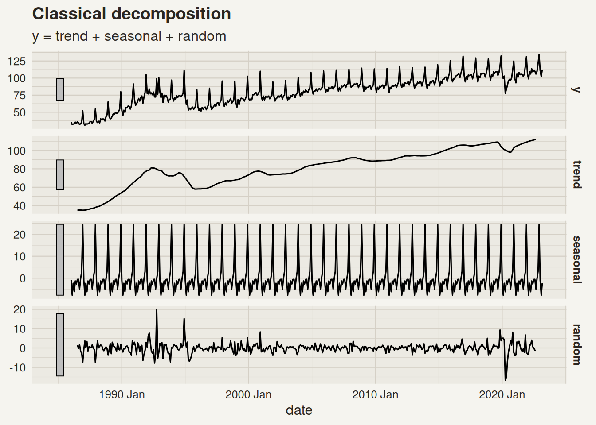
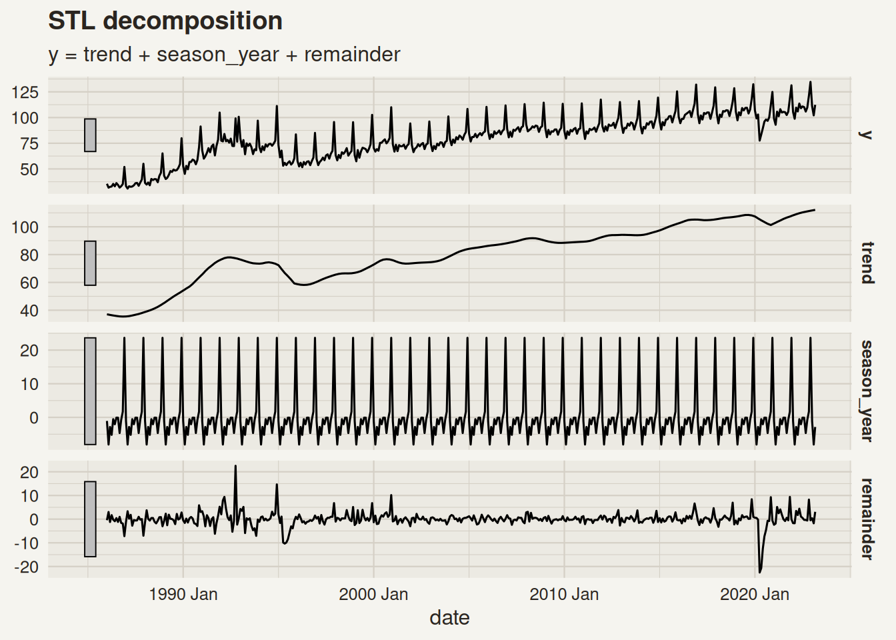

# Time Series Decomposition

Modified

June 1, 2026

Code

``` r
library(tidyquant) #<1>
library(plotly)    #<1>
```

1.  In addition to the regular packages, here we’ll use `tidyquant` and `plotly`

# 1 TS Features & Patterns

Expand


Expand


Expand


Expand


All these time series have different shapes, patterns, and so on. When modeling them, we need to take these characteristics into account. We seek to understand the underlying patterns in the data to make better forecasts.

## 1.1 TS Patterns

Time series can have distinct patterns:

- **Trend:** A long-term increase/decrease in the data.

- **Seasonal:** Fluctuations in the time series with a fixed and known period[^1].

- **Cycles:** More commonly known as “Business cycles”, refer to rises and falls that are not of a fixed frequency[^2].

- **Changes in variability:** Changes in the spread of the data over time, i. e., an increase/decrease in the variance as the level of the series increases/decreases.

## 1.2 Components of a Time Series

A time series can be decomposed into the following components:

- **Seasonal component (S):** The repeating short-term cycle in the series.

- **Trend-cycle component (T):** The long-term progression of the series.

- **Residual component (R):** The residuals or “noise” left after removing the seasonal and trend-cycle components.

# 2 Mathematical Transformations

Transformations are used to stabilize the variance of a time series, making it easier to model and forecast. They can help to make the patterns in the data more apparent.

## 2.1 Log transformations

## Series in levels

> **NOTE:**
>
> Transformations and adjustments help us simplify the patterns in our data, and can improve our forecasts’ accuracy.

## Log

- Log transformations are often useful when the data presents an increasing/decreasing variation with the level of the series.

- Log transformations are very interpretable: changes in a log value are percent changes on the original scale.

## 2.2 Box-Cox transformations

w_t= \begin{cases}\log \left(y_t\right) & \text { if } \lambda=0 \\ \left(\operatorname{sign}\left(y_t\right)\left\|y_t\right\|^\lambda-1\right) / \lambda & \text { otherwise }\end{cases}

In a Box-Cox transformation, the log is always a natural logarithm. The other case is just a power transformation with scaling.

*What happens when \lambda = 1?*

> **TIP:**
>
> You should choose a value of \lambda that makes the size of the seasonal variation the same throughout the series.

### 2.2.1 How can we choose the value of \lambda?

We can use the `guerrero` feature to choose an optimal lambda.

Code

``` numberSource
aus_production |> 
  features(Gas, features = guerrero)
```

    # A tibble: 1 × 1
      lambda_guerrero
                <dbl>
    1           0.110

# 3 Time Series Adjustments

## 3.1 Calendar adjustments

## Closing price and volume

Code

``` r
google_month <- google |> 
  index_by(month = yearmonth(date)) |> 
  summarise(
    trading_days = n(),
    monthly_volume = sum(volume),
    mean_volume = mean(volume)
  )

google_month
```

## Monthly aggregation

## Monthly total and mean and volume

- The number of trading days in a month can vary due to weekends and holidays, and not because of any economic reason.
- Using the monthly total volume can be misleading, as months with more trading days will naturally have higher total volumes.
- Using the mean volume per trading day helps to standardize the data, making it easier to compare across months.

## 3.2 Population adjustments

Is the Mexican economy really that similar Australia’s economy? Is Iceland’s economy really that small?

- A greater GDP can be interpreted as having a larger economy, and a better life standard, but this is not always the case.
- Comparing GDP across countries with different population sizes can be misleading.
- GDP is often used to measure the economic performance of a country, but it doesn’t account for population size.
- The higher the population, the higher the GDP tends to be, simply because there are more people contributing to the economy.
- A more meaningful comparison can be made by looking at *GDP per capita*, which divides the GDP by the population size.

## Population

The population sizes of these countries are very different.

## GDP per capita

- GDP per capita provides a more accurate representation of the economic well-being of individuals in a country.
- It is clear now that Iceland and Australia have a much higher GDP per capita compared to Mexico, indicating a higher standard of living for its residents.

### 3.2.1 Business examples of population adjustments

### 3.2.2 Retail expansion

**Revenue** vs **Revenue per store**

- Total revenue \uparrow can be “just more stores”
- Per-store revenue reveals **dilution** vs **true performance**
- **Normalize by:** \# stores

### 3.2.3 Customer base growth

**Sales** vs **Sales per active customer**

- Sales \uparrow can hide weaker **customer value**
- Per-customer series tracks **ARPA / LTV direction** (signal, not hype) -**Normalize by:** active customers

### 3.2.4 Operational load

**Support tickets** vs **Tickets per customer / contract**

- Tickets \uparrow may be scale, not worse quality
- Tickets per customer exposes **product/service degradation** -**Normalize by:** customers or contracts

> **TIP:**
>
> If the business “size” changes over time (stores, customers, users, employees, assets), model the **rate** (per-unit) to separate **growth** from **efficiency**.

## 3.3 Inflation adjustments

- Inflation is the rate at which the general level of prices for goods and services is rising, and subsequently, purchasing power is falling.
- To make meaningful comparisons of economic data over time, it is essential to adjust for inflation.
- This adjustment is typically done using a price index, such as the Consumer Price Index (CPI). In Mexico, the National Consumer Price Index (INPC) is used. INEGI provides this data.

### 3.3.1 Inflation adjustment formula

x_t = \frac{y_t}{z_t} \* z\_{2010}

where:

- y_t is the original value at time t (nominal value).
- z_t is the price index at time t (e.g., INPC).
- z\_{2010} is the price index in the base year (2010 in this case).
- x_t is the inflation-adjusted value at time t (real value).

### 3.3.2 Inflation adjustment - example

## Nominal values

[](ts_dcmp_files/figure-html/inflation_adjustment-1.png)

## Real values

Code

``` r
aus_economy <- global_economy |>
  filter(Code == "AUS")


print_retail <- print_retail |> 
  left_join(aus_economy, by = "Year") |>
  mutate(Adjusted_turnover = Turnover / CPI) 
```

## Nominal vs. Real values

# 4 Time Series Decomposition

## 4.1 Types of Decompositions

A decomposition splits the time series into its underlying components:

- Trend-cycle
- Seasonal pattern(s)

And what’s left of it we simply call it a “remainder component”.

In general, there are two types of decompositions:

### 4.1.1 Additive decomposition

y_t = T_t + S_t + R_t

### 4.1.2 Multiplicative decomposition

y_t = T_t \times S_t \times R_t \\

- *Which one should you use?*

- If the seasonal variation is roughly constant over time, use an additive decomposition.
- If the seasonal variation increases or decreases with the level of the series, use a multiplicative decomposition.
- If you’re unsure, you can try both and see which one provides a better fit.

A multiplicative decomposition is equivalent to an additive decomposition of the log-transformed series:

y_t = T_t \times S_t \times R_t

is equivalent to

\log(y_t) = \log(T_t) + \log(S_t) + \log(R_t)

## 4.2 Seasonally adjusted series

One use of decomposition is to obtain a seasonally adjusted series, which is the original series with the seasonal component removed.

Seasonally adjusted series can be useful for:

- Identifying and analyzing the trend-cycle component without the influence of seasonal fluctuations.
- Making comparisons across different time periods without seasonal effects.

- For an additive decomposition, the seasonally adjusted series is given by: y_t - S_t
- For a multiplicative decomposition, the seasonally adjusted series is given by: \frac{y_t}{S_t}

## 4.3 Classical decomposition

The classical decomposition is a simple method for decomposing time series data. It assumes that the components of the time series are additive or multiplicative.

1.  The **trend-cycle** component is estimated using a moving average.

An m order moving average is given by:

\hat{T}\_{t}=\frac{1}{m} \sum\_{j=-k}^{k} y\_{t+j}

where k = (m-1)/2[^3].

2.  Then, the **seasonal component** is estimated by averaging the detrended values for each season.
3.  Finally, the **remainder component** is obtained by subtracting the trend-cycle and seasonal components from the original series.

### 4.3.1 Example of a classical decomposition

Code

``` r
mexretail_dcmp <- mexretail |>                                # <1>
  model(                                                      # <2>
    classical = classical_decomposition(y, type = "additive") # <3>
  ) |> 
  components()                                                # <4>

mexretail_dcmp                                                # <5>
```

1.  We start with our original `tsibble`.
2.  Inside the `model()` function, we specify the type of models we want to use.
3.  In any model used, the first thing we need to specify is our forecast variable. Then, depending on the model used, we can specify additional parameters. The `model()` function yields a `mable`[^4], which is a table that contains the fitted models for each time series in the `tsibble`.
4.  The `components()` function is used to extract the components of the decomposition (trend-cycle, seasonal, and remainder) from the fitted models in the `mable`. It also provides the seasonally adjusted series.
5.  Finally, we store the result.

Code

``` r
mexretail_dcmp |> 
  autoplot()
```

[](ts_dcmp_files/figure-html/classical_decomp_plot-1.png)

### 4.3.2 Problems of using a Classical decomposition

- The trend-cycle component is not estimated at the beginning and end of the series. This can be problematic if you want to forecast the series.
- It also tends to over-smooth rises and falls.
- It assumes that the seasonal component is constant over time, which may not be the case in many real-world scenarios.
- It is not robust to outliers, which can significantly affect the estimates of the components.

> **WARNING:**
>
> It is not recommended to use classical decomposition for forecasting because of these issues.

# 5 STL decomposition

STL (Seasonal and Trend decomposition using Loess) is a more advanced method for decomposing time series data[^5]. It uses locally weighted regression (loess) to estimate the trend-cycle and seasonal components. STL is more flexible than classical decomposition and can handle changes in the seasonal component over time.

- It can handle any type of seasonality (not just fixed periods).
- It can handle changes in the seasonal component over time.
- It is robust to outliers.
- It can be used for forecasting.
- It provides a way to control the smoothness of the trend and seasonal components through parameters.

> **WARNING:**
>
> - STL cannot automatically handle calendar or holiday variations.
>
> - It only provides methods for additive models. If your data has multiplicative seasonality, you should log-transform the data before applying STL.

### 5.0.1 STL in R using `fable`

The code is basically the same as for the classical decomposition. We just need to change the model used inside the `model()` function.

Code

``` r
mexretail |>                                
  model(                                                      
    stl = STL(y ~                            # <1>
                trend(window = NULL) +       # <2>
                season(window = "periodic"), # <3>
              robust = TRUE)                 # <4> 
  ) |> 
  components() |> 
  autoplot()
```

1.  Inside the `STL()` function, we can specify the formula for the decomposition, or don’t specify it at all. See [`?STL`](https://feasts.tidyverts.org/reference/STL.html) for more details.
2.  The `trend()` function is used to specify the trend component of the decomposition. The `window` argument controls the smoothness of the trend component. A larger window results in a smoother trend.
3.  The `season()` function is used to specify the seasonal component of the decomposition. The `window` argument controls the smoothness of the seasonal component. Setting it to “periodic” means that the seasonal component will be fixed over time.
4.  The `robust` argument, when set to `TRUE`, makes the STL decomposition more robust to outliers in the data, so the effect of such values is sent to the residual component.

[](ts_dcmp_files/figure-html/stl_decomp_full-1.png)

> **TIP:**
>
> In R, we use “\sim” instead of “=” in formula specification, i.e., y \sim mx + b.

Back to top

## Footnotes

[^1]: A time series can have multiple seasonal patterns.

[^2]: They usually last at least 2 years.

[^3]: In R, you can compute any moving average by using the `slider::slide_dbl()` function.

[^4]: short for “model table”

[^5]: There are other decomposition methods primarily used by official statistics agencies, such as X-11, X-12-ARIMA, and TRAMO/SEATS. However, these methods are not as widely used in the forecasting community as STL. For more on these, see [this](https://otexts.com/fpp3/methods-used-by-official-statistics-agencies.html).
