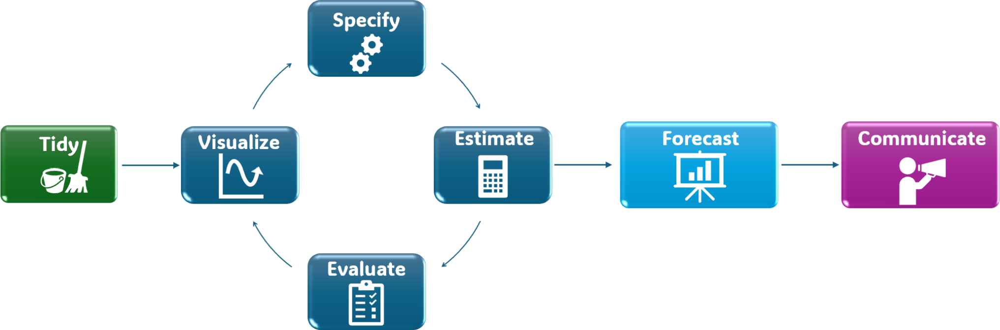
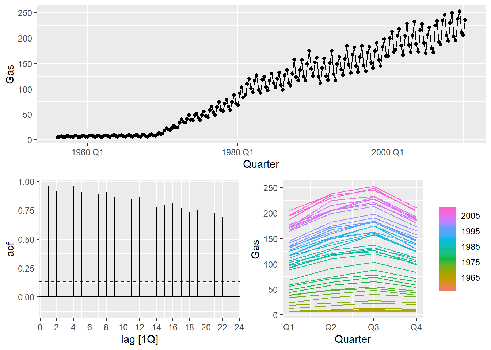

# Forecasting Foundations

Modified

June 1, 2026

# 1 A tidy forecasting workflow

[](fcst_wf.png)

### 1.0.1 Foundations

Forecasting requires methodological discipline:

- Split the data (train/test)
- Establish **benchmark models**
- Forecast
- Measure accuracy
- Select a baseline
- Refit and produce the final forecast

### 1.0.2 Example dataset

We use a built-in dataset from `fpp3`: `aus_production`.

- It is already a `tsibble`
- It contains multiple economic production series
- We focus on `Gas`

### 1.0.3 Visualize

[](forecasting_files/figure-html/viz-1.png)

### 1.0.4 Train/test split

- Split the series into **training** and **test** sets.
- The test set length should match the **forecast horizon**.

For this example, we use the last **8 quarters** as test data.

    n_train  n_test 
        212       6 

> **NOTE:**
>
> In time series, the training set must contain earlier observations and the test set later observations.  
> We mimic the real-world scenario: use past data to forecast the future.

### 1.0.5 Benchmark models

Before fitting complex models, we establish benchmarks.

Common benchmark methods in tidyverts:

- Mean method: `MEAN()`
- Naïve method: `NAIVE()`
- Seasonal naïve method: `SNAIVE()`
- Drift method: `RW(... drift())`

Code

``` r
bench_fit <- gas_train |> 
  model(
    mean   = MEAN(Gas),
    naive  = NAIVE(Gas),
    snaive = SNAIVE(Gas),
    drift  = RW(Gas ~ drift())
  )
```

### 1.0.6 Forecast

Generate forecasts with a horizon equal to the test set length.

Code

``` r
bench_fcst <- bench_fit |> 
  forecast(h = nrow(gas_test))
```

(Optional) Plot forecasts:

Code

``` r
bench_fcst |> 
  autoplot(gas_train, level = 95) |> 
  autolayer(gas_test, Gas, alpha = 0.7)
```

### 1.0.7 Forecast accuracy

We measure forecast accuracy using forecast errors:

e\_{T+h} = y\_{T+h} - \hat{y}\_{T+h\|T}

Compute accuracy metrics:

Code

``` r
bench_acc <- bench_fcst |> 
  accuracy(gas_test) |> 
  arrange(MASE)

bench_acc
```

Selection rule:

- Prefer models that perform well on **MASE** (scale-independent).
- For seasonal data, `snaive` is often a strong benchmark.

### 1.0.8 Error metrics

Using forecast errors, we can compute summary metrics:

[TABLE]

Common error metrics {.caption-top .table}

### 1.0.9 Refit and forecast

Once a benchmark is selected based on the test set, refit it using **all available data**, then forecast the desired future horizon.

Example: refit `snaive` and forecast the next 8 quarters.

Code

``` r
final_fit <- aus_production |> 
  model(
    final_model = SNAIVE(Gas)
  )

final_fcst <- final_fit |> 
  forecast(h = "8 quarters")
```

### 1.0.10 Communicate

Forecasting is not finished when numbers are produced.  
Results must be communicated clearly and honestly.

Minimum communication checklist:

- Plot: history + forecast + prediction intervals
- Horizon: what the forecast period represents
- Baseline: state the benchmark model used
- Uncertainty: prediction intervals are essential
- Limitations: structural breaks, short samples, changing conditions

Back to top
