# Forecasting Foundations

Modified

June 10, 2026

# 1 A tidy forecasting workflow

[](fcst_wf.png)

Everything we have done so far — visualizing patterns, decomposing components — serves one purpose: producing better forecasts.

1.  **Visualize** — identify patterns in the training data
2.  **Specify & estimate** — choose and fit a model on the training set
3.  **Evaluate** — inspect residuals; check for white noise
4.  **Refine** — adjust the model if residuals show remaining structure
5.  **Forecast** — generate forecasts over the test horizon
6.  **Measure accuracy** — compare forecasts against the test set
7.  **Refit & deploy** — refit the chosen model on all available data

### 1.0.1 Train / test split

Before fitting any model, split the series into a **training set** and a **test set**[^1].

- The test set length should match the intended **forecast horizon**.
- A common rule: hold out the last 20–30% of observations, or the last h periods where h is the forecast horizon.

**Option 1 — programmatic split:**

Code

``` r
h <- <horizon>                           #<1>

data_train <- data |>
  slice_head(n = nrow(data) - h)         #<2>

data_test <- data |>
  slice_tail(n = h)                      #<3>
```

1.  Define the forecast horizon once; reuse it throughout.
2.  Training set: all observations except the last `h`.
3.  Test set: the last `h` observations.

**Option 2 — `filter_index()`:**

Code

``` r
data_train <- data |>
  filter_index(. ~ "end_date")           #<1>

data_test <- data |>
  filter_index("start_date" ~ .)         #<2>
```

1.  Training set: from the beginning up to `end_date`.
2.  Test set: from `start_date` to the end of the series.

> **NOTE:**
>
> In time series the training set must always contain the **earlier** observations and the test set the **later** ones. We simulate the real-world scenario: use the past to forecast the future. Shuffling observations — as in cross-sectional machine learning — destroys the temporal structure.

### 1.0.2 Specify & estimate

Fit one or more models on the **training set** using `model()`. Each model specification goes inside the call as a named argument[^2]:

Code

``` r
data_fit <- data_train |>
  model(
    model_1 = <model_spec>(<y>),                      #<1>
    model_2 = <model_spec>(<transformation>(<y>))     #<2>
  )
```

1.  Model specification — the function depends on the model family.
2.  If a transformation is needed, wrap the response variable inside the spec.

### 1.0.3 Evaluate, refine, forecast

After fitting:

- Extract **fitted values** and **residuals** with `augment()`
- Inspect residuals with `gg_tsresiduals()` — they should resemble white noise
- If residuals show remaining structure, **refine**: change the model or add a transformation
- Generate forecasts over the test horizon with `forecast(h = ...)`[^3]

Code

``` r
data_fc <- data_fit |>
  forecast(h = nrow(data_test))   #<1>
```

1.  `h` equals the number of rows in the test set so the forecast horizon lines up exactly with the observations to compare against.

### 1.0.4 Accuracy & refit

Compute accuracy metrics by comparing forecasts against the held-out data:

Code

``` r
data_fc |>
  accuracy(data)    #<1>
```

1.  Pass the **full** tsibble (train + test). `fable` uses the training portion to compute scaled error denominators (MASE, RMSSE) and the test portion to compute forecast errors.

Once a model is selected, **refit on all available data** and forecast the desired future horizon:

Code

``` r
final_fit <- data |>
  model(<chosen_model>(<y>))

final_fc <- final_fit |>
  forecast(h = <horizon>)
```

------------------------------------------------------------------------

# 2 Benchmark forecasting methods

Before fitting complex models, establish **benchmark forecasts**.

Benchmarks serve two purposes:

1.  They set a **floor** — any serious model should clear it.
2.  They reveal when complexity adds nothing.

They are simple, transparent, and surprisingly hard to beat.

### 2.0.1 The four benchmark methods

## Mean

\hat{y}\_{T+h\|T} = \bar{y}

- Forecasts the **historical average** for all future periods.
- Assumes no trend, no seasonality — the series fluctuates around a fixed level.
- Useful baseline for stationary series.

Code

``` r
MEAN(y)
```

## Naïve

\hat{y}\_{T+h\|T} = y_T

- Forecasts the **last observed value** for all future periods.
- Assumes the most recent past is the best predictor.
- Equivalent to a random walk. Surprisingly hard to beat for many economic and financial series.

Code

``` r
NAIVE(y)
```

## Seasonal Naïve

\hat{y}\_{T+h\|T} = y\_{T+h-m}

where m is the seasonal period.

- Forecasts using the **last observed value from the same season**.
- Captures seasonality with no trend modeling.
- Often the strongest benchmark for seasonal data.

Code

``` r
SNAIVE(y)
```

## Drift

\hat{y}\_{T+h\|T} = y_T + h \cdot \frac{y_T - y_1}{T - 1}

- Extrapolates a **linear trend** from the first to the last observation.
- Equivalent to a random walk with drift.
- Simple but competitive for trending series.

Code

``` r
RW(y ~ drift())
```

### 2.0.2 Fitting all four at once

In `fable`, all four benchmarks can be fitted simultaneously inside a single `model()` call:

Code

``` r
data_fit <- data_train |>
  model(
    mean   = MEAN(y),
    naive  = NAIVE(y),
    snaive = SNAIVE(y),
    drift  = RW(y ~ drift())
  )
```

The result is a **model table** (mable) — one row per series, one column per model.

### 2.0.3 Which method wins?

The right benchmark depends on the structure of the series.

## Hare

[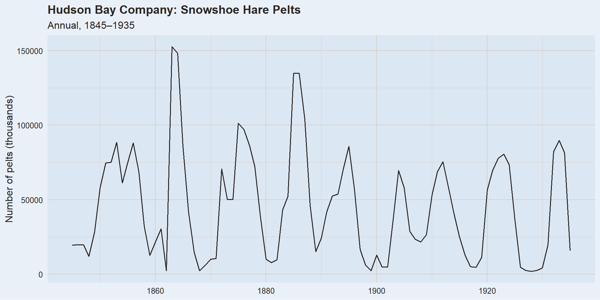](forecasting_files/figure-revealjs/hare-plot-render-1.png)

[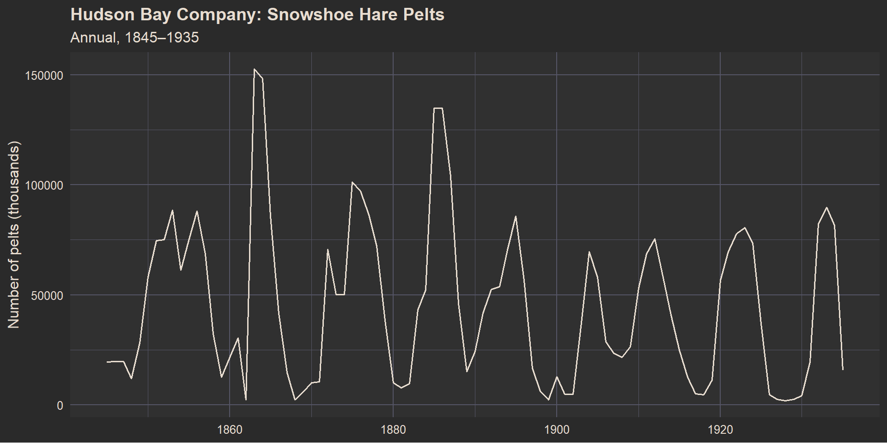](forecasting_files/figure-revealjs/hare-plot-render-2.png)

Code

``` r
h_hare <- 15

hare_train <- pelt |>
  slice_head(n = nrow(pelt) - h_hare)

hare_fit <- hare_train |>
  model(
    mean   = MEAN(Hare),
    naive  = NAIVE(Hare),
    snaive = SNAIVE(Hare),
    drift  = RW(Hare ~ drift())
  )

hare_fc <- hare_fit |>
  forecast(h = h_hare)
```

[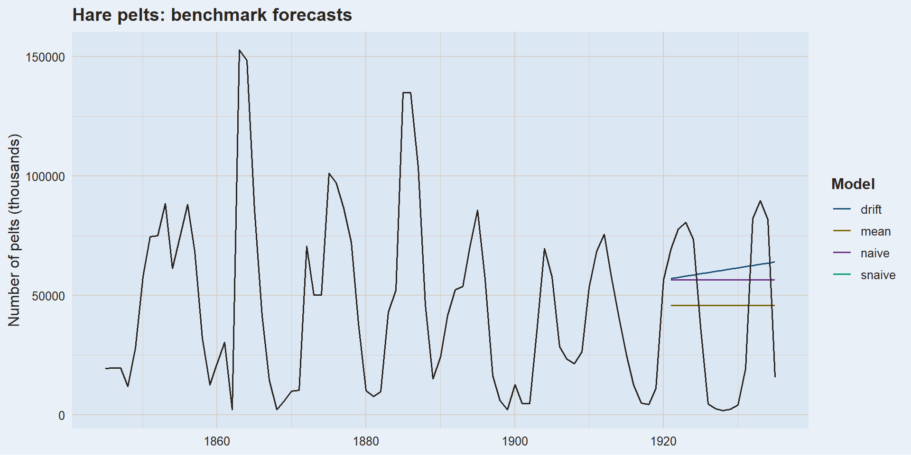](forecasting_files/figure-revealjs/hare-fcst-plot-render-1.png)

[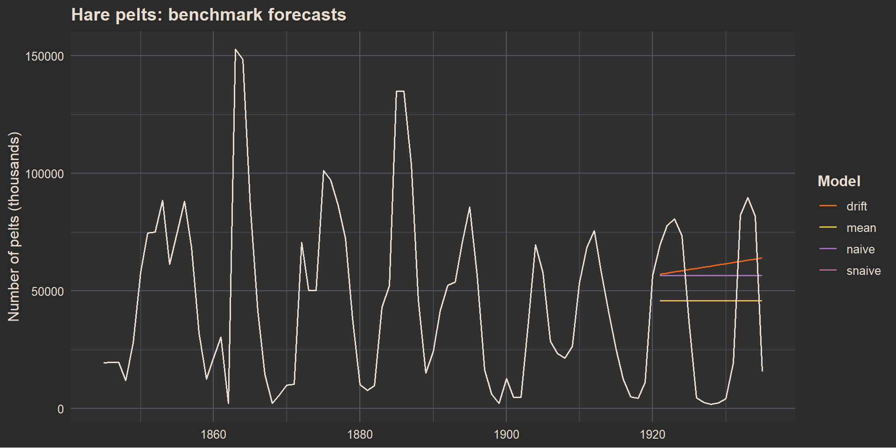](forecasting_files/figure-revealjs/hare-fcst-plot-render-2.png)

> **NOTE:**
>
> The Hare series has no persistent trend and no seasonal pattern — it fluctuates irregularly around a roughly stable level. **MEAN** and **NAIVE** are the most sensible benchmarks: MEAN captures the long-run average, NAIVE assumes the most recent value is the best guess. Drift extrapolates whatever slope happens to exist at the end of training, which is misleading here. SNAIVE is not meaningful for annual data with no seasonal structure.

## Beer

[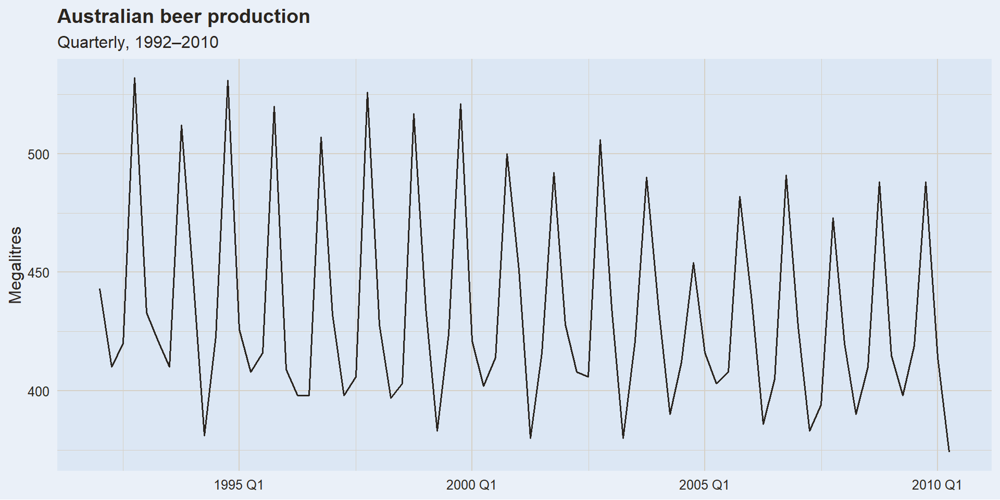](forecasting_files/figure-revealjs/beer-plot-render-1.png)

[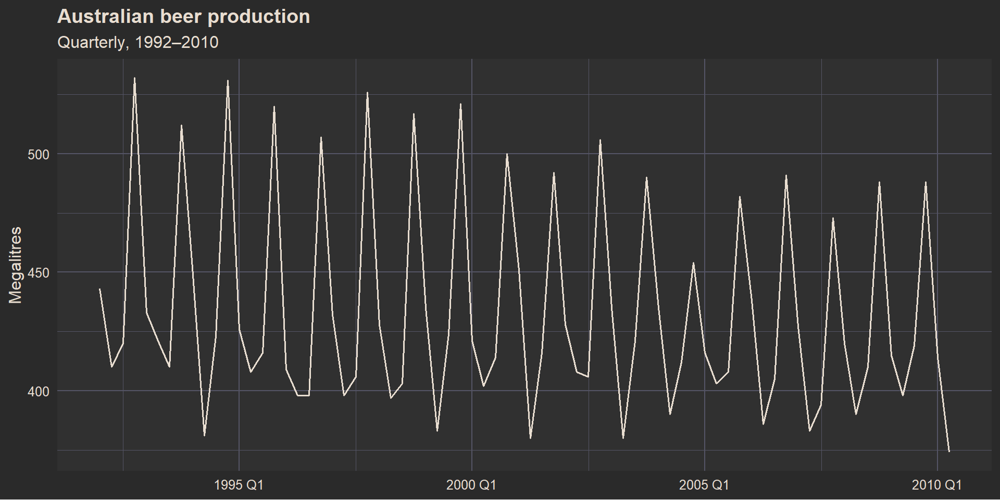](forecasting_files/figure-revealjs/beer-plot-render-2.png)

Code

``` r
beer <- aus_production |>
  filter(year(Quarter) >= 1992) |>
  select(Quarter, Beer)

h_beer <- 4 * 4  # 4 years of quarterly data

beer_train <- beer |>
  slice_head(n = nrow(beer) - h_beer)

beer_fit <- beer_train |>
  model(
    mean   = MEAN(Beer),
    naive  = NAIVE(Beer),
    snaive = SNAIVE(Beer),
    drift  = RW(Beer ~ drift())
  )

beer_fc <- beer_fit |>
  forecast(h = h_beer)
```

[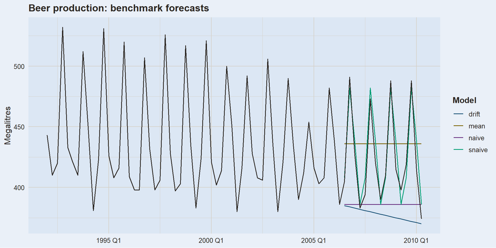](forecasting_files/figure-revealjs/beer-fcst-plot-render-1.png)

[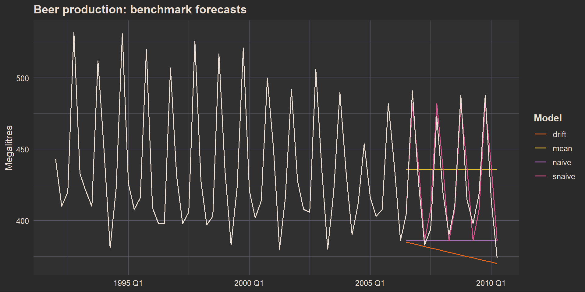](forecasting_files/figure-revealjs/beer-fcst-plot-render-2.png)

> **NOTE:**
>
> From 1992 onward the series shows clear quarterly seasonality with no visible long-run trend — production oscillates in a stable band. **SNAIVE** is the natural winner: it repeats the last observed value from the same quarter, tracking the seasonal pattern without inventing a trend that isn’t there.

## Mexico GDP

[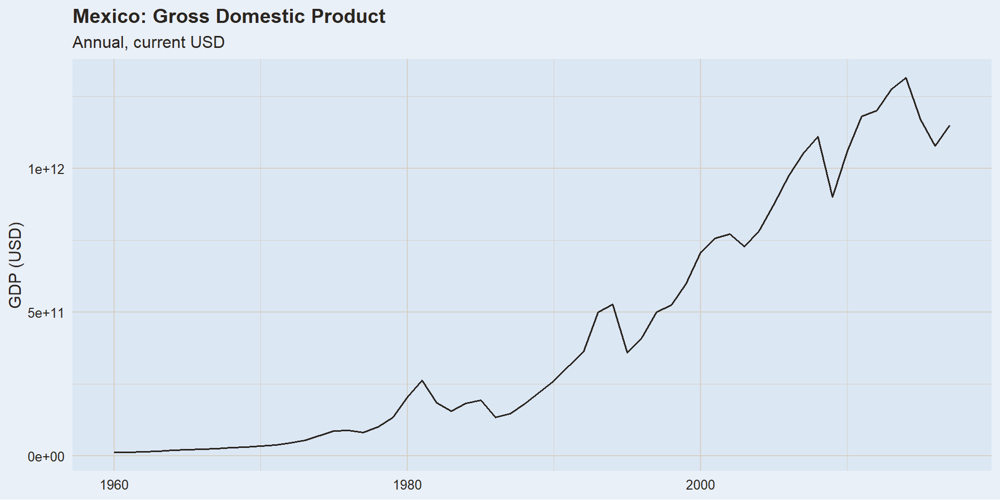](forecasting_files/figure-revealjs/gdp-plot-render-1.png)

[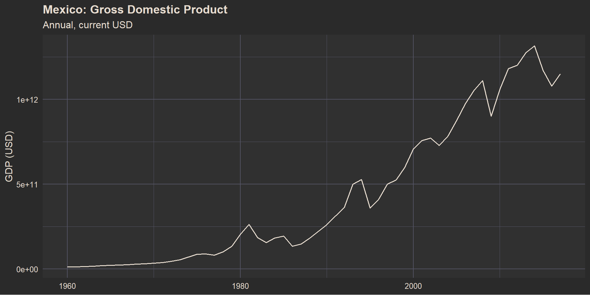](forecasting_files/figure-revealjs/gdp-plot-render-2.png)

Code

``` r
mexico <- global_economy |>
  filter(Country == "Mexico") |>
  select(Year, GDP)

h_mexico <- 7

mexico_train <- mexico |>
  slice_head(n = nrow(mexico) - h_mexico)

mexico_fit <- mexico_train |>
  model(
    mean   = MEAN(GDP),
    naive  = NAIVE(GDP),
    snaive = SNAIVE(GDP),
    drift  = RW(GDP ~ drift())
  )

mexico_fc <- mexico_fit |>
  forecast(h = h_mexico)
```

[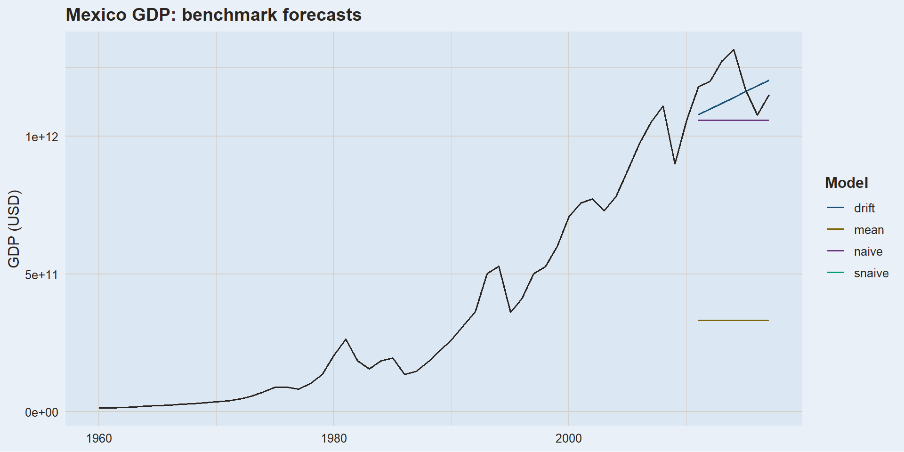](forecasting_files/figure-revealjs/gdp-fcst-plot-render-1.png)

[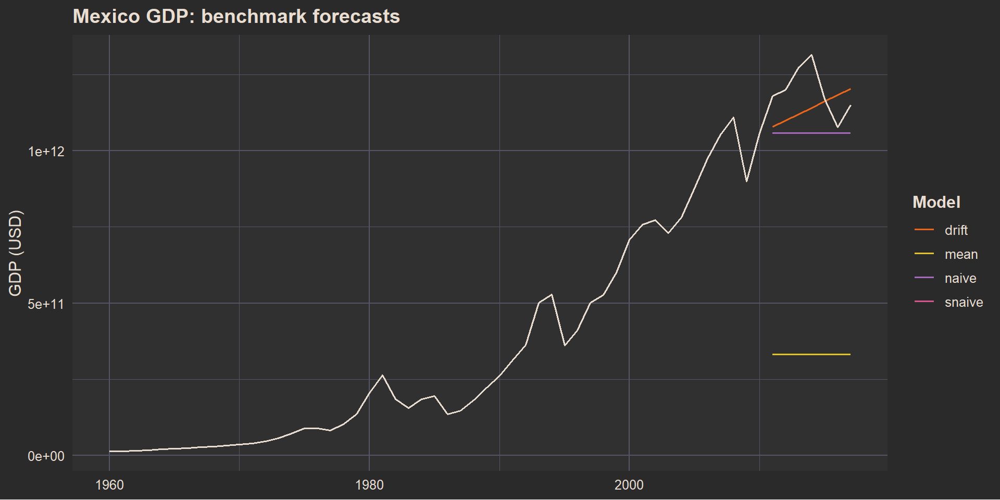](forecasting_files/figure-revealjs/gdp-fcst-plot-render-2.png)

> **NOTE:**
>
> GDP grows persistently over time with no seasonal pattern. **Drift** is the right benchmark: it extrapolates the average historical growth rate into the future. NAIVE predicts no growth at all. MEAN forecasts the historical average — far below recent observations. SNAIVE makes no sense for annual data.

## Gas

[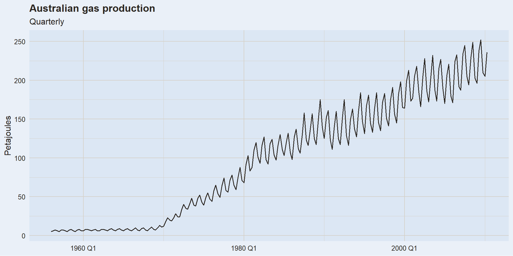](forecasting_files/figure-revealjs/gas-plot-render-1.png)

[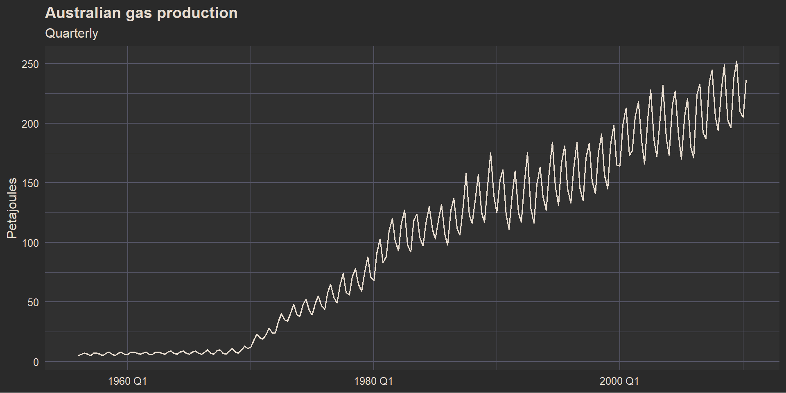](forecasting_files/figure-revealjs/gas-plot-render-2.png)

Code

``` r
h_gas <- 4 * 5  # 5 years of quarterly data

gas_train <- aus_production |>
  slice_head(n = nrow(aus_production) - h_gas)

gas_test <- aus_production |>
  slice_tail(n = h_gas)

gas_fit <- gas_train |>
  model(
    mean   = MEAN(Gas),
    naive  = NAIVE(Gas),
    snaive = SNAIVE(Gas),
    drift  = RW(Gas ~ drift())
  )

gas_fc <- gas_fit |>
  forecast(h = h_gas)
```

[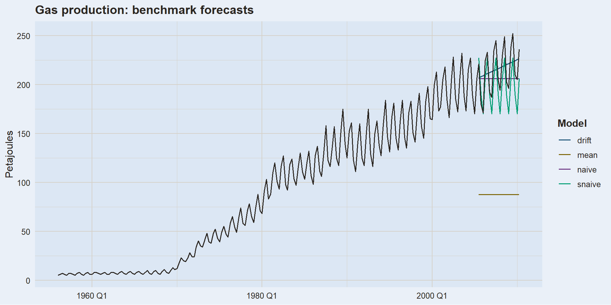](forecasting_files/figure-revealjs/gas-fcst-plot-render-1.png)

[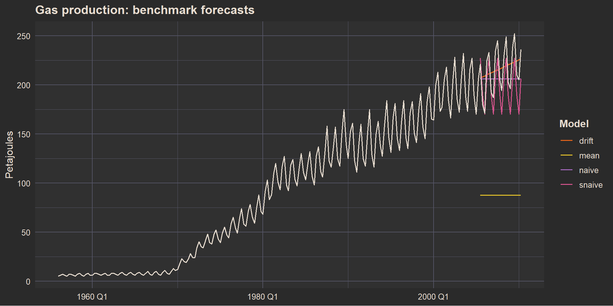](forecasting_files/figure-revealjs/gas-fcst-plot-render-2.png)

The series has **both** a strong upward trend and growing seasonal swings. None of the four benchmarks handles both at the same time.

What would a better approach look like?

------------------------------------------------------------------------

# 3 Evaluating forecasts

Fitting a model and generating forecasts is only half the job. We also need to know **how good** those forecasts are.

Evaluation has two layers:

- **Residual diagnostics** — does the model capture all systematic patterns?
- **Forecast accuracy** — how close are the forecasts to the actual values?

### 3.0.1 Fitted values and residuals

The **fitted values** \hat{y}\_t are the one-step-ahead predictions the model makes for the training observations.

The **residuals** e_t are what the model leaves unexplained:

e_t = y_t - \hat{y}\_t

> **NOTE:**
>
> When a **transformation** is applied (e.g. `log(Gas)`), there are two types of residuals:
>
> - **Residuals** e_t: computed on the **original** scale after back-transforming the fitted values.
> - **Innovation residuals** \tilde{e}\_t: computed on the **transformed** scale.
>
> Residual diagnostics (white noise checks, Ljung-Box) should always be run on the **innovation residuals** — this is what `augment()` returns in `.innov`.

Extract both with `augment()`:

Code

``` r
data_fit |>
  augment()    #<1>
```

1.  Returns a tsibble with columns `.fitted`, `.resid` (original scale), and `.innov` (transformed scale — same as `.resid` when no transformation is used).

### 3.0.2 Residual diagnostics

A well-specified model should leave residuals that behave like **white noise**.

*Essential properties:*

1.  **Uncorrelated** — no remaining autocorrelation at any lag.
2.  **Zero mean** — the model is not systematically over- or under-forecasting.

*Desirable properties:*

3.  **Constant variance** — variability is stable over time.
4.  **Normally distributed** — required for valid parametric prediction intervals.

### 3.0.3 White noise

# An error occurred.

Unable to execute JavaScript.

### 3.0.4 `gg_tsresiduals()`

`gg_tsresiduals()` produces a three-panel diagnostic plot: the residual time series, the ACF of residuals, and a histogram.

## Hare

Code

``` r
theme_narsil()
```

    <theme> List of 144
     $ line                            : <ggplot2::element_line>
      ..@ colour       : chr "black"
      ..@ linewidth    : num 0.545
      ..@ linetype     : num 1
      ..@ lineend      : chr "butt"
      ..@ linejoin     : chr "round"
      ..@ arrow        : logi FALSE
      ..@ arrow.fill   : chr "black"
      ..@ inherit.blank: logi TRUE
     $ rect                            : <ggplot2::element_rect>
      ..@ fill         : chr "white"
      ..@ colour       : chr "black"
      ..@ linewidth    : num 0.545
      ..@ linetype     : num 1
      ..@ linejoin     : chr "round"
      ..@ inherit.blank: logi TRUE
     $ text                            : <ggplot2::element_text>
      ..@ family       : chr ""
      ..@ face         : chr "plain"
      ..@ italic       : chr NA
      ..@ fontweight   : num NA
      ..@ fontwidth    : num NA
      ..@ colour       : chr "#2A2520"
      ..@ size         : num 12
      ..@ hjust        : num 0.5
      ..@ vjust        : num 0.5
      ..@ angle        : num 0
      ..@ lineheight   : num 0.9
      ..@ margin       : <ggplot2::margin> num [1:4] 0 0 0 0
      ..@ debug        : logi FALSE
      ..@ inherit.blank: logi FALSE
     $ title                           : <ggplot2::element_text>
      ..@ family       : NULL
      ..@ face         : NULL
      ..@ italic       : chr NA
      ..@ fontweight   : num NA
      ..@ fontwidth    : num NA
      ..@ colour       : NULL
      ..@ size         : NULL
      ..@ hjust        : NULL
      ..@ vjust        : NULL
      ..@ angle        : NULL
      ..@ lineheight   : NULL
      ..@ margin       : NULL
      ..@ debug        : NULL
      ..@ inherit.blank: logi TRUE
     $ point                           : <ggplot2::element_point>
      ..@ colour       : chr "black"
      ..@ shape        : num 19
      ..@ size         : num 1.64
      ..@ fill         : chr "white"
      ..@ stroke       : num 0.545
      ..@ inherit.blank: logi TRUE
     $ polygon                         : <ggplot2::element_polygon>
      ..@ fill         : chr "white"
      ..@ colour       : chr "black"
      ..@ linewidth    : num 0.545
      ..@ linetype     : num 1
      ..@ linejoin     : chr "round"
      ..@ inherit.blank: logi TRUE
     $ geom                            : <ggplot2::element_geom>
      ..@ ink        : chr "black"
      ..@ paper      : chr "white"
      ..@ accent     : chr "#3366FF"
      ..@ linewidth  : num 0.545
      ..@ borderwidth: num 0.545
      ..@ linetype   : int 1
      ..@ bordertype : int 1
      ..@ family     : chr ""
      ..@ fontsize   : num 4.22
      ..@ pointsize  : num 1.64
      ..@ pointshape : num 19
      ..@ colour     : NULL
      ..@ fill       : NULL
     $ spacing                         : 'simpleUnit' num 6points
      ..- attr(*, "unit")= int 8
     $ margins                         : <ggplot2::margin> num [1:4] 6 6 6 6
     $ aspect.ratio                    : NULL
     $ axis.title                      : <ggplot2::element_text>
      ..@ family       : NULL
      ..@ face         : NULL
      ..@ italic       : chr NA
      ..@ fontweight   : num NA
      ..@ fontwidth    : num NA
      ..@ colour       : chr "#2A2520"
      ..@ size         : NULL
      ..@ hjust        : NULL
      ..@ vjust        : NULL
      ..@ angle        : NULL
      ..@ lineheight   : NULL
      ..@ margin       : NULL
      ..@ debug        : NULL
      ..@ inherit.blank: logi FALSE
     $ axis.title.x                    : <ggplot2::element_text>
      ..@ family       : NULL
      ..@ face         : NULL
      ..@ italic       : chr NA
      ..@ fontweight   : num NA
      ..@ fontwidth    : num NA
      ..@ colour       : NULL
      ..@ size         : NULL
      ..@ hjust        : NULL
      ..@ vjust        : num 1
      ..@ angle        : NULL
      ..@ lineheight   : NULL
      ..@ margin       : <ggplot2::margin> num [1:4] 3 0 0 0
      ..@ debug        : NULL
      ..@ inherit.blank: logi TRUE
     $ axis.title.x.top                : <ggplot2::element_text>
      ..@ family       : NULL
      ..@ face         : NULL
      ..@ italic       : chr NA
      ..@ fontweight   : num NA
      ..@ fontwidth    : num NA
      ..@ colour       : NULL
      ..@ size         : NULL
      ..@ hjust        : NULL
      ..@ vjust        : num 0
      ..@ angle        : NULL
      ..@ lineheight   : NULL
      ..@ margin       : <ggplot2::margin> num [1:4] 0 0 3 0
      ..@ debug        : NULL
      ..@ inherit.blank: logi TRUE
     $ axis.title.x.bottom             : NULL
     $ axis.title.y                    : <ggplot2::element_text>
      ..@ family       : NULL
      ..@ face         : NULL
      ..@ italic       : chr NA
      ..@ fontweight   : num NA
      ..@ fontwidth    : num NA
      ..@ colour       : NULL
      ..@ size         : NULL
      ..@ hjust        : NULL
      ..@ vjust        : num 1
      ..@ angle        : num 90
      ..@ lineheight   : NULL
      ..@ margin       : <ggplot2::margin> num [1:4] 0 3 0 0
      ..@ debug        : NULL
      ..@ inherit.blank: logi TRUE
     $ axis.title.y.left               : NULL
     $ axis.title.y.right              : <ggplot2::element_text>
      ..@ family       : NULL
      ..@ face         : NULL
      ..@ italic       : chr NA
      ..@ fontweight   : num NA
      ..@ fontwidth    : num NA
      ..@ colour       : NULL
      ..@ size         : NULL
      ..@ hjust        : NULL
      ..@ vjust        : num 1
      ..@ angle        : num -90
      ..@ lineheight   : NULL
      ..@ margin       : <ggplot2::margin> num [1:4] 0 0 0 3
      ..@ debug        : NULL
      ..@ inherit.blank: logi TRUE
     $ axis.text                       : <ggplot2::element_text>
      ..@ family       : NULL
      ..@ face         : NULL
      ..@ italic       : chr NA
      ..@ fontweight   : num NA
      ..@ fontwidth    : num NA
      ..@ colour       : chr "#2A2520"
      ..@ size         : 'rel' num 0.8
      ..@ hjust        : NULL
      ..@ vjust        : NULL
      ..@ angle        : NULL
      ..@ lineheight   : NULL
      ..@ margin       : NULL
      ..@ debug        : NULL
      ..@ inherit.blank: logi FALSE
     $ axis.text.x                     : <ggplot2::element_text>
      ..@ family       : NULL
      ..@ face         : NULL
      ..@ italic       : chr NA
      ..@ fontweight   : num NA
      ..@ fontwidth    : num NA
      ..@ colour       : NULL
      ..@ size         : NULL
      ..@ hjust        : NULL
      ..@ vjust        : num 1
      ..@ angle        : NULL
      ..@ lineheight   : NULL
      ..@ margin       : <ggplot2::margin> num [1:4] 2.4 0 0 0
      ..@ debug        : NULL
      ..@ inherit.blank: logi TRUE
     $ axis.text.x.top                 : <ggplot2::element_text>
      ..@ family       : NULL
      ..@ face         : NULL
      ..@ italic       : chr NA
      ..@ fontweight   : num NA
      ..@ fontwidth    : num NA
      ..@ colour       : NULL
      ..@ size         : NULL
      ..@ hjust        : NULL
      ..@ vjust        : NULL
      ..@ angle        : NULL
      ..@ lineheight   : NULL
      ..@ margin       : <ggplot2::margin> num [1:4] 0 0 5.4 0
      ..@ debug        : NULL
      ..@ inherit.blank: logi TRUE
     $ axis.text.x.bottom              : <ggplot2::element_text>
      ..@ family       : NULL
      ..@ face         : NULL
      ..@ italic       : chr NA
      ..@ fontweight   : num NA
      ..@ fontwidth    : num NA
      ..@ colour       : NULL
      ..@ size         : NULL
      ..@ hjust        : NULL
      ..@ vjust        : NULL
      ..@ angle        : NULL
      ..@ lineheight   : NULL
      ..@ margin       : <ggplot2::margin> num [1:4] 5.4 0 0 0
      ..@ debug        : NULL
      ..@ inherit.blank: logi TRUE
     $ axis.text.y                     : <ggplot2::element_text>
      ..@ family       : NULL
      ..@ face         : NULL
      ..@ italic       : chr NA
      ..@ fontweight   : num NA
      ..@ fontwidth    : num NA
      ..@ colour       : NULL
      ..@ size         : NULL
      ..@ hjust        : num 1
      ..@ vjust        : NULL
      ..@ angle        : NULL
      ..@ lineheight   : NULL
      ..@ margin       : <ggplot2::margin> num [1:4] 0 2.4 0 0
      ..@ debug        : NULL
      ..@ inherit.blank: logi TRUE
     $ axis.text.y.left                : <ggplot2::element_text>
      ..@ family       : NULL
      ..@ face         : NULL
      ..@ italic       : chr NA
      ..@ fontweight   : num NA
      ..@ fontwidth    : num NA
      ..@ colour       : NULL
      ..@ size         : NULL
      ..@ hjust        : NULL
      ..@ vjust        : NULL
      ..@ angle        : NULL
      ..@ lineheight   : NULL
      ..@ margin       : <ggplot2::margin> num [1:4] 0 5.4 0 0
      ..@ debug        : NULL
      ..@ inherit.blank: logi TRUE
     $ axis.text.y.right               : <ggplot2::element_text>
      ..@ family       : NULL
      ..@ face         : NULL
      ..@ italic       : chr NA
      ..@ fontweight   : num NA
      ..@ fontwidth    : num NA
      ..@ colour       : NULL
      ..@ size         : NULL
      ..@ hjust        : NULL
      ..@ vjust        : NULL
      ..@ angle        : NULL
      ..@ lineheight   : NULL
      ..@ margin       : <ggplot2::margin> num [1:4] 0 0 0 5.4
      ..@ debug        : NULL
      ..@ inherit.blank: logi TRUE
     $ axis.text.theta                 : NULL
     $ axis.text.r                     : <ggplot2::element_text>
      ..@ family       : NULL
      ..@ face         : NULL
      ..@ italic       : chr NA
      ..@ fontweight   : num NA
      ..@ fontwidth    : num NA
      ..@ colour       : NULL
      ..@ size         : NULL
      ..@ hjust        : num 0.5
      ..@ vjust        : NULL
      ..@ angle        : NULL
      ..@ lineheight   : NULL
      ..@ margin       : <ggplot2::margin> num [1:4] 0 2.4 0 2.4
      ..@ debug        : NULL
      ..@ inherit.blank: logi TRUE
     $ axis.ticks                      : <ggplot2::element_blank>
     $ axis.ticks.x                    : NULL
     $ axis.ticks.x.top                : NULL
     $ axis.ticks.x.bottom             : NULL
     $ axis.ticks.y                    : NULL
     $ axis.ticks.y.left               : NULL
     $ axis.ticks.y.right              : NULL
     $ axis.ticks.theta                : NULL
     $ axis.ticks.r                    : NULL
     $ axis.minor.ticks.x.top          : NULL
     $ axis.minor.ticks.x.bottom       : NULL
     $ axis.minor.ticks.y.left         : NULL
     $ axis.minor.ticks.y.right        : NULL
     $ axis.minor.ticks.theta          : NULL
     $ axis.minor.ticks.r              : NULL
     $ axis.ticks.length               : 'rel' num 0.5
     $ axis.ticks.length.x             : NULL
     $ axis.ticks.length.x.top         : NULL
     $ axis.ticks.length.x.bottom      : NULL
     $ axis.ticks.length.y             : NULL
     $ axis.ticks.length.y.left        : NULL
     $ axis.ticks.length.y.right       : NULL
     $ axis.ticks.length.theta         : NULL
     $ axis.ticks.length.r             : NULL
     $ axis.minor.ticks.length         : 'rel' num 0.75
     $ axis.minor.ticks.length.x       : NULL
     $ axis.minor.ticks.length.x.top   : NULL
     $ axis.minor.ticks.length.x.bottom: NULL
     $ axis.minor.ticks.length.y       : NULL
     $ axis.minor.ticks.length.y.left  : NULL
     $ axis.minor.ticks.length.y.right : NULL
     $ axis.minor.ticks.length.theta   : NULL
     $ axis.minor.ticks.length.r       : NULL
     $ axis.line                       : <ggplot2::element_blank>
     $ axis.line.x                     : NULL
     $ axis.line.x.top                 : NULL
     $ axis.line.x.bottom              : NULL
     $ axis.line.y                     : NULL
     $ axis.line.y.left                : NULL
     $ axis.line.y.right               : NULL
     $ axis.line.theta                 : NULL
     $ axis.line.r                     : NULL
     $ legend.background               : <ggplot2::element_blank>
     $ legend.margin                   : NULL
     $ legend.spacing                  : 'rel' num 2
     $ legend.spacing.x                : NULL
     $ legend.spacing.y                : NULL
     $ legend.key                      : <ggplot2::element_blank>
     $ legend.key.size                 : 'simpleUnit' num 1.2lines
      ..- attr(*, "unit")= int 3
     $ legend.key.height               : NULL
     $ legend.key.width                : NULL
     $ legend.key.spacing              : NULL
     $ legend.key.spacing.x            : NULL
     $ legend.key.spacing.y            : NULL
     $ legend.key.justification        : NULL
     $ legend.frame                    : NULL
     $ legend.ticks                    : NULL
     $ legend.ticks.length             : 'rel' num 0.2
     $ legend.axis.line                : NULL
     $ legend.text                     : <ggplot2::element_text>
      ..@ family       : NULL
      ..@ face         : NULL
      ..@ italic       : chr NA
      ..@ fontweight   : num NA
      ..@ fontwidth    : num NA
      ..@ colour       : chr "#2A2520"
      ..@ size         : 'rel' num 0.8
      ..@ hjust        : NULL
      ..@ vjust        : NULL
      ..@ angle        : NULL
      ..@ lineheight   : NULL
      ..@ margin       : NULL
      ..@ debug        : NULL
      ..@ inherit.blank: logi FALSE
     $ legend.text.position            : NULL
     $ legend.title                    : <ggplot2::element_text>
      ..@ family       : NULL
      ..@ face         : chr "bold"
      ..@ italic       : chr NA
      ..@ fontweight   : num NA
      ..@ fontwidth    : num NA
      ..@ colour       : chr "#2A2520"
      ..@ size         : NULL
      ..@ hjust        : num 0
      ..@ vjust        : NULL
      ..@ angle        : NULL
      ..@ lineheight   : NULL
      ..@ margin       : NULL
      ..@ debug        : NULL
      ..@ inherit.blank: logi FALSE
     $ legend.title.position           : NULL
     $ legend.position                 : chr "right"
     $ legend.position.inside          : NULL
     $ legend.direction                : NULL
     $ legend.byrow                    : NULL
     $ legend.justification            : chr "center"
     $ legend.justification.top        : NULL
     $ legend.justification.bottom     : NULL
     $ legend.justification.left       : NULL
     $ legend.justification.right      : NULL
     $ legend.justification.inside     : NULL
      [list output truncated]
     @ complete: logi TRUE
     @ validate: logi TRUE

Code

``` r
hare_fit |>
  select(naive) |>
  gg_tsresiduals() +
  labs(title = "Hare — NAIVE residuals")
```

[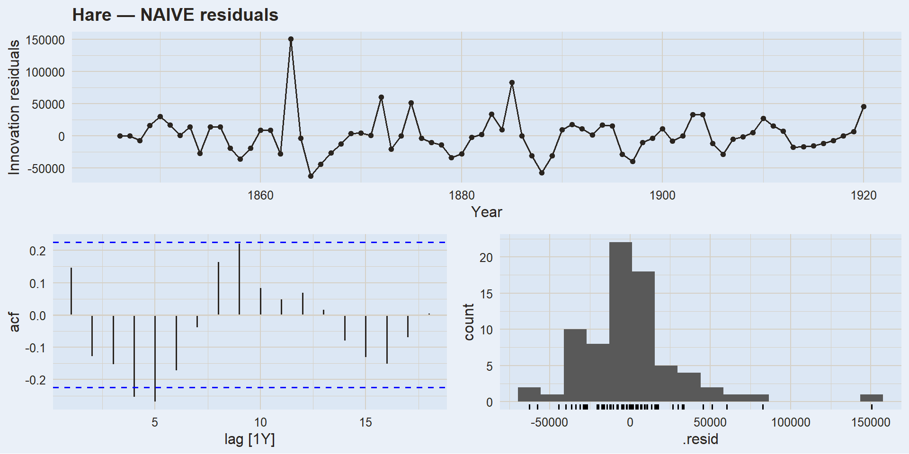](forecasting_files/figure-revealjs/hare-resid-1.png)

## Beer

Code

``` r
theme_narsil()
```

    <theme> List of 144
     $ line                            : <ggplot2::element_line>
      ..@ colour       : chr "black"
      ..@ linewidth    : num 0.545
      ..@ linetype     : num 1
      ..@ lineend      : chr "butt"
      ..@ linejoin     : chr "round"
      ..@ arrow        : logi FALSE
      ..@ arrow.fill   : chr "black"
      ..@ inherit.blank: logi TRUE
     $ rect                            : <ggplot2::element_rect>
      ..@ fill         : chr "white"
      ..@ colour       : chr "black"
      ..@ linewidth    : num 0.545
      ..@ linetype     : num 1
      ..@ linejoin     : chr "round"
      ..@ inherit.blank: logi TRUE
     $ text                            : <ggplot2::element_text>
      ..@ family       : chr ""
      ..@ face         : chr "plain"
      ..@ italic       : chr NA
      ..@ fontweight   : num NA
      ..@ fontwidth    : num NA
      ..@ colour       : chr "#2A2520"
      ..@ size         : num 12
      ..@ hjust        : num 0.5
      ..@ vjust        : num 0.5
      ..@ angle        : num 0
      ..@ lineheight   : num 0.9
      ..@ margin       : <ggplot2::margin> num [1:4] 0 0 0 0
      ..@ debug        : logi FALSE
      ..@ inherit.blank: logi FALSE
     $ title                           : <ggplot2::element_text>
      ..@ family       : NULL
      ..@ face         : NULL
      ..@ italic       : chr NA
      ..@ fontweight   : num NA
      ..@ fontwidth    : num NA
      ..@ colour       : NULL
      ..@ size         : NULL
      ..@ hjust        : NULL
      ..@ vjust        : NULL
      ..@ angle        : NULL
      ..@ lineheight   : NULL
      ..@ margin       : NULL
      ..@ debug        : NULL
      ..@ inherit.blank: logi TRUE
     $ point                           : <ggplot2::element_point>
      ..@ colour       : chr "black"
      ..@ shape        : num 19
      ..@ size         : num 1.64
      ..@ fill         : chr "white"
      ..@ stroke       : num 0.545
      ..@ inherit.blank: logi TRUE
     $ polygon                         : <ggplot2::element_polygon>
      ..@ fill         : chr "white"
      ..@ colour       : chr "black"
      ..@ linewidth    : num 0.545
      ..@ linetype     : num 1
      ..@ linejoin     : chr "round"
      ..@ inherit.blank: logi TRUE
     $ geom                            : <ggplot2::element_geom>
      ..@ ink        : chr "black"
      ..@ paper      : chr "white"
      ..@ accent     : chr "#3366FF"
      ..@ linewidth  : num 0.545
      ..@ borderwidth: num 0.545
      ..@ linetype   : int 1
      ..@ bordertype : int 1
      ..@ family     : chr ""
      ..@ fontsize   : num 4.22
      ..@ pointsize  : num 1.64
      ..@ pointshape : num 19
      ..@ colour     : NULL
      ..@ fill       : NULL
     $ spacing                         : 'simpleUnit' num 6points
      ..- attr(*, "unit")= int 8
     $ margins                         : <ggplot2::margin> num [1:4] 6 6 6 6
     $ aspect.ratio                    : NULL
     $ axis.title                      : <ggplot2::element_text>
      ..@ family       : NULL
      ..@ face         : NULL
      ..@ italic       : chr NA
      ..@ fontweight   : num NA
      ..@ fontwidth    : num NA
      ..@ colour       : chr "#2A2520"
      ..@ size         : NULL
      ..@ hjust        : NULL
      ..@ vjust        : NULL
      ..@ angle        : NULL
      ..@ lineheight   : NULL
      ..@ margin       : NULL
      ..@ debug        : NULL
      ..@ inherit.blank: logi FALSE
     $ axis.title.x                    : <ggplot2::element_text>
      ..@ family       : NULL
      ..@ face         : NULL
      ..@ italic       : chr NA
      ..@ fontweight   : num NA
      ..@ fontwidth    : num NA
      ..@ colour       : NULL
      ..@ size         : NULL
      ..@ hjust        : NULL
      ..@ vjust        : num 1
      ..@ angle        : NULL
      ..@ lineheight   : NULL
      ..@ margin       : <ggplot2::margin> num [1:4] 3 0 0 0
      ..@ debug        : NULL
      ..@ inherit.blank: logi TRUE
     $ axis.title.x.top                : <ggplot2::element_text>
      ..@ family       : NULL
      ..@ face         : NULL
      ..@ italic       : chr NA
      ..@ fontweight   : num NA
      ..@ fontwidth    : num NA
      ..@ colour       : NULL
      ..@ size         : NULL
      ..@ hjust        : NULL
      ..@ vjust        : num 0
      ..@ angle        : NULL
      ..@ lineheight   : NULL
      ..@ margin       : <ggplot2::margin> num [1:4] 0 0 3 0
      ..@ debug        : NULL
      ..@ inherit.blank: logi TRUE
     $ axis.title.x.bottom             : NULL
     $ axis.title.y                    : <ggplot2::element_text>
      ..@ family       : NULL
      ..@ face         : NULL
      ..@ italic       : chr NA
      ..@ fontweight   : num NA
      ..@ fontwidth    : num NA
      ..@ colour       : NULL
      ..@ size         : NULL
      ..@ hjust        : NULL
      ..@ vjust        : num 1
      ..@ angle        : num 90
      ..@ lineheight   : NULL
      ..@ margin       : <ggplot2::margin> num [1:4] 0 3 0 0
      ..@ debug        : NULL
      ..@ inherit.blank: logi TRUE
     $ axis.title.y.left               : NULL
     $ axis.title.y.right              : <ggplot2::element_text>
      ..@ family       : NULL
      ..@ face         : NULL
      ..@ italic       : chr NA
      ..@ fontweight   : num NA
      ..@ fontwidth    : num NA
      ..@ colour       : NULL
      ..@ size         : NULL
      ..@ hjust        : NULL
      ..@ vjust        : num 1
      ..@ angle        : num -90
      ..@ lineheight   : NULL
      ..@ margin       : <ggplot2::margin> num [1:4] 0 0 0 3
      ..@ debug        : NULL
      ..@ inherit.blank: logi TRUE
     $ axis.text                       : <ggplot2::element_text>
      ..@ family       : NULL
      ..@ face         : NULL
      ..@ italic       : chr NA
      ..@ fontweight   : num NA
      ..@ fontwidth    : num NA
      ..@ colour       : chr "#2A2520"
      ..@ size         : 'rel' num 0.8
      ..@ hjust        : NULL
      ..@ vjust        : NULL
      ..@ angle        : NULL
      ..@ lineheight   : NULL
      ..@ margin       : NULL
      ..@ debug        : NULL
      ..@ inherit.blank: logi FALSE
     $ axis.text.x                     : <ggplot2::element_text>
      ..@ family       : NULL
      ..@ face         : NULL
      ..@ italic       : chr NA
      ..@ fontweight   : num NA
      ..@ fontwidth    : num NA
      ..@ colour       : NULL
      ..@ size         : NULL
      ..@ hjust        : NULL
      ..@ vjust        : num 1
      ..@ angle        : NULL
      ..@ lineheight   : NULL
      ..@ margin       : <ggplot2::margin> num [1:4] 2.4 0 0 0
      ..@ debug        : NULL
      ..@ inherit.blank: logi TRUE
     $ axis.text.x.top                 : <ggplot2::element_text>
      ..@ family       : NULL
      ..@ face         : NULL
      ..@ italic       : chr NA
      ..@ fontweight   : num NA
      ..@ fontwidth    : num NA
      ..@ colour       : NULL
      ..@ size         : NULL
      ..@ hjust        : NULL
      ..@ vjust        : NULL
      ..@ angle        : NULL
      ..@ lineheight   : NULL
      ..@ margin       : <ggplot2::margin> num [1:4] 0 0 5.4 0
      ..@ debug        : NULL
      ..@ inherit.blank: logi TRUE
     $ axis.text.x.bottom              : <ggplot2::element_text>
      ..@ family       : NULL
      ..@ face         : NULL
      ..@ italic       : chr NA
      ..@ fontweight   : num NA
      ..@ fontwidth    : num NA
      ..@ colour       : NULL
      ..@ size         : NULL
      ..@ hjust        : NULL
      ..@ vjust        : NULL
      ..@ angle        : NULL
      ..@ lineheight   : NULL
      ..@ margin       : <ggplot2::margin> num [1:4] 5.4 0 0 0
      ..@ debug        : NULL
      ..@ inherit.blank: logi TRUE
     $ axis.text.y                     : <ggplot2::element_text>
      ..@ family       : NULL
      ..@ face         : NULL
      ..@ italic       : chr NA
      ..@ fontweight   : num NA
      ..@ fontwidth    : num NA
      ..@ colour       : NULL
      ..@ size         : NULL
      ..@ hjust        : num 1
      ..@ vjust        : NULL
      ..@ angle        : NULL
      ..@ lineheight   : NULL
      ..@ margin       : <ggplot2::margin> num [1:4] 0 2.4 0 0
      ..@ debug        : NULL
      ..@ inherit.blank: logi TRUE
     $ axis.text.y.left                : <ggplot2::element_text>
      ..@ family       : NULL
      ..@ face         : NULL
      ..@ italic       : chr NA
      ..@ fontweight   : num NA
      ..@ fontwidth    : num NA
      ..@ colour       : NULL
      ..@ size         : NULL
      ..@ hjust        : NULL
      ..@ vjust        : NULL
      ..@ angle        : NULL
      ..@ lineheight   : NULL
      ..@ margin       : <ggplot2::margin> num [1:4] 0 5.4 0 0
      ..@ debug        : NULL
      ..@ inherit.blank: logi TRUE
     $ axis.text.y.right               : <ggplot2::element_text>
      ..@ family       : NULL
      ..@ face         : NULL
      ..@ italic       : chr NA
      ..@ fontweight   : num NA
      ..@ fontwidth    : num NA
      ..@ colour       : NULL
      ..@ size         : NULL
      ..@ hjust        : NULL
      ..@ vjust        : NULL
      ..@ angle        : NULL
      ..@ lineheight   : NULL
      ..@ margin       : <ggplot2::margin> num [1:4] 0 0 0 5.4
      ..@ debug        : NULL
      ..@ inherit.blank: logi TRUE
     $ axis.text.theta                 : NULL
     $ axis.text.r                     : <ggplot2::element_text>
      ..@ family       : NULL
      ..@ face         : NULL
      ..@ italic       : chr NA
      ..@ fontweight   : num NA
      ..@ fontwidth    : num NA
      ..@ colour       : NULL
      ..@ size         : NULL
      ..@ hjust        : num 0.5
      ..@ vjust        : NULL
      ..@ angle        : NULL
      ..@ lineheight   : NULL
      ..@ margin       : <ggplot2::margin> num [1:4] 0 2.4 0 2.4
      ..@ debug        : NULL
      ..@ inherit.blank: logi TRUE
     $ axis.ticks                      : <ggplot2::element_blank>
     $ axis.ticks.x                    : NULL
     $ axis.ticks.x.top                : NULL
     $ axis.ticks.x.bottom             : NULL
     $ axis.ticks.y                    : NULL
     $ axis.ticks.y.left               : NULL
     $ axis.ticks.y.right              : NULL
     $ axis.ticks.theta                : NULL
     $ axis.ticks.r                    : NULL
     $ axis.minor.ticks.x.top          : NULL
     $ axis.minor.ticks.x.bottom       : NULL
     $ axis.minor.ticks.y.left         : NULL
     $ axis.minor.ticks.y.right        : NULL
     $ axis.minor.ticks.theta          : NULL
     $ axis.minor.ticks.r              : NULL
     $ axis.ticks.length               : 'rel' num 0.5
     $ axis.ticks.length.x             : NULL
     $ axis.ticks.length.x.top         : NULL
     $ axis.ticks.length.x.bottom      : NULL
     $ axis.ticks.length.y             : NULL
     $ axis.ticks.length.y.left        : NULL
     $ axis.ticks.length.y.right       : NULL
     $ axis.ticks.length.theta         : NULL
     $ axis.ticks.length.r             : NULL
     $ axis.minor.ticks.length         : 'rel' num 0.75
     $ axis.minor.ticks.length.x       : NULL
     $ axis.minor.ticks.length.x.top   : NULL
     $ axis.minor.ticks.length.x.bottom: NULL
     $ axis.minor.ticks.length.y       : NULL
     $ axis.minor.ticks.length.y.left  : NULL
     $ axis.minor.ticks.length.y.right : NULL
     $ axis.minor.ticks.length.theta   : NULL
     $ axis.minor.ticks.length.r       : NULL
     $ axis.line                       : <ggplot2::element_blank>
     $ axis.line.x                     : NULL
     $ axis.line.x.top                 : NULL
     $ axis.line.x.bottom              : NULL
     $ axis.line.y                     : NULL
     $ axis.line.y.left                : NULL
     $ axis.line.y.right               : NULL
     $ axis.line.theta                 : NULL
     $ axis.line.r                     : NULL
     $ legend.background               : <ggplot2::element_blank>
     $ legend.margin                   : NULL
     $ legend.spacing                  : 'rel' num 2
     $ legend.spacing.x                : NULL
     $ legend.spacing.y                : NULL
     $ legend.key                      : <ggplot2::element_blank>
     $ legend.key.size                 : 'simpleUnit' num 1.2lines
      ..- attr(*, "unit")= int 3
     $ legend.key.height               : NULL
     $ legend.key.width                : NULL
     $ legend.key.spacing              : NULL
     $ legend.key.spacing.x            : NULL
     $ legend.key.spacing.y            : NULL
     $ legend.key.justification        : NULL
     $ legend.frame                    : NULL
     $ legend.ticks                    : NULL
     $ legend.ticks.length             : 'rel' num 0.2
     $ legend.axis.line                : NULL
     $ legend.text                     : <ggplot2::element_text>
      ..@ family       : NULL
      ..@ face         : NULL
      ..@ italic       : chr NA
      ..@ fontweight   : num NA
      ..@ fontwidth    : num NA
      ..@ colour       : chr "#2A2520"
      ..@ size         : 'rel' num 0.8
      ..@ hjust        : NULL
      ..@ vjust        : NULL
      ..@ angle        : NULL
      ..@ lineheight   : NULL
      ..@ margin       : NULL
      ..@ debug        : NULL
      ..@ inherit.blank: logi FALSE
     $ legend.text.position            : NULL
     $ legend.title                    : <ggplot2::element_text>
      ..@ family       : NULL
      ..@ face         : chr "bold"
      ..@ italic       : chr NA
      ..@ fontweight   : num NA
      ..@ fontwidth    : num NA
      ..@ colour       : chr "#2A2520"
      ..@ size         : NULL
      ..@ hjust        : num 0
      ..@ vjust        : NULL
      ..@ angle        : NULL
      ..@ lineheight   : NULL
      ..@ margin       : NULL
      ..@ debug        : NULL
      ..@ inherit.blank: logi FALSE
     $ legend.title.position           : NULL
     $ legend.position                 : chr "right"
     $ legend.position.inside          : NULL
     $ legend.direction                : NULL
     $ legend.byrow                    : NULL
     $ legend.justification            : chr "center"
     $ legend.justification.top        : NULL
     $ legend.justification.bottom     : NULL
     $ legend.justification.left       : NULL
     $ legend.justification.right      : NULL
     $ legend.justification.inside     : NULL
      [list output truncated]
     @ complete: logi TRUE
     @ validate: logi TRUE

Code

``` r
beer_fit |>
  select(snaive) |>
  gg_tsresiduals() +
  labs(title = "Beer — SNAIVE residuals")
```

[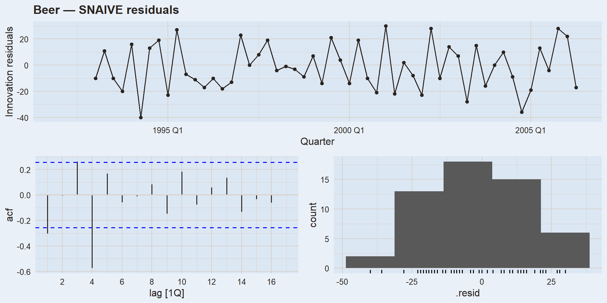](forecasting_files/figure-revealjs/beer-resid-1.png)

## Mexico GDP

Code

``` r
theme_narsil()
```

    <theme> List of 144
     $ line                            : <ggplot2::element_line>
      ..@ colour       : chr "black"
      ..@ linewidth    : num 0.545
      ..@ linetype     : num 1
      ..@ lineend      : chr "butt"
      ..@ linejoin     : chr "round"
      ..@ arrow        : logi FALSE
      ..@ arrow.fill   : chr "black"
      ..@ inherit.blank: logi TRUE
     $ rect                            : <ggplot2::element_rect>
      ..@ fill         : chr "white"
      ..@ colour       : chr "black"
      ..@ linewidth    : num 0.545
      ..@ linetype     : num 1
      ..@ linejoin     : chr "round"
      ..@ inherit.blank: logi TRUE
     $ text                            : <ggplot2::element_text>
      ..@ family       : chr ""
      ..@ face         : chr "plain"
      ..@ italic       : chr NA
      ..@ fontweight   : num NA
      ..@ fontwidth    : num NA
      ..@ colour       : chr "#2A2520"
      ..@ size         : num 12
      ..@ hjust        : num 0.5
      ..@ vjust        : num 0.5
      ..@ angle        : num 0
      ..@ lineheight   : num 0.9
      ..@ margin       : <ggplot2::margin> num [1:4] 0 0 0 0
      ..@ debug        : logi FALSE
      ..@ inherit.blank: logi FALSE
     $ title                           : <ggplot2::element_text>
      ..@ family       : NULL
      ..@ face         : NULL
      ..@ italic       : chr NA
      ..@ fontweight   : num NA
      ..@ fontwidth    : num NA
      ..@ colour       : NULL
      ..@ size         : NULL
      ..@ hjust        : NULL
      ..@ vjust        : NULL
      ..@ angle        : NULL
      ..@ lineheight   : NULL
      ..@ margin       : NULL
      ..@ debug        : NULL
      ..@ inherit.blank: logi TRUE
     $ point                           : <ggplot2::element_point>
      ..@ colour       : chr "black"
      ..@ shape        : num 19
      ..@ size         : num 1.64
      ..@ fill         : chr "white"
      ..@ stroke       : num 0.545
      ..@ inherit.blank: logi TRUE
     $ polygon                         : <ggplot2::element_polygon>
      ..@ fill         : chr "white"
      ..@ colour       : chr "black"
      ..@ linewidth    : num 0.545
      ..@ linetype     : num 1
      ..@ linejoin     : chr "round"
      ..@ inherit.blank: logi TRUE
     $ geom                            : <ggplot2::element_geom>
      ..@ ink        : chr "black"
      ..@ paper      : chr "white"
      ..@ accent     : chr "#3366FF"
      ..@ linewidth  : num 0.545
      ..@ borderwidth: num 0.545
      ..@ linetype   : int 1
      ..@ bordertype : int 1
      ..@ family     : chr ""
      ..@ fontsize   : num 4.22
      ..@ pointsize  : num 1.64
      ..@ pointshape : num 19
      ..@ colour     : NULL
      ..@ fill       : NULL
     $ spacing                         : 'simpleUnit' num 6points
      ..- attr(*, "unit")= int 8
     $ margins                         : <ggplot2::margin> num [1:4] 6 6 6 6
     $ aspect.ratio                    : NULL
     $ axis.title                      : <ggplot2::element_text>
      ..@ family       : NULL
      ..@ face         : NULL
      ..@ italic       : chr NA
      ..@ fontweight   : num NA
      ..@ fontwidth    : num NA
      ..@ colour       : chr "#2A2520"
      ..@ size         : NULL
      ..@ hjust        : NULL
      ..@ vjust        : NULL
      ..@ angle        : NULL
      ..@ lineheight   : NULL
      ..@ margin       : NULL
      ..@ debug        : NULL
      ..@ inherit.blank: logi FALSE
     $ axis.title.x                    : <ggplot2::element_text>
      ..@ family       : NULL
      ..@ face         : NULL
      ..@ italic       : chr NA
      ..@ fontweight   : num NA
      ..@ fontwidth    : num NA
      ..@ colour       : NULL
      ..@ size         : NULL
      ..@ hjust        : NULL
      ..@ vjust        : num 1
      ..@ angle        : NULL
      ..@ lineheight   : NULL
      ..@ margin       : <ggplot2::margin> num [1:4] 3 0 0 0
      ..@ debug        : NULL
      ..@ inherit.blank: logi TRUE
     $ axis.title.x.top                : <ggplot2::element_text>
      ..@ family       : NULL
      ..@ face         : NULL
      ..@ italic       : chr NA
      ..@ fontweight   : num NA
      ..@ fontwidth    : num NA
      ..@ colour       : NULL
      ..@ size         : NULL
      ..@ hjust        : NULL
      ..@ vjust        : num 0
      ..@ angle        : NULL
      ..@ lineheight   : NULL
      ..@ margin       : <ggplot2::margin> num [1:4] 0 0 3 0
      ..@ debug        : NULL
      ..@ inherit.blank: logi TRUE
     $ axis.title.x.bottom             : NULL
     $ axis.title.y                    : <ggplot2::element_text>
      ..@ family       : NULL
      ..@ face         : NULL
      ..@ italic       : chr NA
      ..@ fontweight   : num NA
      ..@ fontwidth    : num NA
      ..@ colour       : NULL
      ..@ size         : NULL
      ..@ hjust        : NULL
      ..@ vjust        : num 1
      ..@ angle        : num 90
      ..@ lineheight   : NULL
      ..@ margin       : <ggplot2::margin> num [1:4] 0 3 0 0
      ..@ debug        : NULL
      ..@ inherit.blank: logi TRUE
     $ axis.title.y.left               : NULL
     $ axis.title.y.right              : <ggplot2::element_text>
      ..@ family       : NULL
      ..@ face         : NULL
      ..@ italic       : chr NA
      ..@ fontweight   : num NA
      ..@ fontwidth    : num NA
      ..@ colour       : NULL
      ..@ size         : NULL
      ..@ hjust        : NULL
      ..@ vjust        : num 1
      ..@ angle        : num -90
      ..@ lineheight   : NULL
      ..@ margin       : <ggplot2::margin> num [1:4] 0 0 0 3
      ..@ debug        : NULL
      ..@ inherit.blank: logi TRUE
     $ axis.text                       : <ggplot2::element_text>
      ..@ family       : NULL
      ..@ face         : NULL
      ..@ italic       : chr NA
      ..@ fontweight   : num NA
      ..@ fontwidth    : num NA
      ..@ colour       : chr "#2A2520"
      ..@ size         : 'rel' num 0.8
      ..@ hjust        : NULL
      ..@ vjust        : NULL
      ..@ angle        : NULL
      ..@ lineheight   : NULL
      ..@ margin       : NULL
      ..@ debug        : NULL
      ..@ inherit.blank: logi FALSE
     $ axis.text.x                     : <ggplot2::element_text>
      ..@ family       : NULL
      ..@ face         : NULL
      ..@ italic       : chr NA
      ..@ fontweight   : num NA
      ..@ fontwidth    : num NA
      ..@ colour       : NULL
      ..@ size         : NULL
      ..@ hjust        : NULL
      ..@ vjust        : num 1
      ..@ angle        : NULL
      ..@ lineheight   : NULL
      ..@ margin       : <ggplot2::margin> num [1:4] 2.4 0 0 0
      ..@ debug        : NULL
      ..@ inherit.blank: logi TRUE
     $ axis.text.x.top                 : <ggplot2::element_text>
      ..@ family       : NULL
      ..@ face         : NULL
      ..@ italic       : chr NA
      ..@ fontweight   : num NA
      ..@ fontwidth    : num NA
      ..@ colour       : NULL
      ..@ size         : NULL
      ..@ hjust        : NULL
      ..@ vjust        : NULL
      ..@ angle        : NULL
      ..@ lineheight   : NULL
      ..@ margin       : <ggplot2::margin> num [1:4] 0 0 5.4 0
      ..@ debug        : NULL
      ..@ inherit.blank: logi TRUE
     $ axis.text.x.bottom              : <ggplot2::element_text>
      ..@ family       : NULL
      ..@ face         : NULL
      ..@ italic       : chr NA
      ..@ fontweight   : num NA
      ..@ fontwidth    : num NA
      ..@ colour       : NULL
      ..@ size         : NULL
      ..@ hjust        : NULL
      ..@ vjust        : NULL
      ..@ angle        : NULL
      ..@ lineheight   : NULL
      ..@ margin       : <ggplot2::margin> num [1:4] 5.4 0 0 0
      ..@ debug        : NULL
      ..@ inherit.blank: logi TRUE
     $ axis.text.y                     : <ggplot2::element_text>
      ..@ family       : NULL
      ..@ face         : NULL
      ..@ italic       : chr NA
      ..@ fontweight   : num NA
      ..@ fontwidth    : num NA
      ..@ colour       : NULL
      ..@ size         : NULL
      ..@ hjust        : num 1
      ..@ vjust        : NULL
      ..@ angle        : NULL
      ..@ lineheight   : NULL
      ..@ margin       : <ggplot2::margin> num [1:4] 0 2.4 0 0
      ..@ debug        : NULL
      ..@ inherit.blank: logi TRUE
     $ axis.text.y.left                : <ggplot2::element_text>
      ..@ family       : NULL
      ..@ face         : NULL
      ..@ italic       : chr NA
      ..@ fontweight   : num NA
      ..@ fontwidth    : num NA
      ..@ colour       : NULL
      ..@ size         : NULL
      ..@ hjust        : NULL
      ..@ vjust        : NULL
      ..@ angle        : NULL
      ..@ lineheight   : NULL
      ..@ margin       : <ggplot2::margin> num [1:4] 0 5.4 0 0
      ..@ debug        : NULL
      ..@ inherit.blank: logi TRUE
     $ axis.text.y.right               : <ggplot2::element_text>
      ..@ family       : NULL
      ..@ face         : NULL
      ..@ italic       : chr NA
      ..@ fontweight   : num NA
      ..@ fontwidth    : num NA
      ..@ colour       : NULL
      ..@ size         : NULL
      ..@ hjust        : NULL
      ..@ vjust        : NULL
      ..@ angle        : NULL
      ..@ lineheight   : NULL
      ..@ margin       : <ggplot2::margin> num [1:4] 0 0 0 5.4
      ..@ debug        : NULL
      ..@ inherit.blank: logi TRUE
     $ axis.text.theta                 : NULL
     $ axis.text.r                     : <ggplot2::element_text>
      ..@ family       : NULL
      ..@ face         : NULL
      ..@ italic       : chr NA
      ..@ fontweight   : num NA
      ..@ fontwidth    : num NA
      ..@ colour       : NULL
      ..@ size         : NULL
      ..@ hjust        : num 0.5
      ..@ vjust        : NULL
      ..@ angle        : NULL
      ..@ lineheight   : NULL
      ..@ margin       : <ggplot2::margin> num [1:4] 0 2.4 0 2.4
      ..@ debug        : NULL
      ..@ inherit.blank: logi TRUE
     $ axis.ticks                      : <ggplot2::element_blank>
     $ axis.ticks.x                    : NULL
     $ axis.ticks.x.top                : NULL
     $ axis.ticks.x.bottom             : NULL
     $ axis.ticks.y                    : NULL
     $ axis.ticks.y.left               : NULL
     $ axis.ticks.y.right              : NULL
     $ axis.ticks.theta                : NULL
     $ axis.ticks.r                    : NULL
     $ axis.minor.ticks.x.top          : NULL
     $ axis.minor.ticks.x.bottom       : NULL
     $ axis.minor.ticks.y.left         : NULL
     $ axis.minor.ticks.y.right        : NULL
     $ axis.minor.ticks.theta          : NULL
     $ axis.minor.ticks.r              : NULL
     $ axis.ticks.length               : 'rel' num 0.5
     $ axis.ticks.length.x             : NULL
     $ axis.ticks.length.x.top         : NULL
     $ axis.ticks.length.x.bottom      : NULL
     $ axis.ticks.length.y             : NULL
     $ axis.ticks.length.y.left        : NULL
     $ axis.ticks.length.y.right       : NULL
     $ axis.ticks.length.theta         : NULL
     $ axis.ticks.length.r             : NULL
     $ axis.minor.ticks.length         : 'rel' num 0.75
     $ axis.minor.ticks.length.x       : NULL
     $ axis.minor.ticks.length.x.top   : NULL
     $ axis.minor.ticks.length.x.bottom: NULL
     $ axis.minor.ticks.length.y       : NULL
     $ axis.minor.ticks.length.y.left  : NULL
     $ axis.minor.ticks.length.y.right : NULL
     $ axis.minor.ticks.length.theta   : NULL
     $ axis.minor.ticks.length.r       : NULL
     $ axis.line                       : <ggplot2::element_blank>
     $ axis.line.x                     : NULL
     $ axis.line.x.top                 : NULL
     $ axis.line.x.bottom              : NULL
     $ axis.line.y                     : NULL
     $ axis.line.y.left                : NULL
     $ axis.line.y.right               : NULL
     $ axis.line.theta                 : NULL
     $ axis.line.r                     : NULL
     $ legend.background               : <ggplot2::element_blank>
     $ legend.margin                   : NULL
     $ legend.spacing                  : 'rel' num 2
     $ legend.spacing.x                : NULL
     $ legend.spacing.y                : NULL
     $ legend.key                      : <ggplot2::element_blank>
     $ legend.key.size                 : 'simpleUnit' num 1.2lines
      ..- attr(*, "unit")= int 3
     $ legend.key.height               : NULL
     $ legend.key.width                : NULL
     $ legend.key.spacing              : NULL
     $ legend.key.spacing.x            : NULL
     $ legend.key.spacing.y            : NULL
     $ legend.key.justification        : NULL
     $ legend.frame                    : NULL
     $ legend.ticks                    : NULL
     $ legend.ticks.length             : 'rel' num 0.2
     $ legend.axis.line                : NULL
     $ legend.text                     : <ggplot2::element_text>
      ..@ family       : NULL
      ..@ face         : NULL
      ..@ italic       : chr NA
      ..@ fontweight   : num NA
      ..@ fontwidth    : num NA
      ..@ colour       : chr "#2A2520"
      ..@ size         : 'rel' num 0.8
      ..@ hjust        : NULL
      ..@ vjust        : NULL
      ..@ angle        : NULL
      ..@ lineheight   : NULL
      ..@ margin       : NULL
      ..@ debug        : NULL
      ..@ inherit.blank: logi FALSE
     $ legend.text.position            : NULL
     $ legend.title                    : <ggplot2::element_text>
      ..@ family       : NULL
      ..@ face         : chr "bold"
      ..@ italic       : chr NA
      ..@ fontweight   : num NA
      ..@ fontwidth    : num NA
      ..@ colour       : chr "#2A2520"
      ..@ size         : NULL
      ..@ hjust        : num 0
      ..@ vjust        : NULL
      ..@ angle        : NULL
      ..@ lineheight   : NULL
      ..@ margin       : NULL
      ..@ debug        : NULL
      ..@ inherit.blank: logi FALSE
     $ legend.title.position           : NULL
     $ legend.position                 : chr "right"
     $ legend.position.inside          : NULL
     $ legend.direction                : NULL
     $ legend.byrow                    : NULL
     $ legend.justification            : chr "center"
     $ legend.justification.top        : NULL
     $ legend.justification.bottom     : NULL
     $ legend.justification.left       : NULL
     $ legend.justification.right      : NULL
     $ legend.justification.inside     : NULL
      [list output truncated]
     @ complete: logi TRUE
     @ validate: logi TRUE

Code

``` r
mexico_fit |>
  select(drift) |>
  gg_tsresiduals() +
  labs(title = "Mexico GDP — Drift residuals")
```

[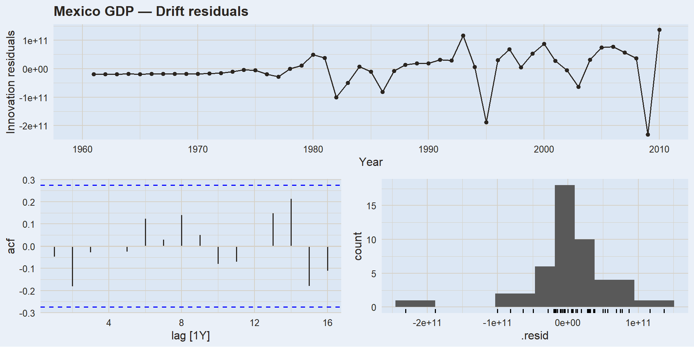](forecasting_files/figure-revealjs/gdp-resid-1.png)

## Gas

Code

``` r
theme_narsil()
```

    <theme> List of 144
     $ line                            : <ggplot2::element_line>
      ..@ colour       : chr "black"
      ..@ linewidth    : num 0.545
      ..@ linetype     : num 1
      ..@ lineend      : chr "butt"
      ..@ linejoin     : chr "round"
      ..@ arrow        : logi FALSE
      ..@ arrow.fill   : chr "black"
      ..@ inherit.blank: logi TRUE
     $ rect                            : <ggplot2::element_rect>
      ..@ fill         : chr "white"
      ..@ colour       : chr "black"
      ..@ linewidth    : num 0.545
      ..@ linetype     : num 1
      ..@ linejoin     : chr "round"
      ..@ inherit.blank: logi TRUE
     $ text                            : <ggplot2::element_text>
      ..@ family       : chr ""
      ..@ face         : chr "plain"
      ..@ italic       : chr NA
      ..@ fontweight   : num NA
      ..@ fontwidth    : num NA
      ..@ colour       : chr "#2A2520"
      ..@ size         : num 12
      ..@ hjust        : num 0.5
      ..@ vjust        : num 0.5
      ..@ angle        : num 0
      ..@ lineheight   : num 0.9
      ..@ margin       : <ggplot2::margin> num [1:4] 0 0 0 0
      ..@ debug        : logi FALSE
      ..@ inherit.blank: logi FALSE
     $ title                           : <ggplot2::element_text>
      ..@ family       : NULL
      ..@ face         : NULL
      ..@ italic       : chr NA
      ..@ fontweight   : num NA
      ..@ fontwidth    : num NA
      ..@ colour       : NULL
      ..@ size         : NULL
      ..@ hjust        : NULL
      ..@ vjust        : NULL
      ..@ angle        : NULL
      ..@ lineheight   : NULL
      ..@ margin       : NULL
      ..@ debug        : NULL
      ..@ inherit.blank: logi TRUE
     $ point                           : <ggplot2::element_point>
      ..@ colour       : chr "black"
      ..@ shape        : num 19
      ..@ size         : num 1.64
      ..@ fill         : chr "white"
      ..@ stroke       : num 0.545
      ..@ inherit.blank: logi TRUE
     $ polygon                         : <ggplot2::element_polygon>
      ..@ fill         : chr "white"
      ..@ colour       : chr "black"
      ..@ linewidth    : num 0.545
      ..@ linetype     : num 1
      ..@ linejoin     : chr "round"
      ..@ inherit.blank: logi TRUE
     $ geom                            : <ggplot2::element_geom>
      ..@ ink        : chr "black"
      ..@ paper      : chr "white"
      ..@ accent     : chr "#3366FF"
      ..@ linewidth  : num 0.545
      ..@ borderwidth: num 0.545
      ..@ linetype   : int 1
      ..@ bordertype : int 1
      ..@ family     : chr ""
      ..@ fontsize   : num 4.22
      ..@ pointsize  : num 1.64
      ..@ pointshape : num 19
      ..@ colour     : NULL
      ..@ fill       : NULL
     $ spacing                         : 'simpleUnit' num 6points
      ..- attr(*, "unit")= int 8
     $ margins                         : <ggplot2::margin> num [1:4] 6 6 6 6
     $ aspect.ratio                    : NULL
     $ axis.title                      : <ggplot2::element_text>
      ..@ family       : NULL
      ..@ face         : NULL
      ..@ italic       : chr NA
      ..@ fontweight   : num NA
      ..@ fontwidth    : num NA
      ..@ colour       : chr "#2A2520"
      ..@ size         : NULL
      ..@ hjust        : NULL
      ..@ vjust        : NULL
      ..@ angle        : NULL
      ..@ lineheight   : NULL
      ..@ margin       : NULL
      ..@ debug        : NULL
      ..@ inherit.blank: logi FALSE
     $ axis.title.x                    : <ggplot2::element_text>
      ..@ family       : NULL
      ..@ face         : NULL
      ..@ italic       : chr NA
      ..@ fontweight   : num NA
      ..@ fontwidth    : num NA
      ..@ colour       : NULL
      ..@ size         : NULL
      ..@ hjust        : NULL
      ..@ vjust        : num 1
      ..@ angle        : NULL
      ..@ lineheight   : NULL
      ..@ margin       : <ggplot2::margin> num [1:4] 3 0 0 0
      ..@ debug        : NULL
      ..@ inherit.blank: logi TRUE
     $ axis.title.x.top                : <ggplot2::element_text>
      ..@ family       : NULL
      ..@ face         : NULL
      ..@ italic       : chr NA
      ..@ fontweight   : num NA
      ..@ fontwidth    : num NA
      ..@ colour       : NULL
      ..@ size         : NULL
      ..@ hjust        : NULL
      ..@ vjust        : num 0
      ..@ angle        : NULL
      ..@ lineheight   : NULL
      ..@ margin       : <ggplot2::margin> num [1:4] 0 0 3 0
      ..@ debug        : NULL
      ..@ inherit.blank: logi TRUE
     $ axis.title.x.bottom             : NULL
     $ axis.title.y                    : <ggplot2::element_text>
      ..@ family       : NULL
      ..@ face         : NULL
      ..@ italic       : chr NA
      ..@ fontweight   : num NA
      ..@ fontwidth    : num NA
      ..@ colour       : NULL
      ..@ size         : NULL
      ..@ hjust        : NULL
      ..@ vjust        : num 1
      ..@ angle        : num 90
      ..@ lineheight   : NULL
      ..@ margin       : <ggplot2::margin> num [1:4] 0 3 0 0
      ..@ debug        : NULL
      ..@ inherit.blank: logi TRUE
     $ axis.title.y.left               : NULL
     $ axis.title.y.right              : <ggplot2::element_text>
      ..@ family       : NULL
      ..@ face         : NULL
      ..@ italic       : chr NA
      ..@ fontweight   : num NA
      ..@ fontwidth    : num NA
      ..@ colour       : NULL
      ..@ size         : NULL
      ..@ hjust        : NULL
      ..@ vjust        : num 1
      ..@ angle        : num -90
      ..@ lineheight   : NULL
      ..@ margin       : <ggplot2::margin> num [1:4] 0 0 0 3
      ..@ debug        : NULL
      ..@ inherit.blank: logi TRUE
     $ axis.text                       : <ggplot2::element_text>
      ..@ family       : NULL
      ..@ face         : NULL
      ..@ italic       : chr NA
      ..@ fontweight   : num NA
      ..@ fontwidth    : num NA
      ..@ colour       : chr "#2A2520"
      ..@ size         : 'rel' num 0.8
      ..@ hjust        : NULL
      ..@ vjust        : NULL
      ..@ angle        : NULL
      ..@ lineheight   : NULL
      ..@ margin       : NULL
      ..@ debug        : NULL
      ..@ inherit.blank: logi FALSE
     $ axis.text.x                     : <ggplot2::element_text>
      ..@ family       : NULL
      ..@ face         : NULL
      ..@ italic       : chr NA
      ..@ fontweight   : num NA
      ..@ fontwidth    : num NA
      ..@ colour       : NULL
      ..@ size         : NULL
      ..@ hjust        : NULL
      ..@ vjust        : num 1
      ..@ angle        : NULL
      ..@ lineheight   : NULL
      ..@ margin       : <ggplot2::margin> num [1:4] 2.4 0 0 0
      ..@ debug        : NULL
      ..@ inherit.blank: logi TRUE
     $ axis.text.x.top                 : <ggplot2::element_text>
      ..@ family       : NULL
      ..@ face         : NULL
      ..@ italic       : chr NA
      ..@ fontweight   : num NA
      ..@ fontwidth    : num NA
      ..@ colour       : NULL
      ..@ size         : NULL
      ..@ hjust        : NULL
      ..@ vjust        : NULL
      ..@ angle        : NULL
      ..@ lineheight   : NULL
      ..@ margin       : <ggplot2::margin> num [1:4] 0 0 5.4 0
      ..@ debug        : NULL
      ..@ inherit.blank: logi TRUE
     $ axis.text.x.bottom              : <ggplot2::element_text>
      ..@ family       : NULL
      ..@ face         : NULL
      ..@ italic       : chr NA
      ..@ fontweight   : num NA
      ..@ fontwidth    : num NA
      ..@ colour       : NULL
      ..@ size         : NULL
      ..@ hjust        : NULL
      ..@ vjust        : NULL
      ..@ angle        : NULL
      ..@ lineheight   : NULL
      ..@ margin       : <ggplot2::margin> num [1:4] 5.4 0 0 0
      ..@ debug        : NULL
      ..@ inherit.blank: logi TRUE
     $ axis.text.y                     : <ggplot2::element_text>
      ..@ family       : NULL
      ..@ face         : NULL
      ..@ italic       : chr NA
      ..@ fontweight   : num NA
      ..@ fontwidth    : num NA
      ..@ colour       : NULL
      ..@ size         : NULL
      ..@ hjust        : num 1
      ..@ vjust        : NULL
      ..@ angle        : NULL
      ..@ lineheight   : NULL
      ..@ margin       : <ggplot2::margin> num [1:4] 0 2.4 0 0
      ..@ debug        : NULL
      ..@ inherit.blank: logi TRUE
     $ axis.text.y.left                : <ggplot2::element_text>
      ..@ family       : NULL
      ..@ face         : NULL
      ..@ italic       : chr NA
      ..@ fontweight   : num NA
      ..@ fontwidth    : num NA
      ..@ colour       : NULL
      ..@ size         : NULL
      ..@ hjust        : NULL
      ..@ vjust        : NULL
      ..@ angle        : NULL
      ..@ lineheight   : NULL
      ..@ margin       : <ggplot2::margin> num [1:4] 0 5.4 0 0
      ..@ debug        : NULL
      ..@ inherit.blank: logi TRUE
     $ axis.text.y.right               : <ggplot2::element_text>
      ..@ family       : NULL
      ..@ face         : NULL
      ..@ italic       : chr NA
      ..@ fontweight   : num NA
      ..@ fontwidth    : num NA
      ..@ colour       : NULL
      ..@ size         : NULL
      ..@ hjust        : NULL
      ..@ vjust        : NULL
      ..@ angle        : NULL
      ..@ lineheight   : NULL
      ..@ margin       : <ggplot2::margin> num [1:4] 0 0 0 5.4
      ..@ debug        : NULL
      ..@ inherit.blank: logi TRUE
     $ axis.text.theta                 : NULL
     $ axis.text.r                     : <ggplot2::element_text>
      ..@ family       : NULL
      ..@ face         : NULL
      ..@ italic       : chr NA
      ..@ fontweight   : num NA
      ..@ fontwidth    : num NA
      ..@ colour       : NULL
      ..@ size         : NULL
      ..@ hjust        : num 0.5
      ..@ vjust        : NULL
      ..@ angle        : NULL
      ..@ lineheight   : NULL
      ..@ margin       : <ggplot2::margin> num [1:4] 0 2.4 0 2.4
      ..@ debug        : NULL
      ..@ inherit.blank: logi TRUE
     $ axis.ticks                      : <ggplot2::element_blank>
     $ axis.ticks.x                    : NULL
     $ axis.ticks.x.top                : NULL
     $ axis.ticks.x.bottom             : NULL
     $ axis.ticks.y                    : NULL
     $ axis.ticks.y.left               : NULL
     $ axis.ticks.y.right              : NULL
     $ axis.ticks.theta                : NULL
     $ axis.ticks.r                    : NULL
     $ axis.minor.ticks.x.top          : NULL
     $ axis.minor.ticks.x.bottom       : NULL
     $ axis.minor.ticks.y.left         : NULL
     $ axis.minor.ticks.y.right        : NULL
     $ axis.minor.ticks.theta          : NULL
     $ axis.minor.ticks.r              : NULL
     $ axis.ticks.length               : 'rel' num 0.5
     $ axis.ticks.length.x             : NULL
     $ axis.ticks.length.x.top         : NULL
     $ axis.ticks.length.x.bottom      : NULL
     $ axis.ticks.length.y             : NULL
     $ axis.ticks.length.y.left        : NULL
     $ axis.ticks.length.y.right       : NULL
     $ axis.ticks.length.theta         : NULL
     $ axis.ticks.length.r             : NULL
     $ axis.minor.ticks.length         : 'rel' num 0.75
     $ axis.minor.ticks.length.x       : NULL
     $ axis.minor.ticks.length.x.top   : NULL
     $ axis.minor.ticks.length.x.bottom: NULL
     $ axis.minor.ticks.length.y       : NULL
     $ axis.minor.ticks.length.y.left  : NULL
     $ axis.minor.ticks.length.y.right : NULL
     $ axis.minor.ticks.length.theta   : NULL
     $ axis.minor.ticks.length.r       : NULL
     $ axis.line                       : <ggplot2::element_blank>
     $ axis.line.x                     : NULL
     $ axis.line.x.top                 : NULL
     $ axis.line.x.bottom              : NULL
     $ axis.line.y                     : NULL
     $ axis.line.y.left                : NULL
     $ axis.line.y.right               : NULL
     $ axis.line.theta                 : NULL
     $ axis.line.r                     : NULL
     $ legend.background               : <ggplot2::element_blank>
     $ legend.margin                   : NULL
     $ legend.spacing                  : 'rel' num 2
     $ legend.spacing.x                : NULL
     $ legend.spacing.y                : NULL
     $ legend.key                      : <ggplot2::element_blank>
     $ legend.key.size                 : 'simpleUnit' num 1.2lines
      ..- attr(*, "unit")= int 3
     $ legend.key.height               : NULL
     $ legend.key.width                : NULL
     $ legend.key.spacing              : NULL
     $ legend.key.spacing.x            : NULL
     $ legend.key.spacing.y            : NULL
     $ legend.key.justification        : NULL
     $ legend.frame                    : NULL
     $ legend.ticks                    : NULL
     $ legend.ticks.length             : 'rel' num 0.2
     $ legend.axis.line                : NULL
     $ legend.text                     : <ggplot2::element_text>
      ..@ family       : NULL
      ..@ face         : NULL
      ..@ italic       : chr NA
      ..@ fontweight   : num NA
      ..@ fontwidth    : num NA
      ..@ colour       : chr "#2A2520"
      ..@ size         : 'rel' num 0.8
      ..@ hjust        : NULL
      ..@ vjust        : NULL
      ..@ angle        : NULL
      ..@ lineheight   : NULL
      ..@ margin       : NULL
      ..@ debug        : NULL
      ..@ inherit.blank: logi FALSE
     $ legend.text.position            : NULL
     $ legend.title                    : <ggplot2::element_text>
      ..@ family       : NULL
      ..@ face         : chr "bold"
      ..@ italic       : chr NA
      ..@ fontweight   : num NA
      ..@ fontwidth    : num NA
      ..@ colour       : chr "#2A2520"
      ..@ size         : NULL
      ..@ hjust        : num 0
      ..@ vjust        : NULL
      ..@ angle        : NULL
      ..@ lineheight   : NULL
      ..@ margin       : NULL
      ..@ debug        : NULL
      ..@ inherit.blank: logi FALSE
     $ legend.title.position           : NULL
     $ legend.position                 : chr "right"
     $ legend.position.inside          : NULL
     $ legend.direction                : NULL
     $ legend.byrow                    : NULL
     $ legend.justification            : chr "center"
     $ legend.justification.top        : NULL
     $ legend.justification.bottom     : NULL
     $ legend.justification.left       : NULL
     $ legend.justification.right      : NULL
     $ legend.justification.inside     : NULL
      [list output truncated]
     @ complete: logi TRUE
     @ validate: logi TRUE

Code

``` r
gas_fit |>
  select(snaive) |>
  gg_tsresiduals() +
  labs(title = "Gas — SNAIVE residuals")
```

[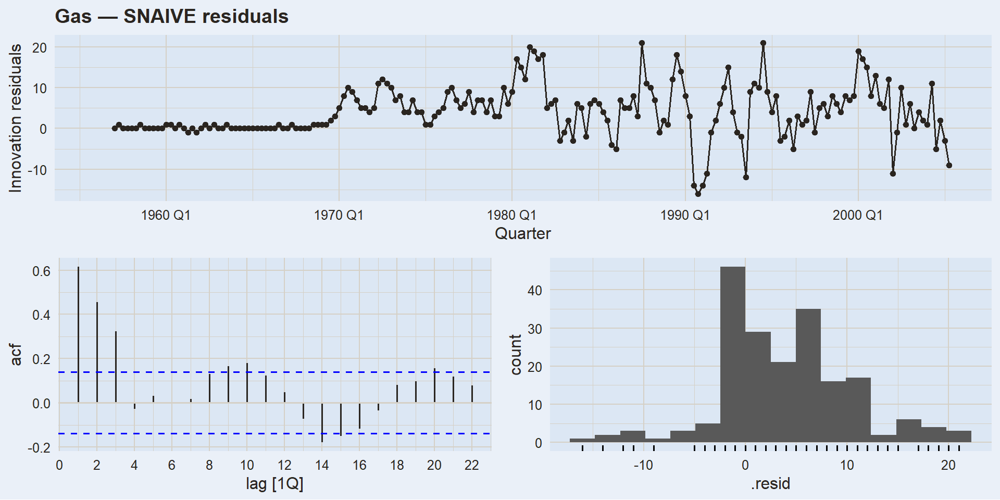](forecasting_files/figure-revealjs/gas-resid-1.png)

### 3.0.5 Portmanteau tests

The ACF plot gives a visual impression, but we also want a formal test. The **Ljung-Box test** checks whether any group of autocorrelations is significantly different from zero.

H_0: \text{residuals are white noise} \qquad H_1: \text{residuals are not white noise}

A small p-value (typically \< 0.05) is evidence against white noise.

Code

``` r
data_fit |>
  augment() |>
  features(.innov, ljung_box, lag = h, dof = K)   #<1>
```

1.  `lag` is typically set to 10 for non-seasonal data and 2m for seasonal data (m = seasonal period). `dof` is the number of estimated parameters (0 for all benchmark methods).

## Hare

Code

``` r
hare_fit |>
  augment() |>
  filter(.model == "naive") |>
  features(.innov, ljung_box, lag = 10, dof = 0)
```

## Beer

Code

``` r
beer_fit |>
  augment() |>
  filter(.model == "snaive") |>
  features(.innov, ljung_box, lag = 8, dof = 0)
```

## Mexico GDP

Code

``` r
mexico_fit |>
  augment() |>
  filter(.model == "drift") |>
  features(.innov, ljung_box, lag = 10, dof = 0)
```

## Gas

Code

``` r
gas_fit |>
  augment() |>
  filter(.model == "snaive") |>
  features(.innov, ljung_box, lag = 8, dof = 0)
```

### 3.0.6 Forecast accuracy

Residual diagnostics tell us about the **training fit**. Forecast accuracy tells us how well the model does on **unseen data**.

Forecast errors on the test set:

e\_{T+h} = y\_{T+h} - \hat{y}\_{T+h\|T}

From these errors we compute **percentage errors**:

p_t = \frac{e\_{T+h}}{y\_{T+h}} \times 100

and **scaled errors** — for seasonal series[^4]:

q_j = \frac{e_j}{\dfrac{1}{T-m}\displaystyle\sum\_{t=m+1}^{T}\|y_t - y\_{t-m}\|}

### 3.0.7 Error metrics

| **Scale** | **Metric** | **Description** | **Formula** |
|----|----|----|----|
| Scale-dependent | RMSE | Root Mean Squared Error | \sqrt{\text{mean}(e_t^2)} |
|  | MAE | Mean Absolute Error | \text{mean}(\|e_t\|) |
| Scale-independent | MAPE | Mean Absolute Percentage Error | \text{mean}(\|p_t\|) |
|  | MASE | Mean Absolute Scaled Error | \text{mean}(\|q_t\|) |
|  | RMSSE | Root Mean Squared Scaled Error | \sqrt{\text{mean}(q_t^2)} |

Common error metrics {.caption-top .table tbl-colwidths="[22,12,38,28]"}

> **TIP:**
>
> - **RMSE / MAE**: useful when all series share the same units and scale. RMSE penalizes large errors more heavily.
> - **MAPE**: intuitive (percentage) but breaks down when actual values are near zero. Avoid for intermittent demand or series with zeros.
> - **MASE / RMSSE**: preferred for comparing across series with different scales or units. A MASE \> 1 means the model is worse than the seasonal naïve benchmark.

### 3.0.8 Computing accuracy

Code

``` r
data_fc |>
  accuracy(data)    #<1>
```

1.  Pass the **full** tsibble (train + test). `fable` identifies the training portion to compute MASE/RMSSE denominators and the test portion to compute forecast errors. Passing only the test set returns `NaN` for scaled metrics.

## Hare

Code

``` r
hare_fc |>
  accuracy(pelt) |>
  select(.model, RMSE, MAE, MAPE, MASE, RMSSE) |>
  arrange(RMSSE)
```

## Beer

Code

``` r
beer_fc |>
  accuracy(beer) |>
  select(.model, RMSE, MAE, MAPE, MASE, RMSSE) |>
  arrange(RMSSE)
```

## Mexico GDP

Code

``` r
mexico_fc |>
  accuracy(mexico) |>
  select(.model, RMSE, MAE, MAPE, MASE, RMSSE) |>
  arrange(RMSSE)
```

## Gas

Code

``` r
gas_fc |>
  accuracy(aus_production) |>
  select(.model, RMSE, MAE, MAPE, MASE, RMSSE) |>
  arrange(RMSSE)
```

### 3.0.9 Refit and forecast

Once a model is selected based on the test set, **refit it on all available data** — the test set is no longer “future” at this point.

Using all observations generally improves parameter estimates and reflects how models are actually deployed.

## Hare

Code

``` r
hare_final_fit <- pelt |>
  model(naive = NAIVE(Hare))

hare_final_fc <- hare_final_fit |>
  forecast(h = 15)

hare_refit_p <- hare_final_fc |>
  autoplot(pelt) +
  labs(title = "Hare pelts — NAIVE forecast (refit on full data)",
       y = "Number of pelts (thousands)", x = NULL)
```

[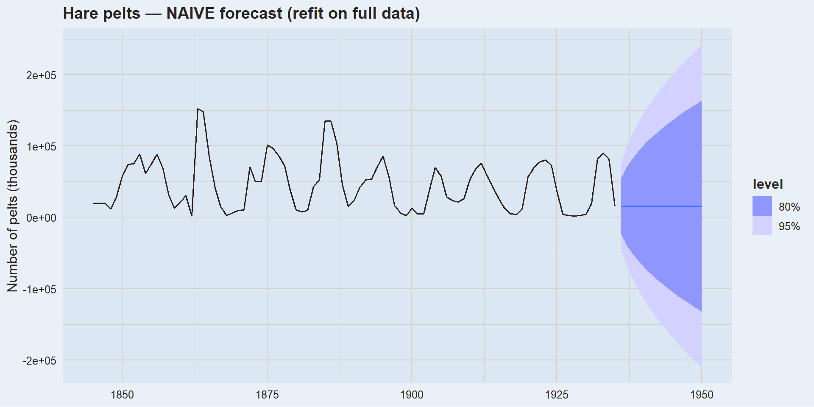](forecasting_files/figure-revealjs/hare-refit-render-1.png)

[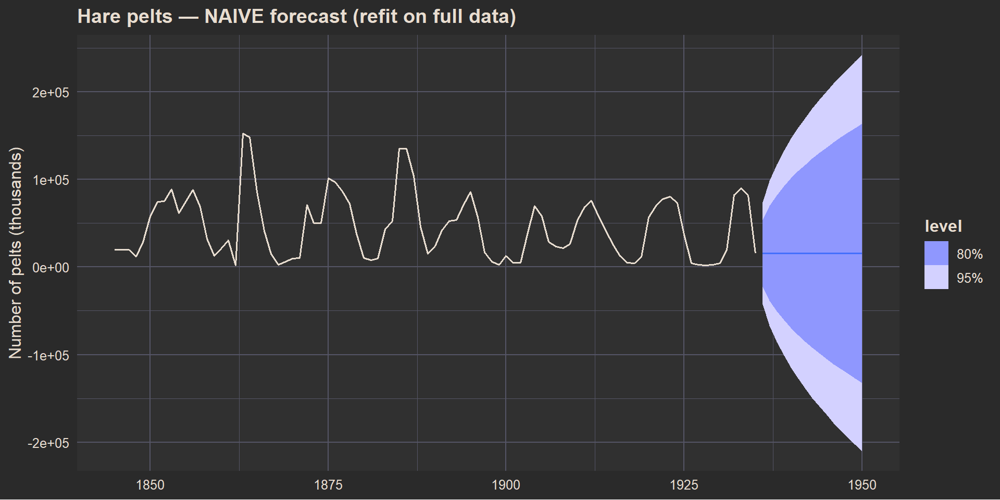](forecasting_files/figure-revealjs/hare-refit-render-2.png)

## Beer

Code

``` r
beer_final_fit <- beer |>
  model(snaive = SNAIVE(Beer))

beer_final_fc <- beer_final_fit |>
  forecast(h = "2 years")

beer_refit_p <- beer_final_fc |>
  autoplot(beer) +
  labs(title = "Beer production — SNAIVE forecast (refit on full data)",
       y = "Megalitres", x = NULL)
```

[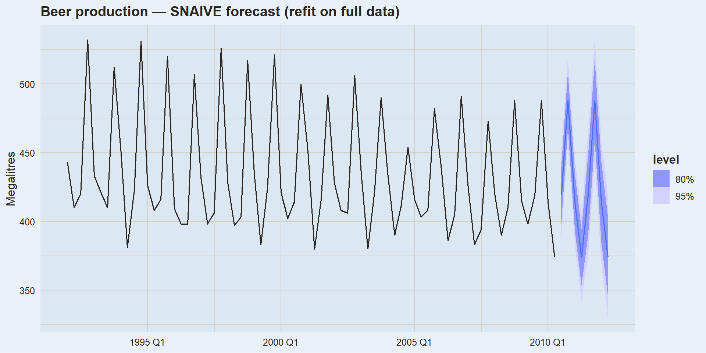](forecasting_files/figure-revealjs/beer-refit-render-1.png)

[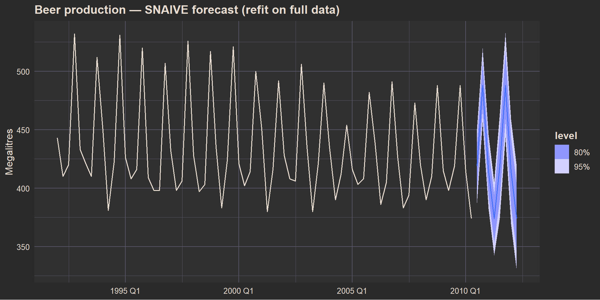](forecasting_files/figure-revealjs/beer-refit-render-2.png)

## Mexico GDP

Code

``` r
mexico_final_fit <- mexico |>
  model(drift = RW(GDP ~ drift()))

mexico_final_fc <- mexico_final_fit |>
  forecast(h = "5 years")

gdp_refit_p <- mexico_final_fc |>
  autoplot(mexico) +
  labs(title = "Mexico GDP — Drift forecast (refit on full data)",
       y = "GDP (USD)", x = NULL)
```

[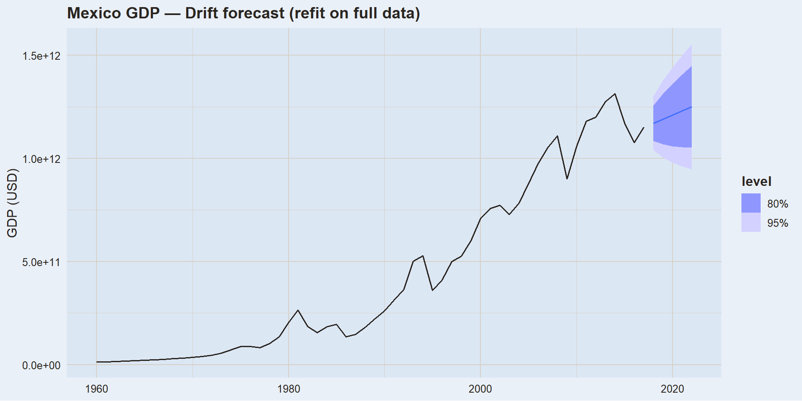](forecasting_files/figure-revealjs/gdp-refit-render-1.png)

[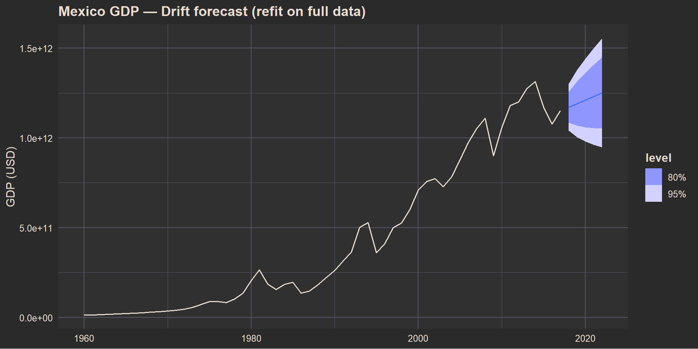](forecasting_files/figure-revealjs/gdp-refit-render-2.png)

### 3.0.10 Communicate

Forecasting is not finished when numbers are produced. Results must be communicated clearly and honestly.

Effective communication includes:

- **Visualization** — historical data + forecasts + prediction intervals, with clear labeling of units and horizons
- **Assumptions** — model choice and any transformations applied
- **Uncertainty** — point forecasts alone are rarely sufficient; prediction intervals convey risk and variability
- **Limitations** — structural breaks, data quality issues, short samples

A good forecast is one that decision-makers can **understand, trust, and act upon** — even when it turns out to be wrong.

Back to top

## Footnotes

[^1]: Splitting into train/test is the minimum. For more robust evaluation, consider time series cross-validation — see [FPP3 §5.10](https://otexts.com/fpp3/tscv.html).

[^2]: Store the resulting model table in a `*_fit` object.

[^3]: Store forecasts in a `*_fc` object.

[^4]: For non-seasonal series replace m with 1 and sum from t = 2. Scaled errors use the in-sample naïve or seasonal naïve error as the denominator, making MASE and RMSSE scale-free and comparable across series.
