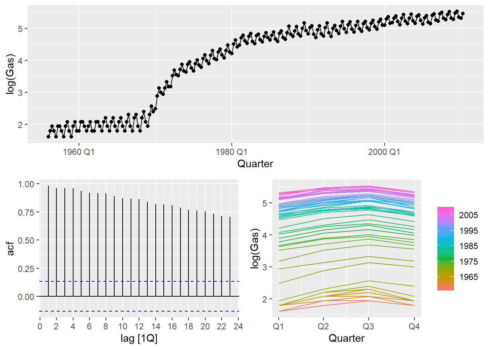

# Forecasting Foundations

Modified

June 1, 2026

# 1 A tidy forecasting workflow

[](fcst_wf.png)

## 1.1 Tidy data

- Use `readr::read_csv()`, `readxl::read_excel()`, or `tidyquant::tq_get()` to import the data into R. You can find more on this [here](https://r4ds.hadley.nz/import.html).

- Your data should be tidy. That means:

  - Each variable should be in its own column.
  - Each observation should be in its own row.
  - Each value should be in its own cell.

- [Data tidying](https://r4ds.hadley.nz/data-tidy.html) and [transforming](https://r4ds.hadley.nz/transform.html) are covered in detail in [R for Data Science](https://r4ds.hadley.nz/).

- Transform the resulting `tibble` into a **`tsibble`**:

  - It should have an `index` (time) variable with the proper time format[^1].
  - The `key` argument is only necessary if the dataset contains more than one time series.

### 1.1.1 Train/test split

- Split the data into a **training set** and a **test set**[^2]. The training set is used to estimate the model parameters, while the test set is used to evaluate the model’s performance on unseen data.

- The size of the training and test sets depends on the length of the time series and the forecasting horizon:

  - If the forecast horizon is e.g.. 12 months, the test set should contain 12 months of data.
  - Another common approach is to use the first 70-80% of the data for training and the remaining 20-30% for testing.

- We can use `filter_index()` to create the training set[^3]:

Code

``` r
datos_train <- <tsibble> |> 
  filter_index("start_date" ~ "end_date")  #<1>
```

1.  Replace `start_date` and `end_date` with the desired date range for the training set.You can also use `.` to indicate the start or end of the series: `filter_index(. ~ "end_date")` or `filter_index("start_date" ~ .)`.

> **NOTE:**
>
> In time series, the training set should always contain the earlier observations, while the test set should contain the later observations. This is because time series data is ordered in time, and we want to simulate the real-world scenario where we use past data to predict future values.

## 1.2 Visualize

Plot the time series to identify patterns, such as trend and seasonality, and anomalies. This can help us choose an appropriate forecasting method. You can find many types of plots [here](../../../../docs/modules/module_1/01_time_series/r_time_series.llms.md#%20TS%20Visualization).

[](forecasting1_files/figure-html/ts_viz-1.png)

## 1.3 Specify & Estimate

Decide whether any math transformations or adjustments are necessary and choose a forecasting method based on the series’ features.

Train the model specification on the training set. You can use the `model()` function to fit various forecasting models[^4].

Code

``` r
datos_fit <- datos_train |> 
  model(
    model_1 = <model_function_1>(<y_t> ~ x_t),                               #<1>
    model_2 = <model_function_2>(<transformation_function>(<y_t>), <args>)   #<2>
  )
```

1.  Replace `model_function_1` with the desired forecasting method (e.g., `ARIMA()`, `ETS()`, `NAIVE()`, etc.). Replace `<y_t>` with the name of the forecast variable and `<predictor_variables>` with any predictor variables if applicable.
2.  If a transformation is needed, replace `transformation_function` with the appropriate function (e.g., `log`, `box_cox`, etc.) and include any specific arguments required by the model.

## 1.4 Evaluate

- **Fitted** values, \hat{y}\_t: The values predicted by the model for the training set.
- **residuals**, e_t: The difference between the actual values and the fitted values, calculated as

e_t = y_t - \hat{y}\_t .

- **innovation residuals**: Residuals on the transformed scale[^5].

We can check if a model is capturing the patterns in the data by analyzing the residuals. Ideally, the residuals should resemble **white noise**.

> **TIP:**
>
> The **fitted** values and **residuals** can be extracted from the model table using `augment()`.

### 1.4.1 White noise

# An error occurred.

Unable to execute JavaScript.

### 1.4.2 Residual diagnostics

We expect residuals to behave like white noise, thus having the following properties:

*The most important:*

1.  **Uncorrelated**: There is no correlation between the values at different time points.

2.  **Zero mean**: The average value of the series is constant over time (and equal to zero).

*Nice to have:*

3.  **Constant variance**: The variability of the series is constant over time.

4.  **Normally distributed**: The values follow a normal distribution (this is not always required).

### 1.4.3 Refine

If the residuals don’t meet these properties, we could refine the model:

- For the first 2: add predictors or change the model structure.
- Apply a variance-stabilizing transformation (e.g., Box-Cox).
- If the residuals are not normally distributed, only the prediction intervals are affected. We can deal with this by using bootstrap prediction intervals.

## 1.5 Forecast

Once a satisfactory model is obtained, we can proceed to forecast[^6]. Use the `forecast()` function to generate forecasts for a specified horizon `h`:

Code

``` r
datos_fcst <- datos_fit |> 
  forecast(h = <forecast_horizon>)  #<1>
```

1.  Replace `<forecast_horizon>` with the desired number of periods to forecast (e.g., `12` for 12 months ahead), or you can write in text `"1 year"` for a one-year forecast.

> **NOTE:**
>
> The forecast horizon should have the same length as the test set to evaluate the model’s performance accurately.

### 1.5.1 Forecast accuracy

We measure a forecast’s accuracy by measuring the **forecast error**. Forecast errors are computed as:

e\_{T+h} = y\_{T+h} - \hat{y}\_{T+h\|T}

> **WARNING:**
>
> These errors depend on the scale of the data. Therefore, they are not suitable for comparing forecast accuracy across series with different scales or units.

We can also measure errors as **percentage errors**[^7]:

p_t = \frac{e\_{T+h}}{y\_{T+h}} \times 100

> **WARNING:**
>
> Percentage errors can be problematic when the actual values are close to zero, leading to extremely high or undefined percentage errors.

or **scaled errors**[^8].:

For non-seasonal time series:

q\_{j}=\frac{e\_{j}}{\frac{1}{T-1} \sum\_{t=2}^{T}\left\|y\_{t}-y\_{t-1}\right\|},

For seasonal time series:

q\_{j}=\frac{e\_{j}}{\frac{1}{T-m} \sum\_{t=m+1}^{T}\left\|y\_{t}-y\_{t-m}\right\|}.

### 1.5.2 Error metrics

Using this errors, we can compute various error metrics to summarize the forecast accuracy:

[TABLE]

Common error metrics {.caption-top .table}

### 1.5.3 Refit and forecast

Up to this point, models have been estimated **only on the training set**.  
Once a model has been selected and validated, the final step before deployment is to **refit it using all available data**.

Why refit?

- The test set is no longer “future” once model selection is finished.
- Using all available observations generally improves parameter estimates.
- This reflects how models are used in practice.

In the tidy forecasting workflow, refitting is straightforward:

- Re-estimate the chosen model using the **full tsibble**.
- Generate forecasts for the desired future horizon.

This ensures that the final forecasts are based on the maximum amount of information available.

### 1.5.4 Communicate

Forecasting is not finished when numbers are produced.  
Results must be **communicated clearly and honestly**.

Effective communication usually includes:

- **Visualizations**
  - Historical data + forecasts + prediction intervals.
  - Clear labeling of units, horizons, and uncertainty.
- **Assumptions**
  - Model choice.
  - Transformations and adjustments.
- **Uncertainty**
  - Point forecasts alone are rarely sufficient.
  - Prediction intervals convey risk and variability.
- **Limitations**
  - Structural breaks, data quality issues, or short samples.

A good forecast is one that decision-makers can **understand, trust, and act upon**, even if it turns out to be wrong.

# 2 Benchmark forecasting methods

Before fitting complex models, it is essential to establish **benchmark forecasts**.

Benchmark methods serve two key purposes:

1.  They provide a **baseline** that any serious model should outperform.
2.  They help detect cases where complexity adds little or no value.

Benchmark methods are typically **simple, transparent, and fast**.

## 2.1 Mean method

The forecast is the historical mean of the series:

\hat{y}\_{T+h\|T} = \bar{y}

Characteristics:

- Assumes no trend and no seasonality.
- Useful mainly as a baseline for stationary series.

## 2.2 Naïve method

The forecast equals the last observed value:

\hat{y}\_{T+h\|T} = y_T

Characteristics:

- Assumes the future will behave like the most recent past.
- Surprisingly hard to beat for many economic and financial series.
- Equivalent to a random walk model.

## 2.3 Seasonal naïve method

The forecast equals the last observed value from the same season:

\hat{y}\_{T+h\|T} = y\_{T+h-m}

where m is the seasonal period.

Characteristics:

- Captures seasonality with no trend modeling.
- Often a very strong benchmark for seasonal data.

## 2.4 Drift method

A linear trend is extrapolated from the first to the last observation:

\hat{y}\_{T+h\|T} = y_T + h \cdot \frac{y_T - y_1}{T-1}

Characteristics:

- Equivalent to a random walk with drift.
- Assumes a constant average change over time.
- Simple but often competitive for trending series.

Benchmark methods are **not meant to be optimal**.  
They are meant to be **hard to beat**.

If a complex model cannot outperform a suitable benchmark, it should be reconsidered.

Back to top

## Footnotes

[^1]: i.e., if the TS has a monthly frequency, the index variable should be in `yearmonth` format. Other formats could be `yearweek`, `yearquarter`, `year`, `date`.

[^2]: Splitting the data into a training and test set is the minimum requirement for evaluating a forecasting model. If you want to avoid overfitting and get a more reliable estimate of the model’s performance, you should consider splitting the data into 3 sets: **training, validation, and test sets**. The validation set is used to tune model hyperparameters and select the best model, while the test set is used for the final evaluation of the selected model. For an even more robust evaluation of forecasting models, consider using [**time series cross-validation**](https://otexts.com/fpp3/tscv.html) methods.

[^3]: and store it in a `*_train` object.

[^4]: and store the model table in a `*_fit` object.

[^5]: We will focus on innovation residuals whenever a transformation is used in the model.

[^6]: and store the forecasts in a `*_fcst` object.

[^7]: Percentage errors are scale-independent, making them useful for comparing forecast accuracy across different series.

[^8]: Scaled errors are also scale-independent and are useful for comparing forecast accuracy across different series.
