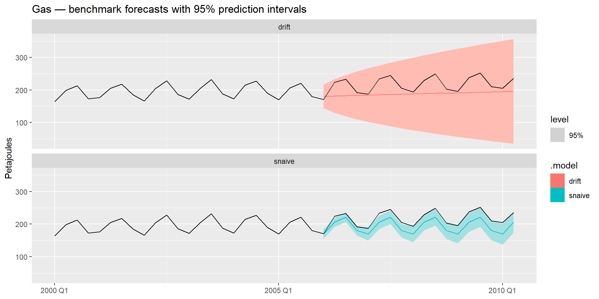
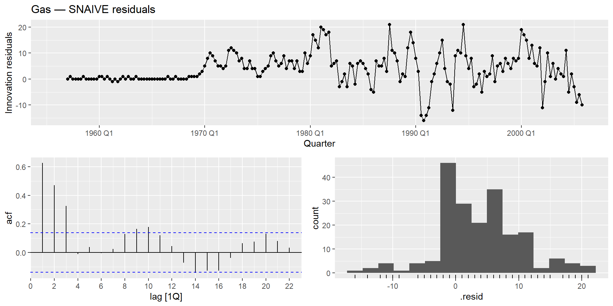
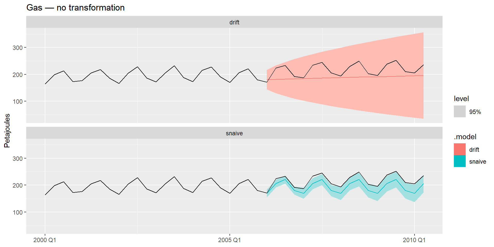
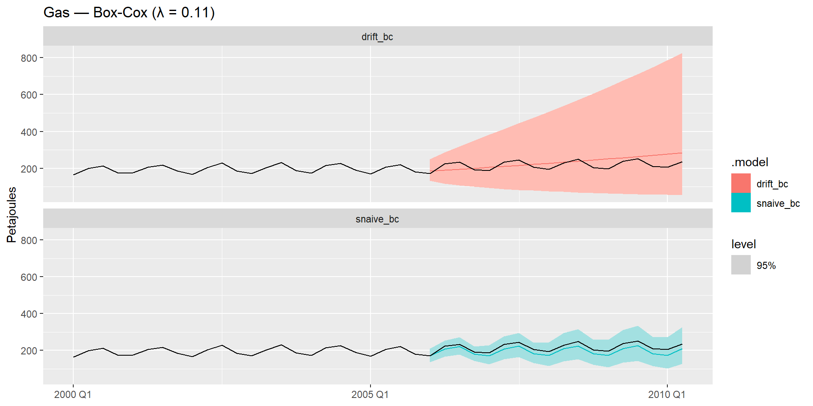
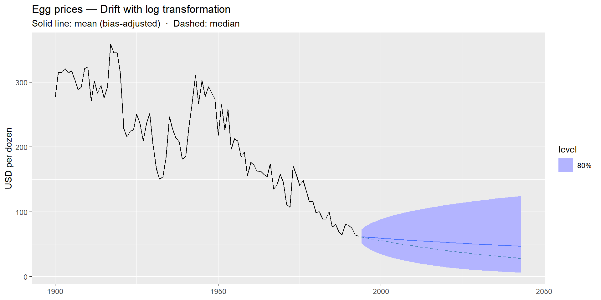
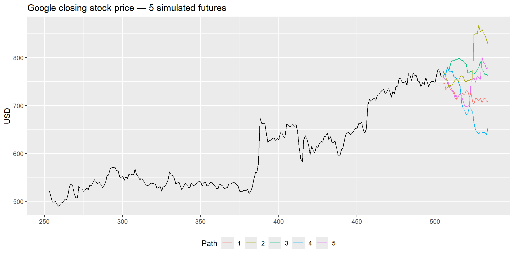
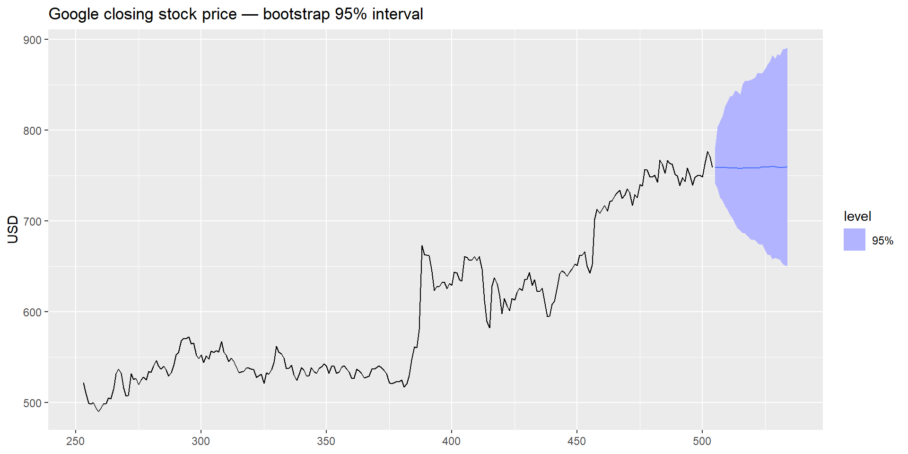
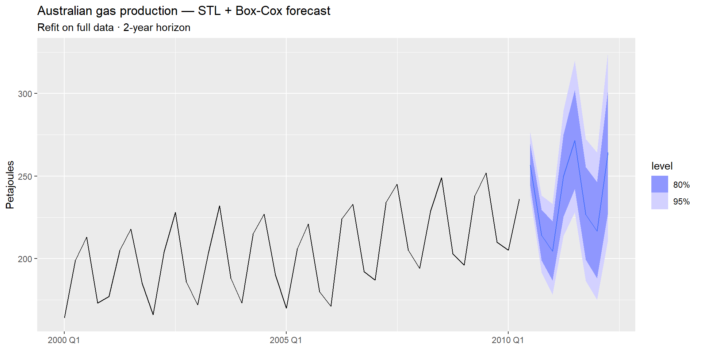

# Model Diagnostics and Advanced Forecasting

Modified

June 9, 2026

# 1 Prediction intervals

A point forecast tells you *where* the series is expected to go. A **prediction interval** tells you *how confident* you should be.

\hat{y}\_{T+h\|T} \pm c \cdot \hat{\sigma}\_h

where c depends on the coverage level (1.96 for 95%) and \hat{\sigma}\_h is the estimated forecast standard deviation at horizon h.

> **IMPORTANT:**
>
> A point forecast without an interval is like a weather forecast without a probability of rain — it gives the illusion of certainty. Uncertainty is part of the forecast.

### 1.0.1 One-step vs. multi-step

\hat{\sigma}\_h grows with the horizon h — errors accumulate as we forecast further ahead.

For the benchmark methods:

| Method | \hat{\sigma}\_h                                  |
|--------|--------------------------------------------------|
| NAIVE  | \hat{\sigma}\sqrt{h}                             |
| Drift  | \hat{\sigma}\sqrt{h\left(1 + \frac{h}{T}\right)} |
| SNAIVE | \hat{\sigma}\sqrt{\lfloor(h-1)/m\rfloor + 1}     |
| MEAN   | \hat{\sigma}\sqrt{1 + 1/T}                       |

The Mean interval barely widens; NAIVE and Drift intervals widen continuously.

### 1.0.2 Reading intervals with `hilo()`

`autoplot()` shows intervals visually. `hilo()` extracts the numeric bounds:

Code

``` numberSource
gas_fc |>
  filter(.model == "snaive") |>
  hilo(level = 95) |>
  select(Quarter, .mean, `95%`) |>
  slice_head(n = 6)
```

    # A tsibble: 6 x 3 [1Q]
      Quarter .mean                  `95%`
        <qtr> <dbl>                 <hilo>
    1 2006 Q1   170 [155.5179, 184.4821]95
    2 2006 Q2   206 [191.5179, 220.4821]95
    3 2006 Q3   221 [206.5179, 235.4821]95
    4 2006 Q4   180 [165.5179, 194.4821]95
    5 2007 Q1   170 [149.5192, 190.4808]95
    6 2007 Q2   206 [185.5192, 226.4808]95

### 1.0.3 The problem with Gas

Look at what SNAIVE and Drift produce for Gas:

Code

``` r
gas_fc |>
  filter(.model %in% c("snaive", "drift")) |>
  autoplot(
    aus_production |> filter_index("2000 Q1" ~ .),
    level = 95
  ) +
  facet_wrap(~ .model, nrow = 2) +
  labs(
    title = "Gas — benchmark forecasts with 95% prediction intervals",
    y = "Petajoules", x = NULL
  )
```

[](model_diagnostics_files/figure-revealjs/gas-pi-raw-1.png)

Both models produce intervals of **constant width** — they assume forecast variance stays the same across all periods. But the series shows growing variance: the swings in the 2000s are far larger than those in the 1970s. The intervals are miscalibrated.

# 2 Forecasting with transformations

### 2.0.1 The residuals tell the story

From the residual diagnostics we ran in [1.3](../../../../docs/modules/module_1/03_fcst/forecasting.llms.md), SNAIVE on Gas showed non-constant variance — larger residuals in recent decades, smaller in earlier ones. That is the signature of **multiplicative** behavior: the seasonal swings are proportional to the level of the series.

Code

``` r
gas_fit |>
  select(snaive) |>
  gg_tsresiduals() +
  labs(title = "Gas — SNAIVE residuals")
```

[](model_diagnostics_files/figure-revealjs/gas-resid-reminder-1.png)

As we saw in [1.2](../../../../docs/modules/module_1/02_ts_dcmp/ts_dcmp.llms.md), a Box-Cox transformation stabilizes the variance. Applied here, the model fits in the transformed scale and `fable` back-transforms the forecasts automatically.

### 2.0.2 Choosing \lambda

Code

``` r
lambda <- aus_production |>
  features(Gas, features = guerrero) |>  #<1>
  pull(lambda_guerrero)                  #<2>

lambda
```

1.  `guerrero` is a named feature function in `feasts` — pass it directly to `features()`.
2.  Extract the scalar value so it can be reused in model specs.

    [1] 0.1095171

### 2.0.3 Fitting with Box-Cox

Wrap the response variable in `box_cox()` inside the model spec:

Code

``` numberSource
gas_fit_bc <- gas_train |>
  model(
    snaive_bc = SNAIVE(box_cox(Gas, lambda)),       #<1>
    drift_bc  = RW(box_cox(Gas, lambda) ~ drift())  #<2>
  )
```

1.  Box-Cox applied inside the spec — the model sees stabilized variance.
2.  Same transformation for Drift. Both use the same `lambda` estimated above.

Code

``` r
gas_fc_bc <- gas_fit_bc |>
  forecast(h = nrow(gas_test))
```

### 2.0.4 Intervals before and after

The intervals are computed in the transformed scale and then back-transformed. Because e^x is a convex function, the back-transformation stretches the upper tail more than the lower one — the resulting intervals in the original scale are **asymmetric**.

## Without transformation

[](model_diagnostics_files/figure-revealjs/gas-pi-no-bc-1.png)

## With Box-Cox

[](model_diagnostics_files/figure-revealjs/gas-pi-bc-1.png)

### 2.0.5 Accuracy after transformation

Does the transformation improve forecast accuracy?

Code

``` r
bind_rows(
  gas_fc |>
    filter(.model %in% c("snaive", "drift")) |>
    accuracy(aus_production),
  gas_fc_bc |>
    accuracy(aus_production)
) |>
  select(.model, RMSE, MAE, MAPE, MASE, RMSSE) |>
  arrange(RMSSE)
```

> **NOTE:**
>
> MASE and RMSSE are computed in the **original scale** regardless of the transformation — `fable` back-transforms before measuring error. This makes accuracy metrics directly comparable across transformed and untransformed models.

# 3 Bias adjustment

### 3.0.1 Mean ≠ median after back-transformation

Back-transforming a forecast recovers the **median** of the forecast distribution in the original scale — not the mean.

For a log transformation, if w\_{T+h} \sim \mathcal{N}(\mu, \sigma_h^2), then in the original scale:

\text{median}(\hat{y}\_{T+h}) = e^{\mu} \qquad \text{mean}(\hat{y}\_{T+h}) = e^{\mu + \sigma_h^2/2}

The median is invariant under monotone transformations — the 50th percentile in log scale maps exactly to the 50th percentile in the original scale. The mean is not: because e^x is convex, Jensen’s inequality gives E\[e^W\] \> e^{E\[W\]}, and the gap grows with \sigma_h^2.

### 3.0.2 The general Box-Cox case

For a general Box-Cox transformation, the bias-adjusted back-transformation is:

y_t = \begin{cases} \exp(w_t)\left\[1 + \dfrac{\sigma_h^2}{2}\right\] & \text{if } \lambda = 0 \\\[10pt\] (\lambda w_t + 1)^{1/\lambda}\left\[1 + \dfrac{\sigma_h^2(1-\lambda)}{2(\lambda w_t+1)^{2}}\right\] & \text{otherwise} \end{cases}

`fable` applies this adjustment **automatically by default**.

### 3.0.3 Seeing the difference

The `eggs` series from `prices` makes the difference visible — it is short and noisy, so \sigma_h^2 grows quickly and the gap between mean and median becomes noticeable:

Code

``` r
eggs_tsb <- prices |>
  filter(!is.na(eggs))                              #<1>

eggs_fit <- eggs_tsb |>
  model(rw = RW(log(eggs) ~ drift()))

eggs_fc <- eggs_fit |>
  forecast(h = 50) |>
  mutate(.median = median(eggs))                    #<2>
```

1.  `prices` is a native `fpp3` dataset. Removing `NA`s before fitting avoids gaps in the series.
2.  `median()` extracts the distributional median from each forecast distribution — different from `.mean`, which already contains the bias-adjusted mean.

Code

``` r
eggs_fc |>
  autoplot(eggs_tsb, level = 80) +
  geom_line(
    data = eggs_fc,
    aes(y = .median),
    linetype = "dashed",
    color = "steelblue"
  ) +
  labs(
    title = "Egg prices — Drift with log transformation",
    subtitle = "Solid line: mean (bias-adjusted)  ·  Dashed: median",
    y = "USD per dozen",
    x = NULL
  )
```

[](model_diagnostics_files/figure-revealjs/eggs-plot-1.png)

> **NOTE:**
>
> For a single series the difference is usually small. It becomes important when **aggregating forecasts** — summing store-level forecasts into a regional total, for example. In that case, using medians instead of means introduces a systematic downward bias in the aggregate. We will revisit this in Module 4 when we cover hierarchical forecasting.

# 4 Bootstrap prediction intervals

### 4.0.1 When normality fails

All the prediction intervals above assume that forecast errors are **normally distributed**. When residuals are skewed or heavy-tailed, this assumption breaks down and the intervals are poorly calibrated.

The key observation is that we can always write:

y_t = \hat{y}\_{t\|t-1} + e_t

so a future observation can be simulated as:

y\_{T+1} = \hat{y}\_{T+1\|T} + e\_{T+1}

Since the errors are uncorrelated, we can substitute e\_{T+1} with a **randomly resampled** historical residual. Repeating this for y\_{T+2}, y\_{T+3}, \ldots gives one possible future path. Do it thousands of times and you have a full distribution of futures — no normality required.

### 4.0.2 Many possible futures

Here are five possible futures for Google’s closing price, each built by resampling historical residuals step by step:

[](model_diagnostics_files/figure-revealjs/google-sim-plot-1.png)

### 4.0.3 From paths to intervals

Running this thousands of times and taking percentiles of the simulated paths gives the **bootstrap prediction interval**. `forecast()` does this in one step:

Code

``` numberSource
google_fc_boot <- google_fit |>
  forecast(
    h         = 30,
    bootstrap = TRUE,   #<1>
    times     = 1000    #<2>
  )
```

1.  `bootstrap = TRUE` switches from the analytical normal interval to the resampling-based one.
2.  Number of simulated paths — more gives smoother intervals at higher computational cost.

Code

``` r
google_fc_boot |>
  autoplot(google_2015, level = 95) +
  labs(
    title = "Google closing stock price — bootstrap 95% interval",
    y = "USD", x = NULL
  )
```

[](model_diagnostics_files/figure-revealjs/google-bootstrap-plot-1.png)

> **TIP:**
>
> Use bootstrap intervals when `gg_tsresiduals()` shows clearly non-normal residuals — heavy tails or marked skew. For series where residuals are roughly symmetric, the additional computational cost rarely changes the conclusion.

# 5 Using STL Decomposition for forecasting with `decomposition_model()`

### 5.0.1 The idea

STL (covered in [1.2](../../../../docs/modules/module_1/02_ts_dcmp/ts_dcmp.llms.md)) decomposes a series into trend-cycle, seasonal, and remainder components. The benchmarks (covered in [1.3](../../../../docs/modules/module_1/03_fcst/forecasting.llms.md)) each handle one aspect of the series well.

`decomposition_model()` combines them into a pipeline:

1.  Apply STL to separate the components
2.  Forecast the **seasonally adjusted series** with one model
3.  Re-seasonalize: add the seasonal component forecast back

> **NOTE:**
>
> The reconstruction is additive in the decomposition scale. If the STL was applied to a transformed series, the reconstruction happens before back-transformation.

### 5.0.2 Syntax

The spec is defined once as a standalone object and passed into `model()`:

Code

``` r
stl_spec <- decomposition_model(                  #<1>
  STL(Gas ~ trend() + season(), robust = TRUE),   #<2>
  SNAIVE(season_year),                            #<3>
  RW(season_adjust ~ drift())                     #<4>
)

gas_fit_dcmp <- gas_train |>
  model(stl_snaive_drift = stl_spec)              #<5>
```

1.  `decomposition_model()` wraps a decomposition method and one or more component models into a single reusable spec.
2.  STL decomposition — same syntax as in 1.2.
3.  SNAIVE on `season_year` handles the seasonal component extracted by STL.
4.  Drift on `season_adjust` handles the seasonally adjusted series. `fable` reconstructs the final forecast by adding the two component forecasts.
5.  We still need to put the decomposition model inside a `mable` with the `model()` function.

### 5.0.3 With a transformation

Box-Cox goes inside the STL spec — declared once, inherited everywhere:

Code

``` numberSource
stl_spec_bc <- decomposition_model(
  STL(box_cox(Gas, lambda) ~ trend() + season(), robust = TRUE), #<1>
  SNAIVE(season_year),
  RW(season_adjust ~ drift())
)

gas_fit_dcmp_bc <- gas_train |>
  model(stl_bc = stl_spec_bc)
```

1.  The only difference from `stl_spec` is `box_cox()` in the STL call. All component models and the final back-transformation inherit it automatically.

Code

``` r
gas_fc_dcmp <- bind_rows(
  gas_fit_dcmp    |> forecast(h = nrow(gas_test)),
  gas_fit_dcmp_bc |> forecast(h = nrow(gas_test))
)
```

### 5.0.4 Final comparison

All models side by side:

### 5.0.5 Accuracy table

Code

``` r
gas_accu <- bind_rows(
  gas_fc      |> filter(.model %in% c("snaive", "drift")) |> accuracy(aus_production),
  gas_fc_bc   |> accuracy(aus_production),
  gas_fc_dcmp |> accuracy(aus_production)
) |>
  select(.model, RMSE, MAE, MAPE, MASE, RMSSE) |>
  arrange(RMSSE)

gas_accu
```

> **IMPORTANT:**
>
> The best-performing model from this table is your benchmark for the rest of the course. Every model we build in Modules 2, 3, and 4 must beat this number to justify its additional complexity.

### 5.0.6 Refit on all data

Because the spec is a standalone object, refitting on the full dataset reuses it directly — no duplication:

Code

``` numberSource
gas_final_fit <- aus_production |>
  model(stl_bc = stl_spec_bc)   #<1>

gas_final_fc <- gas_final_fit |>
  forecast(h = "2 years")

gas_final_fc |>
  autoplot(aus_production |> filter_index("2000 Q1" ~ .)) +
  labs(
    title = "Australian gas production — STL + Box-Cox forecast",
    subtitle = "Refit on full data · 2-year horizon",
    y = "Petajoules", x = NULL
  )
```

1.  Same spec, full data — no need to rewrite the model definition.

[](model_diagnostics_files/figure-revealjs/gas-final-refit-1.png)

> **NOTE:**
>
> You now have a principled, validated baseline model. It handles trend, seasonality, and non-constant variance. Modules 2 onward will replace or enhance individual components — but the workflow stays the same: split, fit, diagnose, compare, refit.

Back to top
