# Model Diagnostics and Advanced Forecasting

Modified

September 7, 2026

# 1 Prediction intervals

### 1.0.1 Why are these intervals so different?

Code

``` r
beer_pi_compare_p <- beer_fc |>
  autoplot(beer, level = 95) +        #<1>
  facet_wrap(~ .model, nrow = 1) +    #<2>
  labs(
    title = "Beer — same series, two benchmark models, 95% prediction intervals",
    y = "Megalitres", x = NULL
  )
```

1.  `beer_fc` holds the forecasts of both models; `level = 95` draws only the 95% band.
2.  One panel per model, side by side and sharing the y-axis, so the interval widths are directly comparable.

[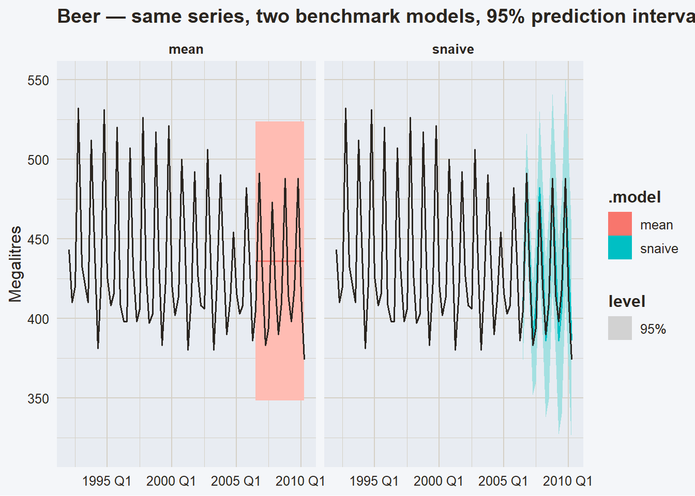](model_diagnostics_files/figure-html/beer-pi-compare-render-1.png)

[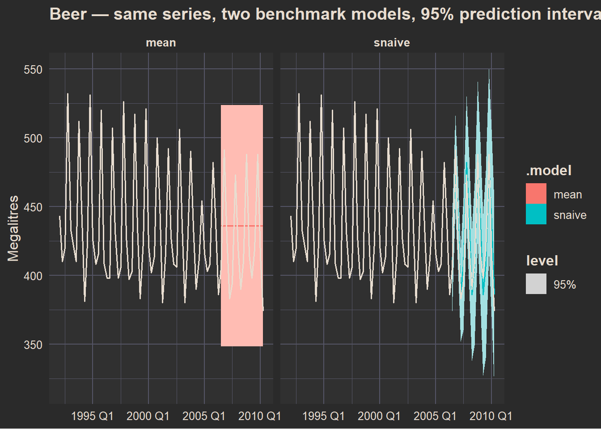](model_diagnostics_files/figure-html/beer-pi-compare-render-2.png)

**Same data. Same coverage level. Why is one interval several times wider than the other?**

### 1.0.2 The interval width comes from the residuals

The one-step residual standard deviation is

\hat{\sigma} = \sqrt{\frac{1}{T-K-M}\sum\_{t=1}^{T} e_t^2}

where K is the number of parameters estimated and M the number of missing residuals at the start of the series (e.g. m for SNAIVE).

Code

``` r
beer_fit |>
  augment() |>                                     #<1>
  as_tibble() |>
  group_by(.model) |>
  summarise(sigma_hat = sd(.innov, na.rm = TRUE))  #<2>
```

1.  `augment()` returns fitted values and residuals for every model in the mable.
2.  The standard deviation of the innovation residuals is the \hat\sigma that every prediction interval is built on. `sd()` divides by T-1 rather than T-K-M; the difference is negligible here, and `fable` uses the exact formula internally.

Every formula on the next slides multiplies this single number by a horizon-dependent factor. A model that fits poorly produces wide intervals — the interval is honest about how little the model knows.

A point forecast tells you *where* the series is expected to go. A **prediction interval** tells you *how confident* you should be.

\hat{y}\_{T+h\|T} \pm c \cdot \hat{\sigma}\_h

where c depends on the coverage level (1.96 for 95%) and \hat{\sigma}\_h is the estimated forecast standard deviation at horizon h, built from the residual standard deviation \hat\sigma we just computed.

> **IMPORTANT:**
>
> A point forecast without an interval is like a weather forecast without a probability of rain — it gives the illusion of certainty. Uncertainty is part of the forecast.

### 1.0.3 One-step vs. multi-step

\hat{\sigma}\_h grows with the horizon h — errors accumulate as we forecast further ahead.

For the benchmark methods:

| Method              | \hat{\sigma}\_h                                  |
|---------------------|--------------------------------------------------|
| h = 1 (all methods) | \hat{\sigma}                                     |
| NAIVE               | \hat{\sigma}\sqrt{h}                             |
| Drift               | \hat{\sigma}\sqrt{h\left(1 + \frac{h}{T}\right)} |
| SNAIVE              | \hat{\sigma}\sqrt{\lfloor(h-1)/m\rfloor + 1}     |
| MEAN                | \hat{\sigma}\sqrt{1 + 1/T}                       |

The Mean interval barely widens; NAIVE and Drift intervals widen continuously.

### 1.0.4 Reading intervals with `hilo()`

`autoplot()` shows intervals visually. `hilo()` extracts the numeric bounds:

Code

``` numberSource
gas_fc |>
  filter(.model == "snaive") |>
  hilo(level = 95) |>                #<1>
  select(Quarter, .mean, `95%`) |>   #<2>
  slice_head(n = 6)
```

1.  `hilo()` converts each forecast distribution into a numeric interval at the requested level.
2.  The interval lives in a new column named after the level; `.mean` is the point forecast.

    # A tsibble: 6 x 3 [1Q]
      Quarter .mean                  `95%`
        <qtr> <dbl>                 <hilo>
    1 2006 Q1   170 [155.5179, 184.4821]95
    2 2006 Q2   206 [191.5179, 220.4821]95
    3 2006 Q3   221 [206.5179, 235.4821]95
    4 2006 Q4   180 [165.5179, 194.4821]95
    5 2007 Q1   170 [149.5192, 190.4808]95
    6 2007 Q2   206 [185.5192, 226.4808]95

### 1.0.5 The problem with Gas

Look at what SNAIVE and Drift produce for Gas:

Code

``` r
gas_pi_raw_p <- gas_fc |>
  filter(.model %in% c("snaive", "drift")) |>   #<1>
  autoplot(
    aus_production |> filter_index("2000 Q1" ~ .),  #<2>
    level = 95
  ) +
  facet_wrap(~ .model, nrow = 2) +                #<3>
  labs(
    title = "Gas — benchmark forecasts with 95% prediction intervals",
    y = "Petajoules", x = NULL
  )
```

1.  Keep only the two benchmarks worth comparing here.
2.  Passing the full series (not just the training set) draws the test observations so we can see them against the intervals. Zooming in from 2000 makes the intervals readable.
3.  One panel per model, stacked so the two intervals share the time axis.

[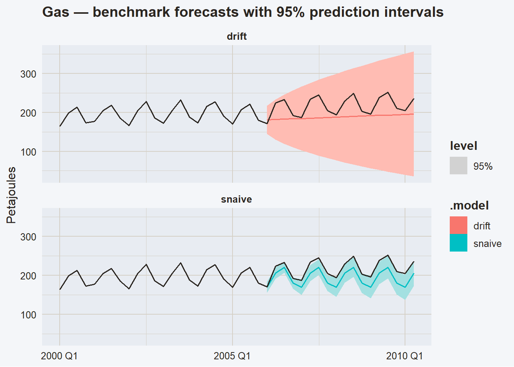](model_diagnostics_files/figure-html/gas-pi-raw-render-1.png)

[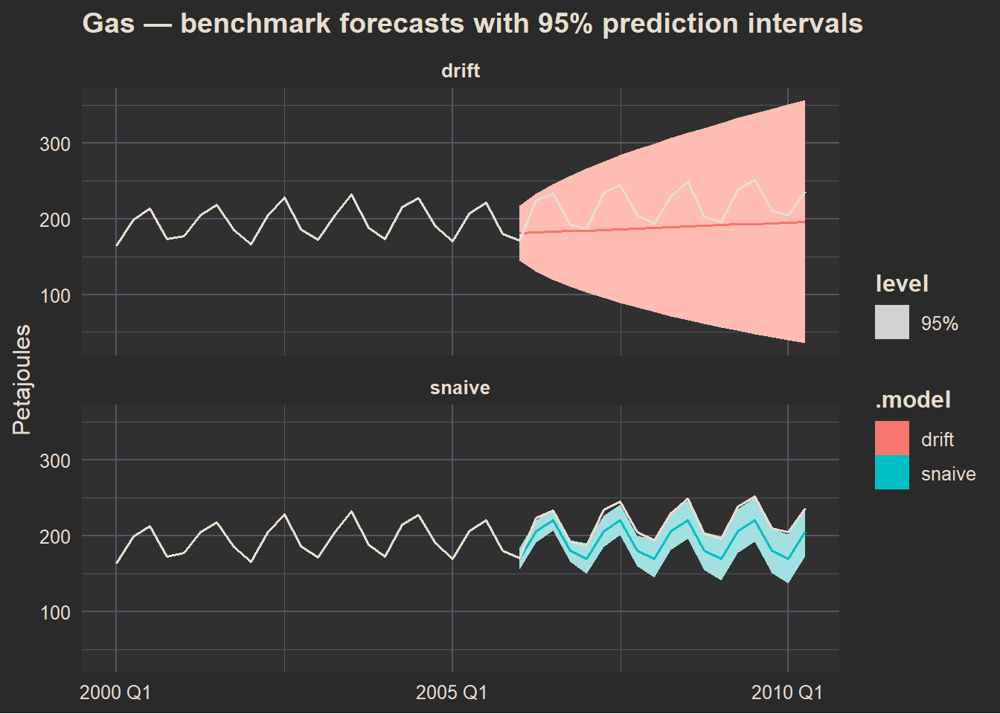](model_diagnostics_files/figure-html/gas-pi-raw-render-2.png)

Look at the SNAIVE panel: the observed peaks in the test set repeatedly fall **outside** the 95% interval. The interval is too narrow — and the reason is how \hat\sigma was estimated. It is a single number computed from residuals across the whole training period (1956–2005), including decades when seasonal swings were a fraction of today’s. Averaging small early residuals with large recent ones **understates current uncertainty**. The Drift panel has the opposite problem: a wide, symmetric interval that ignores the seasonal pattern entirely.

Neither model can express what the series clearly shows — variance that grows with the level. That is what a transformation fixes.

# 2 Forecasting with transformations

### 2.0.1 The residuals tell the story

From the residual diagnostics we ran in [1.3](../../../../docs/modules/module_1/03_fcst/forecasting.llms.md), SNAIVE on Gas showed non-constant variance — larger residuals in recent decades, smaller in earlier ones. That is the signature of **multiplicative** behavior: the seasonal swings are proportional to the level of the series.

Code

``` r
theme_narsil()                                #<1>
gas_fit |>
  select(snaive) |>                           #<2>
  gg_tsresiduals() +
  labs(title = "Gas — SNAIVE residuals")
```

1.  `gg_tsresiduals()` cannot use the light/dark render pattern, so the theme is reset explicitly first.
2.  `gg_tsresiduals()` works on a single model: select one column of the mable before calling it.

[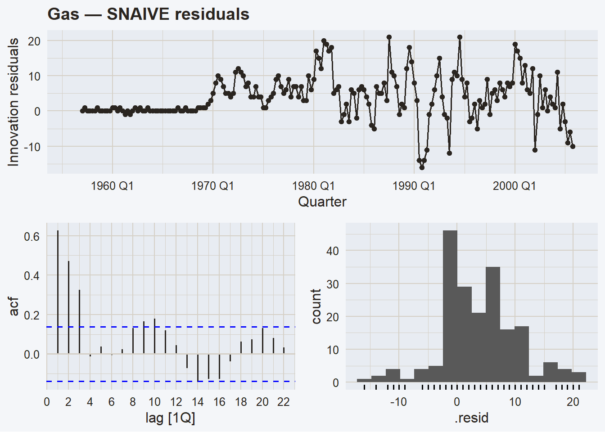](model_diagnostics_files/figure-html/gas-resid-reminder-1.png)

    <theme> List of 144
     $ line                            : <ggplot2::element_line>
      ..@ colour       : chr "black"
      ..@ linewidth    : num 0.545
      ..@ linetype     : num 1
      ..@ lineend      : chr "butt"
      ..@ linejoin     : chr "round"
      ..@ arrow        : logi FALSE
      ..@ arrow.fill   : chr "black"
      ..@ inherit.blank: logi TRUE
     $ rect                            : <ggplot2::element_rect>
      ..@ fill         : chr "white"
      ..@ colour       : chr "black"
      ..@ linewidth    : num 0.545
      ..@ linetype     : num 1
      ..@ linejoin     : chr "round"
      ..@ inherit.blank: logi TRUE
     $ text                            : <ggplot2::element_text>
      ..@ family       : chr ""
      ..@ face         : chr "plain"
      ..@ italic       : chr NA
      ..@ fontweight   : num NA
      ..@ fontwidth    : num NA
      ..@ colour       : chr "#2A2520"
      ..@ size         : num 12
      ..@ hjust        : num 0.5
      ..@ vjust        : num 0.5
      ..@ angle        : num 0
      ..@ lineheight   : num 0.9
      ..@ margin       : <ggplot2::margin> num [1:4] 0 0 0 0
      ..@ debug        : logi FALSE
      ..@ inherit.blank: logi FALSE
     $ title                           : <ggplot2::element_text>
      ..@ family       : NULL
      ..@ face         : NULL
      ..@ italic       : chr NA
      ..@ fontweight   : num NA
      ..@ fontwidth    : num NA
      ..@ colour       : NULL
      ..@ size         : NULL
      ..@ hjust        : NULL
      ..@ vjust        : NULL
      ..@ angle        : NULL
      ..@ lineheight   : NULL
      ..@ margin       : NULL
      ..@ debug        : NULL
      ..@ inherit.blank: logi TRUE
     $ point                           : <ggplot2::element_point>
      ..@ colour       : chr "black"
      ..@ shape        : num 19
      ..@ size         : num 1.64
      ..@ fill         : chr "white"
      ..@ stroke       : num 0.545
      ..@ inherit.blank: logi TRUE
     $ polygon                         : <ggplot2::element_polygon>
      ..@ fill         : chr "white"
      ..@ colour       : chr "black"
      ..@ linewidth    : num 0.545
      ..@ linetype     : num 1
      ..@ linejoin     : chr "round"
      ..@ inherit.blank: logi TRUE
     $ geom                            : <ggplot2::element_geom>
      ..@ ink        : chr "black"
      ..@ paper      : chr "white"
      ..@ accent     : chr "#3366FF"
      ..@ linewidth  : num 0.545
      ..@ borderwidth: num 0.545
      ..@ linetype   : int 1
      ..@ bordertype : int 1
      ..@ family     : chr ""
      ..@ fontsize   : num 4.22
      ..@ pointsize  : num 1.64
      ..@ pointshape : num 19
      ..@ colour     : NULL
      ..@ fill       : NULL
     $ spacing                         : 'simpleUnit' num 6points
      ..- attr(*, "unit")= int 8
     $ margins                         : <ggplot2::margin> num [1:4] 6 6 6 6
     $ aspect.ratio                    : NULL
     $ axis.title                      : <ggplot2::element_text>
      ..@ family       : NULL
      ..@ face         : NULL
      ..@ italic       : chr NA
      ..@ fontweight   : num NA
      ..@ fontwidth    : num NA
      ..@ colour       : chr "#2A2520"
      ..@ size         : NULL
      ..@ hjust        : NULL
      ..@ vjust        : NULL
      ..@ angle        : NULL
      ..@ lineheight   : NULL
      ..@ margin       : NULL
      ..@ debug        : NULL
      ..@ inherit.blank: logi FALSE
     $ axis.title.x                    : <ggplot2::element_text>
      ..@ family       : NULL
      ..@ face         : NULL
      ..@ italic       : chr NA
      ..@ fontweight   : num NA
      ..@ fontwidth    : num NA
      ..@ colour       : NULL
      ..@ size         : NULL
      ..@ hjust        : NULL
      ..@ vjust        : num 1
      ..@ angle        : NULL
      ..@ lineheight   : NULL
      ..@ margin       : <ggplot2::margin> num [1:4] 3 0 0 0
      ..@ debug        : NULL
      ..@ inherit.blank: logi TRUE
     $ axis.title.x.top                : <ggplot2::element_text>
      ..@ family       : NULL
      ..@ face         : NULL
      ..@ italic       : chr NA
      ..@ fontweight   : num NA
      ..@ fontwidth    : num NA
      ..@ colour       : NULL
      ..@ size         : NULL
      ..@ hjust        : NULL
      ..@ vjust        : num 0
      ..@ angle        : NULL
      ..@ lineheight   : NULL
      ..@ margin       : <ggplot2::margin> num [1:4] 0 0 3 0
      ..@ debug        : NULL
      ..@ inherit.blank: logi TRUE
     $ axis.title.x.bottom             : NULL
     $ axis.title.y                    : <ggplot2::element_text>
      ..@ family       : NULL
      ..@ face         : NULL
      ..@ italic       : chr NA
      ..@ fontweight   : num NA
      ..@ fontwidth    : num NA
      ..@ colour       : NULL
      ..@ size         : NULL
      ..@ hjust        : NULL
      ..@ vjust        : num 1
      ..@ angle        : num 90
      ..@ lineheight   : NULL
      ..@ margin       : <ggplot2::margin> num [1:4] 0 3 0 0
      ..@ debug        : NULL
      ..@ inherit.blank: logi TRUE
     $ axis.title.y.left               : NULL
     $ axis.title.y.right              : <ggplot2::element_text>
      ..@ family       : NULL
      ..@ face         : NULL
      ..@ italic       : chr NA
      ..@ fontweight   : num NA
      ..@ fontwidth    : num NA
      ..@ colour       : NULL
      ..@ size         : NULL
      ..@ hjust        : NULL
      ..@ vjust        : num 1
      ..@ angle        : num -90
      ..@ lineheight   : NULL
      ..@ margin       : <ggplot2::margin> num [1:4] 0 0 0 3
      ..@ debug        : NULL
      ..@ inherit.blank: logi TRUE
     $ axis.text                       : <ggplot2::element_text>
      ..@ family       : NULL
      ..@ face         : NULL
      ..@ italic       : chr NA
      ..@ fontweight   : num NA
      ..@ fontwidth    : num NA
      ..@ colour       : chr "#2A2520"
      ..@ size         : 'rel' num 0.8
      ..@ hjust        : NULL
      ..@ vjust        : NULL
      ..@ angle        : NULL
      ..@ lineheight   : NULL
      ..@ margin       : NULL
      ..@ debug        : NULL
      ..@ inherit.blank: logi FALSE
     $ axis.text.x                     : <ggplot2::element_text>
      ..@ family       : NULL
      ..@ face         : NULL
      ..@ italic       : chr NA
      ..@ fontweight   : num NA
      ..@ fontwidth    : num NA
      ..@ colour       : NULL
      ..@ size         : NULL
      ..@ hjust        : NULL
      ..@ vjust        : num 1
      ..@ angle        : NULL
      ..@ lineheight   : NULL
      ..@ margin       : <ggplot2::margin> num [1:4] 2.4 0 0 0
      ..@ debug        : NULL
      ..@ inherit.blank: logi TRUE
     $ axis.text.x.top                 : <ggplot2::element_text>
      ..@ family       : NULL
      ..@ face         : NULL
      ..@ italic       : chr NA
      ..@ fontweight   : num NA
      ..@ fontwidth    : num NA
      ..@ colour       : NULL
      ..@ size         : NULL
      ..@ hjust        : NULL
      ..@ vjust        : NULL
      ..@ angle        : NULL
      ..@ lineheight   : NULL
      ..@ margin       : <ggplot2::margin> num [1:4] 0 0 5.4 0
      ..@ debug        : NULL
      ..@ inherit.blank: logi TRUE
     $ axis.text.x.bottom              : <ggplot2::element_text>
      ..@ family       : NULL
      ..@ face         : NULL
      ..@ italic       : chr NA
      ..@ fontweight   : num NA
      ..@ fontwidth    : num NA
      ..@ colour       : NULL
      ..@ size         : NULL
      ..@ hjust        : NULL
      ..@ vjust        : NULL
      ..@ angle        : NULL
      ..@ lineheight   : NULL
      ..@ margin       : <ggplot2::margin> num [1:4] 5.4 0 0 0
      ..@ debug        : NULL
      ..@ inherit.blank: logi TRUE
     $ axis.text.y                     : <ggplot2::element_text>
      ..@ family       : NULL
      ..@ face         : NULL
      ..@ italic       : chr NA
      ..@ fontweight   : num NA
      ..@ fontwidth    : num NA
      ..@ colour       : NULL
      ..@ size         : NULL
      ..@ hjust        : num 1
      ..@ vjust        : NULL
      ..@ angle        : NULL
      ..@ lineheight   : NULL
      ..@ margin       : <ggplot2::margin> num [1:4] 0 2.4 0 0
      ..@ debug        : NULL
      ..@ inherit.blank: logi TRUE
     $ axis.text.y.left                : <ggplot2::element_text>
      ..@ family       : NULL
      ..@ face         : NULL
      ..@ italic       : chr NA
      ..@ fontweight   : num NA
      ..@ fontwidth    : num NA
      ..@ colour       : NULL
      ..@ size         : NULL
      ..@ hjust        : NULL
      ..@ vjust        : NULL
      ..@ angle        : NULL
      ..@ lineheight   : NULL
      ..@ margin       : <ggplot2::margin> num [1:4] 0 5.4 0 0
      ..@ debug        : NULL
      ..@ inherit.blank: logi TRUE
     $ axis.text.y.right               : <ggplot2::element_text>
      ..@ family       : NULL
      ..@ face         : NULL
      ..@ italic       : chr NA
      ..@ fontweight   : num NA
      ..@ fontwidth    : num NA
      ..@ colour       : NULL
      ..@ size         : NULL
      ..@ hjust        : NULL
      ..@ vjust        : NULL
      ..@ angle        : NULL
      ..@ lineheight   : NULL
      ..@ margin       : <ggplot2::margin> num [1:4] 0 0 0 5.4
      ..@ debug        : NULL
      ..@ inherit.blank: logi TRUE
     $ axis.text.theta                 : NULL
     $ axis.text.r                     : <ggplot2::element_text>
      ..@ family       : NULL
      ..@ face         : NULL
      ..@ italic       : chr NA
      ..@ fontweight   : num NA
      ..@ fontwidth    : num NA
      ..@ colour       : NULL
      ..@ size         : NULL
      ..@ hjust        : num 0.5
      ..@ vjust        : NULL
      ..@ angle        : NULL
      ..@ lineheight   : NULL
      ..@ margin       : <ggplot2::margin> num [1:4] 0 2.4 0 2.4
      ..@ debug        : NULL
      ..@ inherit.blank: logi TRUE
     $ axis.ticks                      : <ggplot2::element_blank>
     $ axis.ticks.x                    : NULL
     $ axis.ticks.x.top                : NULL
     $ axis.ticks.x.bottom             : NULL
     $ axis.ticks.y                    : NULL
     $ axis.ticks.y.left               : NULL
     $ axis.ticks.y.right              : NULL
     $ axis.ticks.theta                : NULL
     $ axis.ticks.r                    : NULL
     $ axis.minor.ticks.x.top          : NULL
     $ axis.minor.ticks.x.bottom       : NULL
     $ axis.minor.ticks.y.left         : NULL
     $ axis.minor.ticks.y.right        : NULL
     $ axis.minor.ticks.theta          : NULL
     $ axis.minor.ticks.r              : NULL
     $ axis.ticks.length               : 'rel' num 0.5
     $ axis.ticks.length.x             : NULL
     $ axis.ticks.length.x.top         : NULL
     $ axis.ticks.length.x.bottom      : NULL
     $ axis.ticks.length.y             : NULL
     $ axis.ticks.length.y.left        : NULL
     $ axis.ticks.length.y.right       : NULL
     $ axis.ticks.length.theta         : NULL
     $ axis.ticks.length.r             : NULL
     $ axis.minor.ticks.length         : 'rel' num 0.75
     $ axis.minor.ticks.length.x       : NULL
     $ axis.minor.ticks.length.x.top   : NULL
     $ axis.minor.ticks.length.x.bottom: NULL
     $ axis.minor.ticks.length.y       : NULL
     $ axis.minor.ticks.length.y.left  : NULL
     $ axis.minor.ticks.length.y.right : NULL
     $ axis.minor.ticks.length.theta   : NULL
     $ axis.minor.ticks.length.r       : NULL
     $ axis.line                       : <ggplot2::element_blank>
     $ axis.line.x                     : NULL
     $ axis.line.x.top                 : NULL
     $ axis.line.x.bottom              : NULL
     $ axis.line.y                     : NULL
     $ axis.line.y.left                : NULL
     $ axis.line.y.right               : NULL
     $ axis.line.theta                 : NULL
     $ axis.line.r                     : NULL
     $ legend.background               : <ggplot2::element_blank>
     $ legend.margin                   : NULL
     $ legend.spacing                  : 'rel' num 2
     $ legend.spacing.x                : NULL
     $ legend.spacing.y                : NULL
     $ legend.key                      : <ggplot2::element_blank>
     $ legend.key.size                 : 'simpleUnit' num 1.2lines
      ..- attr(*, "unit")= int 3
     $ legend.key.height               : NULL
     $ legend.key.width                : NULL
     $ legend.key.spacing              : NULL
     $ legend.key.spacing.x            : NULL
     $ legend.key.spacing.y            : NULL
     $ legend.key.justification        : NULL
     $ legend.frame                    : NULL
     $ legend.ticks                    : NULL
     $ legend.ticks.length             : 'rel' num 0.2
     $ legend.axis.line                : NULL
     $ legend.text                     : <ggplot2::element_text>
      ..@ family       : NULL
      ..@ face         : NULL
      ..@ italic       : chr NA
      ..@ fontweight   : num NA
      ..@ fontwidth    : num NA
      ..@ colour       : chr "#2A2520"
      ..@ size         : 'rel' num 0.8
      ..@ hjust        : NULL
      ..@ vjust        : NULL
      ..@ angle        : NULL
      ..@ lineheight   : NULL
      ..@ margin       : NULL
      ..@ debug        : NULL
      ..@ inherit.blank: logi FALSE
     $ legend.text.position            : NULL
     $ legend.title                    : <ggplot2::element_text>
      ..@ family       : NULL
      ..@ face         : chr "bold"
      ..@ italic       : chr NA
      ..@ fontweight   : num NA
      ..@ fontwidth    : num NA
      ..@ colour       : chr "#2A2520"
      ..@ size         : NULL
      ..@ hjust        : num 0
      ..@ vjust        : NULL
      ..@ angle        : NULL
      ..@ lineheight   : NULL
      ..@ margin       : NULL
      ..@ debug        : NULL
      ..@ inherit.blank: logi FALSE
     $ legend.title.position           : NULL
     $ legend.position                 : chr "right"
     $ legend.position.inside          : NULL
     $ legend.direction                : NULL
     $ legend.byrow                    : NULL
     $ legend.justification            : chr "center"
     $ legend.justification.top        : NULL
     $ legend.justification.bottom     : NULL
     $ legend.justification.left       : NULL
     $ legend.justification.right      : NULL
     $ legend.justification.inside     : NULL
      [list output truncated]
     @ complete: logi TRUE
     @ validate: logi TRUE

As we saw in [1.2](../../../../docs/modules/module_1/02_ts_dcmp/ts_dcmp.llms.md), a Box-Cox transformation stabilizes the variance. Applied here, the model fits in the transformed scale and `fable` back-transforms the forecasts automatically.

### 2.0.2 Choosing \lambda

Code

``` r
lambda <- aus_production |>
  features(Gas, features = guerrero) |>  #<1>
  pull(lambda_guerrero)                  #<2>

lambda
```

1.  `guerrero` is a named feature function in `feasts` — pass it directly to `features()`.
2.  Extract the scalar value so it can be reused in model specs.

    [1] 0.1095171

### 2.0.3 Fitting with Box-Cox

Wrap the response variable in `box_cox()` inside the model spec:

Code

``` numberSource
gas_fit_bc <- gas_train |>
  model(
    snaive_bc = SNAIVE(box_cox(Gas, lambda)),       #<1>
    drift_bc  = RW(box_cox(Gas, lambda) ~ drift())  #<2>
  )
```

1.  Box-Cox applied inside the spec — the model sees stabilized variance.
2.  Same transformation for Drift. Both use the same `lambda` estimated above.

Code

``` r
gas_fc_bc <- gas_fit_bc |>
  forecast(h = nrow(gas_test))   #<1>
```

1.  Same horizon as the untransformed benchmarks. Nothing about the transformation appears here — see the next slide for why.

### 2.0.4 Back to the original scale

We fitted the model to w_t = \text{box\\cox}(y_t, \lambda), so the forecasts and their intervals live in the transformed scale. To report them in the original units we apply the inverse transformation — the **back-transformation**:

y_t = \begin{cases} \exp(w_t) & \text{if } \lambda = 0 \\\[6pt\] \operatorname{sign}(\lambda w_t + 1)\\\|\lambda w_t + 1\|^{1/\lambda} & \text{otherwise} \end{cases}

> **NOTE:**
>
> `fable` does this for you. Because the transformation was declared inside the model formula, `forecast()` returns everything — point forecasts, intervals, the full distribution — already back-transformed. You never call `inv_box_cox()` yourself.

Back-transforming is not free, though. It does two things to the forecast distribution, and both matter.

### 2.0.5 Intervals before and after

The intervals are computed in the transformed scale and back-transformed with the inverse above. Because the inverse is a convex function, the back-transformation stretches the upper tail more than the lower one — the resulting intervals in the original scale are **asymmetric**.

## Without transformation

[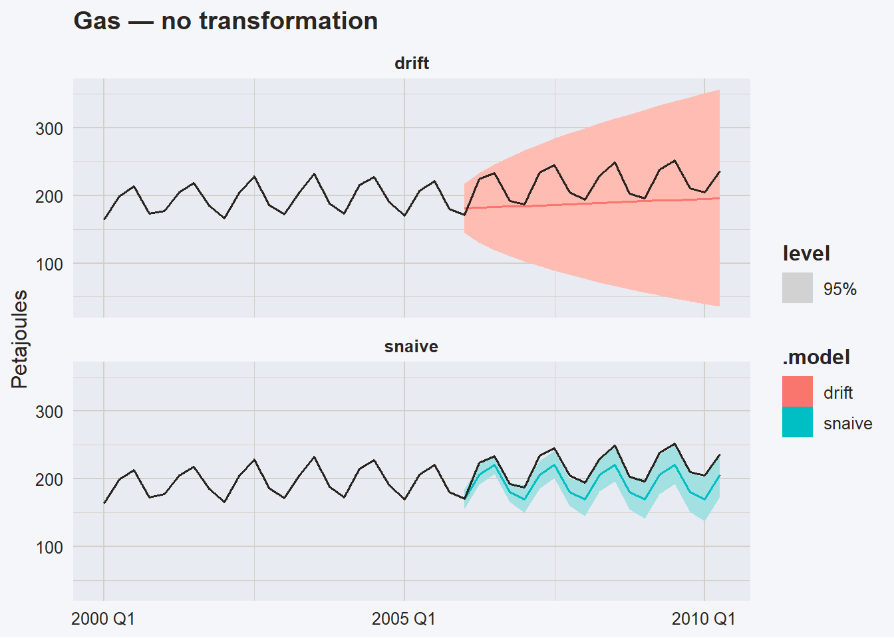](model_diagnostics_files/figure-html/gas-pi-no-bc-render-1.png)

[](model_diagnostics_files/figure-html/gas-pi-no-bc-render-2.png)

## With Box-Cox

[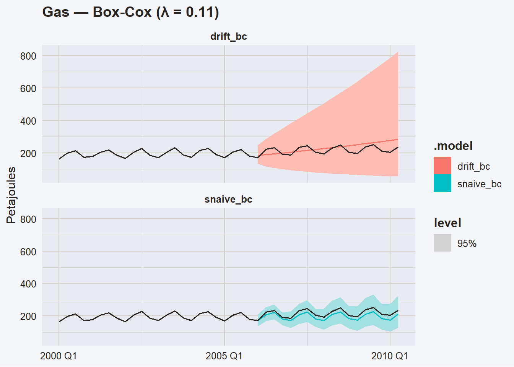](model_diagnostics_files/figure-html/gas-pi-bc-render-1.png)

[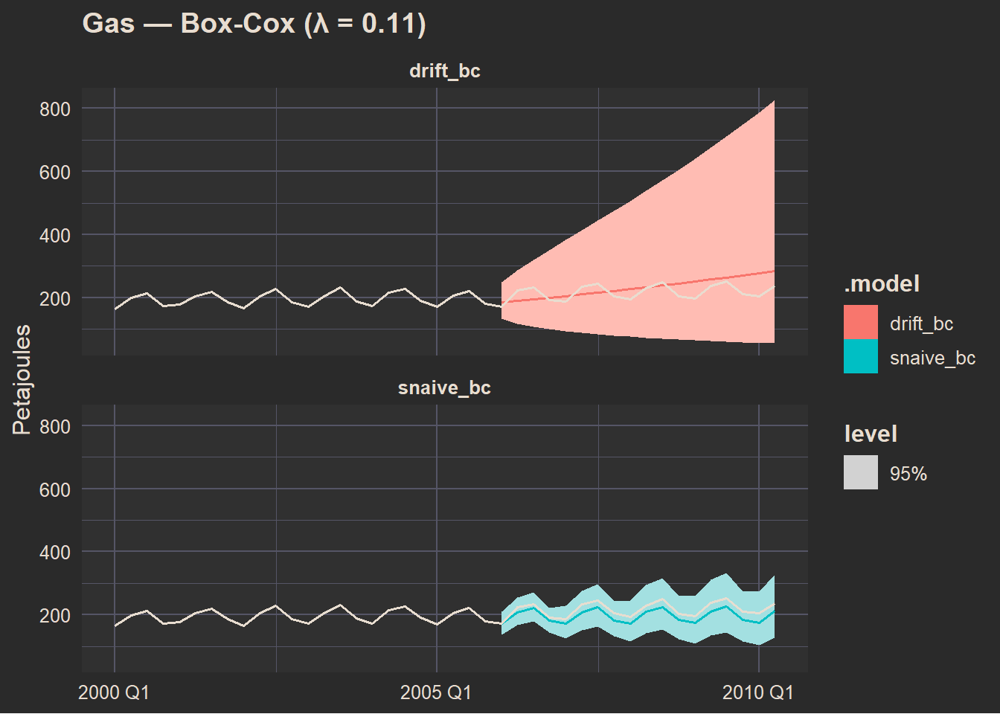](model_diagnostics_files/figure-html/gas-pi-bc-render-2.png)

### 2.0.6 Accuracy after transformation

Does the transformation improve forecast accuracy?

Code

``` r
bind_rows(                                       #<1>
  gas_fc |>
    filter(.model %in% c("snaive", "drift")) |>
    accuracy(aus_production),                    #<2>
  gas_fc_bc |>
    accuracy(aus_production)
) |>
  select(.model, RMSE, MAE, MAPE, MASE, RMSSE) |>
  arrange(RMSSE)                                 #<3>
```

1.  The two fables have different models, so stack their accuracy tables to compare them in one place.
2.  `accuracy()` on a fable takes the **full** series and matches the test observations by index — never pass the test set alone.
3.  Sort by the scaled error so the best model is at the top.

> **NOTE:**
>
> MASE and RMSSE are computed in the **original scale** regardless of the transformation — `fable` back-transforms before measuring error. This makes accuracy metrics directly comparable across transformed and untransformed models.

# 3 Bias adjustment

### 3.0.1 Mean ≠ median after back-transformation

The second consequence of back-transforming: the point forecast you recover is the **median** of the forecast distribution in the original scale — not the mean. The back-transformation introduces a bias, and by default your forecasts follow the median.

For a log transformation, if w\_{T+h} \sim \mathcal{N}(\mu, \sigma_h^2), then in the original scale:

\text{median}(\hat{y}\_{T+h}) = e^{\mu} \qquad \text{mean}(\hat{y}\_{T+h}) = e^{\mu + \sigma_h^2/2}

The median is invariant under monotone transformations — the 50th percentile in log scale maps exactly to the 50th percentile in the original scale. The mean is not: because e^x is convex, Jensen’s inequality gives E\[e^W\] \> e^{E\[W\]}, and the gap grows with \sigma_h^2.

> **NOTE:**
>
> A monotone increasing function g preserves order: if a \< b then g(a) \< g(b). Percentiles are defined by order, so the value with 50% of the distribution below it in the w scale maps to the value with 50% below it in the y scale. Hence \text{median}(g(W)) = g(\text{median}(W)). The same holds for every percentile, which is why the prediction interval bounds can be back-transformed directly.
>
> The mean is an average, not an order statistic. Averaging and then transforming is not the same as transforming and then averaging unless g is linear. For convex g — every Box-Cox inverse with \lambda \< 1, including \exp — Jensen’s inequality gives E\[g(W)\] \ge g(E\[W\]), and the gap grows with the spread of W. Since W is symmetric (normal), its mean equals its median, so g(E\[W\]) = g(\text{median}(W)) = \text{median}(Y): the naive back-transform lands on the median and sits below the mean.

### 3.0.2 The general Box-Cox case

For a general Box-Cox transformation, the bias-adjusted back-transformation is:

y_t = \begin{cases} \exp(w_t)\left\[1 + \dfrac{\sigma_h^2}{2}\right\] & \text{if } \lambda = 0 \\\[10pt\] (\lambda w_t + 1)^{1/\lambda}\left\[1 + \dfrac{\sigma_h^2(1-\lambda)}{2(\lambda w_t+1)^{2}}\right\] & \text{otherwise} \end{cases}

`fable` applies this adjustment **automatically by default**.

> **NOTE:**
>
> **This is an approximation.** The bracketed factor comes from a second-order Taylor expansion of the inverse transformation around w_t. For the log case the exact mean of a lognormal is e^{\mu + \sigma_h^2/2}, and e^{\sigma_h^2/2} \approx 1 + \sigma_h^2/2 when \sigma_h^2 is small — which is why the previous slide and this one agree to first order but not exactly. For the general Box-Cox case there is no closed form, so the approximation is what is used in practice.

### 3.0.3 Seeing the difference

The `eggs` series from `prices` makes the difference visible — it is short and noisy, so \sigma_h^2 grows quickly and the gap between mean and median becomes noticeable:

Code

``` r
eggs_tsb <- prices |>
  filter(!is.na(eggs))                              #<1>

eggs_fit <- eggs_tsb |>
  model(rw = RW(log(eggs) ~ drift()))

eggs_fc <- eggs_fit |>
  forecast(h = 50) |>
  mutate(.median = median(eggs))                    #<2>
```

1.  `prices` is a native `fpp3` dataset. Removing `NA`s before fitting avoids gaps in the series.
2.  `median()` extracts the distributional median from each forecast distribution — different from `.mean`, which already contains the bias-adjusted mean.

Code

``` r
eggs_plot_p <- eggs_fc |>
  autoplot(eggs_tsb, level = 80) +   #<1>
  geom_line(
    data = eggs_fc,
    aes(y = .median),                #<2>
    linetype = "dashed"
  ) +
  labs(
    title = "Egg prices — Drift with log transformation",
    subtitle = "Solid line: mean (bias-adjusted)  ·  Dashed: median",
    y = "USD per dozen",
    x = NULL
  )
```

1.  `autoplot()` draws the bias-adjusted `.mean` as the point forecast, with an 80% interval.
2.  Overlay the `.median` column computed above as a dashed line so the gap is visible.

[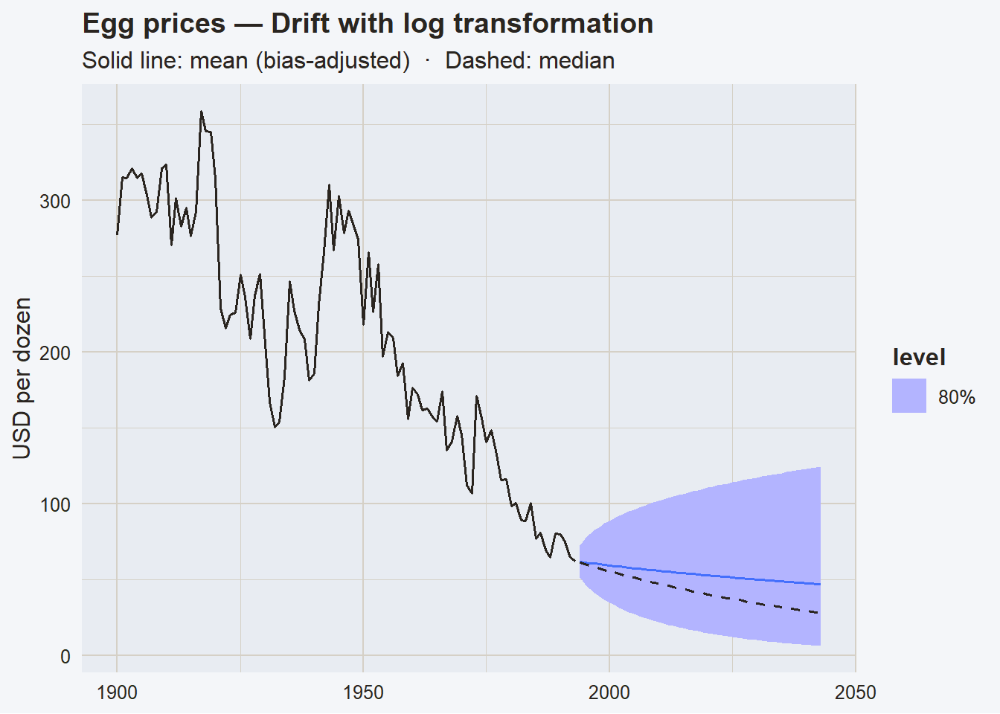](model_diagnostics_files/figure-html/eggs-plot-render-1.png)

[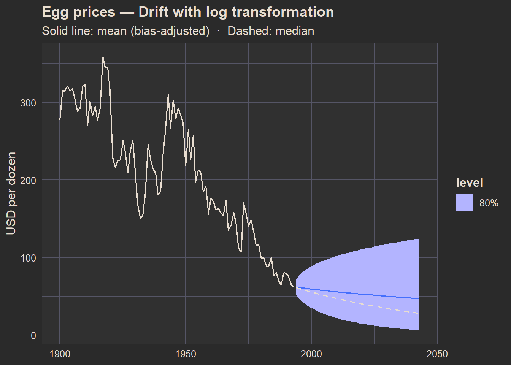](model_diagnostics_files/figure-html/eggs-plot-render-2.png)

> **NOTE:**
>
> For a single series the difference is usually small. It becomes important when **aggregating forecasts** — summing store-level forecasts into a regional total, for example. In that case, using medians instead of means introduces a systematic downward bias in the aggregate. We will revisit this in Module 4 when we cover hierarchical forecasting.

# 4 Bootstrap prediction intervals

### 4.0.1 When normality fails

All the prediction intervals above assume that forecast errors are **normally distributed**. When residuals are skewed or heavy-tailed, this assumption breaks down and the intervals are poorly calibrated.

**Bootstrapping** means resampling **with replacement** from the observed data and treating the empirical distribution as a stand-in for the unknown true distribution.

Here the observed data we resample are the model’s historical residuals: if the model is correctly specified they are approximately independent draws from the error distribution, whatever shape it has.

The key observation is that we can always write:

y_t = \hat{y}\_{t\|t-1} + e_t

so a future observation can be simulated as:

y\_{T+1} = \hat{y}\_{T+1\|T} + e\_{T+1}

Since the errors are uncorrelated, we can substitute e\_{T+1} with a **randomly resampled (with replacement)** historical residual. Repeating this for y\_{T+2}, y\_{T+3}, \ldots gives one possible future path. Do it thousands of times and you have a full distribution of futures — no normality required.

> **TIP:**
>
> The word *bootstrap* will return in Module 4 with a different object being resampled: there we bootstrap **entire series** (via STL and the remainder component) to build bagged forecasts. Here we bootstrap **residuals** to build prediction intervals. Same idea, different target.

### 4.0.2 Many possible futures

Each path is built by resampling a historical residual at every step. Flip through the tabs to watch a distribution emerge from individual paths.

## 5 paths

Five possible futures for Google’s closing price.

[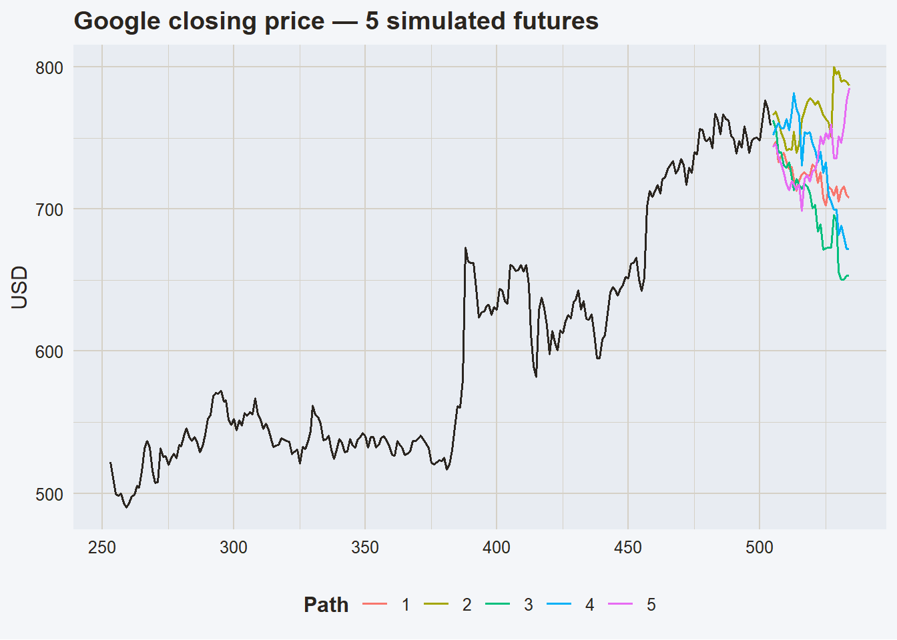](model_diagnostics_files/figure-html/google-sim-5-html-render-1.png)

[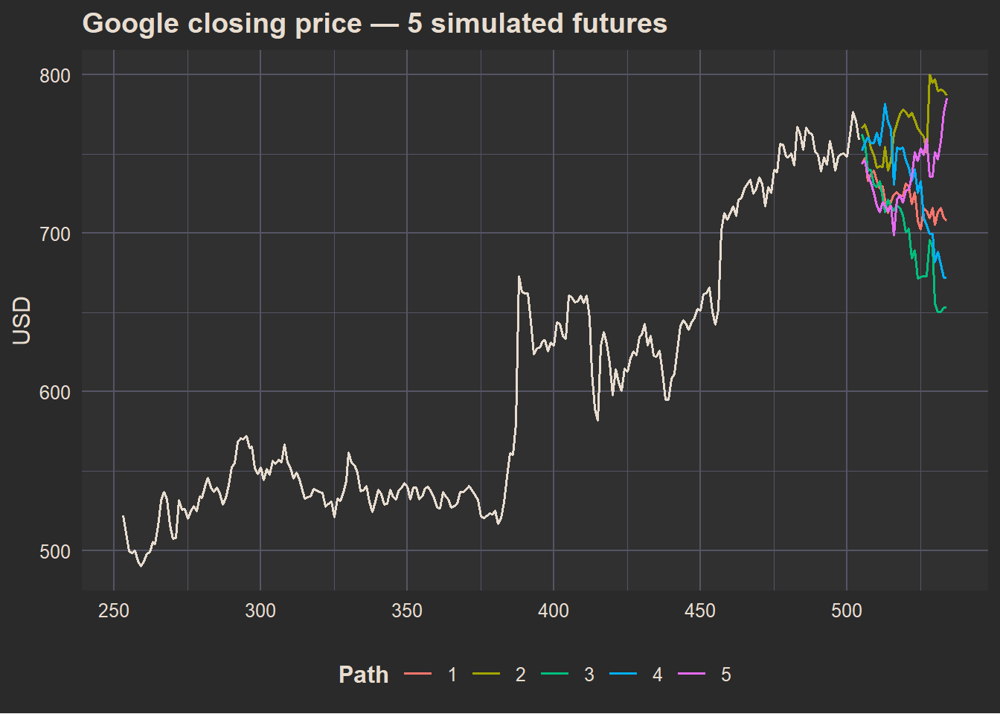](model_diagnostics_files/figure-html/google-sim-5-html-render-2.png)

## 50 paths

Fifty paths. The first five are the same as in the previous tab.

[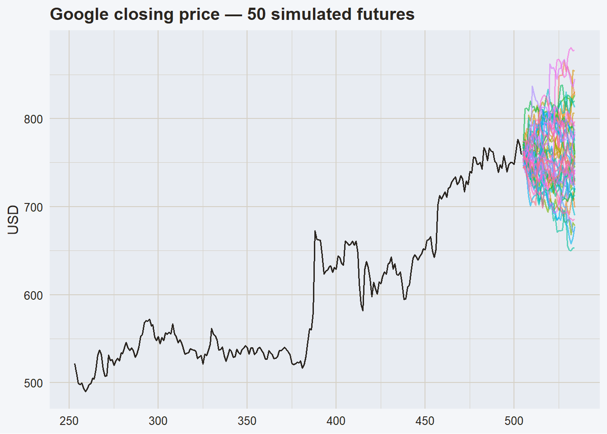](model_diagnostics_files/figure-html/google-sim-50-html-render-1.png)

[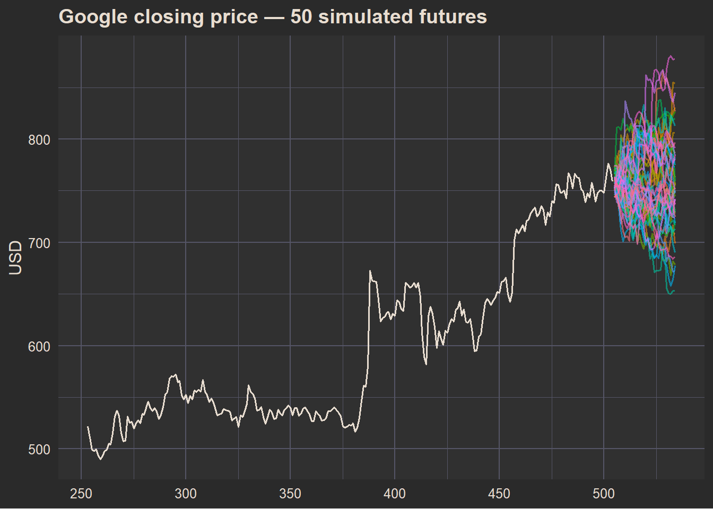](model_diagnostics_files/figure-html/google-sim-50-html-render-2.png)

## 500 paths

Five hundred paths. A distribution is taking shape.

[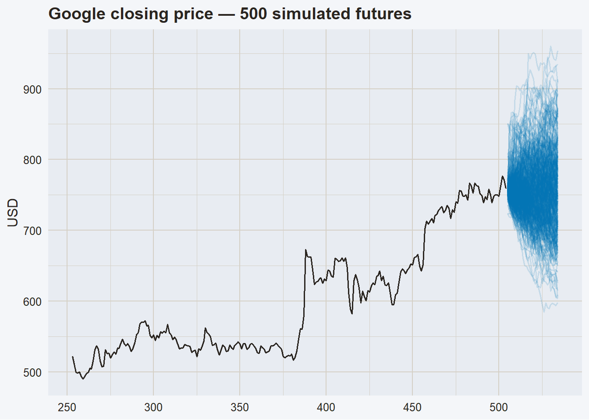](model_diagnostics_files/figure-html/google-sim-500-html-render-1.png)

[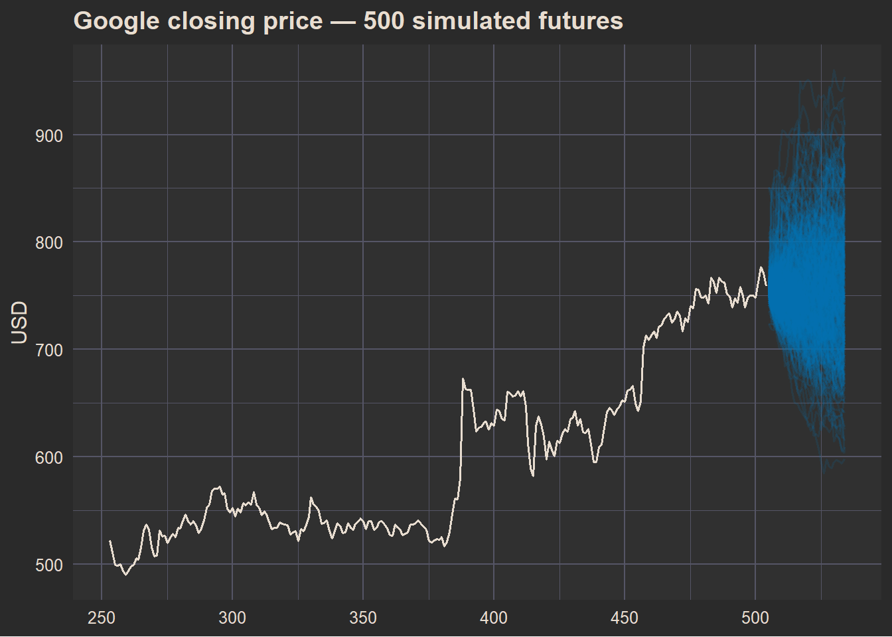](model_diagnostics_files/figure-html/google-sim-500-html-render-2.png)

## 500 paths + interval

Take the 2.5th and 97.5th percentiles at each horizon and you have the bootstrap prediction interval (dashed) around the bootstrap mean (solid).

[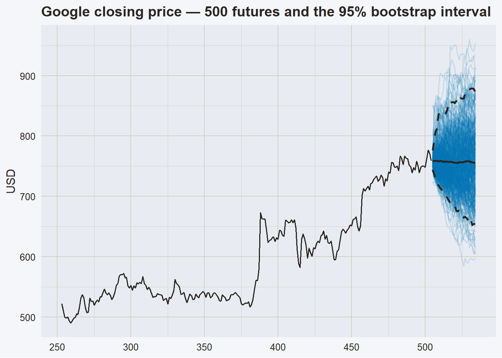](model_diagnostics_files/figure-html/google-sim-pi-html-render-1.png)

[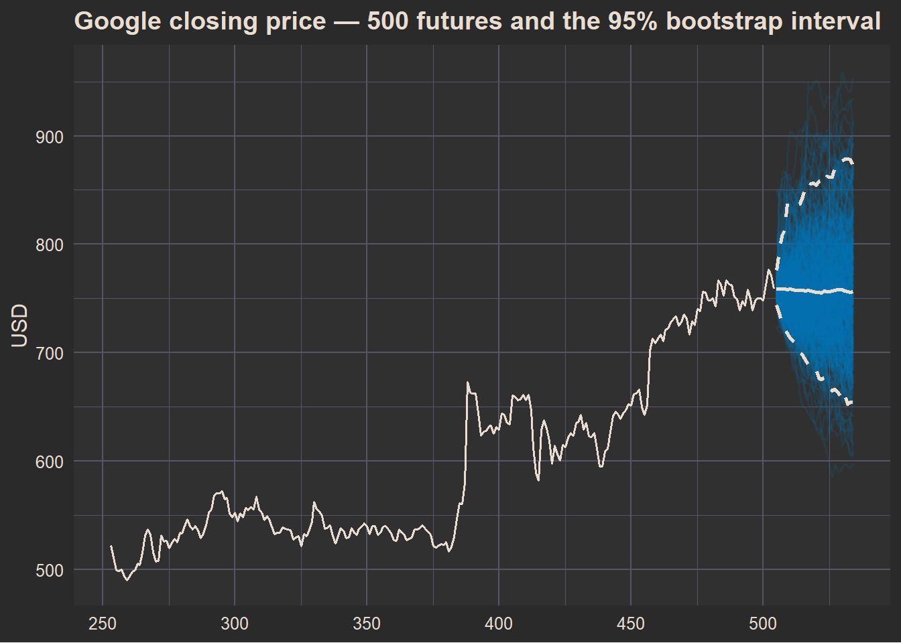](model_diagnostics_files/figure-html/google-sim-pi-html-render-2.png)

### 4.0.3 From paths to intervals

Running this hundreds or thousands of times and taking percentiles of the simulated paths gives the **bootstrap prediction interval**. `forecast()` does this in one step:

Code

``` numberSource
google_fc_boot <- google_fit |>
  forecast(
    h         = 30,
    bootstrap = TRUE,   #<1>
    times     = 500,    #<2>
    seed      = 123     #<3>
  )
```

1.  `bootstrap = TRUE` switches from the analytical normal interval to the resampling-based one.
2.  Number of simulated paths — 500 here, matching the paths drawn on the previous slides. More gives smoother intervals at higher computational cost.
3.  Fixed seed so the interval is reproducible across renders.

Code

``` r
google_bootstrap_plot_p <- google_fc_boot |>
  autoplot(google_2015, level = 95) +   #<1>
  labs(
    title = "Google closing stock price — bootstrap 95% interval",
    y = "USD", x = NULL
  )
```

1.  A bootstrap fable plots exactly like a normal one — `autoplot()` reads the interval from the sample distribution instead of a normal formula.

[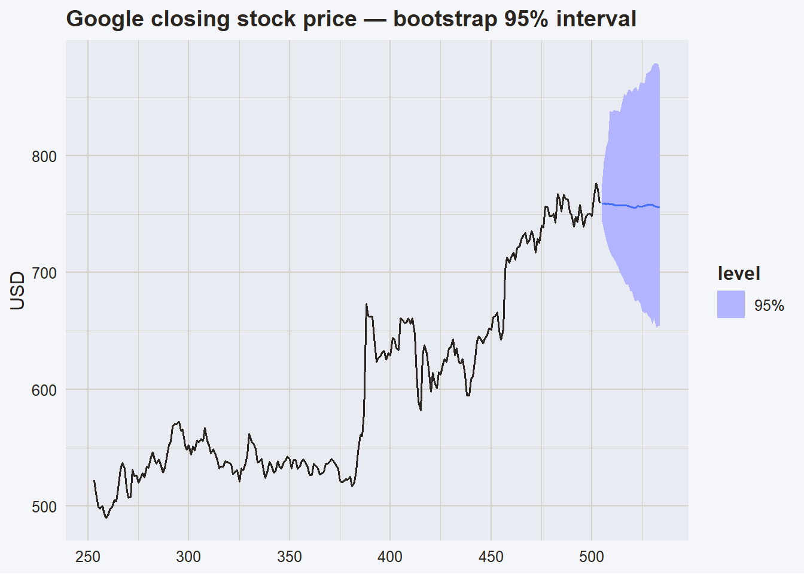](model_diagnostics_files/figure-html/google-bootstrap-plot-render-1.png)

[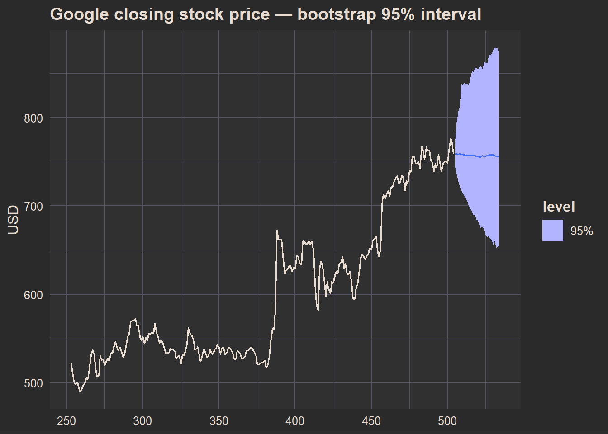](model_diagnostics_files/figure-html/google-bootstrap-plot-render-2.png)

> **TIP:**
>
> Use bootstrap intervals when `gg_tsresiduals()` shows clearly non-normal residuals — heavy tails or marked skew. For series where residuals are roughly symmetric, the additional computational cost rarely changes the conclusion.

# 5 Using STL Decomposition for forecasting with `decomposition_model()`

### 5.0.1 The idea

STL (covered in [1.2](../../../../docs/modules/module_1/02_ts_dcmp/ts_dcmp.llms.md)) decomposes a series into trend-cycle, seasonal, and remainder components. The benchmarks (covered in [1.3](../../../../docs/modules/module_1/03_fcst/forecasting.llms.md)) each handle one aspect of the series well.

The additive STL decomposition is

y_t = T_t + S_t + R_t

For forecasting we regroup it. Everything that is not seasonal goes into one term:

y_t = S_t + A_t, \qquad A_t = T_t + R_t

A_t is the **seasonally adjusted** series. We now have two components, and we forecast each one with its own model:

\hat{y}\_{T+h\|T} = \hat{S}\_{T+h\|T} + \hat{A}\_{T+h\|T}

`decomposition_model()` turns this into a pipeline:

1.  Apply STL to split y_t into S_t and A_t
2.  Forecast the **seasonal component** S_t — by default with SNAIVE, which just repeats the last seasonal cycle
3.  Forecast the **seasonally adjusted series** A_t with a model of your choice (here: Drift)
4.  Add the two forecasts back together

| Component | Notation | `fable` column |
|----|----|----|
| Series | y_t | the response variable (`Gas`) |
| Seasonal | S_t | `season_year`, `season_week`, `season_day`, … — one per seasonal period detected by STL |
| Seasonally adjusted | A_t | `season_adjust` |

The seasonal column is named after its period. Quarterly and monthly data give `season_year`; daily data can give `season_week` and `season_year` at the same time — we return to that in Module 4.

> **NOTE:**
>
> The reconstruction is additive in the decomposition scale. If the STL was applied to a transformed series, the reconstruction happens before back-transformation.

### 5.0.2 Syntax

The spec is defined once as a standalone object and passed into `model()`:

Code

``` r
stl_spec <- decomposition_model(                  #<1>
  STL(Gas ~ trend() + season(), robust = TRUE),   #<2>
  SNAIVE(season_year),                            #<3>
  RW(season_adjust ~ drift())                     #<4>
)

gas_fit_dcmp <- gas_train |>
  model(stl_snaive_drift = stl_spec)              #<5>
```

1.  `decomposition_model()` wraps a decomposition method and one or more component models into a single reusable spec.
2.  STL decomposition — same syntax as in 1.2.
3.  SNAIVE on `season_year` forecasts S_t. This line is optional — see the callout below.
4.  Drift on `season_adjust` handles the seasonally adjusted series. `fable` reconstructs the final forecast by adding the two component forecasts.
5.  We still need to put the decomposition model inside a `mable` with the `model()` function.

> **NOTE:**
>
> No. If you leave out the model for a seasonal component, `decomposition_model()` forecasts it with `SNAIVE()` automatically. The documentation puts it this way: all non-seasonal components must be specified, and any unspecified seasonal components are forecast using seasonal naive. Writing `SNAIVE(season_year)` explicitly, as we do here, changes nothing in the result — it just makes visible that the seasonal part is being modelled too, and shows where you would plug in a different model for it.
>
> Code
>
> ``` r
> decomposition_model(STL(Gas ~ trend() + season(), robust = TRUE), RW(season_adjust ~ drift()))
> ```

### 5.0.3 With a transformation

Box-Cox goes inside the STL spec — declared once, inherited everywhere:

Code

``` numberSource
stl_spec_bc <- decomposition_model(
  STL(box_cox(Gas, lambda) ~ trend() + season(), robust = TRUE), #<1>
  SNAIVE(season_year),
  RW(season_adjust ~ drift())
)

gas_fit_dcmp_bc <- gas_train |>
  model(stl_bc = stl_spec_bc)
```

1.  The only difference from `stl_spec` is `box_cox()` in the STL call. All component models and the final back-transformation inherit it automatically.

Code

``` r
gas_fc_dcmp <- bind_rows(                          #<1>
  gas_fit_dcmp    |> forecast(h = nrow(gas_test)),
  gas_fit_dcmp_bc |> forecast(h = nrow(gas_test))  #<2>
)
```

1.  The two decomposition models live in separate mables, so forecast each and stack the fables.
2.  Same horizon as every other model in this document, so the accuracy tables are comparable.

### 5.0.4 Final comparison

All models side by side:

### 5.0.5 Accuracy table

Code

``` r
gas_accu <- bind_rows(
  gas_fc      |> filter(.model %in% c("snaive", "drift")) |> accuracy(aus_production),
  gas_fc_bc   |> accuracy(aus_production),
  gas_fc_dcmp |> accuracy(aus_production)      #<1>
) |>
  select(.model, RMSE, MAE, MAPE, MASE, RMSSE) |>
  arrange(RMSSE)                               #<2>

gas_accu
```

1.  All six Module 1 models, evaluated on the same test set with the full series passed to `accuracy()`.
2.  Sorted by RMSSE: the first row is the baseline every later model has to beat.

> **IMPORTANT:**
>
> The best-performing model from this table is your benchmark for the rest of the course. Every model we build in Modules 2, 3, and 4 must beat this number to justify its additional complexity.

### 5.0.6 Refit on all data

Because the spec is a standalone object, refitting on the full dataset reuses it directly — no duplication:

[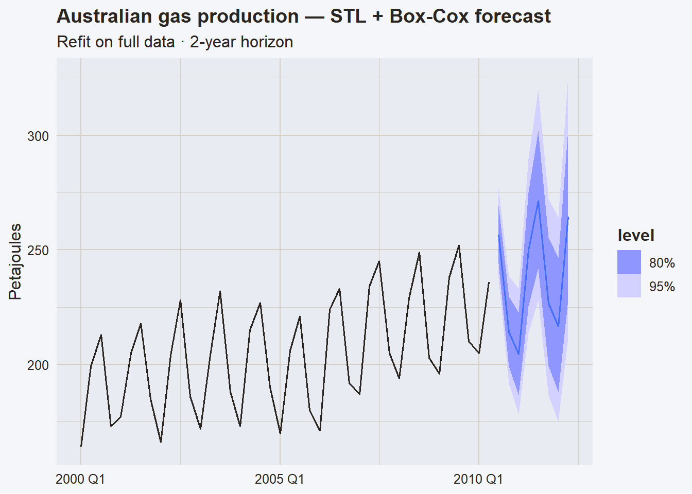](model_diagnostics_files/figure-html/gas-final-refit-render-1.png)

[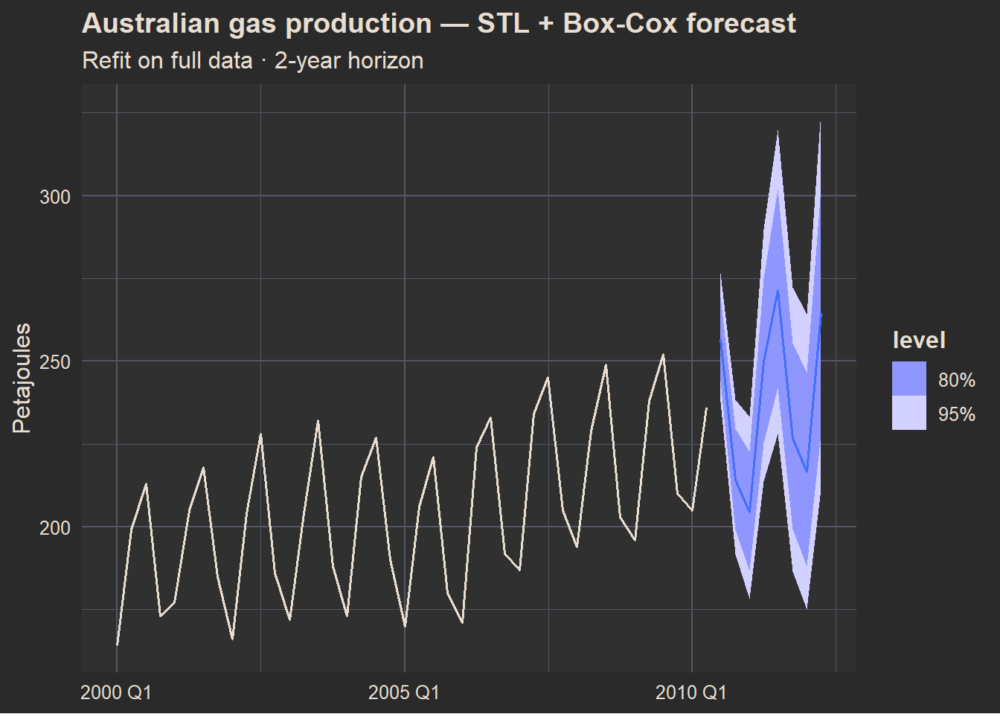](model_diagnostics_files/figure-html/gas-final-refit-render-2.png)

Code

``` numberSource
gas_final_fit <- aus_production |>
  model(stl_bc = stl_spec_bc)   #<1>

gas_final_fc <- gas_final_fit |>
  forecast(h = "2 years")

gas_final_refit_p <- gas_final_fc |>
  autoplot(aus_production |> filter_index("2000 Q1" ~ .)) +
  labs(
    title = "Australian gas production — STL + Box-Cox forecast",
    subtitle = "Refit on full data · 2-year horizon",
    y = "Petajoules", x = NULL
  )
```

1.  Same spec, full data — no need to rewrite the model definition.

> **NOTE:**
>
> You now have a principled, validated baseline model. It handles trend, seasonality, and non-constant variance. Modules 2 onward will replace or enhance individual components — but the workflow stays the same: split, fit, diagnose, compare, refit.

Back to top
