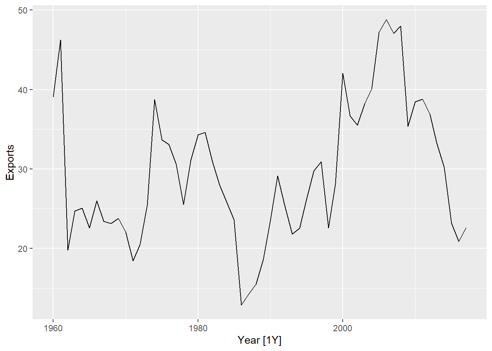
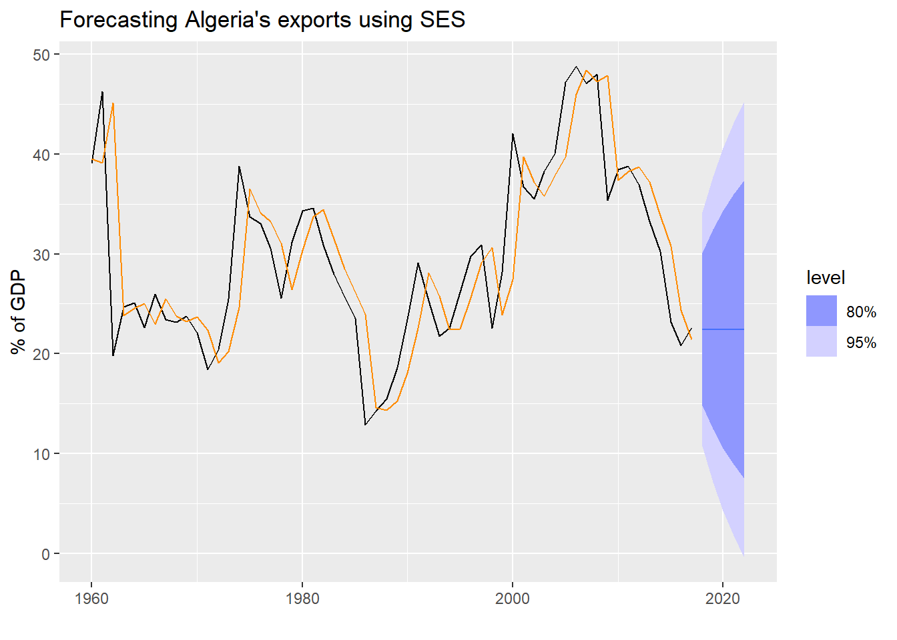
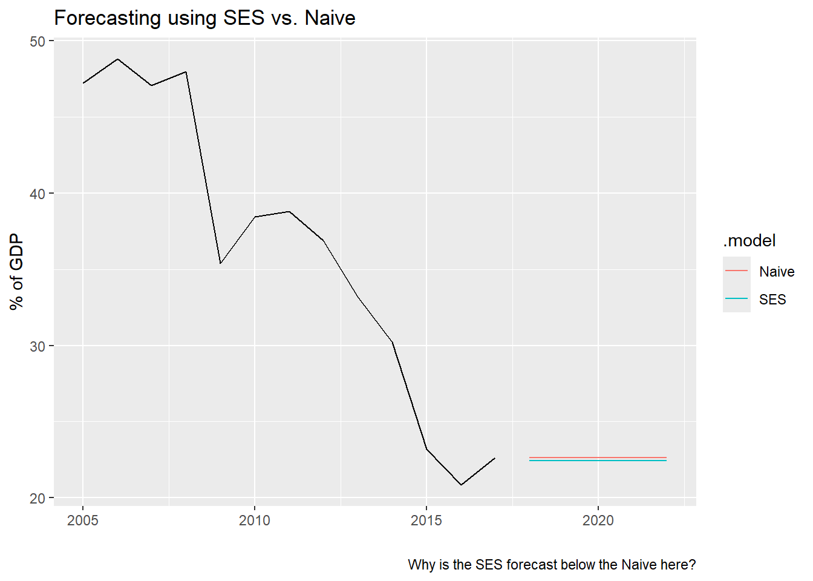
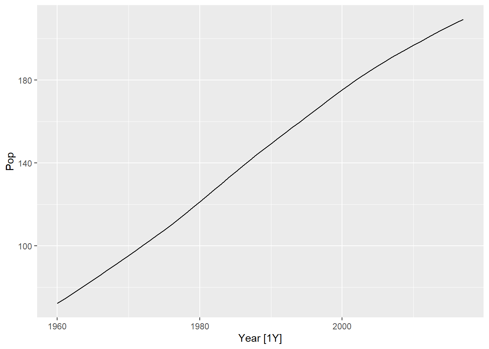
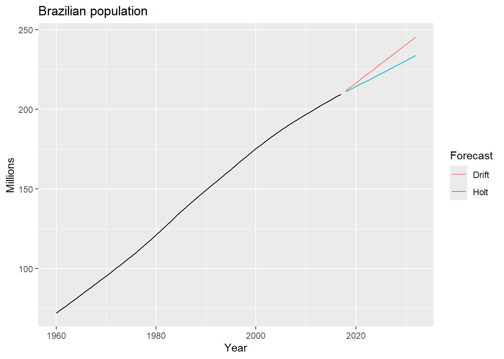
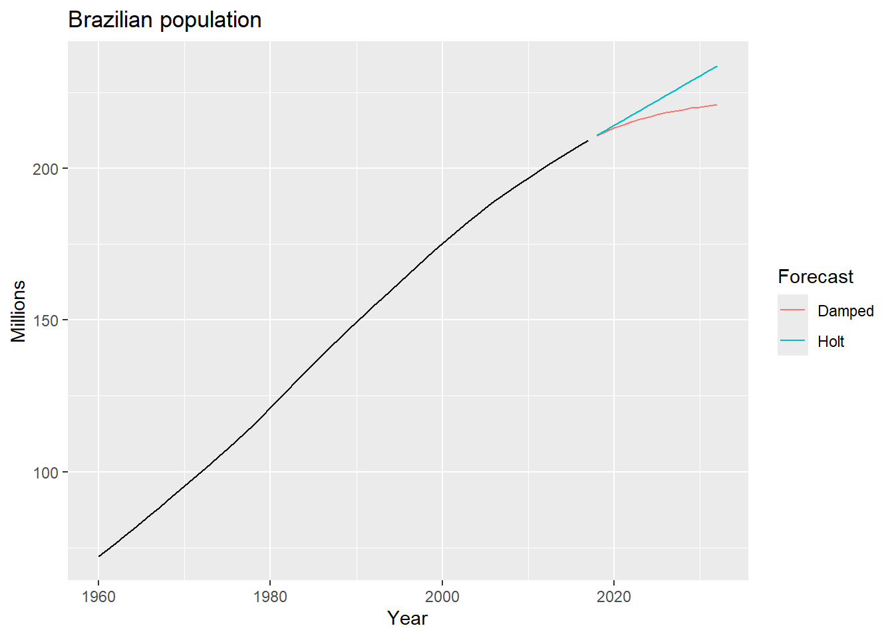
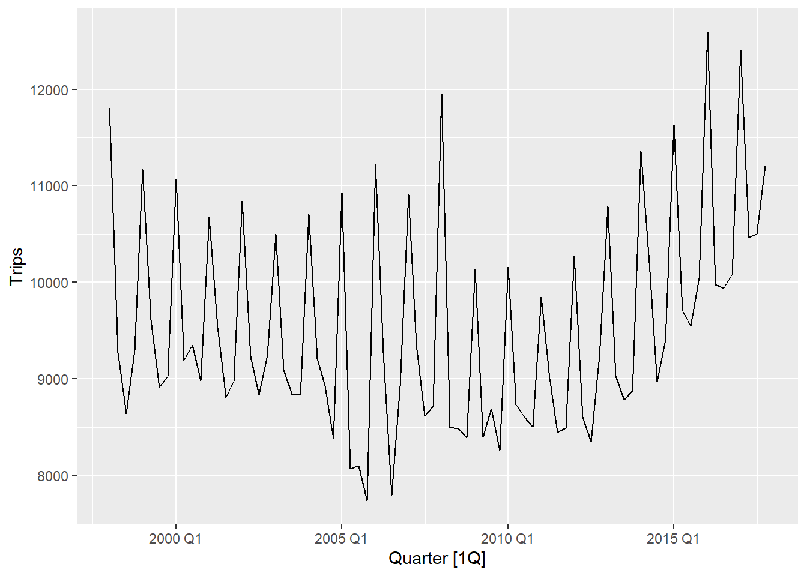
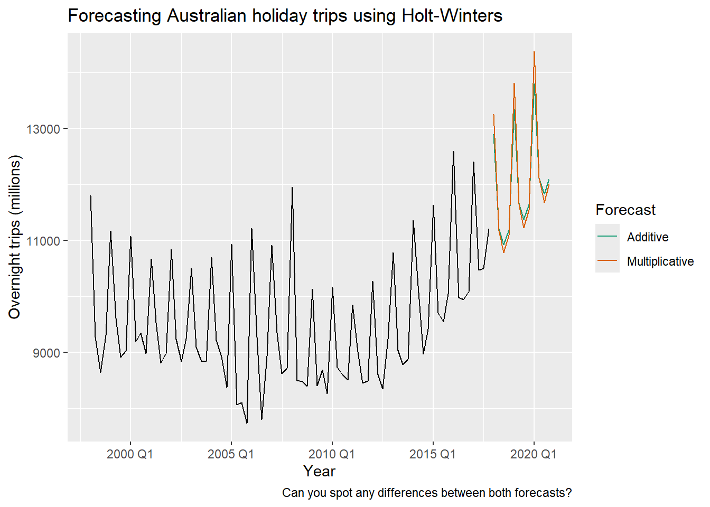
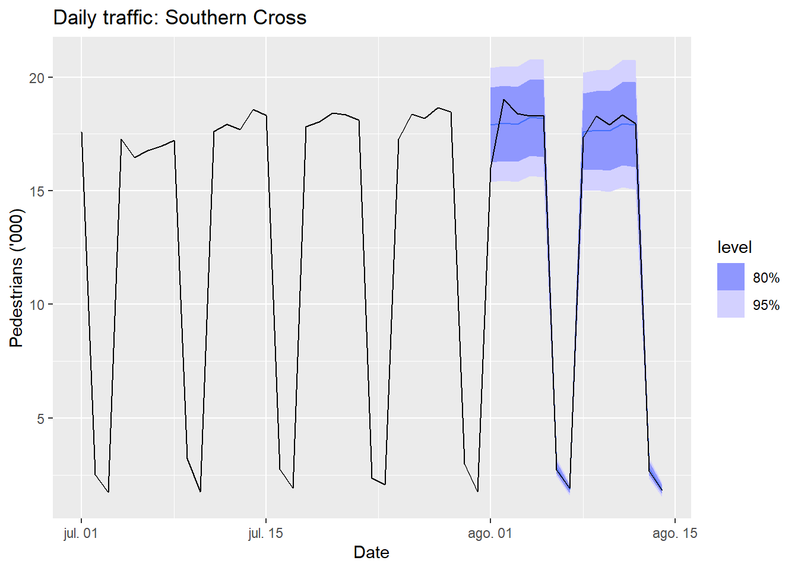

# Exponential smoothing

Modified

May 26, 2026

## 0.1 Introduction

In Module 1, you built your **first complete forecasting model**. That model used:

- **STL decomposition** to separate trend-cycle and seasonal patterns.
- **Drift** to forecast the trend-cycle component (assuming the last observed trend continues linearly).
- **SNAIVE** to forecast the seasonal component (assuming last year’s season repeats).

> **NOTE:**
>
> Code
>
> ``` r
> tsibble |>
>   model(
>     baseline = decomposition_model(
>       STL(y ~ trend(window = NULL) + season(window = "periodic"), robust = TRUE),
>       RW(season_adjust ~ drift()),
>       SNAIVE(season_year)
>     )
>   )
> ```
>
> This is your **benchmark**. Every model we build from now on must beat it.

That’s a solid start — but the Drift method is very simple: it just extrapolates the last observed average growth rate forever. **What if the trend is slowing down? Accelerating? Or changing direction?**

This module introduces **Exponential Smoothing (ETS)** models — a smarter way to model the trend-cycle component (and eventually, the seasonal component too).

> **TIP:**
>
> | Component     | Module 1 (Baseline) |    Module 2 (ETS upgrade)    |
> |:--------------|:-------------------:|:----------------------------:|
> | Trend-cycle   | Drift (RW + drift)  | **ETS** (adaptive smoothing) |
> | Seasonal      |       SNAIVE        |       SNAIVE (for now)       |
> | Decomposition |         STL         |        STL (for now)         |
>
> We’re making the trend-cycle component **smarter**. Same architecture, better engine.

- Exponential smoothing methods are still relatively simple: they’re simply weighted averages from historical data.

  - However, these forecasting methods are widely used in practice, and they can be very effective.

- The exponential smoothing method is a compromise between the mean and naïve methods. It uses all historical data, but it assigns exponentially decreasing weights to older observations.

  - In the *mean* method, all observations are weighted equally (all have the same importance), while in the *naïve* method, only the most recent observation is used for forecasting. (we ignore all previous observations).

- The smoothing parameter \alpha controls the rate of decrease:

  - when \alpha is close to 1, the method behaves like the naïve method, giving more weight to recent observations;
  - when \alpha is close to 0, it behaves like the mean method, giving more equal weight to all observations.

\hat{y}\_{T+1 \| T}= \alpha y\_{T} + \alpha(1-\alpha) y\_{T-1} + \alpha(1-\alpha)^{2} y\_{T-2} + \ldots

where 0\leq \alpha \leq1 is the smoothing parameter.

|          | \alpha = 0.2 | \alpha = 0.4 | \alpha = 0.6 | \alpha = 0.8 |
|----------|:------------:|:------------:|:------------:|:------------:|
| y_t      |    0.2000    |    0.4000    |    0.6000    |    0.8000    |
| y\_{t-1} |    0.1600    |    0.2400    |    0.2400    |    0.1600    |
| y\_{t-2} |    0.1280    |    0.1440    |    0.0960    |    0.0320    |
| y\_{t-3} |    0.1024    |    0.0864    |    0.0384    |    0.0064    |
| y\_{t-4} |    0.0819    |    0.0518    |    0.0154    |    0.0013    |
| y\_{t-5} |    0.0655    |    0.0311    |    0.0061    |    0.0003    |

Table 1: Weights for different values of \alpha

- \alpha can be thought of as the *memory* of the time series: The smaller the value of \alpha, the longer the memory (i.e., the more past observations are taken into account).

- Conversely, a larger value of \alpha means a shorter memory, with more emphasis on recent observations. See [Table 1](#tbl-ets_alpha_weights) for some examples.

# 1 Exponential smoothing methods

## 1.1 Simple exponential smoothing (SES)

\begin{aligned} \text{Forecast equation} \quad & \hat{y}\_{t+h\|t} = \ell_t \\ \text{Smoothing equation} \quad & \ell_t = \alpha y_t + (1-\alpha)\ell\_{t-1} \end{aligned}

where \ell_t is the level at time t.

> **NOTE:**
>
> SES has a flat forecast function, so it is appropriate for data with **no trend** or **seasonal** pattern.

#### 1.1.0.1 Example: Forecasting Algeria’s exports

Code

``` r
algeria_economy <- global_economy |>
  filter(Country == "Algeria")
  
algeria_economy |> 
  autoplot(Exports)
```

[](ets_files/figure-html/alg-plot-1.png)

Code

``` r
alg_fit <- algeria_economy |>
  model(
    SES = ETS(Exports ~ error("A") + trend("N") + season("N")), #<1>
    Naive = NAIVE(Exports)
  )

alg_fc <- alg_fit |>
  forecast(h = 5)
```

1.  We specify `trend("N")` and `season("N")` to indicate that we want a simple exponential smoothing (SES) model, which assumes no trend and no seasonality. The model will estimate the smoothing parameter \alpha automatically.

> **TIP:**
>
> The **mean** and **naïve** methods are typically the best fit as benchmark methods when using SES.

> **NOTE:**
>
> Code
>
> ``` r
> alg_fit |> 
>   select(SES) |> 
>   report()        #<1>
> ```
>
> 1.  The `report()` function allows us to see a model’s report (the time series modeled, the model used, the estimated parameters, and more). It needs a 1 \times 1 dimension `mable`[^1].
>
>     Series: Exports 
>     Model: ETS(A,N,N) 
>       Smoothing parameters:
>         alpha = 0.8399875 
>
>       Initial states:
>        l[0]
>      39.539
>
>       sigma^2:  35.6301
>
>          AIC     AICc      BIC 
>     446.7154 447.1599 452.8968 

[](ets_files/figure-html/ses-plot-1.png)

Comparing the SES and Naive forecasts:

[](ets_files/figure-html/ses-v-naive-plot-1.png)

## 1.2 Methods with trend

### 1.2.1 Holt’s linear trend

We can extend SES models to allow our forecasts to include trend in the data. We need to add a new smoothing parameter \beta^\*, and its corresponding smoothing equation:

\begin{aligned} \text{Forecast equation} \quad & \hat{y}\_{t+h\|t} = \ell_t + hb_t \\ \text{Level equation} \quad & \ell_t = \alpha y_t + (1-\alpha)\ell\_{t-1}\\ \text{Trend equation} \quad & b_t = \beta^\*(\ell_t - \ell\_{t-1}) + (1-\beta^\*)b\_{t-1} \end{aligned}

where b_t is the growth (or slope) at time t.

> **TIP:**
>
> - Holt’s linear trend method is appropriate for data with a **linear trend** but **no seasonal** pattern.
> - The proper benchmark method to compare against is the **drift** method.

Let’s see an example using Holt’s linear trend method to forecast Brazil’s population.

#### 1.2.1.1 Example: Forecasting Brazil’s population

Code

``` r
bra_economy <- global_economy |> 
  filter(Code == "BRA") |> 
  mutate(Pop = Population / 1e6)

bra_economy |> 
  autoplot(Pop)
```

[](ets_files/figure-html/bra-pop-1.png)

Code

``` r
bra_fit <- bra_economy |> 
  model(
    Holt  = ETS(Pop ~ error("A") + trend("A") + season("N")), #<1>
    Drift = RW(Pop ~ drift())
  )

bra_fit |>  
  select(Holt) |>  
  report()

bra_fc <- bra_fit |>  
  forecast(h = 15)

bra_fc |> 
  autoplot(bra_economy, level = NULL) +
  labs(title = "Brazilian population",
       y = "Millions") +
  guides(colour = guide_legend(title = "Forecast"))
```

1.  We specify `trend("A")` to indicate that we want a linear trend. The model will estimate the smoothing parameters \alpha and \beta^\* automatically.

[](ets_files/figure-html/holt_full-1.png)

    Series: Pop 
    Model: ETS(A,A,N) 
      Smoothing parameters:
        alpha = 0.9999 
        beta  = 0.9998999 

      Initial states:
         l[0]     b[0]
     70.06297 2.132884

      sigma^2:  0.0021

          AIC      AICc       BIC 
    -115.2553 -114.1014 -104.9531 

### 1.2.2 Damped trend

- Holt’s linear trend method assume that the trend will continue indefinitely at the same rate. However, in many real-world scenarios, this assumption may not hold true. This methods tend to overestimate (*or underestimate*) long-term forecasts when the trend is strong.

- We can include a damping parameter \phi, which reduces the trend over time.

\begin{aligned} \text{Forecast equation} \quad & \hat{y}\_{t+h\|t} = \ell_t + (\phi + \phi^2 + \ldots + \phi^h) b_t \\ \text{Level equation} \quad & \ell_t = \alpha y_t + (1 - \alpha) (\ell\_{t-1} + \phi b\_{t-1}) \\ \text{Trend equation} \quad & b_t = \beta^\*(\ell_t-\ell\_{t-1}) + (1-\beta^\*)\phi b\_{t-1} \end{aligned}

where 0 \< \phi \< 1[^2] is the damping parameter.

> **CAUTION:**
>
> - If \phi = 1, the model reduces to Holt’s linear trend method, meaning the trend continues indefinitely at the same rate.
> - If \phi = 0, the trend component is completely eliminated, and the model behaves like simple exponential smoothing (SES), where forecasts are based solely on the level component without any trend influence.

#### 1.2.2.1 Example: Forecasting Brazil’s population (continued)

Code

``` r
bra_economy |> 
  model(
    Holt   = ETS(Pop ~ error("A") + trend("A") + season("N")),
    Damped = ETS(Pop ~ error("A") + trend("Ad", phi = 0.9) + season("N")) #<1>
  ) |> 
  forecast(h = 15) |> 
  autoplot(bra_economy, level = NULL) +
  labs(title = "Brazilian population",
       y = "Millions") +
  guides(colour = guide_legend(title = "Forecast"))
```

1.  We specify `trend("Ad")` to indicate that we want a damped trend, and `phi = 0.9` sets the damping parameter to 0.9. We could also let the model estimate \phi automatically by omitting the `phi` argument.

[](ets_files/figure-html/damped_full-1.png)

## 1.3 Methods with seasonality

### 1.3.1 Holt-Winters method

#### 1.3.1.1 HW - Additive

\begin{aligned} \text{Forecast equation} \quad & \hat{y}\_{t+h\|t} = \ell_t + hb_t + s\_{t+h-m(k+1)} \\ \text{Level equation} \quad & \ell_t = \alpha (y_t - s\_{t-m}) + (1 - \alpha) (\ell\_{t-1} + b\_{t-1}) \\ \text{Trend equation} \quad & b_t = \beta^\*(\ell_t-\ell\_{t-1}) + (1-\beta^\*) b\_{t-1} \\ \text{Seasonal equation} \quad & s_t = \gamma(y_t - \ell\_{t-1} - b\_{t-1}) + (1-\gamma)s\_{t-m} \end{aligned}

where s_t is the seasonal component at time t, m is the period of the seasonality[^3], and k = \lfloor (h-1)/m \rfloor.

#### 1.3.1.2 HW - Multiplicative

\begin{aligned} \text{Forecast equation} \quad & \hat{y}\_{t+h\|t} = (\ell_t + hb_t) s\_{t+h-m(k+1)} \\ \text{Level equation} \quad & \ell_t = \alpha \frac{y_t}{s\_{t-m}} + (1 - \alpha)(\ell\_{t-1} + b\_{t-1}) \\ \text{Trend equation} \quad & b_t = \beta^\*(\ell_t-\ell\_{t-1}) + (1-\beta^\*) b\_{t-1} \\ \text{Seasonal equation} \quad & s_t = \gamma \frac{y_t}{\ell\_{t-1} + b\_{t-1}} + (1-\gamma)s\_{t-m} \end{aligned}

> **TIP:**
>
> - Holt-Winters methods are appropriate for data with a **trend** and **seasonal** pattern.
> - Use an **additive model** when the seasonal fluctuations are roughly constant over time.
> - Use a **multiplicative model** when the seasonal variation increase or decrease over time.
> - The proper benchmark method to compare against is the **seasonal naïve** method. for seasonal data.
>   - If the data contains both **trend** and **seasonality**, then A **decomposition model** using **STL**[^4] + **Drift**[^5] + **SNAIVE**[^6] is often a strong competitor.

#### 1.3.1.3 Example: Forecasting Australian holiday trips

We will forecast the number of holiday trips in Australia using additive and multiplicative Holt-Winters methods.

Code

``` r
aus_holidays <- tourism |> 
  filter(Purpose == "Holiday") |>
  summarise(Trips = sum(Trips))

aus_holidays |>
  autoplot(Trips)
```

1.  We specify `error("A")` and `season("A")` to indicate that we want an additive Holt-Winters model. We will usually set the `error()` according to the `season()` type.
2.  We specify `error("M")` and `season("M")` to indicate that we want a multiplicative Holt-Winters model. Both models will estimate the smoothing parameters \alpha, \beta^\*, and \gamma automatically.

[](ets_files/figure-html/hw_full-1.png)

Code

``` r
aus_fit <- aus_holidays |> 
  model(
    Additive       = ETS(Trips ~ error("A") + trend("A") + season("A")), #<1>
    Multiplicative = ETS(Trips ~ error("M") + trend("A") + season("M"))  #<2>
  )
  
aus_fc <- aus_fit |> 
  forecast(h = "3 years")

aus_fc |> 
  autoplot(aus_holidays, level = NULL) + xlab("Year") +
  labs(
    title   = "Forecasting Australian holiday trips using Holt-Winters",
    y       = "Overnight trips (millions)",
    caption = "Can you spot any differences between both forecasts?"
  ) +
  scale_color_brewer(type = "qual", palette = "Dark2") +
  guides(colour = guide_legend(title = "Forecast"))
```

[](ets_files/figure-html/hw_full-2.png)

> **NOTE:**
>
> Code
>
> ``` r
> aus_fit |> 
>   tidy()  #<1>
> ```
>
> 1.  The `tidy()` function allows us to see the estimated parameters of each model in a [tidy](https://r4ds.hadley.nz/data-tidy.html) table.

### 1.3.2 Holt-Winters’ damped method

- Similar to Holt’s linear trend method, we can also include a damping parameter \phi in the Holt-Winters method to reduce the trend over time.
  - This can be done on both additive or multiplicative seasonal models.
- A configuration that has proven to be robust and accurate in practice is to use a multiplicative seasonal component with a damped trend.

\begin{aligned} \text{Forecast equation} \quad & \hat{y}\_{t+h\|t} = \[\ell_t +(\phi + \phi^2 + \ldots + \phi^h)b_t\] s\_{t+h-m(k+1)} \\ \text{Level equation} \quad & \ell_t = \alpha \frac{y_t}{s\_{t-m}} + (1 - \alpha)(\ell\_{t-1} + b\_{t-1}) \\ \text{Trend equation} \quad & b_t = \beta^\*(\ell_t-\ell\_{t-1}) + (1-\beta^\*) \phi b\_{t-1} \\ \text{Seasonal equation} \quad & s_t = \gamma \frac{y_t}{\ell\_{t-1} + \phi b\_{t-1}} + (1-\gamma)s\_{t-m} \end{aligned}

#### 1.3.2.1 Example: Forecasting daily pedestrian traffic

Code

``` numberSource
sth_cross_ped <- pedestrian |>
  filter(Date >= "2016-07-01",
         Sensor == "Southern Cross Station") |>
  index_by(Date) |>
  summarise(Count = sum(Count)/1000)

sth_cross_ped |>
  filter(Date <= "2016-07-31") |>
  model(
    hw = ETS(Count ~ error("M") + trend("Ad") + season("M"))
  ) |>
  forecast(h = "2 weeks") |>
  autoplot(sth_cross_ped |> filter(Date <= "2016-08-14")) +
  labs(title = "Daily traffic: Southern Cross",
       y="Pedestrians ('000)")
```

[](ets_files/figure-html/hw_damped-1.png)

> **TIP:**
>
> The setup `ETS(y ~ error("M") + trend("Ad") + season("M"))` is often a robust choice for seasonal data with trend.

## 1.4 Automatic ETS selection

- Using `fable`, we can automatically select the best ETS model for our data using the `ETS()` function. We achieve this by **not specifying** the error, trend, or seasonal components.
- You can also get a *semi-automatic* selection by specifying some components and leaving others to be selected automatically, or by providing a set of possible values for a component.
- Automatic selection is especially useful when we have multiple time series to model, as it allows us to fit different ETS models to each series.

#### 1.4.0.1 Example: Forecasting daily pedestrian traffic (continued)

Code

``` r
ped_fit <- pedestrian |> 
  filter(
    Date >= "2016-07-01",
    Sensor != "Birrarung Marr"
  ) |> 
  index_by(Date) |>
  group_by_key() |> 
  summarise(Count = sum(Count)/1000) |> 
  model(
    ETS_auto       = ETS(Count),                       #<1>
    ets_with_trend = ETS(Count ~ trend(c("A", "Ad"))), #<2>
  )

ped_fit                                                #<3>
```

1.  Leaving the right-hand side of the formula empty allows `fable` to automatically select the best ETS model for each time series.
2.  Here, we specify that the trend component can be either additive or damped, while the error and seasonal components will be selected automatically.
3.  The output shows the selected model for each sensor.

## 1.5 The lineup of exponential smoothing methods

| Trend component           | N (None) | A (Additive) | M (Multiplicative) |
|:--------------------------|:--------:|:------------:|:------------------:|
| N **(None)**              |  (N,N),  |    (N,A)     |       (N,M)        |
| A **(Additive)**          |  (A,N),  |    (A,A)     |       (A,M)        |
| A_d **(Additive damped)** | (A_d,N), |   (A_d, A)   |      (A_d,M)       |

Table 2: ETS component combinations (trend × seasonal)

| Notation |               Method               |
|:--------:|:----------------------------------:|
|  (N,N)   | Simple Exponential Smoothing (SES) |
|  (A,N)   |        Holt’s Linear Trend         |
| (A_d,N)  |       Additive damped Trend        |
|  (A,A)   |       Holt-Winters’ Additive       |
|  (A,M)   |    Holt-Winters’ Multiplicative    |
| (A_d,M)  |        Holt-Winters’ damped        |

Table 3: Names of some popular ETS models

## 1.6 In summary

- Exponential smoothing methods are a family of forecasting methods that use **weighted averages** of past observations to make forecasts.
- The **weights decrease exponentially** for older observations, controlled by smoothing parameters.
- Different configurations of ETS models can be used to handle various data patterns, including trend and seasonality.
- The choice of model components (`error(c("A", "M"))`, `trend(c("N", "A", "Ad"))`, `seasonality(c("N", "A", "M"))`) should be based on the characteristics of the data.
  - That is, we **choose the model by viewing the time plot**.
- Automatic ETS selection can be a powerful tool for fitting models to multiple time series efficiently.

Back to top

## Footnotes

[^1]: (i.e., a `mable` containing only one model and one time series.)

[^2]: In practice, we restrict 0.8 \leq \phi \leq 0.98 because the damping effect would be too great for smaller values than 0.8 and almost non distinguishable from a linear trend for greater values than 0.98.

[^3]: e.g., m=4 for quarterly data, m=12 for monthly data, …

[^4]: as the decomposition method

[^5]: for the seasonally adjusted series

[^6]: for the seasonal component
