# Stationarity & Differencing

Modified

June 10, 2026

Code

``` r
library(tidyquant) #<1>
library(plotly)    #<1>
```

1.  In addition to the regular packages, here we’ll use `tidyquant` and `plotly`.

# 1 Stationarity

Have you ever heard the word **“stationary”** before?

[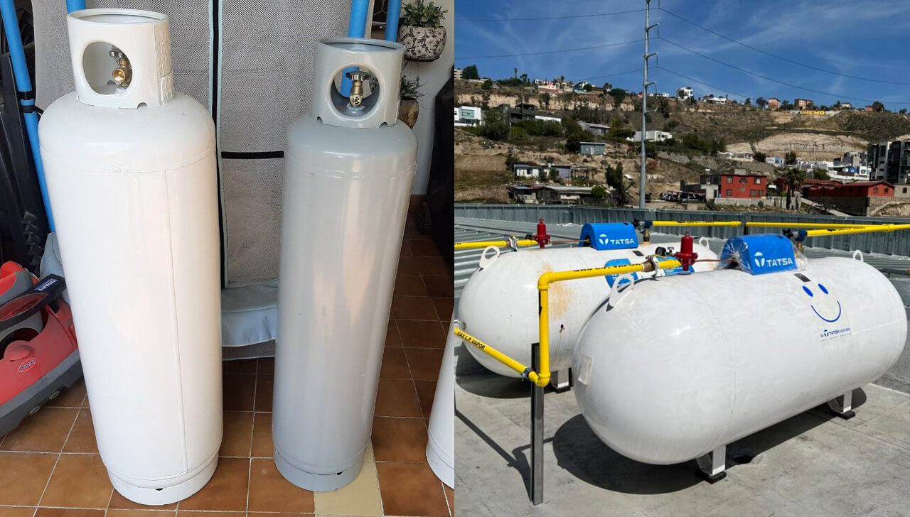](gas_tanks.jpg "Gas cylinders & stationary tanks — what’s the difference?")

Gas cylinders & stationary tanks — what’s the difference?

- In everyday language, **stationary** means *not moving* — fixed in place.
- For a time series, what would that mean?

> **NOTE:**
>
> If a time series is “not moving”, what statistical properties would you expect it to have?

## 1.1 The Formal Definition

A time series is **stationary** if its statistical properties — primarily its **mean** and **variance** — do not change over time.

- The series fluctuates around a **constant mean**.
- The spread of those fluctuations stays **roughly constant** over time.
- There are no systematic patterns that change the level or scale of the series.

## 1.2 Are These Series Stationary?

Which of the following six series are stationary (i.e., which look more *stable*)?

[](stationarity_files/figure-html/all-six-html-1.png)

[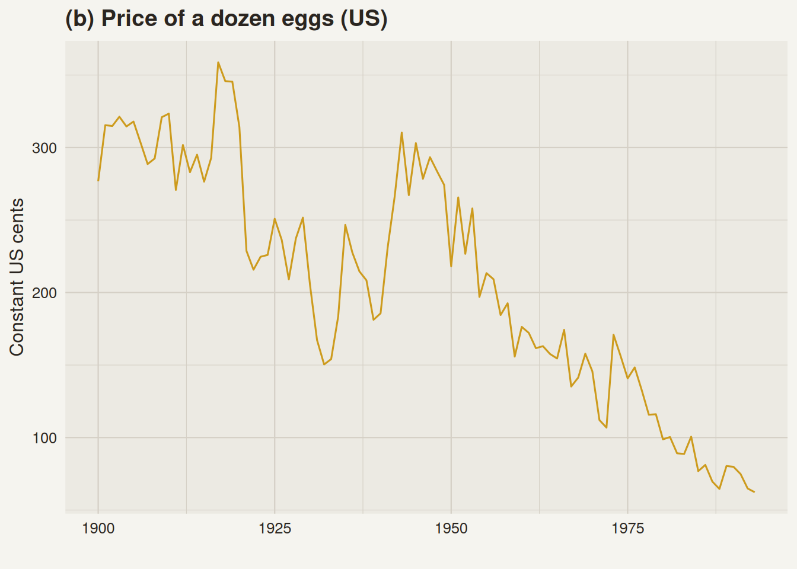](stationarity_files/figure-html/all-six-html-2.png)

[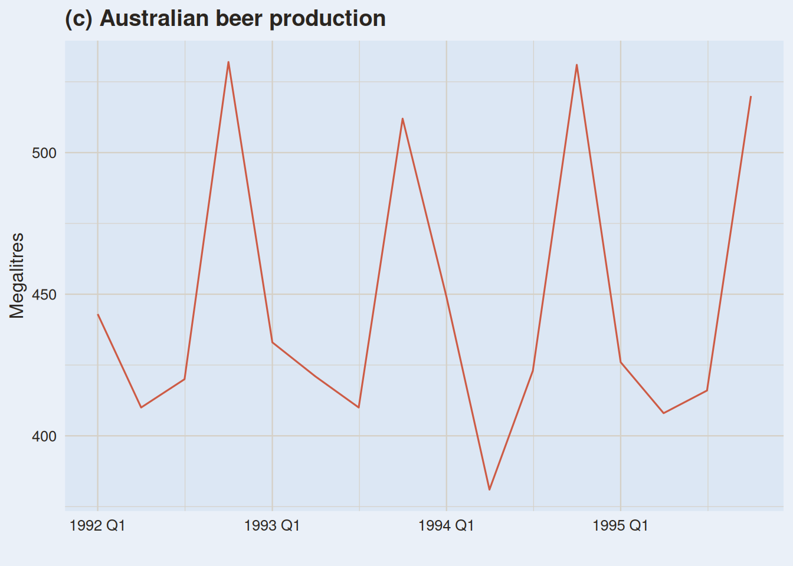](stationarity_files/figure-html/all-six-html-3.png)

[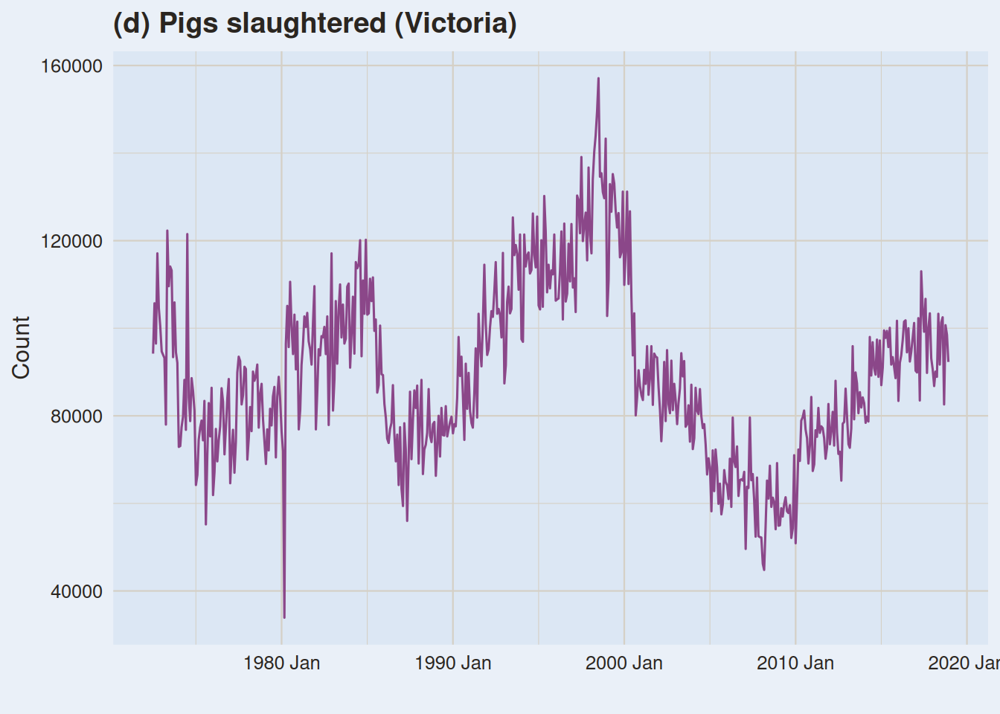](stationarity_files/figure-html/all-six-html-4.png)

[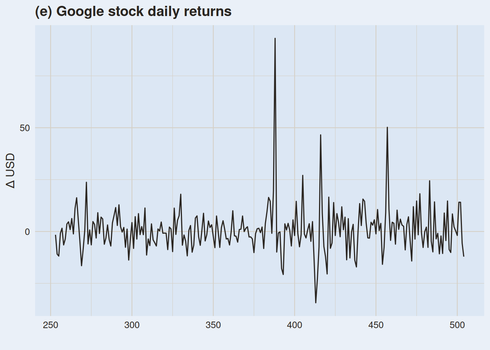](stationarity_files/figure-html/all-six-html-5.png)

[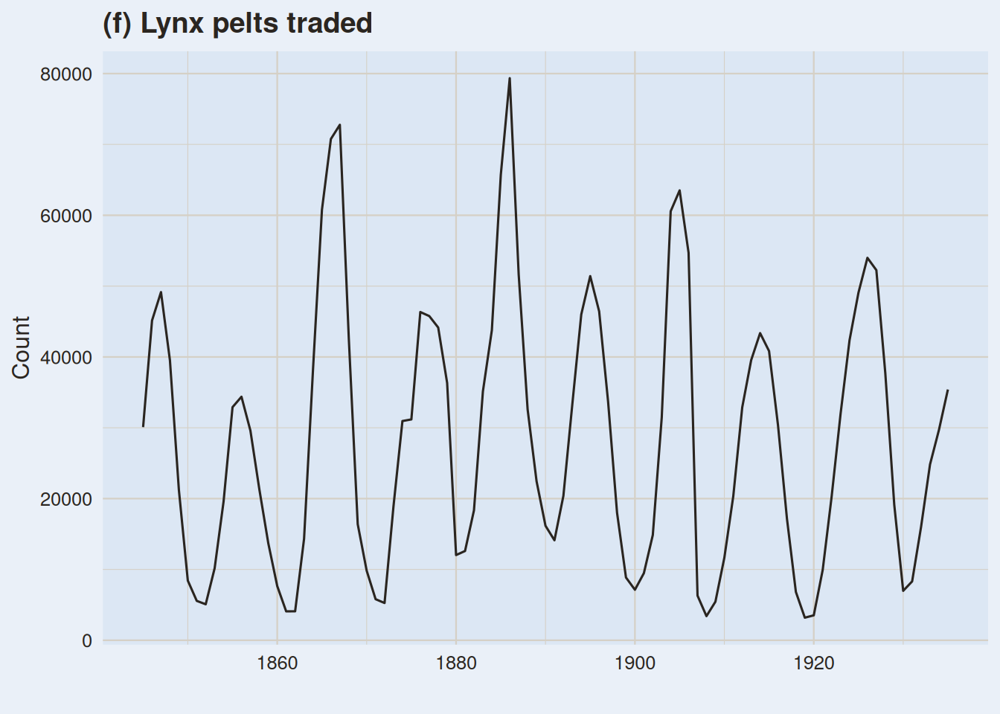](stationarity_files/figure-html/all-six-html-6.png)

[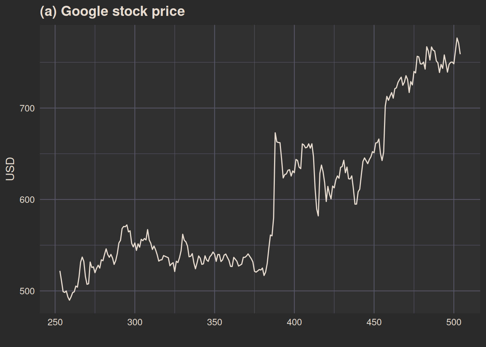](stationarity_files/figure-html/all-six-html-7.png)

[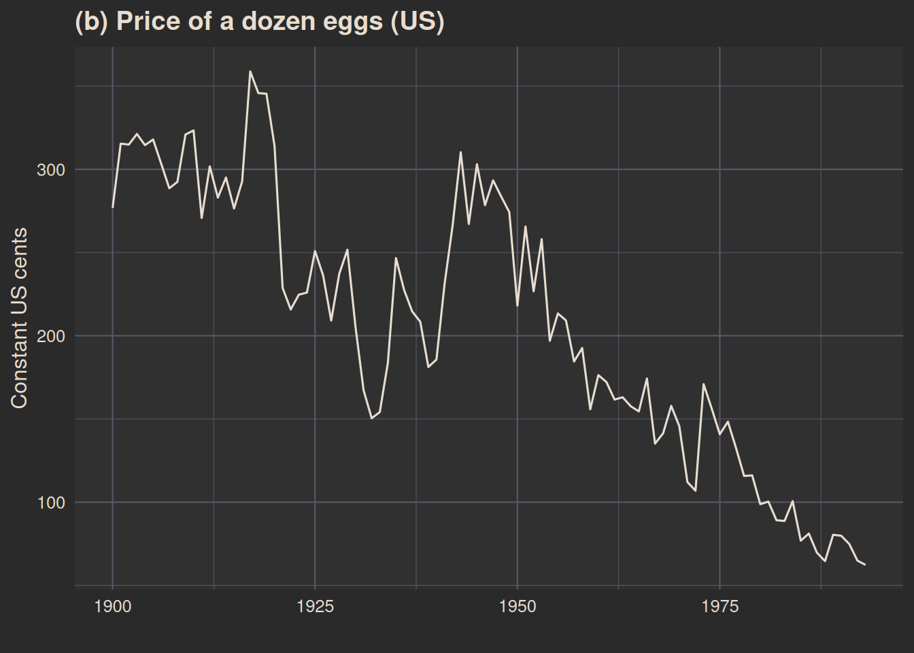](stationarity_files/figure-html/all-six-html-8.png)

[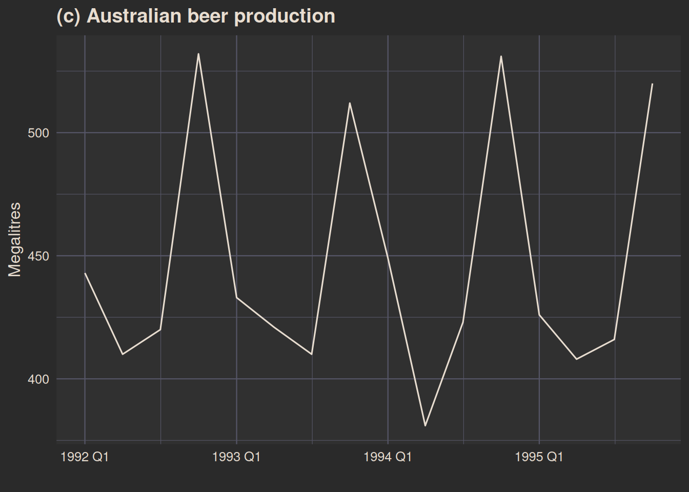](stationarity_files/figure-html/all-six-html-9.png)

[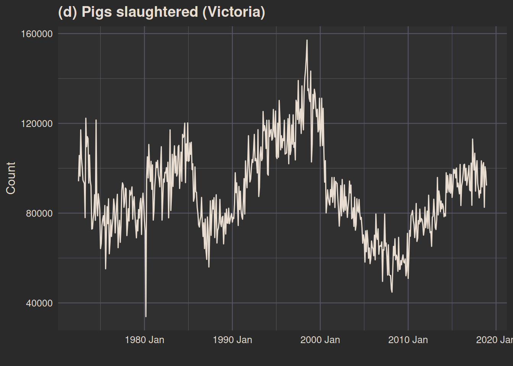](stationarity_files/figure-html/all-six-html-10.png)

[](stationarity_files/figure-html/all-six-html-11.png)

[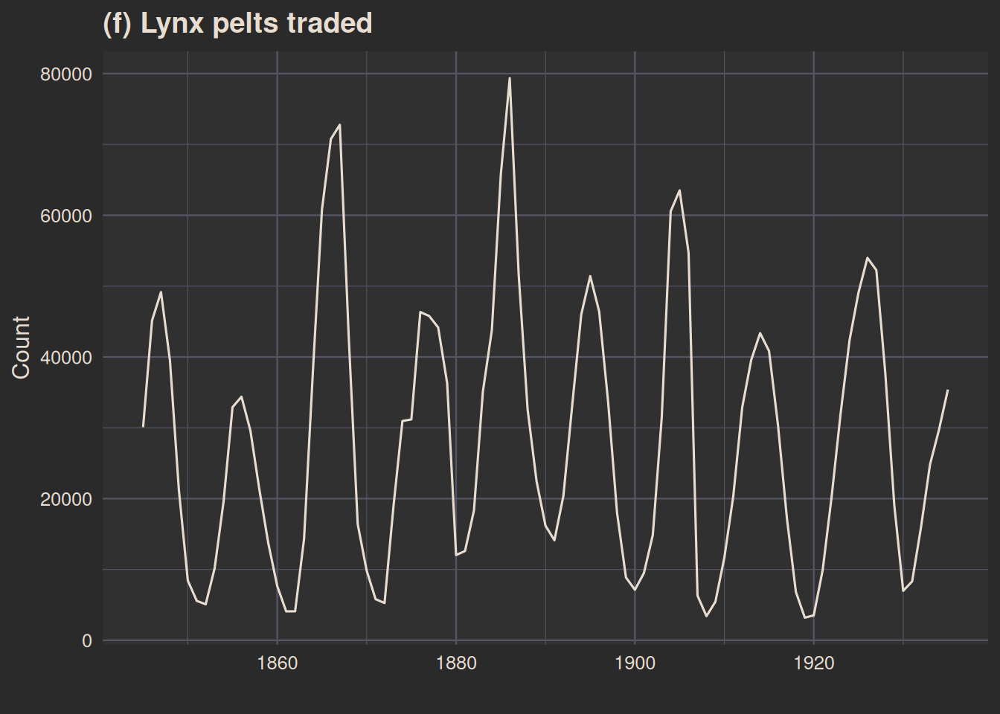](stationarity_files/figure-html/all-six-html-12.png)

> **TIP:**
>
> - **(a)** and **(b)**: clear trends (upward and downward) → **not stationary** ✗
> - **(c)** and **(d)**: strong repeating seasonal pattern → **not stationary** ✗
> - **(e)**: daily returns fluctuate around zero with constant spread → **stationary** ✓
> - **(f)**: the cycling looks seasonal but has no fixed period — this is a *business cycle*. The series is **stationary** ✓
>
> **Key distinction:** Seasonality repeats at a fixed, known frequency. Business cycles rise and fall irregularly.

## 1.3 What Makes a Series Non-Stationary?

A time series is **non-stationary** if it exhibits any of the following:

- **Trend** — a long-term increase or decrease in the mean.
- **Seasonality** — a repeating pattern that causes the mean to shift systematically.
- **Changing variance** — the spread of fluctuations grows or shrinks over time.

> **NOTE:**
>
> A stationary serie will not have any systematic patterns that change the level or scale of the series over time (**no trend**, **no seasonality**, and **constant variance**).

## 1.4 Why Does Stationarity Matter?

- There is an important family of forecasting models that work by describing the **correlation structure** between a series and its own past values.

- For those correlations to be stable and meaningful, the series needs to be stationary.

> **NOTE:**
>
> - If these models require stationarity, does that mean they can *only* work with series that have no trend, no seasonality, and no changing variance?
>
> - Or is there something we can do to a non-stationary series to make it usable?

## 1.5 What to do with Non-Stationary Series?

### 1.5.1 If we find heteroskedasticity (changing variance)

Recall from [Module 1](../../../../docs/modules/module_1/02_ts_dcmp/ts_dcmp.llms.md#mathematical-transformations): we can **stabilize the variance** using mathematical transformations — logarithms, Box-Cox, and so on.

### 1.5.2 But what about the **mean**?

Transformations alone don’t remove a trend or seasonal pattern.

# 2 Differencing

Look at these two series:

[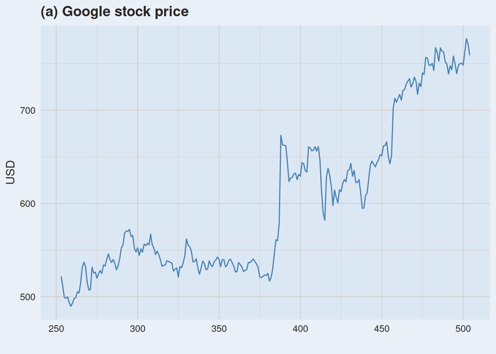](stationarity_files/figure-html/google-reveal-pres-1.png "a non-stationary series")

a non-stationary series

[](stationarity_files/figure-html/google-reveal-pres-2.png "a stationary series")

a stationary series

[](stationarity_files/figure-html/google-reveal-pres-3.png "a non-stationary series")

a non-stationary series

[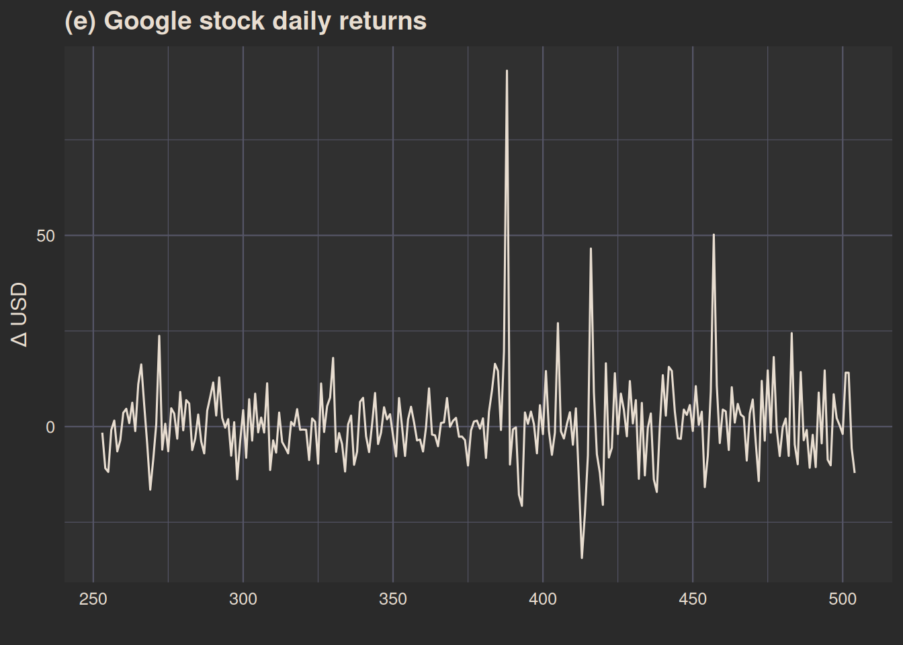](stationarity_files/figure-html/google-reveal-pres-4.png "a stationary series")

a stationary series

The second series was produced directly from the first. Can you figure out how?

> **NOTE:**
>
> The daily return is simply today’s price minus yesterday’s price — the **change** between consecutive observations. This operation is called **differencing**, and it is how we stabilize the mean of a non-stationary series.

> **TIP:**
>
> - Google’s stock price follows a **random walk**.
> - By definition, random walks are non-stationary, but their first differences are stationary.

## 2.1 First Differences

The **first difference** of a series y_t is:

y'\_t = y_t - y\_{t-1}

- The differenced series has T - 1 observations.
- First differences represent the *change* from one period to the next.
- If the original series has a linear trend, the differences will fluctuate around a constant mean.

Code

``` r
google_tsdisplay_p <- google_2015 |>
  autoplot(difference(Close)) #<1>
```

1.  `difference(Close)` computes the first difference of the `Close` variable.

[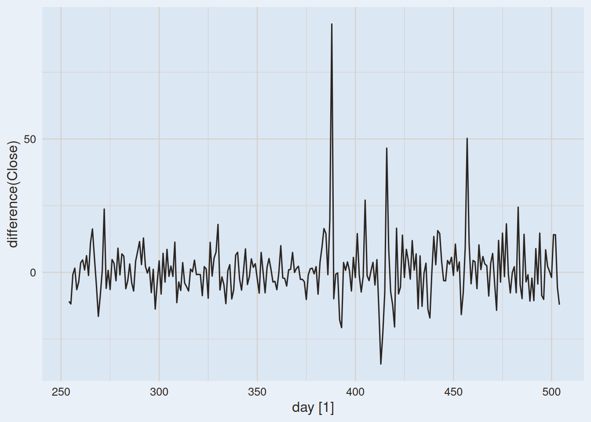](stationarity_files/figure-html/google-tsdisplay-render-1.png)

[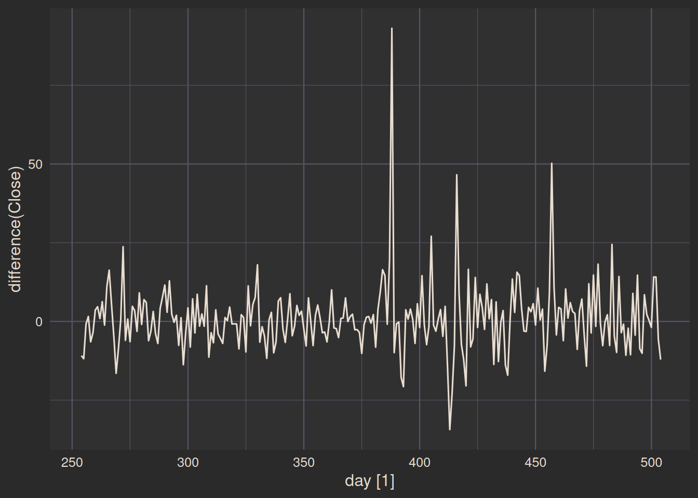](stationarity_files/figure-html/google-tsdisplay-render-2.png)

## 2.2 Second Differences

Sometimes the first-differenced series is still non-stationary. We can **difference again**:

\begin{align\*} y''\_t &= y'\_t - y'\_{t-1} \\ &= (y_t-y\_{t-1}) - (y\_{t-1} - y\_{t-2}) \\ &= y_t - 2y\_{t-1} + y\_{t-2} \end{align\*}

- Second differences have T - 2 observations.
- They represent the *change in the changes* — acceleration rather than velocity.
- **Economic and business series almost never require more than two differences.**

> **WARNING:**
>
> Needing three or more differences usually signals something else is wrong — an outlier, a structural break, or a transformation that should have been applied first.

Code

``` r
google_second_diff_p <- google_2015 |>
  autoplot(difference(Close, differences = 2)) #<1>
```

1.  The argument `differences = 2` tells `difference()` to apply the differencing operation twice.

[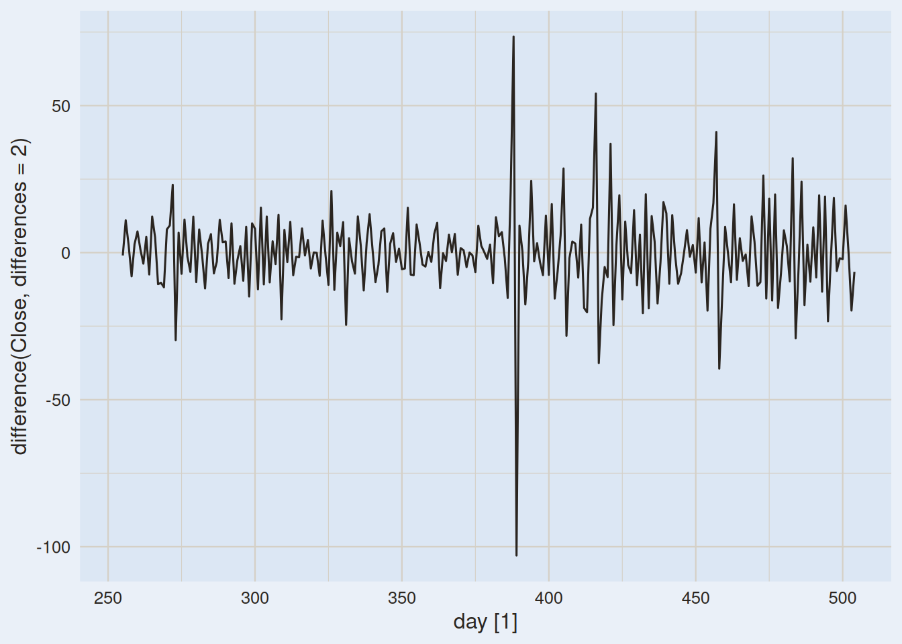](stationarity_files/figure-html/google-second-diff-render-1.png)

[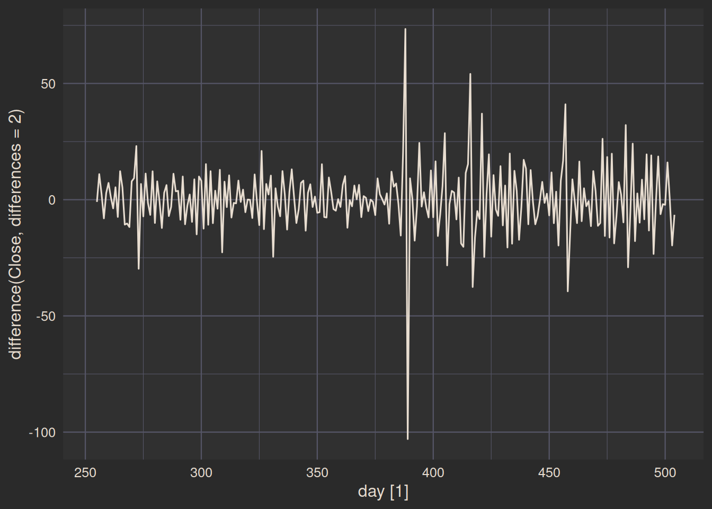](stationarity_files/figure-html/google-second-diff-render-2.png)

## 2.3 Seasonal Differencing

If the series has seasonality, we take a **seasonal difference** — the change relative to the same period in the previous cycle:

y'\_t = y_t - y\_{t-m}

where m is the seasonal period (m = 12 for monthly data, m = 4 for quarterly, …).

- Seasonal differences represent *season-over-season change*[^1] at each point.
- Also called **lag-m differences**.
- After seasonal differencing, any remaining non-seasonal trend can be removed with a first difference.

[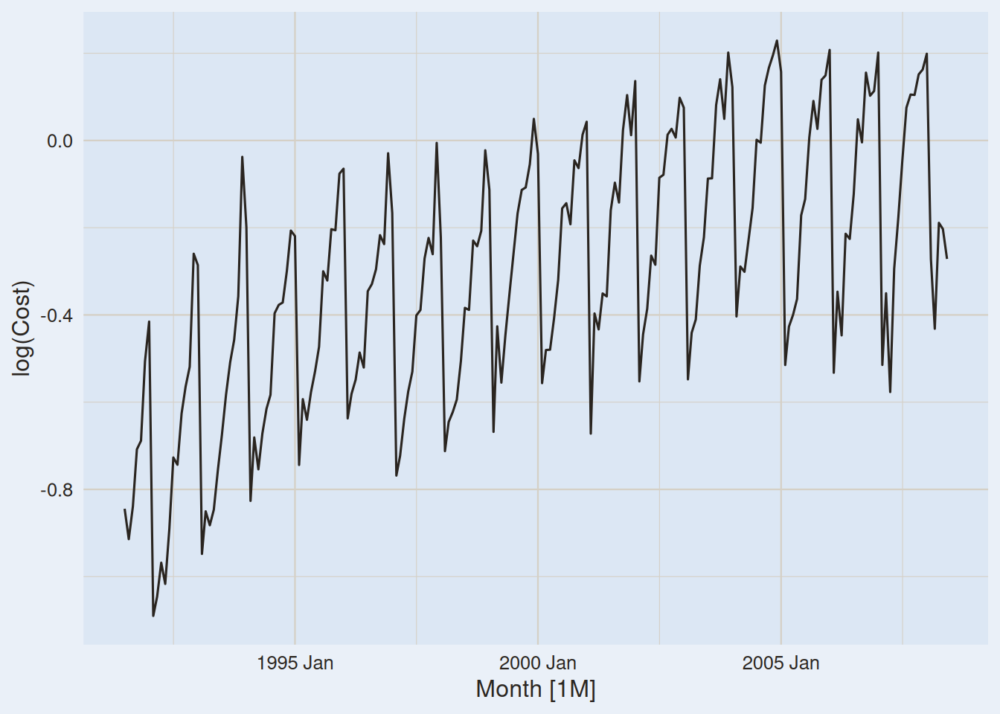](stationarity_files/figure-html/pbs-setup-render-1.png)

[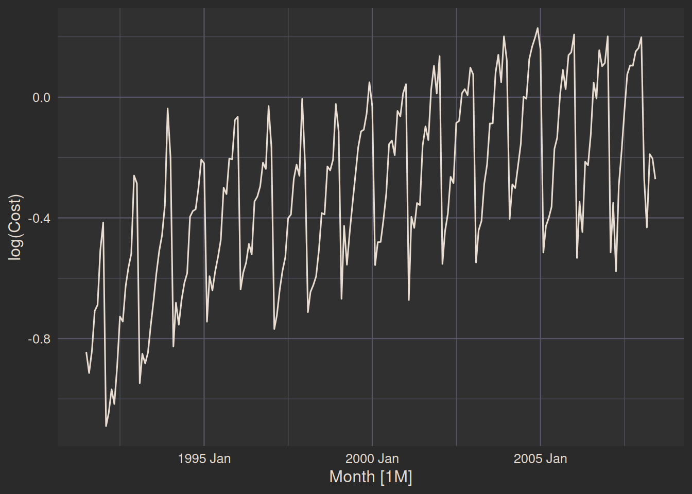](stationarity_files/figure-html/pbs-setup-render-2.png)

Code

``` r
h02_sdiff_p <- h02 |>
  autoplot(difference(log(Cost), lag = 12)) #<1>
```

1.  The argument `lag = 12` tells `difference()` to compute the seasonal difference with a lag of 12 periods (i.e. y_t - y\_{t-12}). If no `lag` is specified, it defaults to 1 (the first difference).

[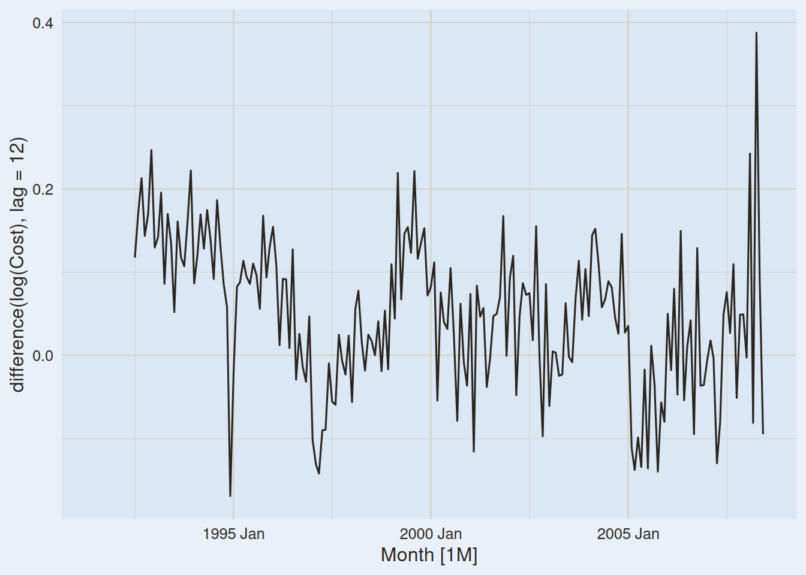](stationarity_files/figure-html/h02-sdiff-render-1.png)

[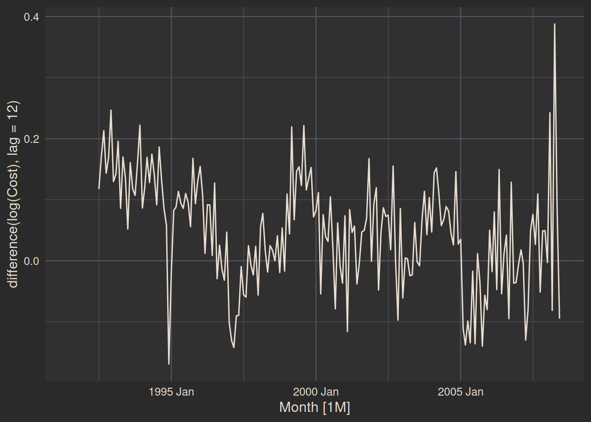](stationarity_files/figure-html/h02-sdiff-render-2.png)

## 2.4 Does the Order of Differencing Matter?

When a series needs both seasonal and regular differencing, does it matter which one we apply first?

Applying **seasonal first, then regular**:

\begin{align\*} (y_t - y\_{t-m})' &= (y_t - y\_{t-m}) - (y\_{t-1} - y\_{t-m-1}) \\ &= y_t - y\_{t-1} - y\_{t-m} + y\_{t-m-1} \end{align\*}

Applying **regular first, then seasonal**:

\begin{align\*} (y_t - y\_{t-1})' &= (y_t - y\_{t-1}) - (y\_{t-m} - y\_{t-m-1}) \\ &= y_t - y\_{t-1} - y\_{t-m} + y\_{t-m-1} \end{align\*}

Both routes lead to the same result.

> **TIP:**
>
> The order **does not matter** — the result is always identical. In practice, if the seasonal pattern is strong, apply the seasonal difference first: the result may already be stationary without needing the regular difference.

## 2.5 Backshift Notation

The **backshift operator** B provides a compact way to write differencing operations — and, as we will see next class, to write out full model equations cleanly.

It is defined simply as:

By_t = y\_{t-1} ; B(By_t) = B^2 y_t = y\_{t-2}

That is, applying B to a series shifts it back one period.

### 2.5.1 First Differences

Recall the first difference:

y'\_t = y_t - y\_{t-1}

We can rewrite y\_{t-1} = By_t, so:

y'\_t = y_t - By_t = (1 - B)y_t

### 2.5.2 Second Differences

Recall:

y''\_t = y_t - 2y\_{t-1} + y\_{t-2}

Using the backshift operator turns to:

y''\_t = y_t - 2By_t + B^2 y_t = (1 - 2B + B^2)y_t

which gives a **perfect square trinomial**[^2]

y''\_t = (1-B)^2 y_t

### 2.5.3 General d-level Differences

The pattern generalizes naturally:

(1 - B)^d y_t

where d is the number of times we difference the series.

> **TIP:**
>
> For a general order d, the binomial theorem gives:
>
> (1-B)^d = \sum\_{k=0}^{d} \binom{d}{k} (-B)^k = \sum\_{k=0}^{d} \binom{d}{k} (-1)^k B^k
>
> So:
>
> (1-B)^d y_t = \sum\_{k=0}^{d} \binom{d}{k} (-1)^k y\_{t-k}
>
> For d=1: y_t - y\_{t-1} ✓  
> For d=2: y_t - 2y\_{t-1} + y\_{t-2} ✓

### 2.5.4 Seasonal Differences

A seasonal difference shifts back m periods:

y_t - y\_{t-m} = y_t - B^m y_t = (1 - B^m)y_t

And when both are needed — as with `mexretail` — the two operators simply multiply:

(1-B)(1-B^m)y_t

which is exactly the expression we expanded by hand in the previous section.

| Operation           | Backshift form          |
|:--------------------|:------------------------|
| First difference    | (1 - B)\\y_t            |
| Second difference   | (1 - B)^2\\y_t          |
| d-th difference     | (1 - B)^d\\y_t          |
| Seasonal difference | (1 - B^m)\\y_t          |
| Both together       | (1 - B)^d(1 - B^m)\\y_t |

> **TIP:**
>
> Using backshift notation, it becomes trivial to see that the order doesn’t matter. Both orderings produce the same expression, since multiplication is commutative:
>
> (1-B)(1-B^m)y_t = (1-B^m)(1-B)y_t
>
> No algebra needed.

## 2.6 Applying This to `mexretail`

`mexretail` has trend, seasonality, and growing variance. The full differencing pipeline:

## Levels

## Log

## Box-Cox

## Seasonal diff

## Seasonal + first diff

> **NOTE:**
>
> We have been deciding how many differences to apply by looking at plots. But visual inspection is subjective — two analysts could disagree. Is there a more rigorous, objective way to make this call?

# 3 Unit Root Tests

Visual inspection is useful but subjective. **Unit root tests** formalize the question: *is this series stationary?*

The test we will use is the **KPSS test** (Kwiatkowski-Phillips-Schmidt-Shin).

> **NOTE:**
>
> The KPSS test works by regressing y_t on a constant (or a constant + trend), computing the residuals e_t, and then building their cumulative sums S_t = \sum\_{i=1}^{t} e_i. The test statistic is:
>
> \text{KPSS} = \frac{1}{T^2} \sum\_{t=1}^{T} \frac{S_t^2}{\hat{\sigma}^2}
>
> where \hat{\sigma}^2 is a long-run variance estimate that corrects for autocorrelation in the residuals.
>
> The intuition: if the series is stationary, the residuals e_t fluctuate around zero and their cumulative sums S_t stay bounded. If the series has a unit root (non-stationary), the cumulative sums drift away from zero — making the statistic large and leading to rejection of H_0.

> **IMPORTANT:**
>
> H_0: \text{the series IS stationary} H_1: \text{the series is NOT stationary}
>
> - **Large p-value** (\> 0.05): fail to reject H_0 → the series is stationary ✓
> - **Small p-value** (\< 0.05): reject H_0 → the series needs differencing ✗
>
> You *want* a large p-value here.

## 3.1 KPSS in R

Code

``` r
google_2015 |> features(Close, unitroot_kpss)
```

Code

``` r
google_2015 |> features(diff_close, unitroot_kpss)
```

## 3.2 Automated Differencing Orders

Rather than manually testing each transformation, `feasts` provides two functions that determine exactly how many differences are needed:

Code

``` r
mexretail |> features(box_cox(y, lambda), unitroot_nsdiffs)
```

Code

``` r
mexretail |>
  features(difference(box_cox(y, lambda), 12), unitroot_ndiffs)
```

> **TIP:**
>
> 1.  Apply Box-Cox with Guerrero lambda to stabilize variance: `box_cox(y, lambda)`
> 2.  Check seasonal differencing needed: `unitroot_nsdiffs()` → 1
> 3.  Apply seasonal diff, then check regular: `unitroot_ndiffs()` → 1
> 4.  Final stationary series: `difference(box_cox(y, lambda), 12) |> difference(1)`

# 4 ACF and PACF

We have already encountered the **ACF** when diagnosing residuals from our benchmark models — checking whether leftover errors looked like white noise. Here we use it for a different but related purpose: understanding the correlation structure of the series itself.

## 4.1 Autocorrelation Function (ACF)

The **ACF** measures the correlation between a series and its own past values at each lag k:

r_k = \text{Corr}(y_t,\\ y\_{t-k})

> **NOTE:**
>
> - **Stationary** series: ACF drops to zero **quickly**.
> - **Non-stationary** series: ACF decays **very slowly**, with the lag-1 value close to 1.
>
> This gives us another way to detect non-stationarity — and, as we will see, it also tells us about the structure of the model to fit.

## 4.2 ACF Shapes for Different Patterns

## Trend only

[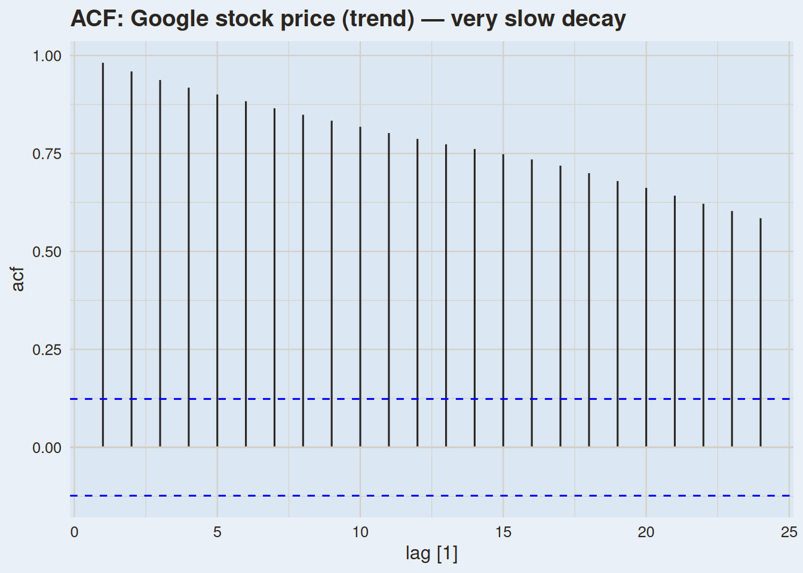](stationarity_files/figure-html/acf-trend-render-1.png)

[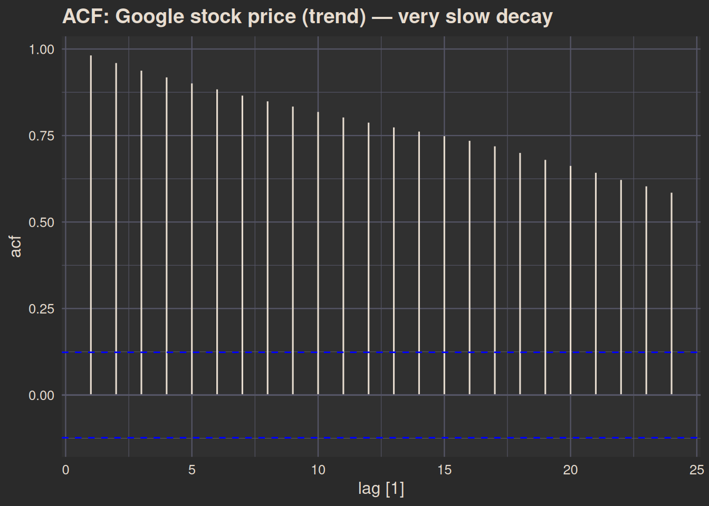](stationarity_files/figure-html/acf-trend-render-2.png)

## Seasonality only

[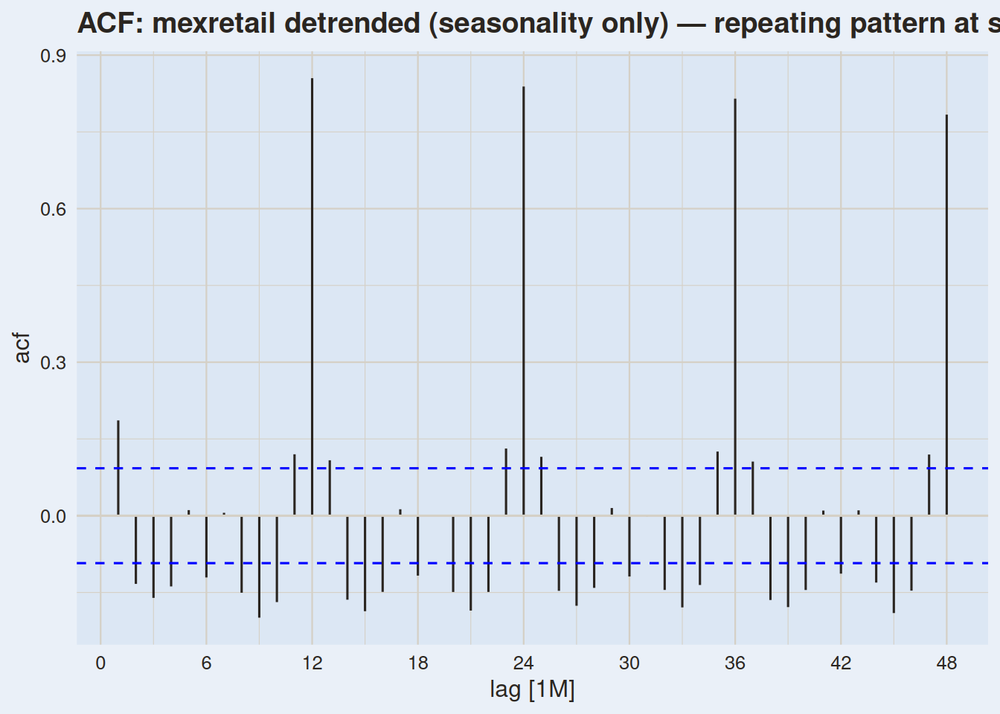](stationarity_files/figure-html/acf-season-only-render-1.png)

[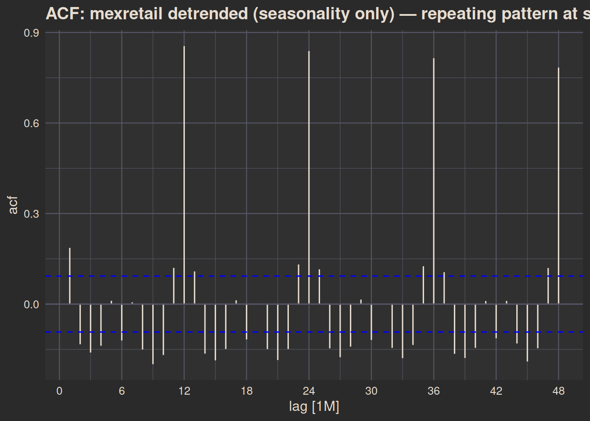](stationarity_files/figure-html/acf-season-only-render-2.png)

## Trend + seasonality

[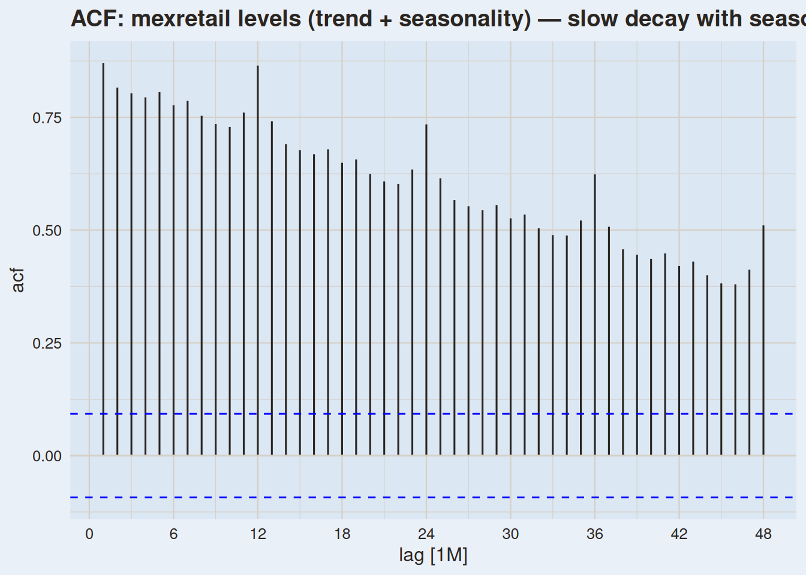](stationarity_files/figure-html/acf-trend-season-render-1.png)

[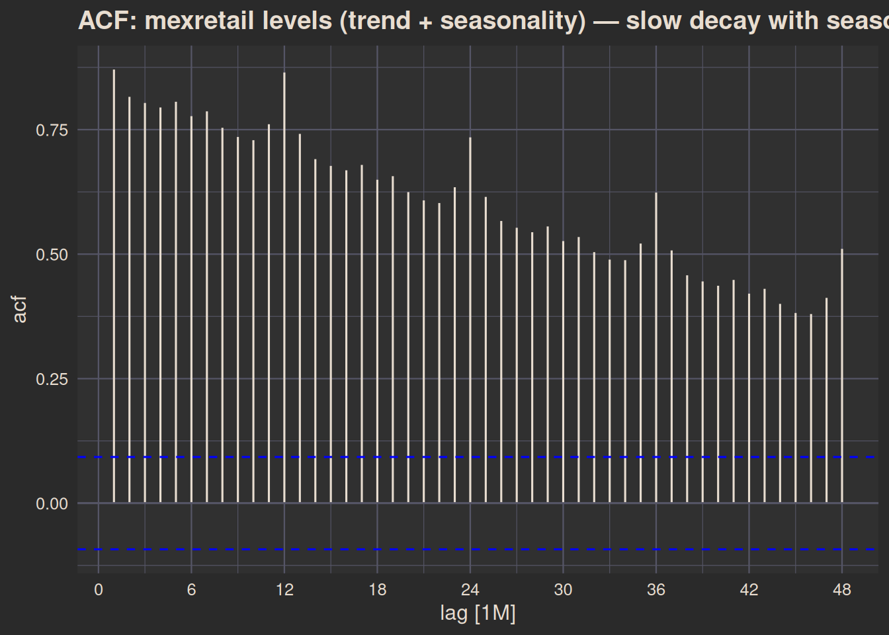](stationarity_files/figure-html/acf-trend-season-render-2.png)

## Stationary

[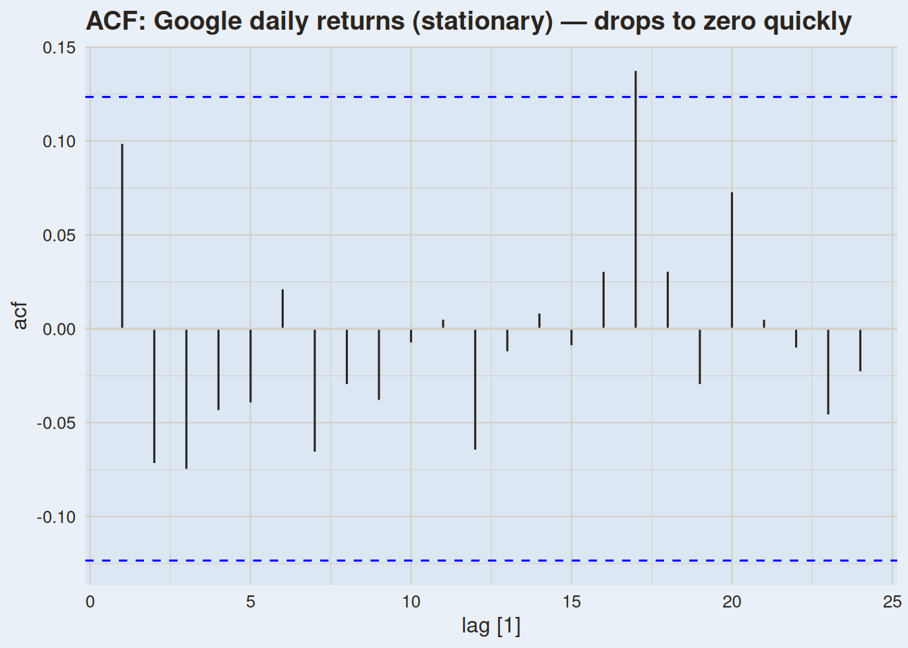](stationarity_files/figure-html/acf-stationary-render-1.png)

[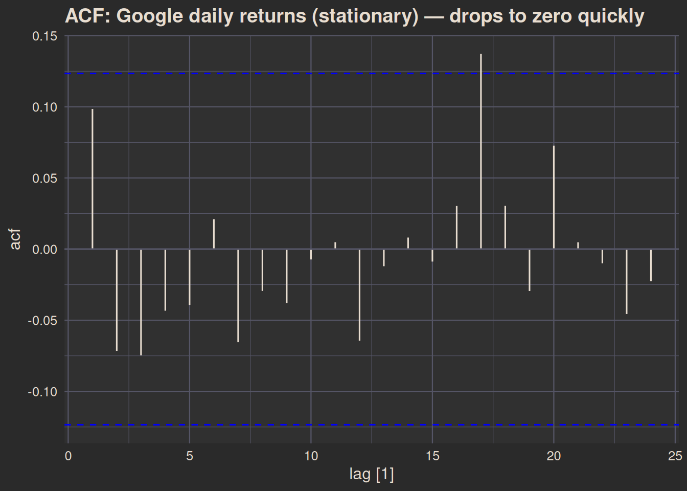](stationarity_files/figure-html/acf-stationary-render-2.png)

## mexretail after differencing

[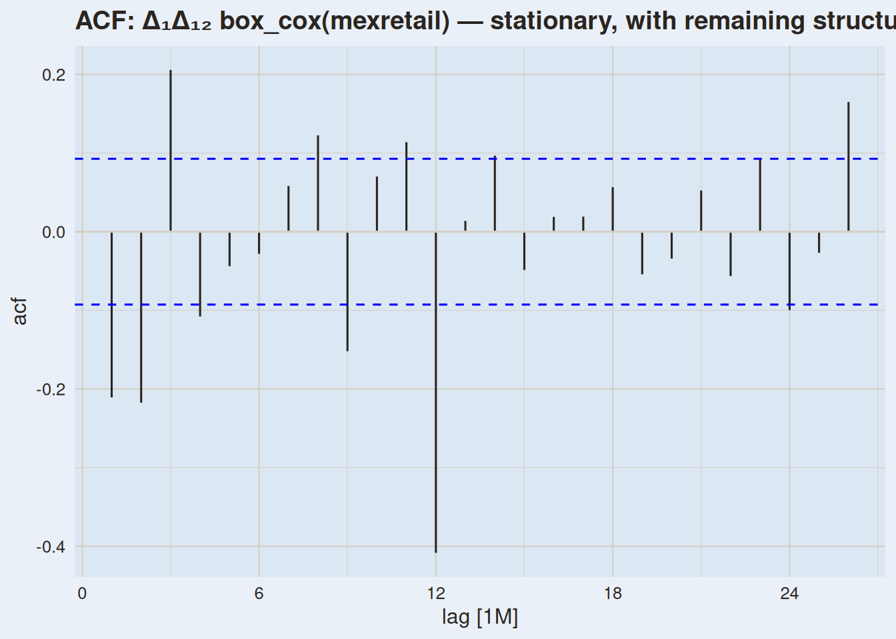](stationarity_files/figure-html/acf-mexretail-diff-render-1.png)

[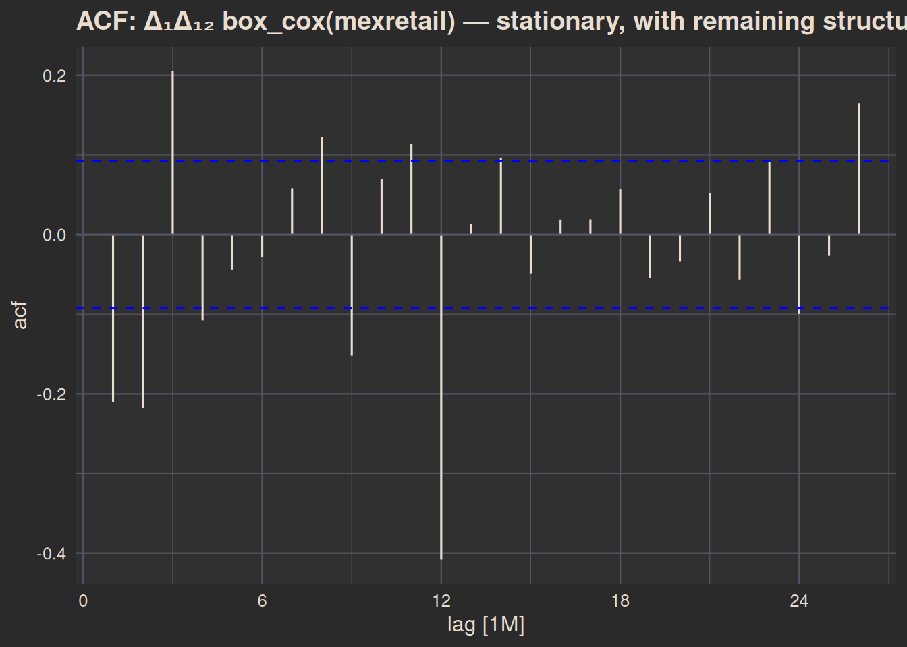](stationarity_files/figure-html/acf-mexretail-diff-render-2.png)

## 4.3 Partial Autocorrelation Function (PACF)

The ACF at lag k captures both the *direct* relationship between y_t and y\_{t-k} and the *indirect* relationship mediated through intermediate lags. The **PACF** isolates only the direct part.

> **TIP:**
>
> - **ACF at lag k**: simple correlation between y_t and y\_{t-k}.
> - **PACF at lag k**: the coefficient on y\_{t-k} in a regression of y_t on y\_{t-1}, y\_{t-2}, \ldots, y\_{t-k}.
>
> The PACF asks: *once I already know the effect of all closer lags, does lag k add any new information?*

## 4.4 ACF and PACF Together

`gg_tsdisplay()` with `plot_type = "partial"` shows the time series, ACF, and PACF together — this is the standard diagnostic display for the rest of the module.

Code

``` r
theme_narsil()
```

    <theme> List of 144
     $ line                            : <ggplot2::element_line>
      ..@ colour       : chr "black"
      ..@ linewidth    : num 0.545
      ..@ linetype     : num 1
      ..@ lineend      : chr "butt"
      ..@ linejoin     : chr "round"
      ..@ arrow        : logi FALSE
      ..@ arrow.fill   : chr "black"
      ..@ inherit.blank: logi TRUE
     $ rect                            : <ggplot2::element_rect>
      ..@ fill         : chr "white"
      ..@ colour       : chr "black"
      ..@ linewidth    : num 0.545
      ..@ linetype     : num 1
      ..@ linejoin     : chr "round"
      ..@ inherit.blank: logi TRUE
     $ text                            : <ggplot2::element_text>
      ..@ family       : chr ""
      ..@ face         : chr "plain"
      ..@ italic       : chr NA
      ..@ fontweight   : num NA
      ..@ fontwidth    : num NA
      ..@ colour       : chr "#2A2520"
      ..@ size         : num 12
      ..@ hjust        : num 0.5
      ..@ vjust        : num 0.5
      ..@ angle        : num 0
      ..@ lineheight   : num 0.9
      ..@ margin       : <ggplot2::margin> num [1:4] 0 0 0 0
      ..@ debug        : logi FALSE
      ..@ inherit.blank: logi FALSE
     $ title                           : <ggplot2::element_text>
      ..@ family       : NULL
      ..@ face         : NULL
      ..@ italic       : chr NA
      ..@ fontweight   : num NA
      ..@ fontwidth    : num NA
      ..@ colour       : NULL
      ..@ size         : NULL
      ..@ hjust        : NULL
      ..@ vjust        : NULL
      ..@ angle        : NULL
      ..@ lineheight   : NULL
      ..@ margin       : NULL
      ..@ debug        : NULL
      ..@ inherit.blank: logi TRUE
     $ point                           : <ggplot2::element_point>
      ..@ colour       : chr "black"
      ..@ shape        : num 19
      ..@ size         : num 1.64
      ..@ fill         : chr "white"
      ..@ stroke       : num 0.545
      ..@ inherit.blank: logi TRUE
     $ polygon                         : <ggplot2::element_polygon>
      ..@ fill         : chr "white"
      ..@ colour       : chr "black"
      ..@ linewidth    : num 0.545
      ..@ linetype     : num 1
      ..@ linejoin     : chr "round"
      ..@ inherit.blank: logi TRUE
     $ geom                            : <ggplot2::element_geom>
      ..@ ink        : chr "black"
      ..@ paper      : chr "white"
      ..@ accent     : chr "#3366FF"
      ..@ linewidth  : num 0.545
      ..@ borderwidth: num 0.545
      ..@ linetype   : int 1
      ..@ bordertype : int 1
      ..@ family     : chr ""
      ..@ fontsize   : num 4.22
      ..@ pointsize  : num 1.64
      ..@ pointshape : num 19
      ..@ colour     : NULL
      ..@ fill       : NULL
     $ spacing                         : 'simpleUnit' num 6points
      ..- attr(*, "unit")= int 8
     $ margins                         : <ggplot2::margin> num [1:4] 6 6 6 6
     $ aspect.ratio                    : NULL
     $ axis.title                      : <ggplot2::element_text>
      ..@ family       : NULL
      ..@ face         : NULL
      ..@ italic       : chr NA
      ..@ fontweight   : num NA
      ..@ fontwidth    : num NA
      ..@ colour       : chr "#2A2520"
      ..@ size         : NULL
      ..@ hjust        : NULL
      ..@ vjust        : NULL
      ..@ angle        : NULL
      ..@ lineheight   : NULL
      ..@ margin       : NULL
      ..@ debug        : NULL
      ..@ inherit.blank: logi FALSE
     $ axis.title.x                    : <ggplot2::element_text>
      ..@ family       : NULL
      ..@ face         : NULL
      ..@ italic       : chr NA
      ..@ fontweight   : num NA
      ..@ fontwidth    : num NA
      ..@ colour       : NULL
      ..@ size         : NULL
      ..@ hjust        : NULL
      ..@ vjust        : num 1
      ..@ angle        : NULL
      ..@ lineheight   : NULL
      ..@ margin       : <ggplot2::margin> num [1:4] 3 0 0 0
      ..@ debug        : NULL
      ..@ inherit.blank: logi TRUE
     $ axis.title.x.top                : <ggplot2::element_text>
      ..@ family       : NULL
      ..@ face         : NULL
      ..@ italic       : chr NA
      ..@ fontweight   : num NA
      ..@ fontwidth    : num NA
      ..@ colour       : NULL
      ..@ size         : NULL
      ..@ hjust        : NULL
      ..@ vjust        : num 0
      ..@ angle        : NULL
      ..@ lineheight   : NULL
      ..@ margin       : <ggplot2::margin> num [1:4] 0 0 3 0
      ..@ debug        : NULL
      ..@ inherit.blank: logi TRUE
     $ axis.title.x.bottom             : NULL
     $ axis.title.y                    : <ggplot2::element_text>
      ..@ family       : NULL
      ..@ face         : NULL
      ..@ italic       : chr NA
      ..@ fontweight   : num NA
      ..@ fontwidth    : num NA
      ..@ colour       : NULL
      ..@ size         : NULL
      ..@ hjust        : NULL
      ..@ vjust        : num 1
      ..@ angle        : num 90
      ..@ lineheight   : NULL
      ..@ margin       : <ggplot2::margin> num [1:4] 0 3 0 0
      ..@ debug        : NULL
      ..@ inherit.blank: logi TRUE
     $ axis.title.y.left               : NULL
     $ axis.title.y.right              : <ggplot2::element_text>
      ..@ family       : NULL
      ..@ face         : NULL
      ..@ italic       : chr NA
      ..@ fontweight   : num NA
      ..@ fontwidth    : num NA
      ..@ colour       : NULL
      ..@ size         : NULL
      ..@ hjust        : NULL
      ..@ vjust        : num 1
      ..@ angle        : num -90
      ..@ lineheight   : NULL
      ..@ margin       : <ggplot2::margin> num [1:4] 0 0 0 3
      ..@ debug        : NULL
      ..@ inherit.blank: logi TRUE
     $ axis.text                       : <ggplot2::element_text>
      ..@ family       : NULL
      ..@ face         : NULL
      ..@ italic       : chr NA
      ..@ fontweight   : num NA
      ..@ fontwidth    : num NA
      ..@ colour       : chr "#2A2520"
      ..@ size         : 'rel' num 0.8
      ..@ hjust        : NULL
      ..@ vjust        : NULL
      ..@ angle        : NULL
      ..@ lineheight   : NULL
      ..@ margin       : NULL
      ..@ debug        : NULL
      ..@ inherit.blank: logi FALSE
     $ axis.text.x                     : <ggplot2::element_text>
      ..@ family       : NULL
      ..@ face         : NULL
      ..@ italic       : chr NA
      ..@ fontweight   : num NA
      ..@ fontwidth    : num NA
      ..@ colour       : NULL
      ..@ size         : NULL
      ..@ hjust        : NULL
      ..@ vjust        : num 1
      ..@ angle        : NULL
      ..@ lineheight   : NULL
      ..@ margin       : <ggplot2::margin> num [1:4] 2.4 0 0 0
      ..@ debug        : NULL
      ..@ inherit.blank: logi TRUE
     $ axis.text.x.top                 : <ggplot2::element_text>
      ..@ family       : NULL
      ..@ face         : NULL
      ..@ italic       : chr NA
      ..@ fontweight   : num NA
      ..@ fontwidth    : num NA
      ..@ colour       : NULL
      ..@ size         : NULL
      ..@ hjust        : NULL
      ..@ vjust        : NULL
      ..@ angle        : NULL
      ..@ lineheight   : NULL
      ..@ margin       : <ggplot2::margin> num [1:4] 0 0 5.4 0
      ..@ debug        : NULL
      ..@ inherit.blank: logi TRUE
     $ axis.text.x.bottom              : <ggplot2::element_text>
      ..@ family       : NULL
      ..@ face         : NULL
      ..@ italic       : chr NA
      ..@ fontweight   : num NA
      ..@ fontwidth    : num NA
      ..@ colour       : NULL
      ..@ size         : NULL
      ..@ hjust        : NULL
      ..@ vjust        : NULL
      ..@ angle        : NULL
      ..@ lineheight   : NULL
      ..@ margin       : <ggplot2::margin> num [1:4] 5.4 0 0 0
      ..@ debug        : NULL
      ..@ inherit.blank: logi TRUE
     $ axis.text.y                     : <ggplot2::element_text>
      ..@ family       : NULL
      ..@ face         : NULL
      ..@ italic       : chr NA
      ..@ fontweight   : num NA
      ..@ fontwidth    : num NA
      ..@ colour       : NULL
      ..@ size         : NULL
      ..@ hjust        : num 1
      ..@ vjust        : NULL
      ..@ angle        : NULL
      ..@ lineheight   : NULL
      ..@ margin       : <ggplot2::margin> num [1:4] 0 2.4 0 0
      ..@ debug        : NULL
      ..@ inherit.blank: logi TRUE
     $ axis.text.y.left                : <ggplot2::element_text>
      ..@ family       : NULL
      ..@ face         : NULL
      ..@ italic       : chr NA
      ..@ fontweight   : num NA
      ..@ fontwidth    : num NA
      ..@ colour       : NULL
      ..@ size         : NULL
      ..@ hjust        : NULL
      ..@ vjust        : NULL
      ..@ angle        : NULL
      ..@ lineheight   : NULL
      ..@ margin       : <ggplot2::margin> num [1:4] 0 5.4 0 0
      ..@ debug        : NULL
      ..@ inherit.blank: logi TRUE
     $ axis.text.y.right               : <ggplot2::element_text>
      ..@ family       : NULL
      ..@ face         : NULL
      ..@ italic       : chr NA
      ..@ fontweight   : num NA
      ..@ fontwidth    : num NA
      ..@ colour       : NULL
      ..@ size         : NULL
      ..@ hjust        : NULL
      ..@ vjust        : NULL
      ..@ angle        : NULL
      ..@ lineheight   : NULL
      ..@ margin       : <ggplot2::margin> num [1:4] 0 0 0 5.4
      ..@ debug        : NULL
      ..@ inherit.blank: logi TRUE
     $ axis.text.theta                 : NULL
     $ axis.text.r                     : <ggplot2::element_text>
      ..@ family       : NULL
      ..@ face         : NULL
      ..@ italic       : chr NA
      ..@ fontweight   : num NA
      ..@ fontwidth    : num NA
      ..@ colour       : NULL
      ..@ size         : NULL
      ..@ hjust        : num 0.5
      ..@ vjust        : NULL
      ..@ angle        : NULL
      ..@ lineheight   : NULL
      ..@ margin       : <ggplot2::margin> num [1:4] 0 2.4 0 2.4
      ..@ debug        : NULL
      ..@ inherit.blank: logi TRUE
     $ axis.ticks                      : <ggplot2::element_blank>
     $ axis.ticks.x                    : NULL
     $ axis.ticks.x.top                : NULL
     $ axis.ticks.x.bottom             : NULL
     $ axis.ticks.y                    : NULL
     $ axis.ticks.y.left               : NULL
     $ axis.ticks.y.right              : NULL
     $ axis.ticks.theta                : NULL
     $ axis.ticks.r                    : NULL
     $ axis.minor.ticks.x.top          : NULL
     $ axis.minor.ticks.x.bottom       : NULL
     $ axis.minor.ticks.y.left         : NULL
     $ axis.minor.ticks.y.right        : NULL
     $ axis.minor.ticks.theta          : NULL
     $ axis.minor.ticks.r              : NULL
     $ axis.ticks.length               : 'rel' num 0.5
     $ axis.ticks.length.x             : NULL
     $ axis.ticks.length.x.top         : NULL
     $ axis.ticks.length.x.bottom      : NULL
     $ axis.ticks.length.y             : NULL
     $ axis.ticks.length.y.left        : NULL
     $ axis.ticks.length.y.right       : NULL
     $ axis.ticks.length.theta         : NULL
     $ axis.ticks.length.r             : NULL
     $ axis.minor.ticks.length         : 'rel' num 0.75
     $ axis.minor.ticks.length.x       : NULL
     $ axis.minor.ticks.length.x.top   : NULL
     $ axis.minor.ticks.length.x.bottom: NULL
     $ axis.minor.ticks.length.y       : NULL
     $ axis.minor.ticks.length.y.left  : NULL
     $ axis.minor.ticks.length.y.right : NULL
     $ axis.minor.ticks.length.theta   : NULL
     $ axis.minor.ticks.length.r       : NULL
     $ axis.line                       : <ggplot2::element_blank>
     $ axis.line.x                     : NULL
     $ axis.line.x.top                 : NULL
     $ axis.line.x.bottom              : NULL
     $ axis.line.y                     : NULL
     $ axis.line.y.left                : NULL
     $ axis.line.y.right               : NULL
     $ axis.line.theta                 : NULL
     $ axis.line.r                     : NULL
     $ legend.background               : <ggplot2::element_blank>
     $ legend.margin                   : NULL
     $ legend.spacing                  : 'rel' num 2
     $ legend.spacing.x                : NULL
     $ legend.spacing.y                : NULL
     $ legend.key                      : <ggplot2::element_blank>
     $ legend.key.size                 : 'simpleUnit' num 1.2lines
      ..- attr(*, "unit")= int 3
     $ legend.key.height               : NULL
     $ legend.key.width                : NULL
     $ legend.key.spacing              : NULL
     $ legend.key.spacing.x            : NULL
     $ legend.key.spacing.y            : NULL
     $ legend.key.justification        : NULL
     $ legend.frame                    : NULL
     $ legend.ticks                    : NULL
     $ legend.ticks.length             : 'rel' num 0.2
     $ legend.axis.line                : NULL
     $ legend.text                     : <ggplot2::element_text>
      ..@ family       : NULL
      ..@ face         : NULL
      ..@ italic       : chr NA
      ..@ fontweight   : num NA
      ..@ fontwidth    : num NA
      ..@ colour       : chr "#2A2520"
      ..@ size         : 'rel' num 0.8
      ..@ hjust        : NULL
      ..@ vjust        : NULL
      ..@ angle        : NULL
      ..@ lineheight   : NULL
      ..@ margin       : NULL
      ..@ debug        : NULL
      ..@ inherit.blank: logi FALSE
     $ legend.text.position            : NULL
     $ legend.title                    : <ggplot2::element_text>
      ..@ family       : NULL
      ..@ face         : chr "bold"
      ..@ italic       : chr NA
      ..@ fontweight   : num NA
      ..@ fontwidth    : num NA
      ..@ colour       : chr "#2A2520"
      ..@ size         : NULL
      ..@ hjust        : num 0
      ..@ vjust        : NULL
      ..@ angle        : NULL
      ..@ lineheight   : NULL
      ..@ margin       : NULL
      ..@ debug        : NULL
      ..@ inherit.blank: logi FALSE
     $ legend.title.position           : NULL
     $ legend.position                 : chr "right"
     $ legend.position.inside          : NULL
     $ legend.direction                : NULL
     $ legend.byrow                    : NULL
     $ legend.justification            : chr "center"
     $ legend.justification.top        : NULL
     $ legend.justification.bottom     : NULL
     $ legend.justification.left       : NULL
     $ legend.justification.right      : NULL
     $ legend.justification.inside     : NULL
      [list output truncated]
     @ complete: logi TRUE
     @ validate: logi TRUE

Code

``` r
mexretail |>
  gg_tsdisplay(
    difference(box_cox(y, lambda), 12) |> difference(1),
    plot_type = "partial",
    lag_max = 48
  )
```

[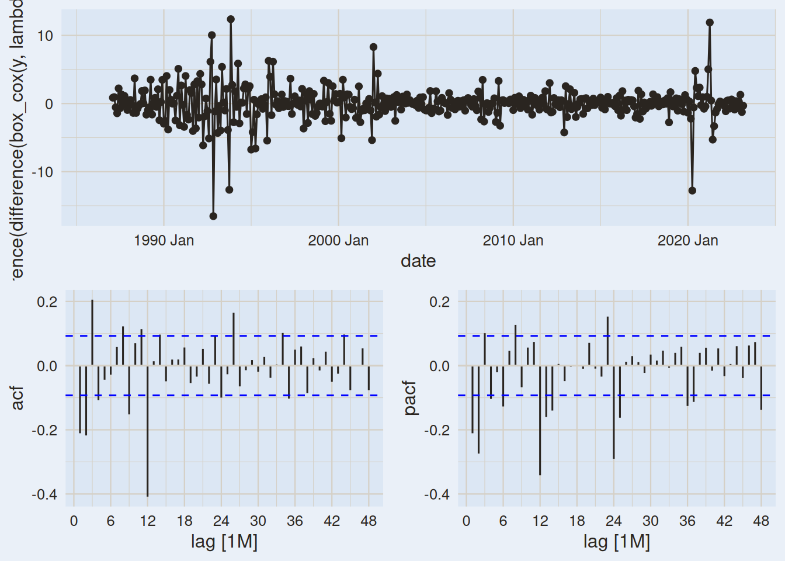](stationarity_files/figure-html/tsdisplay-mexretail-1.png)

# 5 AR and MA Models

## 5.1 Autoregressive Models — AR(p)

An **autoregressive model** of order p forecasts y_t as a weighted sum of its own **past values**:

y_t = c + \phi_1 y\_{t-1} + \phi_2 y\_{t-2} + \cdots + \phi_p y\_{t-p} + \varepsilon_t

- Structurally identical to multiple linear regression — except the predictors are *lagged values of the series itself*.
- p is the number of past values used.
- \varepsilon_t is white noise.

[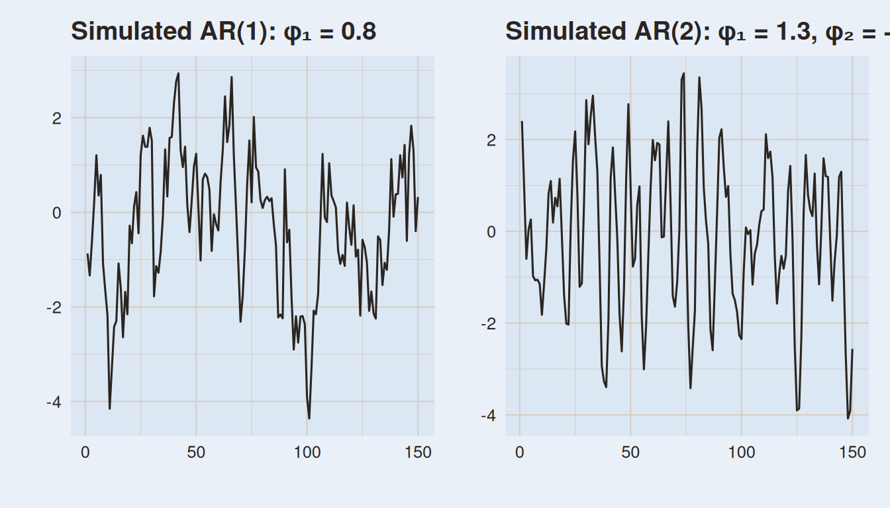](stationarity_files/figure-html/ar-examples-render-1.png)

[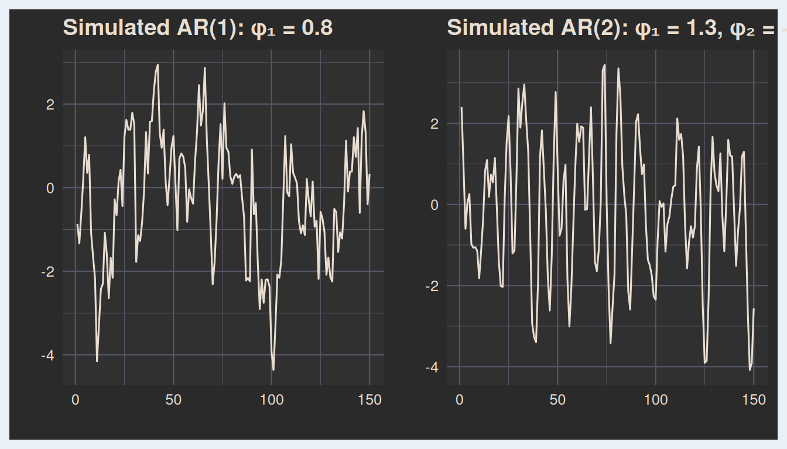](stationarity_files/figure-html/ar-examples-render-2.png)

> **NOTE:**
>
> - **PACF** cuts off sharply after lag p — this is how you read the order.
> - **ACF** decays exponentially or sinusoidal.

[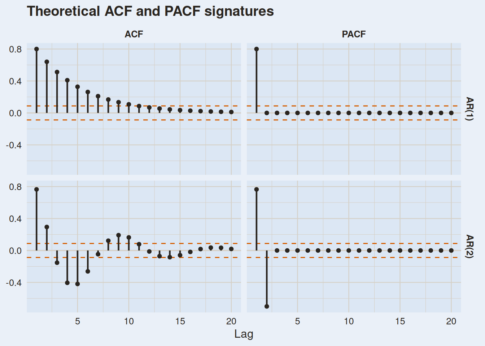](stationarity_files/figure-html/ar-acf-pacf-render-1.png)

[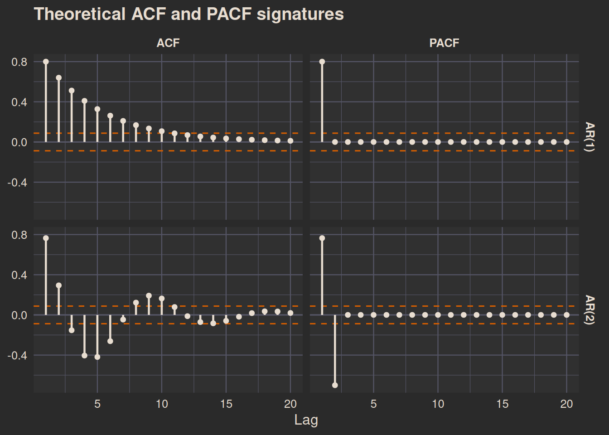](stationarity_files/figure-html/ar-acf-pacf-render-2.png)

## 5.2 Moving Average Models — MA(q)

A **moving average model** of order q forecasts y_t as a weighted sum of **past forecast errors**:

y_t = c + \varepsilon_t + \theta_1 \varepsilon\_{t-1} + \theta_2 \varepsilon\_{t-2} + \cdots + \theta_q \varepsilon\_{t-q}

- The predictors are *past errors*, not past values of the series.
- q is the number of past errors used.
- \varepsilon_t is white noise.

> **WARNING:**
>
> Do not confuse MA *models* with the moving average *smoothing* used in decomposition. Smoothing estimates the trend-cycle from past observed values. MA models use past *errors* to describe the correlation structure of the series.

> **NOTE:**
>
> - **ACF** cuts off sharply after lag q — the mirror image of the AR signature.
> - **PACF** decays exponentially or sinusoidal.

[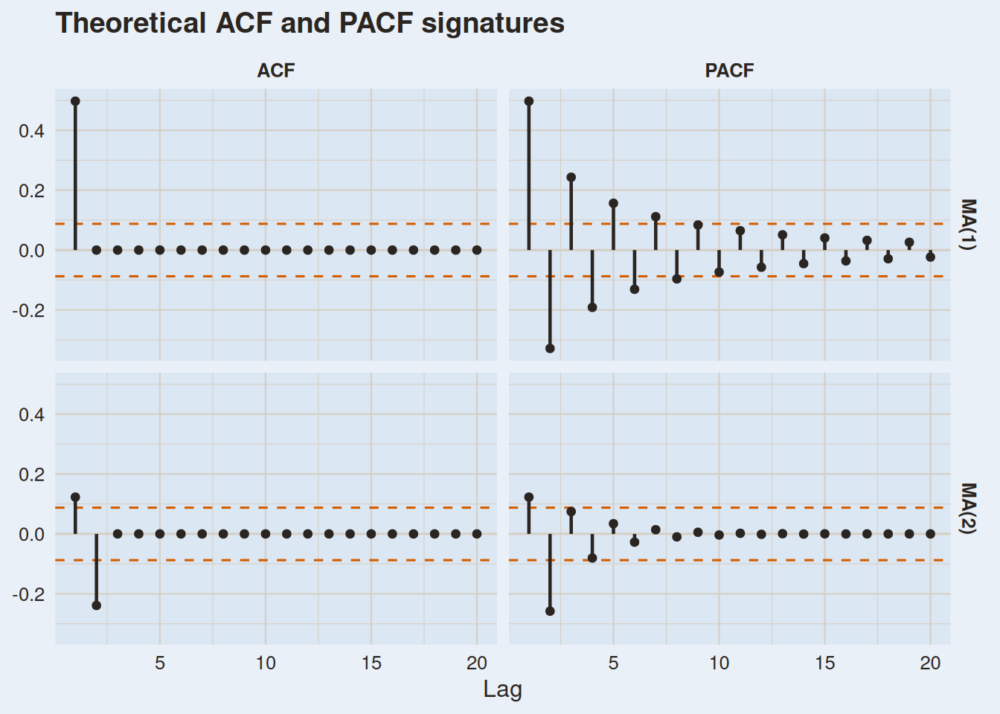](stationarity_files/figure-html/ma-acf-pacf-render-1.png)

[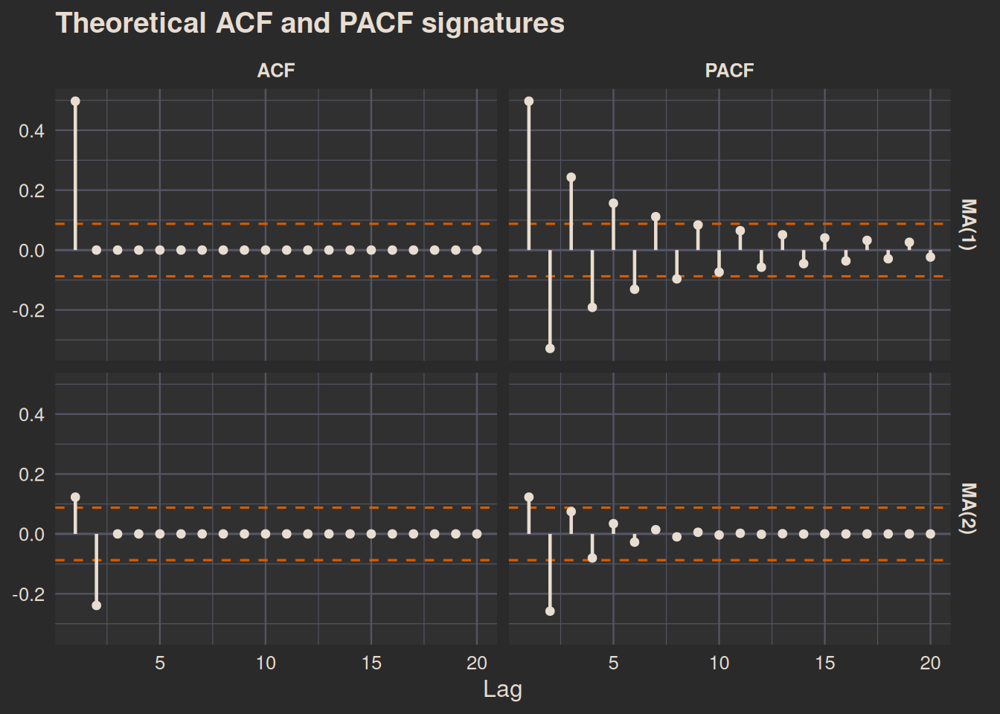](stationarity_files/figure-html/ma-acf-pacf-render-2.png)

> **IMPORTANT:**
>
> Now that you have seen AR and MA models: their time plots can look very similar to each other. The ACF and PACF are what distinguish them. This is fundamentally different from ETS, where the form of trend and seasonality in the time plot directly guides model selection — one of the key differences we will revisit when comparing these two families.

## 5.3 What Comes Next

In practice, you will rarely use a pure AR or pure MA model. Real series typically need both. And most real series also need differencing before any of this applies.

Combining differencing, AR terms, and MA terms into a single unified model — and applying it systematically to `mexretail` — is the subject of the next class.

> **NOTE:**
>
> - Stabilize **variance** → Box-Cox / log transformation ✓
> - Stabilize the **mean** → differencing ✓  
> - Detect **remaining correlation structure** → ACF and PACF ✓
> - Understand the building blocks → AR and MA terms ✓
>
> All the pieces are in place. Time to put them together.

Back to top

## Footnotes

[^1]: most commonly YoY (year-over-year), but remember there can be daily, weekly, or more seasonal patterns too.

[^2]: [](trinomio%20cuadrado%20perfecto.jpg)
