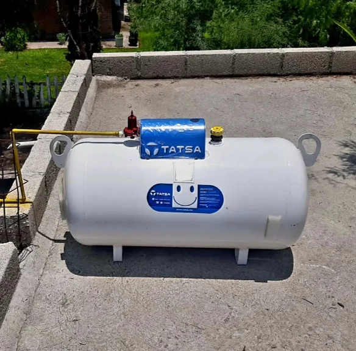

```{r}
#| label: pkgs
#| message: false
#| include: false

library(tidyverse)
library(fpp3)
library(ggtime)
```

:::{.content-visible unless-format="revealjs"}

```{r}
#| label: pkgs_special
#| message: false

library(tidyquant) #<1>
library(plotly)    #<1>
```

1. In addition to the regular packages, here we'll use `tidyquant` and `plotly`.

:::

```{r}
#| label: data-setup
#| include: false
#| message: false

mexretail <- tq_get(
  "MEXSLRTTO01IXOBM",
  get = "economic.data",
  from = "1985-01-01"
) |>
  mutate(date = yearmonth(date)) |>
  rename(y = price) |>
  as_tsibble(index = date)

lambda <- mexretail |>
  features(y, features = guerrero) |>
  pull(lambda_guerrero)

google_stock <- gafa_stock |>
  filter(Symbol == "GOOG") |>
  mutate(day = row_number()) |>
  update_tsibble(index = day, regular = TRUE) |>
  mutate(diff_close = difference(Close))

google_2015 <- google_stock |> filter(year(Date) == 2015)
```

# What Does "Stationary" Mean? 

:::{.content-hidden unless-format="revealjs"}

# What Does "Stationary" Mean? {background-image="https://github.com/pbenavidesh/narsil/blob/main/docs/modules/module_2/02_stationarity/stationary_tank.png"}

##

:::

Have you ever heard the word **stationary** before?

:::{.content-visible unless-format="revealjs"}

{width=50%}

:::


- In everyday language, **stationary** means *not moving* — fixed in place.
- For a time series, what would that mean?

:::{.callout-note appearance="simple"}
## Think about it

If a time series is "not moving", what statistical properties would you expect it to have?
:::

## The Formal Definition

A time series is **stationary** if its statistical properties — primarily its **mean** and **variance** — do not change over time.

:::{.incremental}

- The series fluctuates around a **constant mean**.
- The spread of those fluctuations stays **roughly constant** over time.
- There are no systematic patterns that change the level or scale of the series.

:::


# Are These Series Stationary?

```{r}
#| label: ts-plots-setup
#| include: false

p_google <- google_2015 |>
  autoplot(Close, color = "steelblue") +
  labs(title = "(a) Google stock price", y = "USD", x = "")

eggs <- as_tsibble(fma::eggs)
p_eggs <- eggs |>
  autoplot(value, color = "goldenrod3") +
  labs(title = "(b) Price of a dozen eggs (US)", y = "Constant US cents", x = "")

recent_production <- aus_production |>
  filter(year(Quarter) >= 1992 & year(Quarter) <= 1995)
p_beer <- recent_production |>
  autoplot(Beer, color = "coral3") +
  labs(title = "(c) Australian beer production", y = "Megalitres", x = "")

pigs <- aus_livestock |>
  filter(Animal == "Pigs", State == "Victoria")
p_pigs <- pigs |>
  autoplot(Count, color = "orchid4") +
  labs(title = "(d) Pigs slaughtered (Victoria)", y = "Count", x = "")

p_returns <- google_2015 |>
  autoplot(diff_close, color = "seagreen") +
  labs(title = "(e) Google stock daily returns", y = "Δ USD", x = "")

lynx <- pelt |> select(Year, Lynx)
p_lynx <- lynx |>
  autoplot(Lynx, color = "sienna") +
  labs(title = "(f) Lynx pelts traded", y = "Count", x = "")
```

:::{.content-visible unless-format="revealjs"}

Which of the following six series are stationary?

```{r}
#| label: all-six-html
#| echo: false
#| message: false
#| fig-height: 9

library(patchwork)
(p_google | p_eggs) / (p_beer | p_pigs) / (p_returns | p_lynx)
```

:::

:::{.content-hidden unless-format="revealjs"}

##

```{r}
#| label: trend-series-pres
#| echo: false

p_google
p_eggs
```

##

```{r}
#| label: seasonal-series-pres
#| echo: false

p_beer
p_pigs
```

##

```{r}
#| label: stationary-series-pres
#| echo: false

p_returns
p_lynx
```

:::


:::{.content-visible unless-format="revealjs"}

:::{.callout-tip collapse="false"}
## Answer

- **(a)** and **(b)**: clear trends (upward and downward) → **not stationary** ✗
- **(c)** and **(d)**: strong repeating seasonal pattern → **not stationary** ✗
- **(e)**: daily returns fluctuate around zero with constant spread → **stationary** ✓
- **(f)**: the cycling looks seasonal but has no fixed period — this is a *business cycle*. The series is **stationary** ✓

**Key distinction:** Seasonality repeats at a fixed, known frequency. Business cycles rise and fall irregularly.
:::

:::

## What Makes a Series Non-Stationary?

A time series is **non-stationary** if it exhibits any of the following:

:::{.incremental}

- **Trend** — a long-term increase or decrease in the mean.
- **Seasonality** — a repeating pattern that causes the mean to shift systematically.
- **Changing variance** — the spread of fluctuations grows or shrinks over time.

:::


# Why Does This Matter?


There is an important family of forecasting models that work by describing the **correlation structure** between a series and its own past values.

For those correlations to be stable and meaningful, the series needs to have a **constant mean and variance** — it needs to be stationary.

:::{.callout-note appearance="simple"}
## The key question

If these models require stationarity, does that mean they can *only* work with series that have no trend, no seasonality, and no changing variance?

Or is there something we can do to a non-stationary series to make it usable?
:::

## We Already Know Part of the Answer

Recall from Module 1: we can **stabilize the variance** using mathematical transformations — logarithms, Box-Cox, and so on.

$$w_t = \log(y_t) \qquad \text{or more generally} \qquad w_t = \frac{y_t^\lambda - 1}{\lambda}$$

But what about the **mean**? Transformations alone don't remove a trend or seasonal pattern.


# Differencing

Before naming the technique, look at these two series. The first is non-stationary. The second is stationary. The second was produced **directly from the first** — can you figure out how?

:::{.content-visible unless-format="revealjs"}

```{r}
#| label: google-reveal-plotly
#| echo: false
#| message: false

ggplotly(
  p_google + labs(title = "Google stock price"),
  dynamicTicks = TRUE
) |>
  bslib::card(full_screen = TRUE)

ggplotly(
  p_returns + labs(title = "Google stock daily returns"),
  dynamicTicks = TRUE
) |>
  bslib::card(full_screen = TRUE)
```

:::

:::{.content-hidden unless-format="revealjs"}

##

```{r}
#| label: google-reveal-pres
#| echo: false

p_google
```

##

```{r}
#| label: google-returns-pres
#| echo: false

p_returns
```

:::

:::{.callout-note appearance="simple"}
The daily return is simply today's price minus yesterday's price — the **change** between consecutive observations. This operation is called **differencing**, and it is how we stabilize the mean of a non-stationary series.
:::

:::{.callout-tip collapse="true"}
## Google stock and random walks

Google's stock price follows a **random walk**. Random walks are non-stationary, but their first differences are stationary — something we will revisit when we look at model equations.
:::

## First Differences

The **first difference** of a series $y_t$ is:

$$y'_t = y_t - y_{t-1}$$

:::{.incremental}

- The differenced series has $T - 1$ observations.
- First differences represent the *change* from one period to the next.
- If the original series has a linear trend, the differences will fluctuate around a constant mean.

:::

```{r}
#| label: google-tsdisplay
#| warning: false
#| message: false

google_2015 |>
  gg_tsdisplay(difference(Close), plot_type = "partial")
```

## Second Differences

Sometimes the first-differenced series is still non-stationary. We can **difference again**:

$$\begin{align}
y''_t &= y'_t - y'_{t-1} \\
      &= y_t - 2y_{t-1} + y_{t-2}
\end{align}$$

:::{.incremental}

- Second differences have $T - 2$ observations.
- They represent the *change in the changes* — acceleration rather than velocity.
- **Economic and business series almost never require more than two differences.**

:::

:::{.callout-warning appearance="simple"}
Needing three or more differences usually signals something else is wrong — an outlier, a structural break, or a transformation that should have been applied first.
:::

## Seasonal Differencing

If the series has seasonality, we take a **seasonal difference** — the change relative to the same period in the previous cycle:

$$y'_t = y_t - y_{t-m}$$

where $m$ is the seasonal period ($m = 12$ for monthly data, $m = 4$ for quarterly).

:::{.incremental}

- Seasonal differences represent *year-over-year change* at each point.
- Also called **lag-$m$ differences**.
- After seasonal differencing, any remaining non-seasonal trend can be removed with a first difference.

:::

```{r}
#| label: pbs-setup
#| message: false

h02 <- PBS |>
  filter(ATC2 == "H02") |>
  summarise(Cost = sum(Cost) / 1e6)
```

```{r}
#| label: h02-sdiff
#| warning: false
#| message: false

h02 |>
  gg_tsdisplay(difference(log(Cost), 12),
               plot_type = "partial",
               lag_max = 48)
```

## Does the Order of Differencing Matter?

When a series needs both seasonal and regular differencing, does it matter which one we apply first?

Let's introduce the **backshift operator** $B$, where $B^k y_t = y_{t-k}$, to work out the algebra cleanly:

- First difference: $(1 - B)\,y_t = y_t - y_{t-1}$
- Seasonal difference: $(1 - B^m)\,y_t = y_t - y_{t-m}$

Applying **seasonal first, then regular**:
$$(1 - B)(1 - B^m)\,y_t$$

Applying **regular first, then seasonal**:
$$(1 - B^m)(1 - B)\,y_t$$

Since $B$ follows ordinary algebraic rules, both expand to the same result:

$$y_t - y_{t-1} - y_{t-m} + y_{t-m-1}$$

:::{.callout-tip appearance="simple"}
The order **does not matter** — the result is always identical. In practice, if the seasonal pattern is strong, apply the seasonal difference first: the result may already be stationary without needing the regular difference.
:::

## Backshift Notation

The backshift operator $B$ is worth understanding properly — you will see it throughout the model equations in the next classes.

$$By_t = y_{t-1}, \qquad B^2y_t = y_{t-2}, \qquad B^m y_t = y_{t-m}$$

| Operation | Backshift form |
|:----------|:--------------|
| First difference | $(1 - B)\,y_t$ |
| Second difference | $(1 - B)^2\,y_t$ |
| Seasonal difference | $(1 - B^m)\,y_t$ |
| Both together | $(1 - B)(1 - B^m)\,y_t$ |


## Applying This to `mexretail`

`mexretail` has trend, seasonality, and growing variance. The full differencing pipeline:

::: {.panel-tabset}

### Levels

```{r}
#| label: mex-levels
#| echo: false
#| message: false

p <- mexretail |>
  autoplot(y, color = "springgreen4") +
  labs(title = "Levels — trend + seasonality + growing variance",
       y = "Index 2015=100", x = "")
ggplotly(p, dynamicTicks = TRUE)
```

### Log

```{r}
#| label: mex-log
#| echo: false
#| message: false
#| warning: false

p <- mexretail |>
  autoplot(log(y), color = "steelblue") +
  labs(title = "Log — variance partially stabilized, trend + seasonality remain",
       y = "log(Index)", x = "")
ggplotly(p, dynamicTicks = TRUE)
```

### Box-Cox

```{r}
#| label: mex-boxcox
#| echo: false
#| message: false
#| warning: false

p <- mexretail |>
  autoplot(box_cox(y, lambda), color = "steelblue") +
  labs(
    title = glue::glue("Box-Cox (λ = {round(lambda, 3)}) — variance better stabilized"),
    y = "box_cox(y, λ)", x = ""
  )
ggplotly(p, dynamicTicks = TRUE)
```

### Seasonal diff

```{r}
#| label: mex-sdiff
#| echo: false
#| message: false
#| warning: false

p <- mexretail |>
  autoplot(difference(box_cox(y, lambda), 12), color = "coral3") +
  labs(title = "Seasonal diff of Box-Cox — trend largely removed",
       y = "Δ₁₂ box_cox(y)", x = "")
ggplotly(p, dynamicTicks = TRUE)
```

### Seasonal + first diff

```{r}
#| label: mex-ddiff
#| echo: false
#| message: false
#| warning: false

p <- mexretail |>
  autoplot(difference(box_cox(y, lambda), 12) |> difference(1), color = "orchid4") +
  labs(title = "Seasonal + first diff of Box-Cox — approximately stationary",
       y = "Δ₁Δ₁₂ box_cox(y)", x = "")
ggplotly(p, dynamicTicks = TRUE)
```

:::


:::{.callout-note appearance="simple"}
## A question to think about before next class

We have been deciding how many differences to apply by looking at plots. But visual inspection is subjective — two analysts could disagree. Is there a more rigorous, objective way to make this call?

That is exactly where we pick up next time.
:::

# Unit Root Tests

Visual inspection is useful but subjective. **Unit root tests** formalize the question: *is this series stationary?*

The test we will use is the **KPSS test** (Kwiatkowski-Phillips-Schmidt-Shin).

:::{.callout-important appearance="simple"}
## Read the hypotheses carefully — they are the opposite of what you might expect

$$H_0: \text{the series IS stationary}$$
$$H_1: \text{the series is NOT stationary}$$

- **Large p-value** ($> 0.05$): fail to reject $H_0$ → the series is stationary ✓
- **Small p-value** ($< 0.05$): reject $H_0$ → the series needs differencing ✗

You *want* a large p-value here.
:::

## KPSS in R

```{r}
#| label: kpss-google
#| echo: true

google_2015 |> features(Close, unitroot_kpss)
```

```{r}
#| label: kpss-returns
#| echo: true

google_2015 |> features(diff_close, unitroot_kpss)
```


## Automated Differencing Orders

Rather than manually testing each transformation, `feasts` provides two functions that determine exactly how many differences are needed:

```{r}
#| label: nsdiffs-mexretail
#| echo: true

mexretail |> features(box_cox(y, lambda), unitroot_nsdiffs)
```

```{r}
#| label: ndiffs-mexretail
#| echo: true

mexretail |>
  features(difference(box_cox(y, lambda), 12), unitroot_ndiffs)
```


:::{.callout-tip collapse="true"}
## Full stationarity protocol for `mexretail`

1. Apply Box-Cox with Guerrero lambda to stabilize variance: `box_cox(y, lambda)`
2. Check seasonal differencing needed: `unitroot_nsdiffs()` → 1
3. Apply seasonal diff, then check regular: `unitroot_ndiffs()` → 1
4. Final stationary series: `difference(box_cox(y, lambda), 12) |> difference(1)`

When we fit the models in the next class, the algorithm will make these exact same choices automatically. Now you understand *why*.
:::

# ACF and PACF

We have already encountered the **ACF** when diagnosing residuals from our benchmark models — checking whether leftover errors looked like white noise. Here we use it for a different but related purpose: understanding the correlation structure of the series itself.

## Autocorrelation Function (ACF)

The **ACF** measures the correlation between a series and its own past values at each lag $k$:

$$r_k = \text{Corr}(y_t,\, y_{t-k})$$

:::{.callout-note appearance="simple"}
## ACF as a stationarity diagnostic

- **Stationary** series: ACF drops to zero **quickly**.
- **Non-stationary** series: ACF decays **very slowly**, with the lag-1 value close to 1.

This gives us another way to detect non-stationarity — and, as we will see, it also tells us about the structure of the model to fit.
:::

## ACF Shapes for Different Patterns

::: {.panel-tabset}

### Trend only

```{r}
#| label: acf-trend
#| echo: false
#| message: false

google_2015 |> ACF(Close) |> autoplot() +
  labs(title = "ACF: Google stock price (trend) — very slow decay")
```

### Seasonality only

```{r}
#| label: acf-season-only
#| echo: false
#| message: false
#| warning: false

mexretail |>
  model(stl = STL(box_cox(y, lambda) ~ trend(window = NULL), robust = TRUE)) |>
  components() |>
  mutate(season_only =  `box_cox(y, lambda)` - trend) |>
  ACF(season_only, lag_max = 48) |>
  autoplot() +
  labs(title = "ACF: mexretail detrended (seasonality only) — repeating pattern at seasonal lags")
```

### Trend + seasonality

```{r}
#| label: acf-trend-season
#| echo: false
#| message: false

mexretail |> ACF(y, lag_max = 48) |> autoplot() +
  labs(title = "ACF: mexretail levels (trend + seasonality) — slow decay with seasonal bumps")
```

### Stationary

```{r}
#| label: acf-stationary
#| echo: false
#| message: false

google_2015 |> ACF(diff_close) |> autoplot() +
  labs(title = "ACF: Google daily returns (stationary) — drops to zero quickly")
```

### mexretail after differencing

```{r}
#| label: acf-mexretail-diff
#| echo: false
#| message: false
#| warning: false

mexretail |>
  ACF(difference(box_cox(y, lambda), 12) |> difference(1)) |>
  autoplot() +
  labs(title = "ACF: Δ₁Δ₁₂ box_cox(mexretail) — stationary, with remaining structure to model")
```

:::

## Partial Autocorrelation Function (PACF)

The ACF at lag $k$ captures both the *direct* relationship between $y_t$ and $y_{t-k}$ and the *indirect* relationship mediated through intermediate lags. The **PACF** isolates only the direct part.

:::{.callout-tip appearance="simple"}
## The regression analogy

- **ACF at lag $k$**: simple correlation between $y_t$ and $y_{t-k}$.
- **PACF at lag $k$**: the coefficient on $y_{t-k}$ in a regression of $y_t$ on $y_{t-1}, y_{t-2}, \ldots, y_{t-k}$.

The PACF asks: *once I already know the effect of all closer lags, does lag $k$ add any new information?*
:::


## ACF and PACF Together

`gg_tsdisplay()` with `plot_type = "partial"` shows the time series, ACF, and PACF together — this is the standard diagnostic display for the rest of the module.

```{r}
#| label: tsdisplay-mexretail
#| warning: false
#| message: false

mexretail |>
  gg_tsdisplay(
    difference(box_cox(y, lambda), 12) |> difference(1),
    plot_type = "partial",
    lag_max = 48
  )
```


# AR and MA Models

:::{.callout-important appearance="simple"}
## You cannot identify a model from the time plot alone

The time plot of a stationary series shows its *levels*. The model structure lives in its *correlations*. Two series with very different time plots can have the same correlation structure — and vice versa. This is precisely why we need the ACF and PACF.

Note: this is a key difference from ETS, where the form of trend and seasonality in the time plot directly guides model selection.
:::

## Autoregressive Models — AR($p$)

An **autoregressive model** of order $p$ forecasts $y_t$ as a weighted sum of its own **past values**:

$$y_t = c + \phi_1 y_{t-1} + \phi_2 y_{t-2} + \cdots + \phi_p y_{t-p} + \varepsilon_t$$

:::{.incremental}

- Structurally identical to multiple linear regression — except the predictors are *lagged values of the series itself*.
- $p$ is the number of past values used.
- $\varepsilon_t$ is white noise.

:::


:::{.callout-note appearance="simple"}
## Signature in ACF/PACF

- **PACF** cuts off sharply after lag $p$ — this is how you read the order.
- **ACF** decays gradually (exponentially or with damped oscillations).
:::

```{r}
#| label: ar-examples
#| echo: false
#| message: false
#| fig-height: 3
#| warning: false

set.seed(42)
ar1_sim <- arima.sim(list(order = c(1, 0, 0), ar = 0.8), n = 150) |>
  as_tsibble()
ar2_sim <- arima.sim(list(order = c(2, 0, 0), ar = c(1.3, -0.7)), n = 150) |>
  as_tsibble()

library(patchwork)
(ar1_sim |> autoplot(value, color = "steelblue") +
  labs(title = "Simulated AR(1): φ₁ = 0.8", x = "", y = "")) |
(ar2_sim |> autoplot(value, color = "coral3") +
  labs(title = "Simulated AR(2): φ₁ = 1.3, φ₂ = −0.7", x = "", y = ""))
```

## Moving Average Models — MA($q$)

A **moving average model** of order $q$ forecasts $y_t$ as a weighted sum of **past forecast errors**:

$$y_t = c + \varepsilon_t + \theta_1 \varepsilon_{t-1} + \theta_2 \varepsilon_{t-2} + \cdots + \theta_q \varepsilon_{t-q}$$

:::{.incremental}

- The predictors are *past errors*, not past values of the series.
- $q$ is the number of past errors used.
- $\varepsilon_t$ is white noise.

:::

:::{.callout-warning appearance="simple"}
## MA models ≠ moving average smoothing

Do not confuse MA *models* with the moving average *smoothing* used in decomposition. Smoothing estimates the trend-cycle from past observed values. MA models use past *errors* to describe the correlation structure of the series.
:::

:::{.callout-note appearance="simple"}
## Signature in ACF/PACF

- **ACF** cuts off sharply after lag $q$ — the mirror image of the AR signature.
- **PACF** decays gradually.
:::

:::{.callout-important appearance="simple"}
## You cannot identify a model from the time plot alone

Now that you have seen AR and MA models: their time plots can look very similar to each other. The ACF and PACF are what distinguish them. This is fundamentally different from ETS, where the form of trend and seasonality in the time plot directly guides model selection — one of the key differences we will revisit when comparing these two families.
:::

## What Comes Next

In practice, you will rarely use a pure AR or pure MA model. Real series typically need both. And most real series also need differencing before any of this applies.

Combining differencing, AR terms, and MA terms into a single unified model — and applying it systematically to `mexretail` — is the subject of the next class.

:::{.callout-note appearance="simple"}
## Where we are in the bigger picture

- Stabilize **variance** → Box-Cox / log transformation ✓
- Stabilize the **mean** → differencing ✓  
- Detect **remaining correlation structure** → ACF and PACF ✓
- Understand the building blocks → AR and MA terms ✓

All the pieces are in place. Time to put them together.
:::
