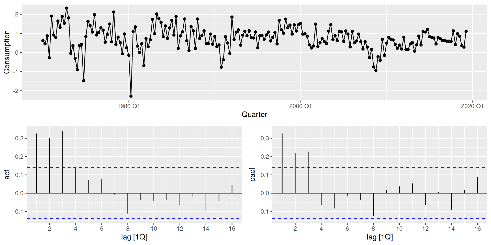
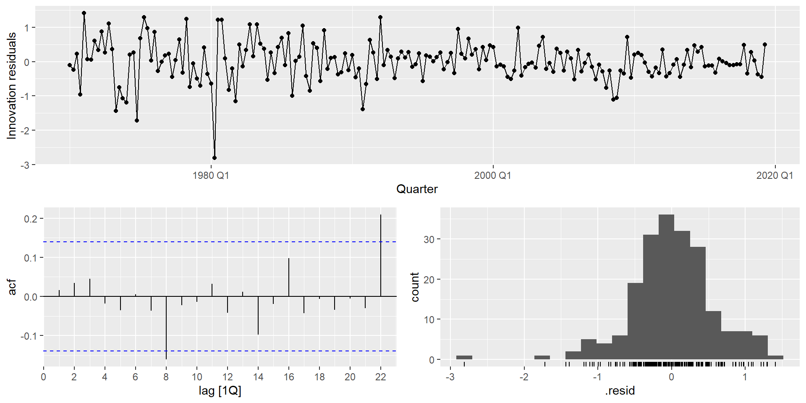
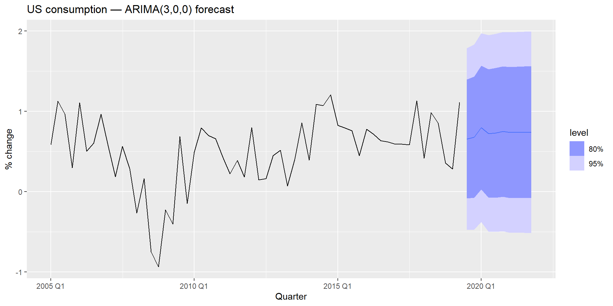
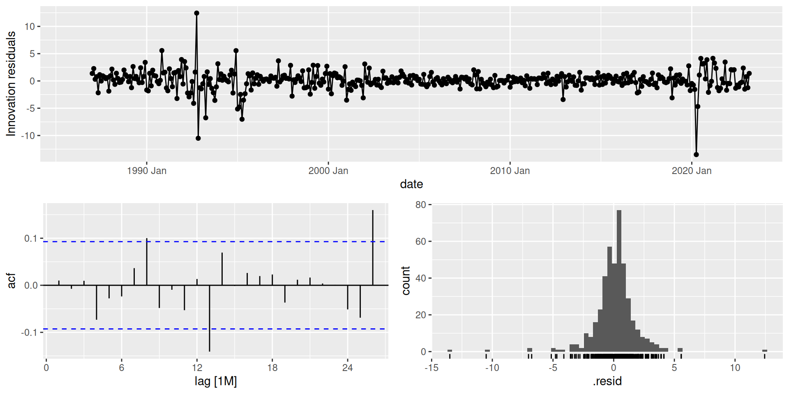
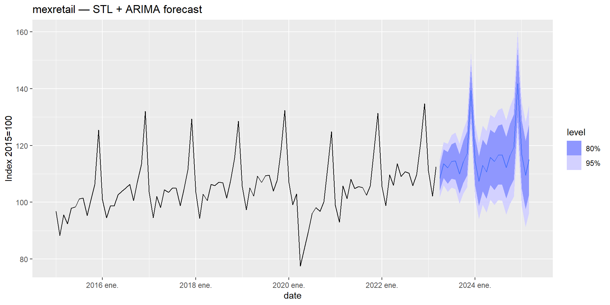
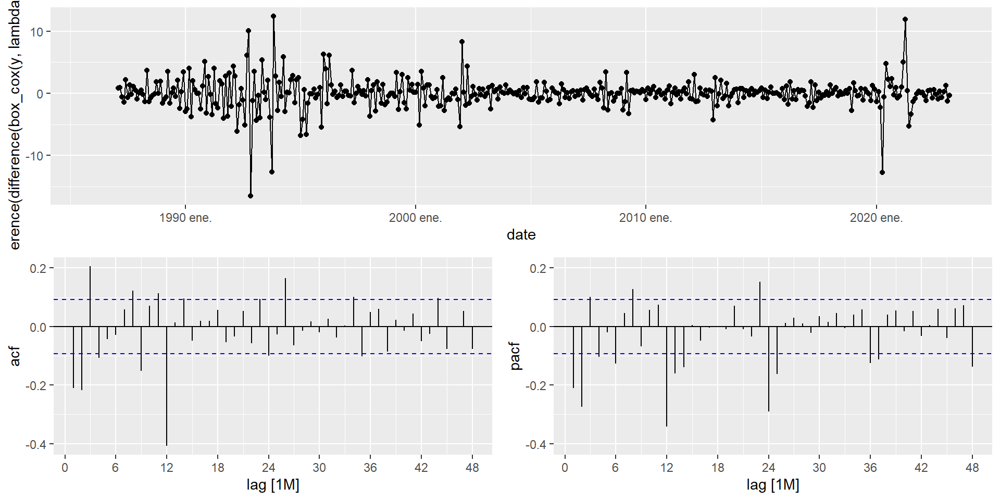
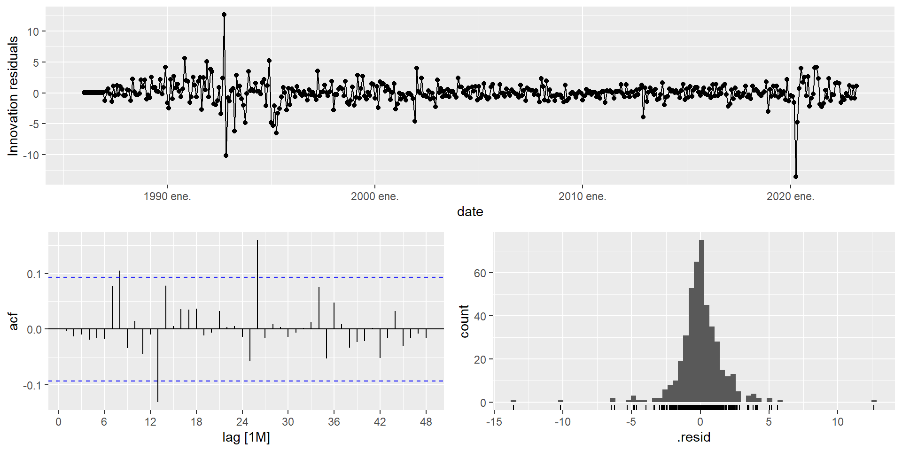
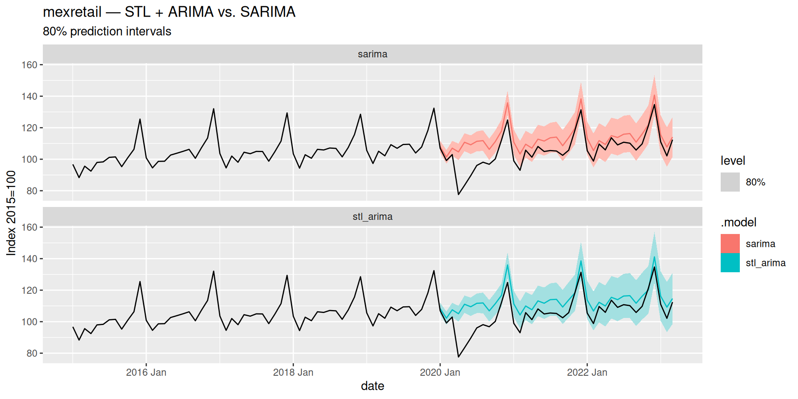
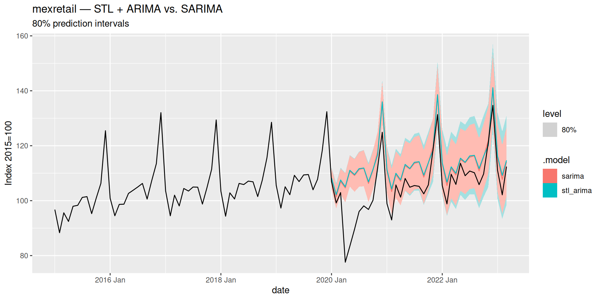

# ARIMA Models

Modified

June 4, 2026

Code

``` r
library(tidyquant) #<1>
library(plotly)    #<1>
```

1.  In addition to the regular packages, here we’ll use `tidyquant` and `plotly`.

# 1 ARIMA Models

In the [previous topic](../../../../docs/modules/module_2/02_stationarity/stationarity.llms.md#ar-and-ma-models) we introduced the two basic building blocks for modeling the correlation structure of a stationary time series:

- **AR(p):** forecast y_t using its own p past values.
- **MA(q):** forecast y_t using q past forecast errors.

In practice, neither model alone is usually sufficient. Real series often show patterns that require *both* autoregressive and moving average components simultaneously. And most real series are also **non-stationary** — they have trend, seasonality, or both.

> **NOTE:**
>
> If we could combine AR and MA terms *and* relax the stationarity requirement by incorporating differencing directly into the model, we would have a single, unified framework for a very wide range of time series.
>
> That framework is **ARIMA**.

## 1.1 The ARIMA Equation

**ARIMA** stands for **A**uto**R**egressive **I**ntegrated **M**oving **A**verage. The “Integrated” part refers to the reverse operation of differencing: if we difference a series d times to make it stationary, the model is said to be integrated of order d.

A non-seasonal ARIMA model is written as **ARIMA(p, d, q)**, where:

- p — order of the **autoregressive** component (how many past values)
- d — order of **differencing** (how many times we difference to achieve stationarity)
- q — order of the **moving average** component (how many past errors)

The model equation, written on the **differenced series** y'\_t, is:

y'\_t = c + \phi_1 y'\_{t-1} + \cdots + \phi_p y'\_{t-p} + \theta_1 \varepsilon\_{t-1} + \cdots + \theta_q \varepsilon\_{t-q} + \varepsilon_t

where y'\_t denotes the d-times differenced series and \varepsilon_t is white noise.

## 1.2 Backshift Notation

Recall from the [previous topic](../../../../docs/modules/module_2/02_stationarity/stationarity.llms.md#backshift-notation) that the backshift operator B satisfies By_t = y\_{t-1}, and that d-th order differencing can be written as (1-B)^d y_t.

Using this notation, we can write the AR and MA components compactly as well:

**AR component:** \phi_1 y\_{t-1} + \phi_2 y\_{t-2} + \cdots + \phi_p y\_{t-p} = \phi(B)\\y_t

where \phi(B) = \phi_1 B + \phi_2 B^2 + \cdots + \phi_p B^p.

**MA component:** \theta_1 \varepsilon\_{t-1} + \theta_2 \varepsilon\_{t-2} + \cdots + \theta_q \varepsilon\_{t-q} = \theta(B)\\\varepsilon_t

where \theta(B) = \theta_1 B + \theta_2 B^2 + \cdots + \theta_q B^q.

**Full ARIMA(p, d, q) in backshift notation:**

\underbrace{(1 - \phi_1 B - \cdots - \phi_p B^p)}\_{\text{AR}(p)} \underbrace{(1-B)^d}\_{\text{differencing}} y_t = c + \underbrace{(1 + \theta_1 B + \cdots + \theta_q B^q)}\_{\text{MA}(q)} \varepsilon_t

This compact form shows clearly how the three components interact. The differencing operator (1-B)^d is applied first, and the AR and MA operators act on the resulting stationary series.

## 1.3 Special Cases

Several models we have already encountered are special cases of the ARIMA family:

| Model                  | ARIMA specification             |
|:-----------------------|:--------------------------------|
| White noise            | ARIMA(0, 0, 0) without constant |
| Random walk            | ARIMA(0, 1, 0) without constant |
| Random walk with drift | ARIMA(0, 1, 0) with constant    |
| AR(p)                  | ARIMA(p, 0, 0)                  |
| MA(q)                  | ARIMA(0, 0, q)                  |

> **TIP:**
>
> The constant c and the differencing order d interact to determine the long-run behavior of ARIMA forecasts:
>
> - d = 0, c = 0: forecasts go to zero.
> - d = 0, c \neq 0: forecasts go to the mean of the series.
> - d = 1, c = 0: forecasts approach a non-zero constant.
> - d = 1, c \neq 0: forecasts follow a straight line.
> - d = 2, c \neq 0: forecasts follow a quadratic trend.
>
> Higher values of d also produce wider prediction intervals that grow faster.

# 2 ARIMA in R

## 2.1 Choosing the Orders

Selecting the right ARIMA order involves three decisions:

1.  **Choose d** — determine how many differences are needed using the stationarity protocol from the [previous topic](../../../../docs/modules/module_2/02_stationarity/stationarity.llms.md#unit-root-tests): Box-Cox / log transformation to stabilize variance, `unitroot_nsdiffs()` for seasonal differencing (if any), then `unitroot_ndiffs()` on the differenced series.

2.  **Choose p or q** — read the ACF and PACF of the (differenced, stationary) series:

    - **PACF cuts off** after lag p → AR(p) component.
    - **ACF cuts off** after lag q → MA(q) component.
    - Both decay gradually → mixed ARMA, try several combinations.

3.  **Compare candidates** using information criteria (see [Model Selection](#sec-model-selection)).

> **WARNING:**
>
> Real data rarely produces textbook-perfect ACF/PACF shapes. Use the plots to narrow down candidate models, then compare them formally with AIC\_c.

## 2.2 Manual and Automatic Specification

In `fable`, ARIMA models are specified inside `model()` using the `ARIMA()` function. The order is controlled with `pdq()` for non-seasonal terms and `PDQ()` for seasonal terms. When `pdq()` is left unspecified, `fable` searches for the best order automatically.

[](arima_files/figure-revealjs/us-change-tsdisplay-1.png)

The series appears stationary (d = 0). The PACF shows significant spikes at lags 1–3, suggesting AR(3). We can fit this manually, compare it against automatic selection strategies, and let AIC\_c arbitrate — all within a single `mable`:

Code

``` r
us_change_fit <- us_change |>
  model(
    manual     = ARIMA(Consumption ~ pdq(3, 0, 0) + PDQ(0, 0, 0)),     #<1>
    auto       = ARIMA(Consumption ~ PDQ(0, 0, 0)),                     #<2>
    semi_auto  = ARIMA(Consumption ~ pdq(1:3, 0, 0:2) + PDQ(0, 0, 0)), #<3>
    exhaustive = ARIMA(Consumption ~ PDQ(0, 0, 0),
                       stepwise      = FALSE,                           #<4>
                       approximation = FALSE)                           #<5>
  )

glance(us_change_fit) |>
  arrange(AICc) |>
  select(.model, AIC, AICc, BIC)
```

1.  Manual specification using `pdq()`. `PDQ(0,0,0)` explicitly forces a non-seasonal model.
2.  Leaving `pdq()` unspecified triggers automatic stepwise order selection.
3.  Evaluates all combinations of p \in \\1,2,3\\ and q \in \\0,1,2\\, returns the lowest AIC\_c.
4.  `stepwise = FALSE` explores all combinations rather than navigating step by step.
5.  `approximation = FALSE` uses exact likelihood. More accurate but slower on long series.

> **NOTE:**
>
> `fable` implements a stepwise search algorithm (Hyndman & Khandakar, 2008) that:
>
> 1.  Determines d using unit root tests.
> 2.  Starts from a simple model and navigates through the order space by comparing AIC\_c values.
> 3.  Stops when no neighboring model improves AIC\_c.
>
> **Important:** this is a heuristic search — it does *not* evaluate all possible combinations. It is fast and usually good, but not guaranteed to find the global optimum.

> **TIP:**
>
> For exploratory work, automatic selection is fine. For a final model, use `stepwise = FALSE, approximation = FALSE` and compare the result with your manually identified candidate.

> **TIP:**
>
> `stepwise = FALSE, approximation = FALSE` triggers a full search over all candidate models using exact likelihood. The difference in runtime can be dramatic:
>
> Code
>
> ``` r
> tictoc::tic("auto")
> us_change |>
>   model(ARIMA(Consumption ~ PDQ(0, 0, 0)))
> ```
>
> Code
>
> ``` r
> tictoc::toc()
> ```
>
>     auto: 0.12 sec elapsed
>
> Code
>
> ``` r
> tictoc::tic("exhaustive")
> us_change |>
>   model(ARIMA(Consumption ~ PDQ(0, 0, 0),
>               stepwise      = FALSE,
>               approximation = FALSE))
> ```
>
> Code
>
> ``` r
> tictoc::toc()
> ```
>
>     exhaustive: 0.75 sec elapsed
>
> Times will vary by hardware, but the **relative difference** is what matters. On longer series like `mexretail` (480+ monthly observations with seasonal structure), the gap is even more pronounced — which is why `freeze` is recommended for documents containing exhaustive ARIMA searches.

## 2.3 Model Selection

When we fit a statistical model, we face a fundamental tension: a more complex model (more parameters) will always fit the observed data better, but it may simply be memorizing noise rather than capturing genuine structure. This is the **bias-variance tradeoff**.

**Information criteria** address this by penalizing model complexity — they reward goodness of fit but add a cost for each additional parameter estimated. The goal is to find the model that generalizes best, not the one that fits best in-sample.

When comparing candidate ARIMA models, we use three related criteria:

- **AIC** — Akaike Information Criterion
- **AIC\_c** — AIC corrected for small sample sizes
- **BIC** — Bayesian Information Criterion (also known as Schwarz criterion)

\text{AIC} = -2\log(L) + 2(p + q + k + 1)

\text{AIC}\_c = \text{AIC} + \frac{2(p + q + k + 1)(p + q + k + 2)}{T - p - q - k - 2}

\text{BIC} = \text{AIC} + \[\log(T) - 2\](p + q + k + 1)

where k = 1 if the model includes a constant, k = 0 otherwise. **Lower is better** for all three. The preferred criterion is AIC\_c — it converges to AIC as T grows, but is more conservative with small samples.

> **TIP:**
>
> Both penalize complexity, but BIC applies a heavier penalty (it grows with \log T rather than a fixed 2). In practice:
>
> - **AIC\_c** tends to select slightly richer models and is generally preferred for forecasting.
> - **BIC** tends to select more parsimonious models and is preferred when interpretability matters.
>
> For this course, use **AIC\_c** as the default.

> **IMPORTANT:**
>
> Information criteria are only comparable across models fitted to **identical data** — same transformation, same differencing order. You cannot compare AIC\_c of an ARIMA fitted to \log(y_t) vs. one fitted to y_t, or ARIMA(1,1,1) vs. ARIMA(1,0,1). When models differ in d, use forecast accuracy on a test set instead.

## 2.4 Box-Jenkins Methodology

ARIMA model building follows an iterative procedure known as the **Box-Jenkins methodology**:

1.  **Plot the data.** Identify unusual observations, structural breaks, outliers.
2.  **Stabilize the variance** if needed — apply a log or Box-Cox transformation.
3.  **Determine d** — use `unitroot_nsdiffs()` and `unitroot_ndiffs()`.
4.  **Examine ACF and PACF** of the stationary series to identify candidate orders p and q.
5.  **Fit candidate models** and compare using AIC\_c.
6.  **Check residuals** — ACF of residuals and Ljung-Box test. If not white noise, refine.
7.  **Forecast** once residuals pass diagnostic checks.

> **NOTE:**
>
> The Box-Jenkins procedure is a cycle, not a checklist. It is normal to go through steps 4–6 two or three times before settling on a model.

## 2.5 Residual Diagnostics

We have already used the Ljung-Box test to check residuals from benchmark models. When applying it to **ARIMA models**, there is one important adjustment: you must account for the degrees of freedom consumed by the estimated AR and MA parameters.

Code

``` r
us_change_fit |>
  select(manual) |>
  gg_tsresiduals()
```

[](arima_files/figure-revealjs/us-change-residuals-1.png)

Code

``` r
us_change_fit |>
  select(manual) |>
  augment() |>
  features(.innov, ljung_box,
           lag = 10,
           dof = us_change_fit |>                          #<1>
                   select(manual) |>
                   coefficients() |>
                   filter(str_detect(term, "^ar|^ma")) |>
                   nrow())
```

1.  `dof` is computed dynamically as the number of estimated AR and MA coefficients, so it always matches the fitted model regardless of order.

## 2.6 Forecasting

Once the model passes residual diagnostics, forecasting uses the same `forecast()` workflow as all other `fable` models:

Code

``` r
us_change_fit |>
  select(manual) |>
  forecast(h = 10) |>
  autoplot(us_change |> filter(year(Quarter) >= 2005)) +
  labs(
    title = "US consumption — ARIMA(3,0,0) forecast",
    y = "% change"
  )
```

[](arima_files/figure-revealjs/us-change-forecast-1.png)

> **NOTE:**
>
> ARIMA prediction intervals are derived analytically from the model’s MA representation. Their width grows with the forecast horizon, and **grows faster as d increases** — a direct consequence of accumulated uncertainty from differencing. For a random walk (d = 1), intervals widen at rate \sqrt{h}; for d = 2, they widen even faster.

# 3 Seasonal ARIMA

## 3.1 STL + ARIMA

`mexretail` is a monthly series with strong trend and seasonality. We already know how to handle it with STL decomposition. In Module 1 we combined STL with SNAIVE; in Module 2 we replaced SNAIVE with ETS. The natural next step is to replace it with ARIMA.

The idea is the same: use STL to handle the seasonal pattern, and let ARIMA model the trend-cycle on the **seasonally adjusted series**.

Code

``` r
mexretail_fit_stl_arima <- mexretail |>
  model(
    stl_arima = decomposition_model(       #<1>
      STL(box_cox(y, lambda) ~             #<2>
            season(window = "periodic"),
          robust = TRUE),
      ARIMA(season_adjust ~ PDQ(0,0,0))    #<3>
    )
  )

report(mexretail_fit_stl_arima)
```

1.  `decomposition_model()` combines a decomposition method with a model for one or more of its components.
2.  STL decomposes the Box-Cox-transformed series. The seasonal component is handled implicitly by the decomposition.
3.  `ARIMA(season_adjust)` fits an ARIMA model automatically to the seasonally adjusted component. The seasonal part is re-added when generating forecasts.

    Series: y 
    Model: STL decomposition model 
    Transformation: box_cox(y, lambda) 
    Combination: season_adjust + season_year

    ========================================

    Series: season_adjust 
    Model: ARIMA(0,1,1) w/ drift 

    Coefficients:
              ma1  constant
          -0.4500    0.1007
    s.e.   0.0433    0.0491

    sigma^2 estimated as 3.553:  log likelihood=-914.69
    AIC=1835.38   AICc=1835.43   BIC=1847.68

    Series: season_year 
    Model: SNAIVE 

    sigma^2: 0 

Code

``` r
mexretail_fit_stl_arima |> gg_tsresiduals()
```

[](arima_files/figure-revealjs/stl-arima-residuals-1.png)

Code

``` r
mexretail_fit_stl_arima |>
  forecast(h = 24) |>
  autoplot(mexretail |> filter(year(date) >= 2015)) +
  labs(
    title = "mexretail — STL + ARIMA forecast",
    y = "Index 2015=100"
  )
```

[](arima_files/figure-revealjs/stl-arima-forecast-1.png)

## 3.2 SARIMA

STL + ARIMA is a two-stage approach: decompose first, then model. An alternative is to handle seasonality **within a single ARIMA model** by adding seasonal AR and MA terms. This is a **Seasonal ARIMA** model, written as:

\text{ARIMA}\underbrace{(p,\\d,\\q)}\_{\text{non-seasonal}}\underbrace{(P,\\D,\\Q)\_{m}}\_{\text{seasonal}}

where m is the seasonal period (m = 12 for monthly data).

The full model in backshift notation is:

\underbrace{\Phi(B^m)}\_{\text{seasonal AR}} \underbrace{\phi(B)}\_{\text{non-seasonal AR}} \underbrace{(1-B^m)^D (1-B)^d}\_{\text{differencing}} y_t = c + \underbrace{\Theta(B^m)}\_{\text{seasonal MA}} \underbrace{\theta(B)}\_{\text{non-seasonal MA}} \varepsilon_t

### 3.2.1 Reading ACF/PACF for Seasonal Orders

The non-seasonal orders (p, q) are read from the first few lags of the ACF/PACF, as before. The seasonal orders (P, Q) are read from the **seasonal lags** (m, 2m, 3m, …):

| Pattern at seasonal lags         | Suggested component |
|:---------------------------------|:--------------------|
| PACF spikes cut off after lag Pm | Seasonal AR(P)      |
| ACF spikes cut off after lag Qm  | Seasonal MA(Q)      |
| Both decay gradually             | Mixed seasonal ARMA |

> **TIP:**
>
> Focus on the seasonal lags *separately* from the non-seasonal lags. Use `lag_max = 3m` or `4m` to make the seasonal structure clearly visible.

### 3.2.2 SARIMA for `mexretail`

The stationarity protocol for `mexretail` established that we need D = 1 and d = 1 applied to the Box-Cox-transformed series. Let’s inspect the ACF/PACF to choose p, q, P, Q:

Code

``` r
mexretail |>
  gg_tsdisplay(
    difference(box_cox(y, lambda), 12) |> difference(1),
    plot_type = "partial",
    lag_max   = 48
  )
```

[](arima_files/figure-revealjs/mexretail-tsdisplay-1.png)

> **NOTE:**
>
> - **Non-seasonal lags (1–11):**
>   - ACF: spike at lag 1, and up to lag 4 → try q = 1 up to q = 4.
>   - PACF: spikes at lags 1 and 2, borderline at lag 3 → try p = 2 or p = 3.
> - **Seasonal lags (12, 24, 36, 48):**
>   - ACF: spike at lag 12, barely at lag 24 → try Q = 1 or Q = 2.
>   - PACF: spikes at lags 12, 24, and slightly at 36 and 48 → try P = 2, P = 3, or even P = 4.

> **TIP:**
>
> A strict reading of the ACF/PACF above could justify orders as large as AR(3), MA(4), SAR(4), SMA(2) — a model with over a dozen parameters. In practice, this is rarely a good starting point: high-order models are harder to estimate, more prone to overfitting, and — if specified manually — can fail to converge or return non-invertible roots altogether.
>
> A better strategy: start with a parsimonious candidate like \text{ARIMA}(0,1,1)(0,1,1)\_{12} or \text{ARIMA}(1,1,1)(1,1,1)\_{12}, fit a few of the larger candidates suggested by the plots, and let AIC\_c arbitrate. You will often find that the simpler model performs comparably or better — and it will always be more stable.

Code

``` r
mexretail_fit_sarima <- mexretail |>
  model(
    sarima_011_110 = ARIMA(box_cox(y, lambda) ~
                             pdq(0, 1, 1) + PDQ(1, 1, 0)), #<1>
    sarima_011_011 = ARIMA(box_cox(y, lambda) ~
                             pdq(0, 1, 1) + PDQ(0, 1, 1)), #<2>
    sarima_auto    = ARIMA(box_cox(y, lambda),              #<3>
                           stepwise      = FALSE,
                           approximation = FALSE)
  )

glance(mexretail_fit_sarima) |>
  arrange(AICc) |>
  select(.model, AIC, AICc, BIC)
```

1.  First candidate from ACF/PACF: non-seasonal MA(1), seasonal AR(1).
2.  Second candidate: non-seasonal MA(1), seasonal MA(1) — a very common structure for monthly economic data.
3.  Exhaustive automatic search for comparison.

Code

``` r
mexretail_fit_sarima |>
  select(sarima_auto) |>
  report()
```

    Series: y 
    Model: ARIMA(3,0,1)(0,1,2)[12] w/ drift 
    Transformation: box_cox(y, lambda) 

    Coefficients:
             ar1     ar2     ar3     ma1     sma1     sma2  constant
          0.2930  0.3114  0.3143  0.3671  -0.6877  -0.0956    0.0931
    s.e.  0.1848  0.1454  0.0521  0.1975   0.0526   0.0534    0.0274

    sigma^2 estimated as 3.303:  log likelihood=-879.31
    AIC=1774.62   AICc=1774.95   BIC=1807.22

Code

``` r
mexretail_fit_sarima |>
  select(sarima_auto) |>
  gg_tsresiduals(lag_max = 48)
```

[](arima_files/figure-revealjs/sarima-residuals-1.png)

Code

``` r
mexretail_fit_sarima |>
  select(sarima_auto) |>
  augment() |>
  features(.innov, ljung_box,
           lag = 24,
           dof = mexretail_fit_sarima |>                        #<1>
                   select(sarima_auto) |>
                   coefficients() |>
                   filter(str_detect(term, "^ar|^ma|^sar|^sma")) |>
                   nrow())
```

1.  `dof` is computed dynamically as p + q + P + Q for the fitted model, so it always reflects the actual order selected by the exhaustive search.

# 4 STL + ARIMA vs. SARIMA

Both approaches are valid for seasonal series. Let’s compare them on `mexretail` using a train/test split:

Code

``` r
mexretail_train <- mexretail |> filter(year(date) <= 2019)
mexretail_test  <- mexretail |> filter(year(date) >  2019)
```

Code

``` r
mexretail_fit <- mexretail_train |>
  model(
    stl_arima = decomposition_model(
      STL(box_cox(y, lambda) ~
            trend(window = NULL) +
            season(window = "periodic"),
          robust = TRUE),
      ARIMA(season_adjust)
    ),
    sarima = ARIMA(box_cox(y, lambda),
                   stepwise      = FALSE,
                   approximation = FALSE)
  )
```

Code

``` r
mexretail_fit |>
  forecast(h = nrow(mexretail_test)) |>
  accuracy(mexretail) |>
  select(.model, RMSE, MAE, MAPE, MASE) |>
  arrange(RMSE)
```

[](arima_files/figure-revealjs/comparison-plot-facet-1.png)

[](arima_files/figure-revealjs/comparison-plot-overlay-1.png)

> **NOTE:**
>
> |  | STL + ARIMA | SARIMA |
> |:---|:---|:---|
> | **Seasonal pattern** | Flexible — can change over time | Fixed structure |
> | **Outlier robustness** | High (with `robust = TRUE`) | Lower |
> | **Interpretability** | Decomposition is visible | Single compact model |
> | **Multiple seasonality** | Handles it naturally | Difficult |
> | **Parsimony** | Two models in sequence | One unified model |
>
> Neither approach dominates universally. Let the data and the accuracy metrics guide the choice.

Back to top
