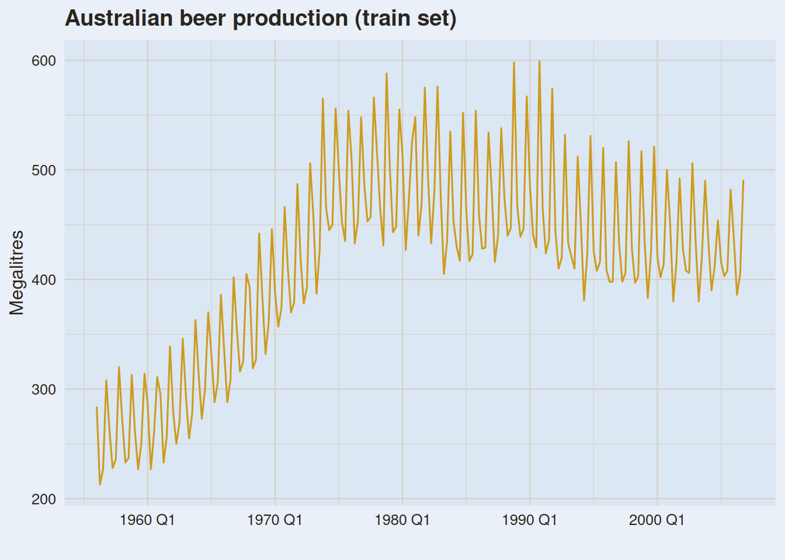

# Modular Forecasting: Mixing ETS and ARIMA

Modified

June 10, 2026

Code

``` r
library(tidyquant) #<1>
library(plotly)    #<1>
```

1.  In addition to the regular packages, here we’ll use `tidyquant` and `plotly`.

> **NOTE:**
>
> `mexretail` was first introduced in [Module 1 — Time Series Decomposition](../../../../docs/modules/module_1/02_ts_dcmp/ts_dcmp.llms.md#ts-features--patterns) and has been our running dataset throughout Module 2.
>
> Code
>
> ``` r
> mexretail <- tq_get(
>   "MEXSLRTTO01IXOBM",
>   get = "economic.data",
>   from = "1985-01-01"
> ) |>
>   mutate(date = yearmonth(date)) |>
>   rename(y = price) |>
>   as_tsibble(index = date)
>
> mexretail_train <- mexretail |> filter(year(date) <= 2019)
> mexretail_test  <- mexretail |> filter(year(date) >  2019)
> ```

# 1 Where We Are

Module 2 has added two new model families to our toolkit. Together with `decomposition_model()`, they give us far more combinations than it might initially seem:

| Approach              | Decomposition | Trend-cycle model | Seasonal model  |
|:----------------------|:-------------:|:-----------------:|:---------------:|
| **M1 baseline**       |      STL      |       Drift       |     SNAIVE      |
| **STL + ETS**         |      STL      |        ETS        |     SNAIVE      |
| **STL + ARIMA**       |      STL      |       ARIMA       |     SNAIVE      |
| **STL + ETS + ARIMA** |      STL      |        ETS        |      ARIMA      |
| **STL + ARIMA + ETS** |      STL      |       ARIMA       |       ETS       |
| **ETS**               |       —       |        ETS        |       ETS       |
| **SARIMA**            |       —       |       ARIMA       | ARIMA(P,D,Q)\_m |

> **NOTE:**
>
> In the previous sections, we always let STL handle the seasonal component implicitly — which defaults to SNAIVE. But `decomposition_model()` lets you specify a model for *each* component separately. This opens up the mixed combinations in the middle of the table, and that is exactly what we explore here.

# 2 Mixing ETS and ARIMA inside `decomposition_model()`

Recall the structure of `decomposition_model()`:

``` r
decomposition_model(
  <decomposition method>,
  <model for season_adjust>,   # trend-cycle component
  <model for season_year>      # seasonal component (defaults to SNAIVE if omitted)
)
```

Each component has its own characteristics, and we can choose the best model for each one *independently*:

> **TIP:**
>
> | Component | What it contains | What to suppress |
> |:---|:---|:---|
> | `season_adjust` | trend + cycle + remainder | seasonality → `season("N")` / `PDQ(0,0,0)` |
> | `season_year` | seasonal pattern only | trend → `trend("N")` |

## 2.1 Defining the model specs

Rather than embedding the full `decomposition_model()` calls inside the `mable`, we define them as named objects first. This keeps the model comparison code clean and makes each specification easy to inspect and reuse.

Code

``` r
baseline_spec <- decomposition_model(        #<1>
  STL(log(y) ~
        trend(window = NULL) +
        season(window = "periodic"),
      robust = TRUE),
  RW(season_adjust ~ drift()),
  SNAIVE(season_year)
)
```

1.  Module 1 baseline: STL + Drift + SNAIVE. Our benchmark — every model must beat this. See [The Forecasting Workflow](../../../../docs/modules/forecasting_workflow.llms.md).

Code

``` r
stl_ets_spec <- decomposition_model(         #<1>
  STL(log(y) ~
        trend(window = NULL) +
        season(window = "periodic"),
      robust = TRUE),
  ETS(season_adjust ~ season("N"))           #<2>
)
```

1.  STL + ETS on the seasonally adjusted series; seasonal component defaults to SNAIVE. See [Exponential Smoothing](../../../../docs/modules/module_2/01_ets/ets.llms.md).
2.  `season("N")` suppresses seasonality — STL already removed it from `season_adjust`.

Code

``` r
stl_arima_spec <- decomposition_model(       #<1>
  STL(log(y) ~
        trend(window = NULL) +
        season(window = "periodic"),
      robust = TRUE),
  ARIMA(season_adjust ~ PDQ(0, 0, 0))        #<2>
)
```

1.  STL + ARIMA on the seasonally adjusted series; seasonal component defaults to SNAIVE. See [ARIMA Models](../../../../docs/modules/module_2/03_arima/arima.llms.md#stl--arima).
2.  `PDQ(0,0,0)` suppresses seasonal ARIMA terms — not needed on the seasonally adjusted series.

## 2.2 STL + ETS + ARIMA

ETS models the trend-cycle; ARIMA models the seasonal pattern:

Code

``` r
stl_ets_arima_spec <- decomposition_model(
  STL(log(y) ~
        trend(window = NULL) +
        season(window = "periodic"),
      robust = TRUE),
  ETS(season_adjust ~ season("N")),          #<1>
  ARIMA(season_year)
)
```

1.  ETS with `season("N")` on the trend-cycle — no seasonality to model here.

## 2.3 STL + ARIMA + ETS

ARIMA models the trend-cycle; ETS models the seasonal pattern:

Code

``` r
stl_arima_ets_spec <- decomposition_model(
  STL(log(y) ~
        trend(window = NULL) +
        season(window = "periodic"),
      robust = TRUE),
  ARIMA(season_adjust ~ PDQ(0, 0, 0)),       #<1>
  ETS(season_year ~ trend("N"))              #<2>
)
```

1.  ARIMA with `PDQ(0,0,0)` on the trend-cycle — no seasonal ARIMA terms needed.
2.  ETS with `trend("N")` on the seasonal component — the seasonal pattern has no trend.

# 3 Revisiting `mexretail`

With the specs defined, the `mable` is straightforward to read — each row is a named approach:

Code

``` r
mexretail_fit <- mexretail_train |>
  model(
    baseline      = baseline_spec,
    stl_ets       = stl_ets_spec,
    stl_arima     = stl_arima_spec,
    stl_ets_arima = stl_ets_arima_spec,
    stl_arima_ets = stl_arima_ets_spec,
    ets           = ETS(log(y)),                             #<1>
    sarima        = ARIMA(log(y),                            #<2>
                          stepwise      = FALSE,
                          approximation = FALSE)
  )

mexretail_fit
```

1.  Full ETS without explicit decomposition — Holt-Winters handles everything internally. See [Exponential Smoothing](../../../../docs/modules/module_2/01_ets/ets.llms.md#methods-with-seasonality).
2.  Full SARIMA without explicit decomposition. See [ARIMA Models](../../../../docs/modules/module_2/03_arima/arima.llms.md#sarima).

Code

``` r
mexretail_fc <- mexretail_fit |>
  forecast(h = nrow(mexretail_test))
```

Code

``` r
mexretail_accu <- mexretail_fc |>
  accuracy(mexretail) |>
  select(.model, RMSE, MAE, MAPE, MASE) |>
  arrange(RMSE)

mexretail_accu
```

> **TIP:**
>
> A MASE below 1 means the model beats the SNAIVE benchmark. Check where `baseline` lands — that is the floor set in Module 1. Everything above it in this ranking is a genuine improvement.

# 4 A New Series: Australian Beer Production

To check whether the rankings hold on a different series, we apply the same workflow to quarterly Australian beer production from `fpp3`:

Code

``` r
beer_train <- aus_production |>
  rename(y = Beer) |>                  #<1>
  select(Quarter, y) |>
  filter(!is.na(y), year(Quarter) <= 2006)

beer_test <- aus_production |>
  rename(y = Beer) |>
  select(Quarter, y) |>
  filter(!is.na(y), year(Quarter) > 2006)

beer_full <- bind_rows(beer_train, beer_test)
```

1.  We rename `Beer` to `y` — the same convention used for `mexretail`. This is what allows the specs defined above to be reused directly.

[](modular_forecasting_files/figure-html/unnamed-chunk-1-1.png)

> **TIP:**
>
> Because both `mexretail` and `beer` use `log(y)` as the response variable, the specs defined above apply to both series without any modification. The `mable` for `beer` will look identical to the one for `mexretail` — the only difference is the `tsibble` being piped in.
>
> This is the payoff of two conventions working together: naming your response variable `y`, and defining specs outside the `mable`.

Code

``` r
beer_fit <- beer_train |>
  model(
    baseline      = baseline_spec,
    stl_ets       = stl_ets_spec,
    stl_arima     = stl_arima_spec,
    stl_ets_arima = stl_ets_arima_spec,
    stl_arima_ets = stl_arima_ets_spec,
    ets           = ETS(log(y)),
    sarima        = ARIMA(log(y), stepwise = FALSE, approximation = FALSE)
  )

beer_fit
```

Code

``` r
beer_fc <- beer_fit |>
  forecast(h = nrow(beer_test))
```

Code

``` r
beer_accu <- beer_fc |>
  accuracy(beer_full) |>
  select(.model, RMSE, MAE, MAPE, MASE) |>
  arrange(RMSE)

beer_accu
```

> **NOTE:**
>
> Compare the ranking here against `mexretail`. Does the same approach win on both series? What does that tell you about when mixed decomposition models add value — and when they don’t?

# 5 When to Use Which

| Approach | Seasonal pattern | Outlier robustness | Best when… |
|:---|:---|:---|:---|
| **STL + ETS** | Flexible, can evolve | High | Trend is smooth; seasonality stable |
| **STL + ARIMA** | Flexible, can evolve | High | Trend has autocorrelation structure |
| **STL + ETS + ARIMA** | Flexible, can evolve | High | Trend smooth; seasonal pattern has autocorrelation |
| **STL + ARIMA + ETS** | Flexible, can evolve | High | Trend autocorrelated; seasonal is level-shifting |
| **ETS** | Fixed structure | Moderate | Short series; no need for explicit decomposition |
| **SARIMA** | Fixed structure | Lower | Compact model preferred; longer series |

> **IMPORTANT:**
>
> No approach dominates universally. Always compare on a held-out test set. The mixed combinations (`stl_ets_arima`, `stl_arima_ets`) are not automatically better — they add flexibility but also complexity. Let the accuracy metrics decide.

# 6 Module 2 Wrap-Up

We started Module 2 with a single question: *can we do better than Drift and SNAIVE?*

- We replaced **Drift** with **ETS** — adaptive smoothing that weights recent observations more heavily and handles a wide range of trend and seasonal patterns. ([Exponential Smoothing](../../../../docs/modules/module_2/01_ets/ets.llms.md))

- We formalized **stationarity**, and learned to use Box-Cox transformations, differencing, and unit root tests to prepare a series for ARIMA modeling. ([Stationarity & Differencing](../../../../docs/modules/module_2/02_stationarity/stationarity.llms.md))

- We built **ARIMA** models — combining differencing, AR, and MA terms into a unified framework, applied both inside STL and as a standalone seasonal model. ([ARIMA Models](../../../../docs/modules/module_2/03_arima/arima.llms.md))

- Today, we discovered that `decomposition_model()` lets us **mix ETS and ARIMA freely** across components — and saw that naming specs separately keeps model comparison code clean and reusable across series.

> **NOTE:**
>
> All models in Module 2 are **univariate** — they only look at the history of the series itself, with no knowledge of the world outside: promotions, holidays, economic conditions, competitor behavior.
>
> In **Module 3**, we give our models that external context by introducing regression with time series errors.

Back to top
