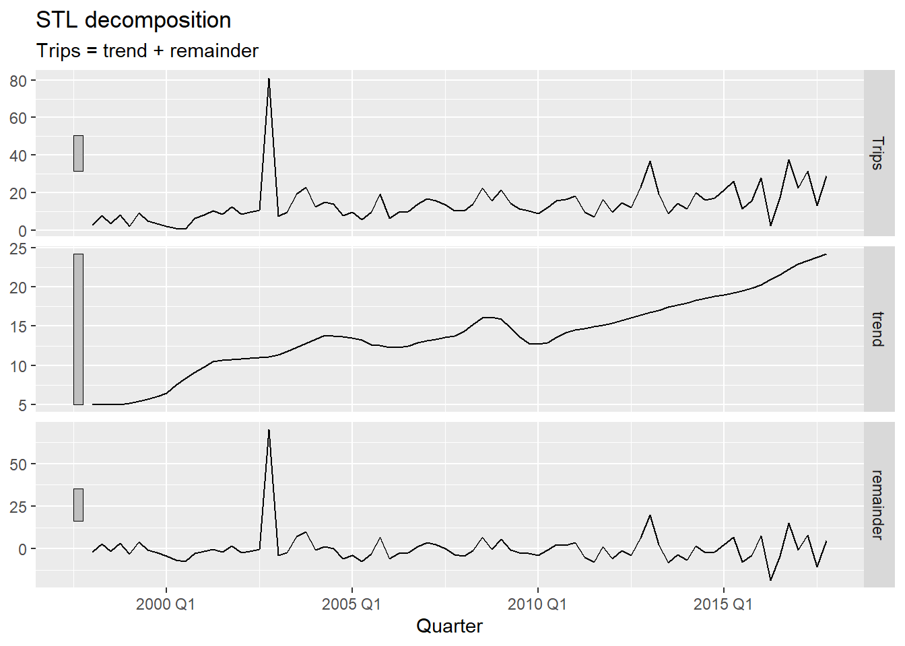
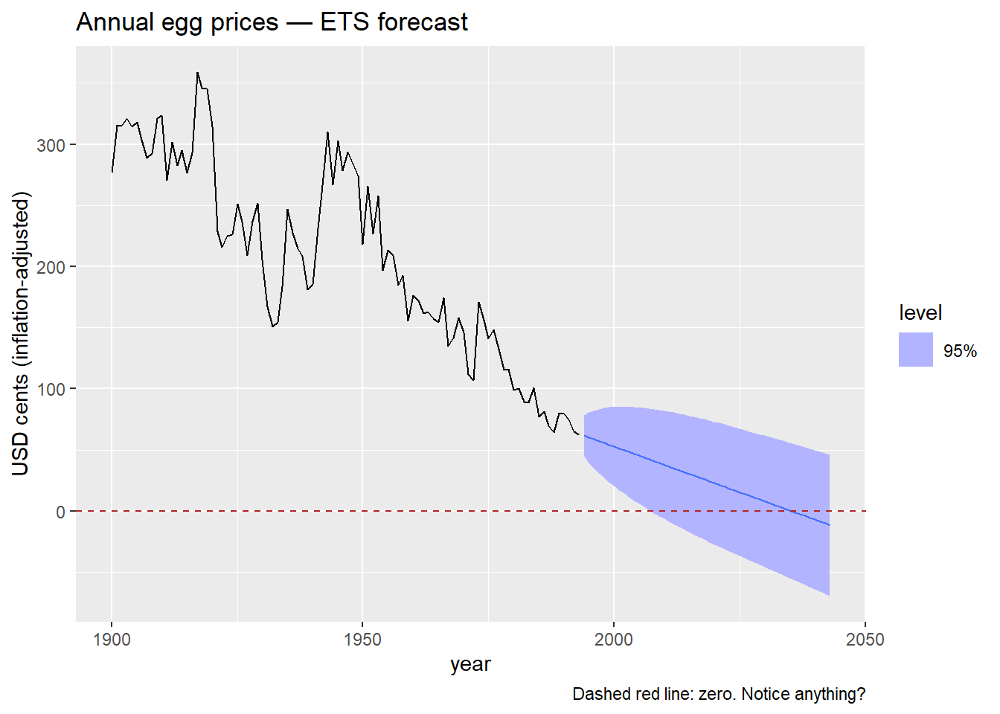
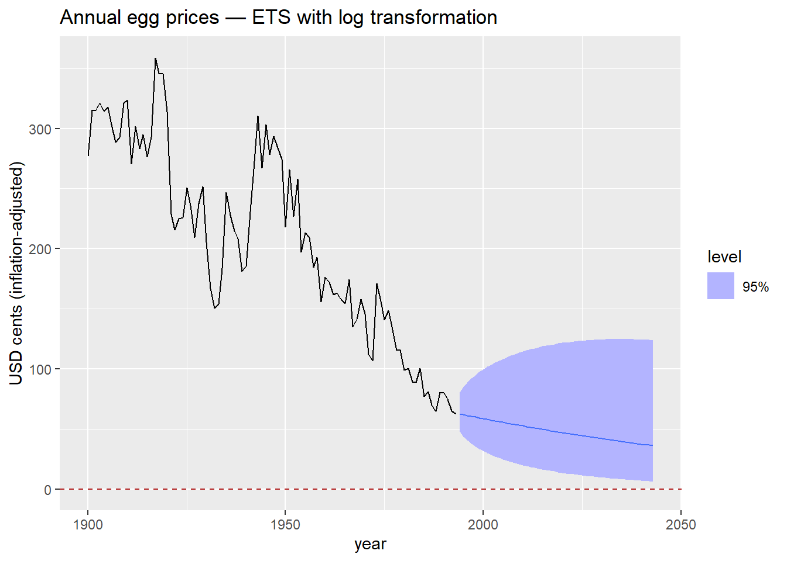
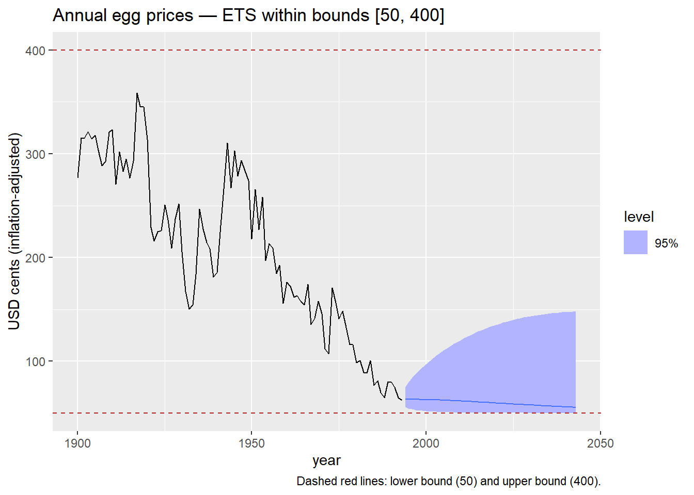

# Practical Forecasting Issues

Modified

June 10, 2026

Code

``` r
library(plotly) #<1>
```

1.  In addition to the regular packages, we use `plotly` for interactive graphics.

# 1 Outliers

> *What do you observe in this series? Think about trend, seasonality, variance — and anything else that catches your eye.*

## 1.1 What do we do with outliers?

- In **cross-sectional** data, a common reaction is to **remove** outliers before modeling.
- That intuition is reasonable — but in time series, simply deleting an observation creates a new problem: a **gap in the timeline**.
- Time series models depend on the temporal ordering and regularity of observations. A missing period is not the same as a removed row.

> **IMPORTANT:**
>
> In time series, removing an outlier and leaving a gap is not a solution — it creates a missing value problem that must also be addressed.

## 1.2 Why not apply the IQR rule directly to the series?

In cross-sectional data, outlier detection often works directly on the raw values:

\text{outlier if } y \< Q_1 - 1.5 \cdot \text{IQR} \quad \text{or} \quad y \> Q_3 + 1.5 \cdot \text{IQR}

- In time series, this **does not work** — and the reason is **trend**.
- A series with an upward trend has values that naturally increase over time. Later observations will always appear “large” relative to the overall distribution — not because they are anomalous, but because the series has grown.
- Applying the IQR rule directly would flag perfectly normal observations at the end of a trending series as outliers.

> **TIP:**
>
> By removing the trend before applying the IQR rule, we isolate the variation that *cannot* be explained by the regular structure of the series. Only then does outlier detection make sense.

## 1.3 Formally identifying outliers via STL

### 1.3.1 Using the remainder component

We decompose the series with STL using `season(period = 1)` to remove **only the trend** — keeping seasonality in the remainder so it is not mistaken for an anomaly[^1]. We then apply the IQR rule to the remainder:

\text{outlier if } R_t \< Q_1 - c \cdot \text{IQR} \quad \text{or} \quad R_t \> Q_3 + c \cdot \text{IQR}

where c = 1.5 is the standard threshold and c = 3 flags only more extreme observations.

Code

``` r
ah_dcmp <- ah |>
  model(
    stl = STL(Trips ~ season(period = 1), robust = TRUE) #<1>
  ) |>
  components()

ah_dcmp |> autoplot()
```

1.  `season(period = 1)` fits a non-seasonal STL — only the trend is extracted. This ensures the remainder reflects true anomalies and seasonal variation together, rather than having a genuine outlier absorbed into the seasonal component.

[](practical_issues_files/figure-html/stl-decomp-1.png)

Code

``` r
c_threshold <- 1.5  #<1>

ah_outliers <- ah_dcmp |>
  filter(
    remainder < quantile(remainder, 0.25) - c_threshold * IQR(remainder) |
    remainder > quantile(remainder, 0.75) + c_threshold * IQR(remainder)
  )

ah_outliers
```

1.  Changing `c_threshold` to `3` makes detection stricter — only more extreme remainders are flagged. Start with `1.5` and increase if too many periods are flagged.

> **NOTE:**
>
> The value c = 1.5 is the standard Tukey fence used in boxplots — it flags observations that are moderately unusual. A value of c = 3 (the “far fence”) is more conservative and only captures truly extreme values. In practice, start with `1.5`, inspect the flagged periods, and tighten the threshold if normal variation is being flagged.

### 1.3.2 What happens when we remove them?

Code

``` r
ah_miss <- ah |>
  anti_join(ah_outliers, by = "Quarter") |> #<1>
  fill_gaps()                                #<2>

ah_miss
```

1.  `anti_join()` removes the flagged periods from the original data.
2.  `fill_gaps()` makes the missing periods explicit — they now appear as `NA` rows in the tsibble rather than simply not existing.

We removed the outlier — but now there is a gap. The model still needs a value for that period.

# 2 Missing Values

> *We have gaps. What do we do with them?*

Some approaches that might seem right at first — but do not hold up under scrutiny:

- Use the **mean** of the series → ignores trend and seasonality entirely
- Use the **previous value** → that is NAIVE — reasonable, but ignores all future information
- Use the **same period last year** → that is SNAIVE — better, but still mechanical
- **Average the neighboring values** → which neighbors? How many? Sensitive to local anomalies, ignores global structure

> **TIP:**
>
> All of these are simplified versions of models we have already studied. Can we do something more principled — something that uses the *full* structure of the series, including trend, seasonality, and autocorrelation?

### 2.0.1 Why not ETS?

A natural next suggestion: fit an ETS model to the available data and use it to fill the gaps.

The problem: **ETS cannot be estimated when the series contains `NA` values.**

ETS is built on weighted averages of all past observations:

\hat{y}\_{t} = \alpha y\_{t-1} + \alpha(1-\alpha) y\_{t-2} + \alpha(1-\alpha)^2 y\_{t-3} + \cdots

If any y_t is `NA`, every weighted sum that includes it becomes `NA` — and the entire estimation collapses.

Code

``` r
mean(c(10, 20, NA, 40))   #<1>
10 + NA                   #<2>
```

1.  `mean()` with a missing value returns `NA` — the average is undefined when one element is unknown.
2.  Any arithmetic involving `NA` propagates the missingness. ETS, as a chain of weighted sums over all observations, fails entirely if any single observation is missing.

    [1] NA
    [1] NA

### 2.0.2 ARIMA and interpolation

ARIMA models **can handle missing values**. They use a state-space representation where the likelihood is computed period by period — missing observations are skipped in the likelihood update, and the state is propagated forward without an observation.

The workflow:

1.  Fit an ARIMA model to the series containing `NA` values
2.  Use `interpolate()` to replace each `NA` with the model’s conditional expectation for that period

Code

``` r
ah_fill <- ah_miss |>
  model(ARIMA(Trips)) |>    #<1>
  interpolate(ah_miss)      #<2>
```

1.  ARIMA is fitted using all non-missing observations. The `NA` periods do not contribute to parameter estimation but are accounted for in the state propagation.
2.  `interpolate()` replaces each `NA` with the in-sample conditional expectation — the most likely value for that period given the surrounding data and the estimated model.

### 2.0.3 Comparing original, missing, and imputed values

Code

``` r
ah |>
  rename(Trips_original = Trips) |>
  left_join(
    ah_miss |> rename(Trips_na      = Trips), by = "Quarter"
  ) |>
  left_join(
    ah_fill |> rename(Trips_imputed = Trips), by = "Quarter"
  ) |>
  filter(Quarter %in% ah_outliers$Quarter) #<1>
```

1.  Filter to show only the flagged periods, making the comparison between original, missing, and imputed values immediately clear.

1.  Extract the imputed periods as a separate tibble for targeted highlighting — avoids the rendering issue that occurs when `autolayer` tries to draw a line segment over only 2–3 isolated points.
2.  `geom_point()` with a diamond shape (`shape = 18`) marks each imputed period clearly and reliably, regardless of how many periods were flagged.
3.  `geom_label()` shows the imputed value directly on the plot.

> **TIP:**
>
> A model trained on data that includes the anomalous observation will produce different — and usually worse — forecasts than one trained on the cleaned series. The outlier inflates variance estimates and can distort trend and seasonal parameter estimates, leading to wider and less accurate prediction intervals.

# 3 Keeping Forecasts Positive

[](practical_issues_files/figure-html/eggs-with-line-html-1.png)

> *What do you observe? Does anything look strange about those prediction intervals?*

- The prediction intervals extend **below zero**.
- A negative egg price has no real-world interpretation — prices cannot be negative.
- The model does not know this. It fits a linear trend and extrapolates symmetrically in both directions.
- This is not a bug — it is a consequence of a modeling choice we have not made yet.

> *What mathematical transformation do you know that forces all output values to be strictly positive?*

### 3.0.1 The log transformation

- \log(y_t) is defined only for y_t \> 0, and \log(y_t) \to -\infty as y_t \to 0^+.
- When we model \log(y_t) and back-transform with \exp(\cdot), the result is **always strictly positive** — regardless of how far the trend extrapolates downward.
- We saw this in Module 1 with Box-Cox transformations (the \lambda = 0 case). Here we use it explicitly as a forecasting constraint.

Code

``` r
egg_prices |>
  model(ETS(log(eggs) ~ trend("A"))) |> #<1>
  forecast(h = 50) |>
  autoplot(egg_prices, level = 95) +
  geom_hline(yintercept = 0, color = "firebrick", linetype = "dashed") +
  labs(
    title   = "Annual egg prices — ETS with log transformation",
    y       = "USD cents (inflation-adjusted)"
  )
```

1.  The only change is wrapping `eggs` in `log()`. `fable` handles the back-transformation automatically — forecasts and prediction intervals are returned on the original scale.

[](practical_issues_files/figure-html/eggs-log-forecast-1.png)

> **NOTE:**
>
> The log transformation is the simplest way to keep forecasts positive. It works well when the series is strictly positive and the variance grows with the level — both common features of price and volume data.

# 4 Keeping Forecasts within Bounds

The log transformation handles a lower bound of zero. But what if we need to **constrain forecasts between two finite values** \[a, b\]?

> **TIP:**
>
> **Proportions and rates:**
>
> - Hotel or airline **occupancy rate** (0%–100%)
> - **Market share** of a product in a category (0%–100%)
> - **Unemployment rate** — bounded below at 0%, practically bounded above
>
> **Physical systems:**
>
> - **Water level in a dam or reservoir** — bounded between 0 m (empty) and maximum storage capacity. Particularly relevant in Mexico, where reservoir levels drive water supply and hydroelectric generation decisions.
> - **Temperature in an industrial process** — operating outside the allowed range causes product defects or safety incidents.
> - **Battery state of charge** (0%–100%)
>
> **Financial and regulatory:**
>
> - **Benchmark interest rate** — central banks operate within policy corridors; forecasts outside those bounds are not credible.
> - **Loan-to-value ratio** on a mortgage portfolio — bounded by regulation.
> - **Credit utilization rate** on a consumer loan portfolio (0%–100%)

### 4.0.1 The scaled logit transformation

The **scaled logit** maps any value in (a, b) to the entire real line (-\infty, +\infty):

f(x) = \log\left(\frac{x - a}{b - x}\right)

The inverse — used to back-transform forecasts to the original scale — is:

f^{-1}(y) = \frac{(b - a)\\ e^y}{1 + e^y} + a

This guarantees that back-transformed forecasts always lie strictly within (a, b).

> **NOTE:**
>
> The standard logistic (sigmoid) function maps \mathbb{R} \to (0, 1):
>
> \sigma(y) = \frac{e^y}{1 + e^y}
>
> The scaled logit is a linear rescaling of this to the interval (a, b). The same structure appears in logistic regression, neural network activation functions, and ecological population models with a carrying capacity.

Code

``` r
scaled_logit <- function(x, lower = 0, upper = 1) {     #<1>
  log((x - lower) / (upper - x))
}

inv_scaled_logit <- function(x, lower = 0, upper = 1) { #<2>
  (upper - lower) * exp(x) / (1 + exp(x)) + lower
}

my_scaled_logit <- new_transformation(                   #<3>
  scaled_logit,
  inv_scaled_logit
)
```

1.  Forward transformation: maps (a, b) \to \mathbb{R}. Applied to the data before model fitting.
2.  Inverse transformation: maps \mathbb{R} \to (a, b). Applied automatically by `fable` when back-transforming forecasts and prediction intervals.
3.  `new_transformation()` bundles both functions into a single transformation object that `fable` recognizes.

### 4.0.2 Applying the scaled logit

Code

``` r
egg_prices |>
  model(
    ETS(my_scaled_logit(eggs, lower = 50, upper = 400) ~ trend("A")) #<1>
  ) |>
  forecast(h = 50) |>
  autoplot(egg_prices, level = 95) +
  geom_hline(yintercept =  50, color = "firebrick", linetype = "dashed") +
  geom_hline(yintercept = 400, color = "firebrick", linetype = "dashed") +
  labs(
    title   = "Annual egg prices — ETS within bounds [50, 400]",
    y       = "USD cents (inflation-adjusted)",
    caption = "Dashed red lines: lower bound (50) and upper bound (400)."
  )
```

1.  The bounds `lower = 50` and `upper = 400` reflect a plausible range for egg prices in this dataset. In practice, bounds should be informed by domain knowledge or regulatory constraints — not chosen to make the plot look neat.

[](practical_issues_files/figure-html/eggs-scaled-logit-1.png)

> **WARNING:**
>
> The scaled logit requires that **all historical observations fall strictly within** (a, b). If any observation equals or exceeds the bounds, the transformation is undefined. Always verify your data range before applying it.

# 5 Summary

- **Outliers in time series** cannot be identified by applying the IQR rule to the raw series — trend distorts the distribution. Decompose first, then inspect the **remainder component**.
- **Removing an outlier** creates a missing value that must be addressed. Simply deleting the row leaves a gap that most time series models cannot handle.
- **ARIMA interpolation** provides a principled, model-based imputation that respects the full structure of the series — trend, seasonality, and autocorrelation.
- **Log transformations** prevent forecasts from going negative — appropriate for prices, counts, and volumes.
- **Scaled logit transformations** constrain forecasts to any finite interval (a, b) — use them when domain knowledge or regulation defines hard bounds.

> **IMPORTANT:**
>
> These are not just data-cleaning steps. They are **modeling decisions** that affect forecast distributions, prediction intervals, and the interpretability of results. Make them deliberately and document your reasoning.

Back to top

## Footnotes

[^1]: If you suspect outliers are hiding inside the seasonal pattern, you can use a full seasonal decomposition instead.
