# Linear Regression Models for Time Series

Modified

June 9, 2026

Code

``` r
library(plotly) #<1>
library(car)    #<2>
```

1.  For interactive plots.
2.  For the `vif()` function used in the multicollinearity section.

# 1 From Univariate to Multivariate Models

Every model we have built so far shares one fundamental characteristic: it is **univariate**. Whether it was STL decomposition, ETS, or ARIMA, we only looked inward — we used the history of y_t itself to forecast its future.

That approach has taken us surprisingly far. But it ignores the **outside world** entirely.

- A retailer’s sales are not just a function of past sales — they depend on promotions, competitor prices, and economic conditions.
- Energy demand depends on temperature, not just its own history.
- Mexico’s retail trade index (`mexretail`) reflects consumer purchasing power, employment, and credit conditions — none of which appear in the series itself.

## 1.1 Why exogenous variables?

The question we are addressing now is: **what if we gave our model access to external information?**

- In Modules 1–2, our model improved by getting smarter about the *structure* of y_t (trend, seasonality, autocorrelation).
- In Module 3, we improve by adding *context*: variables from outside the series that help explain its movement.
- This is the transition from filtering to **causal modeling** — at least in the predictive, not necessarily structural, sense.

> **NOTE:**
>
> | Module | What we modeled | Tool |
> |----|----|----|
> | 1 | Trend + seasonality via decomposition | STL + SNAIVE/Drift |
> | 2 | Autocorrelation structure of the signal | ETS, ARIMA |
> | **3** | **Relationship with external variables** | **TSLM, dynamic regression** |
> | 4 | Complex seasonality, robustness | Prophet, bootstrapping |
>
> Each module has asked: *what does my current model fail to capture?* The answer now is: information from other series.

# 2 The Linear Regression Model

The simplest case is the **simple linear regression model**:

y_t = \beta_0 + \beta_1 x_t + \varepsilon_t

where:

- \beta_0 is the **intercept**: the predicted value of y when x = 0.
- \beta_1 is the **slope**: the average change in y for a one-unit change in x.
- \varepsilon_t is the **error term**: captures all other influences on y_t not explicitly modeled.

[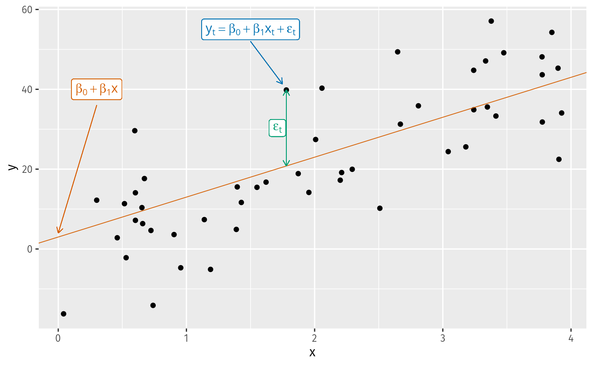](linreg.PNG "(Hyndman, 2019)")

*[(Hyndman, 2019)](https://otexts.com/fpp3/)*

> **TIP:**
>
> We cannot observe the \beta’s directly — we estimate them from data. The **Ordinary Least Squares (OLS)** method chooses the estimates \hat{\beta}\_0, \hat{\beta}\_1, \ldots, \hat{\beta}\_k that minimize the **sum of squared residuals**:
>
> \min\_{\hat{\boldsymbol{\beta}}} \sum\_{t=1}^{T} \hat{\varepsilon}\_t^2 = \sum\_{t=1}^{T} \left(y_t - \hat{\beta}\_0 - \hat{\beta}\_1 x\_{1t} - \cdots - \hat{\beta}\_k x\_{kt}\right)^2
>
> For the simple case (k = 1), taking partial derivatives and setting them to zero yields closed-form solutions:
>
> \hat{\beta}\_1 = \frac{\sum x_t y_t - T\bar{x}\bar{y}}{\sum x_t^2 - T\bar{x}^2}, \qquad \hat{\beta}\_0 = \bar{y} - \hat{\beta}\_1 \bar{x}
>
> For the general case with k predictors, the solution extends naturally to matrix form:
>
> \hat{\boldsymbol{\beta}} = (\mathbf{X}^\top \mathbf{X})^{-1} \mathbf{X}^\top \mathbf{y}
>
> where \mathbf{X} is the **design matrix** — a column of ones (for the intercept) plus one column per predictor — and \mathbf{y} is the vector of observed responses.
>
> In practice, R handles all of this internally. But knowing the objective function matters: OLS penalizes **large** residuals more than small ones (because of the square), and under the classical assumptions the Gauss-Markov theorem guarantees the estimates are **BLUE** (Best Linear Unbiased Estimators) — regardless of whether we have one predictor or twenty.

## 2.1 Some motivating examples

- **Ice cream sales** (y) and **daily temperature** (x).
- **Nike revenue** (y) and **marketing spend** (x).
- **US consumption growth** (y) and **income growth** (x).
- **Mexico retail trade** (y) and **consumer confidence index** (x).

> **NOTE:**
>
> The same concept appears under different names depending on the discipline:
>
> | y (forecast variable) | x (predictor variables) |
> |:---------------------:|:-----------------------:|
> |       Dependent       |       Independent       |
> |       Explained       |       Explanatory       |
> |      Regressand       |        Regressor        |
> |       Response        |  Stimulus / Covariate   |
> |      Endogenous       |        Exogenous        |
>
> In time series forecasting, FPP3 uses **forecast variable** and **predictor variables**.

> **NOTE:**
>
> The term was coined by Francis Galton while studying the relationship between parents’ height and their children’s height.
>
> [](regression.png)
>
> His finding: tall parents tend to have tall children, but on average their children are *not as tall as them*. Short parents tend to have children *taller than themselves*. There is a tendency to **regress toward the mean**.
>
> Without this regression to the mean, the distribution of heights across generations would diverge — we would eventually have people of Hobbit stature and people of giant stature, with nothing in between.
>
> Modern regression analysis generalizes this idea: studying the dependence of one variable on one or more others to predict its **average value**.

## 2.2 Regression and Causality

> *“A statistical relationship, however strong and suggestive, can never establish causal connexion: our ideas of causality must come from outside statistics, ultimately from some theory or other.”*
>
> — Kendall & Stuart (1961)

\text{Regression} \neq \text{Causality} \qquad \text{Correlation} \neq \text{Causality}

This is not a technicality — it is one of the most practically important ideas in data science:

- People who carry lighters have higher rates of lung cancer. Does carrying a lighter *cause* cancer?
- Ice cream sales and drowning rates are correlated. Should we ban ice cream?
- Homeopathic treatments show improvements. Does the remedy *work*, or did patients improve on their own?
- Casually: “every time I hiccup and hold my breath, it goes away.” Does holding your breath cure hiccups, or would they have stopped anyway?

### 2.2.1 Spurious correlations

The web is full of striking examples where two completely unrelated time series happen to move together — these are called **spurious correlations**.

[](https://tylervigen.com)

[about](about) · [email me](mailto:emailme@tylervigen.com) · [subscribe](subscribe)

# [spurious](spurious-correlations) correlations

*correlation is not causation*  
  
[random](spurious/random) · [discover](spurious/discover) · *[next page →](?page=2)*  
  
don't miss [spurious scholar](https://tylervigen.com/spurious-scholar),  
where each of these is an academic paper  

------------------------------------------------------------------------

[   
**View details about correlation \#2,203**](spurious/correlation/2203_yogurt-consumption_correlates-with_google-searches-for-i-cant-even)  
  

^(Show scatterplot)


  
  

*What else correlates?*  
[Yogurt consumption](spurious/variable?id=568) · [all food](spurious/view-all-variables/farmingfood)  
[Google searches for 'i cant even'](spurious/variable?id=1525) · [all google searches](spurious/view-all-variables/google)  

------------------------------------------------------------------------

[   
**View details about correlation \#2,674**](spurious/correlation/2674_popularity-of-the-first-name-brooklyn_correlates-with_ufo-sightings-in-kentucky)  
  

^(Show scatterplot)


  
  

*What else correlates?*  
[Popularity of the first name Brooklyn](spurious/variable?id=2526) · [all first names](spurious/view-all-variables/babynames)  
[UFO sightings in Kentucky](spurious/variable?id=1174) · [all random state specific](spurious/view-all-variables/statespecific)  

------------------------------------------------------------------------

[   
**View details about correlation \#2,948**](spurious/correlation/2948_rainfall-in-san-francisco_correlates-with_the-number-of-printing-press-operators-in-rhode-island)  
  

^(Show scatterplot)


  
  

*What else correlates?*  
[Rainfall in San Francisco](spurious/variable?id=374) · [all weather](spurious/view-all-variables/weather)  
[The number of printing press operators in Rhode Island](spurious/variable?id=18578) · [all cccupations](spurious/view-all-variables/occupations)  

------------------------------------------------------------------------

[   
**View details about correlation \#5,959**](spurious/correlation/5959_popularity-of-the-success-kid-meme_correlates-with_average-number-of-comments-on-numberphile-youtube-videos)  
  

^(Show scatterplot)


  
  

*What else correlates?*  
[Popularity of the 'success kid' meme](spurious/variable?id=25157) · [all memes](spurious/view-all-variables/memes)  
[Average number of comments on Numberphile YouTube videos](spurious/variable?id=25473) · [all YouTube](spurious/view-all-variables/youtube)  

------------------------------------------------------------------------

[   
**View details about correlation \#2,310**](spurious/correlation/2310_the-distance-between-uranus-and-saturn_correlates-with_nuclear-power-generation-in-brazil)  
  

^(Show scatterplot)


  
  

*What else correlates?*  
[The distance between Uranus and Saturn](spurious/variable?id=1966) · [all planets](spurious/view-all-variables/planets)  
[Nuclear power generation in Brazil](spurious/variable?id=23536) · [all energy](spurious/view-all-variables/energy)  

------------------------------------------------------------------------

[   
**View details about correlation \#1,218**](spurious/correlation/1218_burglaries-in-oregon_correlates-with_viewership-count-for-days-of-our-lives)  
  

^(Show scatterplot)


  
  

*What else correlates?*  
[Burglaries in Oregon](spurious/variable?id=20115) · [all random state specific](spurious/view-all-variables/statespecific)  
[Viewership count for Days of Our Lives](spurious/variable?id=87) · [all weird & wacky](spurious/view-all-variables/weirdwacky)  

------------------------------------------------------------------------

[   
**View details about correlation \#1,041**](spurious/correlation/1041_popularity-of-the-first-name-tiarra_correlates-with_google-searches-for-why-isnt-11-pronounced-onety-one)  
  

^(Show scatterplot)


  
  

*What else correlates?*  
[Popularity of the first name Tiarra](spurious/variable?id=3786) · [all first names](spurious/view-all-variables/babynames)  
[Google searches for 'why isnt 11 pronounced onety one'](spurious/variable?id=1469) · [all google searches](spurious/view-all-variables/google)  

------------------------------------------------------------------------

[   
**View details about correlation \#1,254**](spurious/correlation/1254_masters-degrees-awarded-in-education_correlates-with_gmo-use-in-corn-grown-in-ohio)  
  

^(Show scatterplot)


  
  

*What else correlates?*  
[Master's degrees awarded in Education](spurious/variable?id=1319) · [all education](spurious/view-all-variables/education)  
[GMO use in corn grown in Ohio](spurious/variable?id=719) · [all food](spurious/view-all-variables/farmingfood)  

------------------------------------------------------------------------

[.  The chart goes from 2002 to 2023, and the two variables track closely in value over that time.")   
**View details about correlation \#1,526**](spurious/correlation/1526_the-distance-between-saturn-and-earth_correlates-with_fomento-econmico-mexicanos-stock-price)  
  

^(Show scatterplot)


  
  

*What else correlates?*  
[The distance between Saturn and Earth](spurious/variable?id=1942) · [all planets](spurious/view-all-variables/planets)  
[Fomento Econ's stock price (FMX)](spurious/variable?id=1579) · [all stocks](spurious/view-all-variables/stocks)  

------------------------------------------------------------------------

[   
**View details about correlation \#4,252**](spurious/correlation/4252_the-number-of-phlebotomists-in-minnesota_correlates-with_arson-in-united-states)  
  

^(Show scatterplot)


  
  

*What else correlates?*  
[The number of phlebotomists in Minnesota](spurious/variable?id=19215) · [all cccupations](spurious/view-all-variables/occupations)  
[Arson in United States](spurious/variable?id=20038) · [all random state specific](spurious/view-all-variables/statespecific)  

------------------------------------------------------------------------

[   
**View details about correlation \#4,554**](spurious/correlation/4554_how-hip-and-with-it-numberphile-youtube-video-titles-are_correlates-with_wind-power-generated-in-latvia)  
  

^(Show scatterplot)


  
  

*What else correlates?*  
[How 'hip and with it' Numberphile YouTube video titles are](spurious/variable?id=25476) · [all YouTube](spurious/view-all-variables/youtube)  
[Wind power generated in Latvia](spurious/variable?id=23783) · [all energy](spurious/view-all-variables/energy)  

------------------------------------------------------------------------

[   
**View details about correlation \#5,468**](spurious/correlation/5468_american-cheese-consumption_correlates-with_popularity-of-the-this-is-fine-meme)  
  

^(Show scatterplot)


  
  

*What else correlates?*  
[American cheese consumption](spurious/variable?id=553) · [all food](spurious/view-all-variables/farmingfood)  
[Popularity of the 'this is fine' meme](spurious/variable?id=25124) · [all memes](spurious/view-all-variables/memes)  

------------------------------------------------------------------------

[.  The chart goes from 2010 to 2023, and the two variables track closely in value over that time.")   
**View details about correlation \#2,734**](spurious/correlation/2734_the-distance-between-jupiter-and-mercury_correlates-with_anheuser-busch-inbevs-stock-price)  
  

^(Show scatterplot)


  
  

*What else correlates?*  
[The distance between Jupiter and Mercury](spurious/variable?id=1952) · [all planets](spurious/view-all-variables/planets)  
[Anheuser-Busch InBev's stock price (BUD)](spurious/variable?id=1623) · [all stocks](spurious/view-all-variables/stocks)  

------------------------------------------------------------------------

[   
**View details about correlation \#1,840**](spurious/correlation/1840_bachelors-degrees-awarded-in-library-science_correlates-with_google-searches-for-how-to-hide-a-body)  
  

^(Show scatterplot)


  
  

*What else correlates?*  
[Bachelor's degrees awarded in Library science](spurious/variable?id=1282) · [all education](spurious/view-all-variables/education)  
[Google searches for 'how to hide a body'](spurious/variable?id=1513) · [all google searches](spurious/view-all-variables/google)  

------------------------------------------------------------------------

[   
**View details about correlation \#2,423**](spurious/correlation/2423_ufo-sightings-in-south-carolina_correlates-with_total-number-of-successful-mount-everest-climbs)  
  

^(Show scatterplot)


  
  

*What else correlates?*  
[UFO sightings in South Carolina](spurious/variable?id=1168) · [all random state specific](spurious/view-all-variables/statespecific)  
[Total Number of Successful Mount Everest Climbs](spurious/variable?id=498) · [all weird & wacky](spurious/view-all-variables/weirdwacky)  

------------------------------------------------------------------------

[   
**View details about correlation \#5,955**](spurious/correlation/5955_popularity-of-the-y-u-no-meme_correlates-with_the-number-of-loan-interviewers-and-clerks-in-nebraska)  
  

^(Show scatterplot)


  
  

*What else correlates?*  
[Popularity of the 'y u no' meme](spurious/variable?id=25164) · [all memes](spurious/view-all-variables/memes)  
[The number of loan interviewers and clerks in Nebraska](spurious/variable?id=10999) · [all cccupations](spurious/view-all-variables/occupations)  

------------------------------------------------------------------------

[   
**View details about correlation \#1,362**](spurious/correlation/1362_butter-consumption_correlates-with_wind-power-generated-in-lithuania)  
  

^(Show scatterplot)


  
  

*What else correlates?*  
[Butter consumption](spurious/variable?id=557) · [all food](spurious/view-all-variables/farmingfood)  
[Wind power generated in Lithuania](spurious/variable?id=23795) · [all energy](spurious/view-all-variables/energy)  

------------------------------------------------------------------------

[   
**View details about correlation \#1,532**](spurious/correlation/1532_bachelors-degrees-awarded-in-law-enforcement_correlates-with_google-searches-for-sleepwalking)  
  

^(Show scatterplot)


  
  

*What else correlates?*  
[Bachelor's degrees awarded in law enforcement](spurious/variable?id=1279) · [all education](spurious/view-all-variables/education)  
[Google searches for 'sleepwalking'](spurious/variable?id=1499) · [all google searches](spurious/view-all-variables/google)  

------------------------------------------------------------------------

[   
**View details about correlation \#1,205**](spurious/correlation/1205_divorce-rates-in-the-united-kingdom_correlates-with_disney-movies-released)  
  

^(Show scatterplot)


  
  

*What else correlates?*  
[Divorce rates in the United Kingdom](spurious/variable?id=506) · [all weird & wacky](spurious/view-all-variables/weirdwacky)  
[Disney movies released](spurious/variable?id=12) · [all films & actors](spurious/view-all-variables/films)  

------------------------------------------------------------------------

[   
**View details about correlation \#4,953**](spurious/correlation/4953_popularity-of-the-first-name-kori_correlates-with_popularity-of-the-pepe-meme)  
  

^(Show scatterplot)


  
  

*What else correlates?*  
[Popularity of the first name Kori](spurious/variable?id=3237) · [all first names](spurious/view-all-variables/babynames)  
[Popularity of the 'pepe' meme](spurious/variable?id=25152) · [all memes](spurious/view-all-variables/memes)  

------------------------------------------------------------------------

[   
**View details about correlation \#2,996**](spurious/correlation/2996_less-than-ideal-air-quality-in-dayton_correlates-with_the-number-of-genetic-counselors-in-ohio)  
  

^(Show scatterplot)


  
  

*What else correlates?*  
[Air pollution in Dayton](spurious/variable?id=20525) · [all weather](spurious/view-all-variables/weather)  
[The number of genetic counselors in Ohio](spurious/variable?id=19400) · [all cccupations](spurious/view-all-variables/occupations)  

------------------------------------------------------------------------

[   
**View details about correlation \#5,920**](spurious/correlation/5920_per-capita-consumption-of-margarine_correlates-with_the-divorce-rate-in-maine)  
  

^(Show scatterplot)


  
  

*What else correlates?*  
[Per capita consumption of margarine](spurious/variable?id=26741) · [all food](spurious/view-all-variables/farmingfood)  
[The divorce rate in Maine](spurious/variable?id=19802) · [all random state specific](spurious/view-all-variables/statespecific)  

------------------------------------------------------------------------

[next page →](?page=2)  
  

[Discover a new correlation](spurious/discover)  
[View random correlation](spurious/random)  
[View all correlations](spurious/view-all-correlations)  
[View all research papers](spurious/spurious-research-papers)  
[Get permission to re-use these charts](permission)  

------------------------------------------------------------------------

# *Why this works*

1.  **Data dredging:** I have 25,237 variables in my database. I compare all these variables against each other to find ones that randomly match up. That's 636,906,169 correlation calculations! This is called “[data dredging](https://en.wikipedia.org/wiki/Data_dredging).”☐ ^(Note) Fun fact: the chart used on the wikipedia page to demonstrate data dredging is also from me. I've been being naughty with data since 2014.  
    Instead of starting with a hypothesis and testing it, I instead tossed a bunch of data in a blender to see what correlations would shake out. It’s a dangerous way to go about analysis, because any sufficiently large dataset will yield strong correlations completely at random.
2.  **Lack of causal connection:** There is probably no direct connection between these variables, despite what the AI says above.☐ ^(Note) Because these pages are automatically generated, it's possible that the two variables you are viewing are in fact causually related. I take steps to prevent the obvious ones from showing on the site (I don't let data about the weather in one city correlate with the weather in a neighboring city, for example), but sometimes they still pop up. If they are related, cool! You found a loophole.  
    This is exacerbated by the fact that I used "Years" as the base variable. Lots of things happen in a year that are not related to each other! Most studies would use something like "one person" in stead of "one year" to be the "thing" studied.
3.  **Observations not independent:** For many variables, sequential years are not independent of each other. You will often see trend-lines form. If a population of people is continuously doing something every day, there is no reason to think they would suddenly *change* how they are doing that thing on January 1. A naive *p*-value calculation does not take this into account.☐ ^(Note) You will calculate a lower chance of "randomly" achieving the result than represents reality.  
      
    To be more specific: p-value tests are probability values, where you are calculating the probability of achieving a result at least as extreme as you found completely by chance. When calculating a p-value, you need to assert how many "degrees of freedom" your variable has. I count each year (minus one) as a "degree of freedom," but this is misleading for continuous variables.  
      
    This kind of thing can creep up on you pretty easily when using p-values, which is why it's best to take it as "one of many" inputs that help you assess the results of your analysis.  
4.  **Y-axes doesn't start at zero:** I truncated the Y-axes of the graphs above. I also used a line graph, which makes the visual connection stand out more than it deserves. ☐ ^(Note) Nothing against line graphs. They are great at telling a story when you have linear data! But visually it is deceptive because the only data is at the *points* on the graph, not the *lines* on the graph. In between each point, the data could have been doing anything. Like going for a random walk by itself!  
    Mathematically what I showed is true, but it is intentionally misleading. If you click on any of the charts that abuse this, you can scroll down to see a version that starts at zero.
5.  **Confounding variable:** Confounding variables (like global pandemics) will cause two variables to look connected when in fact a "sneaky third" variable is influencing both of them behind the scenes.
6.  **Outliers:** Some datasets here have outliers which drag up the correlation.☐ ^(Note) In concept, "outlier" just means "way different than the rest of your dataset." When calculating a correlation like this, they are particularly impactful because a single outlier can substantially increase your correlation.  
      
    Because this page is automatically generated, I don't know whether any of the charts displayed on it have outliers. I'm just a footnote. ¯\\(ツ)\_/¯  
    I intentionally mishandeled outliers, which makes the correlation look extra strong.
7.  **Low *n*:** There are not many data points included in some of these charts.☐ ^(Note) You can do analyses with low ns! But you shouldn't data dredge with a low n.  
    Even if the p-value is high, we should be suspicious of using so few datapoints in a correlation.

------------------------------------------------------------------------

  
**Pro-tip: click on any correlation to see**:

- Detailed data sources
- Prompts for the AI-generated content
- Explanations of each of the calculations (correlation, p-value)
- Python code to calculate it yourself

  

------------------------------------------------------------------------

[TABLE]

[  
CC BY 4.0](http://creativecommons.org/licenses/by/4.0/)

> **IMPORTANT:**
>
> A regression model would happily fit a line through any of those charts. The model does not know the relationship is nonsense — **you** have to know. Causal direction requires theory, domain knowledge, or experimental design, not statistical strength alone.

## 2.3 What Does “Linear” Mean?

*Are these models linear?*

[](linear.png)

Linearity can be defined in two senses:

1.  **Linearity in the variables** — E(y \mid x) is a linear function of x. This is the restrictive sense: only straight lines.

2.  **Linearity in the parameters** — E(y \mid x) is linear in the \beta’s.

The three models above are all **nonlinear in x** but **linear in \beta**. A linear regression model can produce a straight line, a parabola, an exponential curve, or a piecewise function, depending on the **functional form** chosen.

# 3 Regression in R: `us_change`

We will use `us_change` — quarterly percentage changes in US macroeconomic variables. Our forecast variable is **Consumption**.

Code

``` r
us_change
```

## 3.1 Exploratory analysis

Before fitting any model, we look at the data.

## All series over time

Code

``` r
us_change |>
  as_tibble() |>
  select(-Quarter) |>
  GGally::ggpairs()
```

[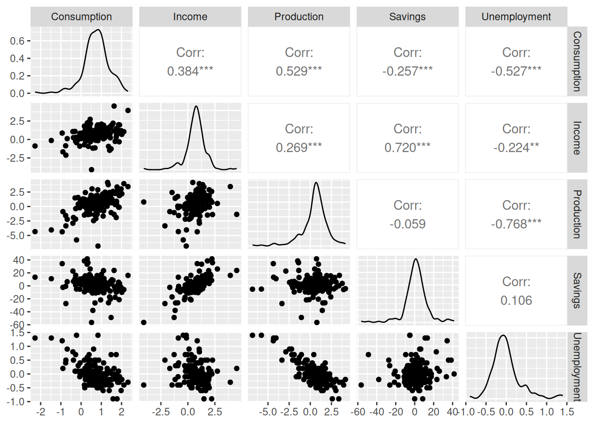](regression_files/figure-html/us-change-pairs-1.png)

## Scatter matrix

> **WARNING:**
>
> The scatter matrix shows correlations between all pairs of variables. Notice that some predictors are correlated with each other — we will return to this when we discuss multicollinearity.

## 3.2 Simple Linear Regression

We start with the simplest possible model: **Consumption as a function of Income only**.

y\_{t, \text{Consumption}} = \beta_0 + \beta_1 x\_{t, \text{Income}} + \varepsilon_t

In `fable`, time series linear models use `TSLM()`:

Code

``` r
us_change_fit_simple <- us_change |>                   #<1>
  model(
    simple = TSLM(Consumption ~ Income)                #<2>
  )

report(us_change_fit_simple)                           #<3>
```

1.  Start with the `us_change` tsibble.
2.  `TSLM()` fits a **T**ime **S**eries **L**inear **M**odel using OLS. The formula syntax is identical to `lm()`.
3.  `report()` prints the full regression output.

    Series: Consumption 
    Model: TSLM 

    Residuals:
         Min       1Q   Median       3Q      Max 
    -2.58236 -0.27777  0.01862  0.32330  1.42229 

    Coefficients:
                Estimate Std. Error t value Pr(>|t|)    
    (Intercept)  0.54454    0.05403  10.079  < 2e-16 ***
    Income       0.27183    0.04673   5.817  2.4e-08 ***
    ---
    Signif. codes:  0 '***' 0.001 '**' 0.01 '*' 0.05 '.' 0.1 ' ' 1

    Residual standard error: 0.5905 on 196 degrees of freedom
    Multiple R-squared: 0.1472, Adjusted R-squared: 0.1429
    F-statistic: 33.84 on 1 and 196 DF, p-value: 2.4022e-08

### 3.2.1 Reading the regression output

The output has two main parts:

**Individual significance** — each coefficient has a t-test: H_0: \beta_i = 0 \qquad H_1: \beta_i \neq 0 The stars (`*`, `**`, `***`) indicate p \< 0.05, p \< 0.01, p \< 0.001.

**Joint significance** — the F-test asks whether *any* predictor is useful: H_0: \beta_1 = \beta_2 = \cdots = \beta_k = 0 A significant F-test does not mean all individual coefficients are significant.

The estimated model is: \hat{y}\_{t, \text{Consumption}} = 0.545 + 0.272 \cdot x\_{t, \text{Income}}

For every 1 percentage point increase in income growth, consumption growth increases by 0.272 percentage points on average.

## 3.3 Residual Diagnostics

### 3.3.1 Gauss-Markov assumptions

OLS produces BLUE estimators only if the classical assumptions hold. The one most frequently violated in time series is **no autocorrelation in the errors**:

\text{cov}(\varepsilon_t, \varepsilon_s) = 0 \quad \forall \\ t \neq s

If residuals are autocorrelated, OLS estimates are still unbiased but **no longer efficient** — standard errors are wrong, p-values are wrong, and forecast intervals are wrong. This is why we always check the residuals.

## Time series vs. fitted

[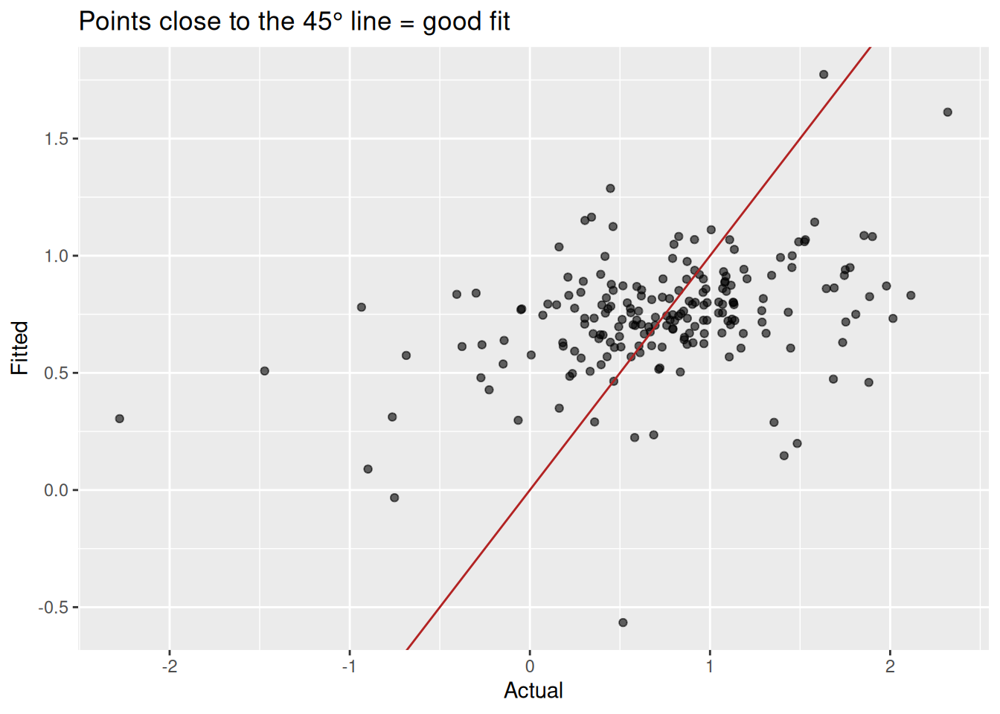](regression_files/figure-html/us-change-simple-scatter-1.png)

## Fitted vs. actual (45° line)

Code

``` r
us_change_fit_simple |>
  gg_tsresiduals()
```

[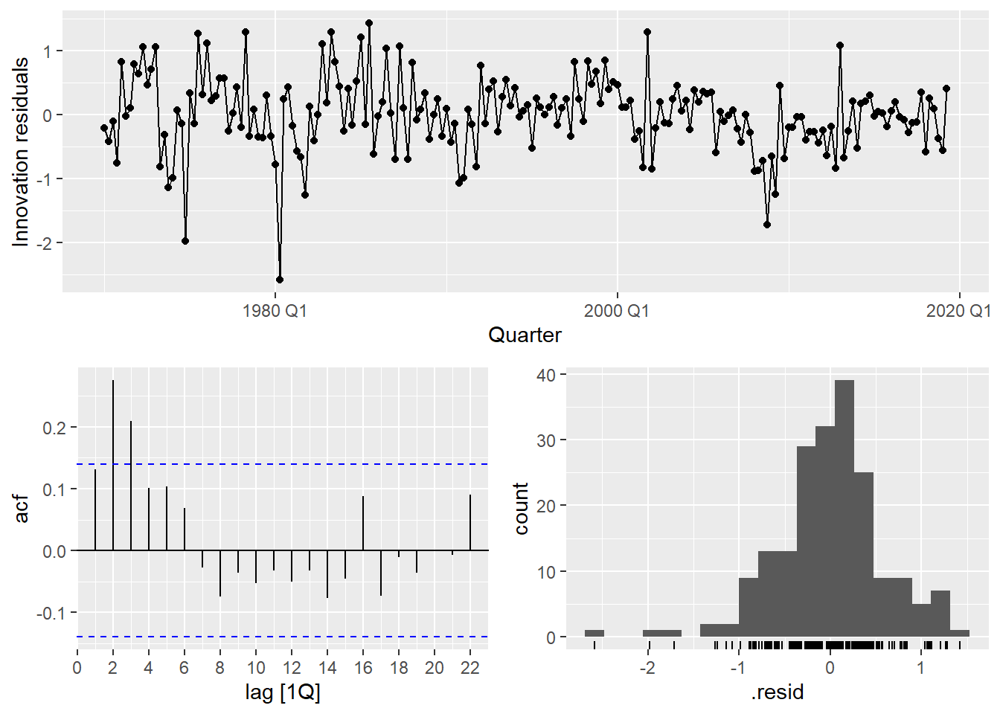](regression_files/figure-html/us-change-simple-resid-1.png)

## Residual diagnostics

Code

``` r
us_change_dof_simple <- us_change_fit_simple |>    #<1>
  tidy() |>
  nrow()

augment(us_change_fit_simple) |>
  features(.resid, ljung_box,
           lag = 10,
           dof = us_change_dof_simple)             #<2>
```

1.  Extract the number of estimated parameters to use as degrees of freedom correction.
2.  A significant p-value indicates autocorrelated residuals — a sign the model is missing structure.

## Ljung-Box test

The residuals show clear autocorrelation. The simple model is not capturing all the dynamics of consumption. Let’s improve it.

# 4 Multiple Linear Regression

In practice, one predictor is rarely sufficient. The **multiple linear regression model** is:

y_t = \beta_0 + \beta_1 x\_{1t} + \beta_2 x\_{2t} + \cdots + \beta_k x\_{kt} + \varepsilon_t

For `us_change`, a natural extension is:

y\_{t, \text{Cons.}} = \beta_0 + \beta_1 x\_{t, \text{Inc.}} + \beta_2 x\_{t, \text{Prod.}} + \beta_3 x\_{t, \text{Sav.}} + \beta_4 x\_{t, \text{Unemp.}} + \varepsilon_t

Code

``` r
us_change_fit_mult <- us_change |>
  model(
    multiple = TSLM(Consumption ~ Income + Production + Savings + Unemployment) #<1>
  )

report(us_change_fit_mult)
```

1.  The formula syntax is the same as the simple linear regression: just add more predictors with `+`.

    Series: Consumption 
    Model: TSLM 

    Residuals:
         Min       1Q   Median       3Q      Max 
    -0.90555 -0.15821 -0.03608  0.13618  1.15471 

    Coefficients:
                  Estimate Std. Error t value Pr(>|t|)    
    (Intercept)   0.253105   0.034470   7.343 5.71e-12 ***
    Income        0.740583   0.040115  18.461  < 2e-16 ***
    Production    0.047173   0.023142   2.038   0.0429 *  
    Savings      -0.052890   0.002924 -18.088  < 2e-16 ***
    Unemployment -0.174685   0.095511  -1.829   0.0689 .  
    ---
    Signif. codes:  0 '***' 0.001 '**' 0.01 '*' 0.05 '.' 0.1 ' ' 1

    Residual standard error: 0.3102 on 193 degrees of freedom
    Multiple R-squared: 0.7683, Adjusted R-squared: 0.7635
    F-statistic:   160 on 4 and 193 DF, p-value: < 2.22e-16

### 4.0.1 Comparing simple vs. multiple

## Time series vs. fitted

Grey line = actual consumption; colored line = fitted values. The multiple model tracks the data much more closely.

## Fitted vs. actual

Points closer to the 45° line indicate better fit. The multiple model shows a much tighter cloud.

## Residual diagnostics

[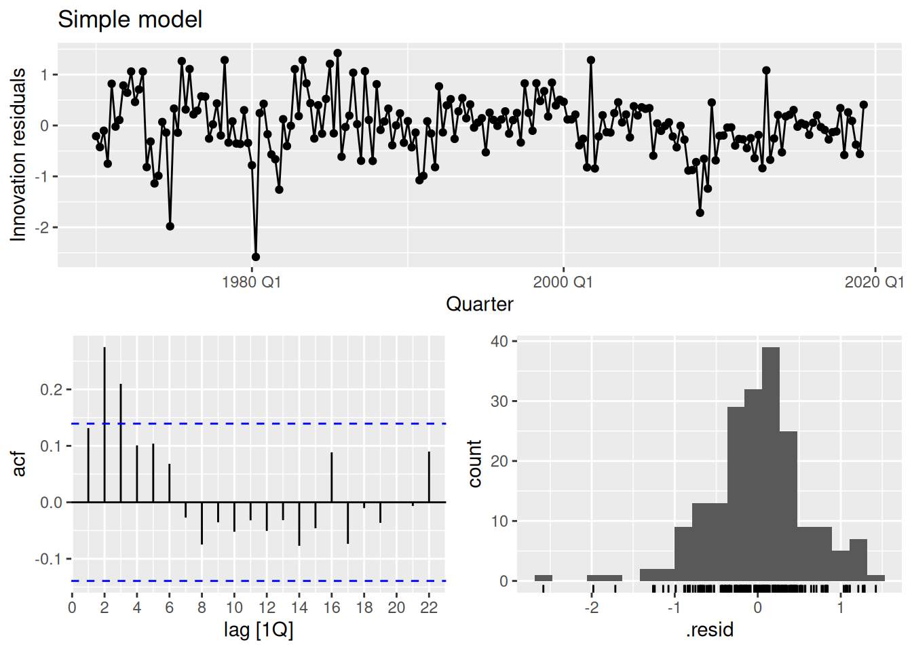](regression_files/figure-html/us-change-resid-simple-1.png "Simple model residuals: significant ACF spikes indicate remaining autocorrelation.")

Simple model residuals: significant ACF spikes indicate remaining autocorrelation.

[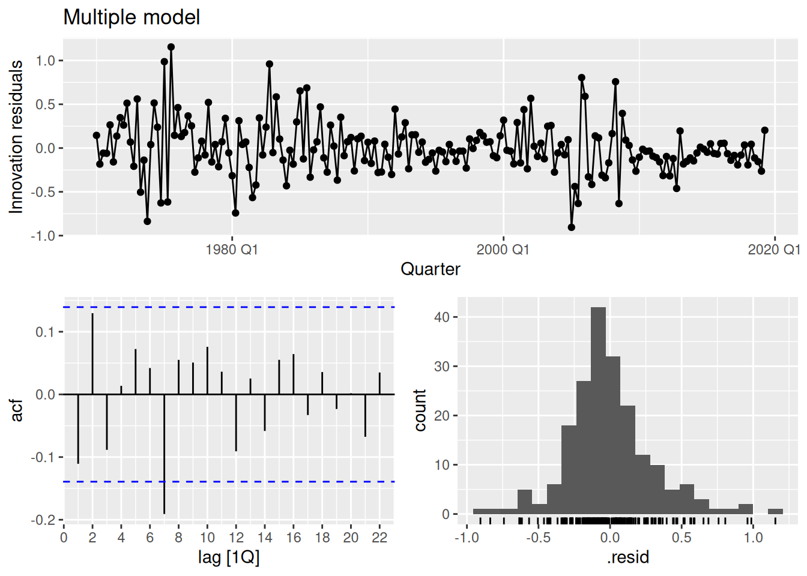](regression_files/figure-html/us-change-resid-mult-1.png "Multiple model residuals: ACF spikes are much reduced and the distribution is closer to normal.")

Multiple model residuals: ACF spikes are much reduced and the distribution is closer to normal.

## Residuals vs. predictors

[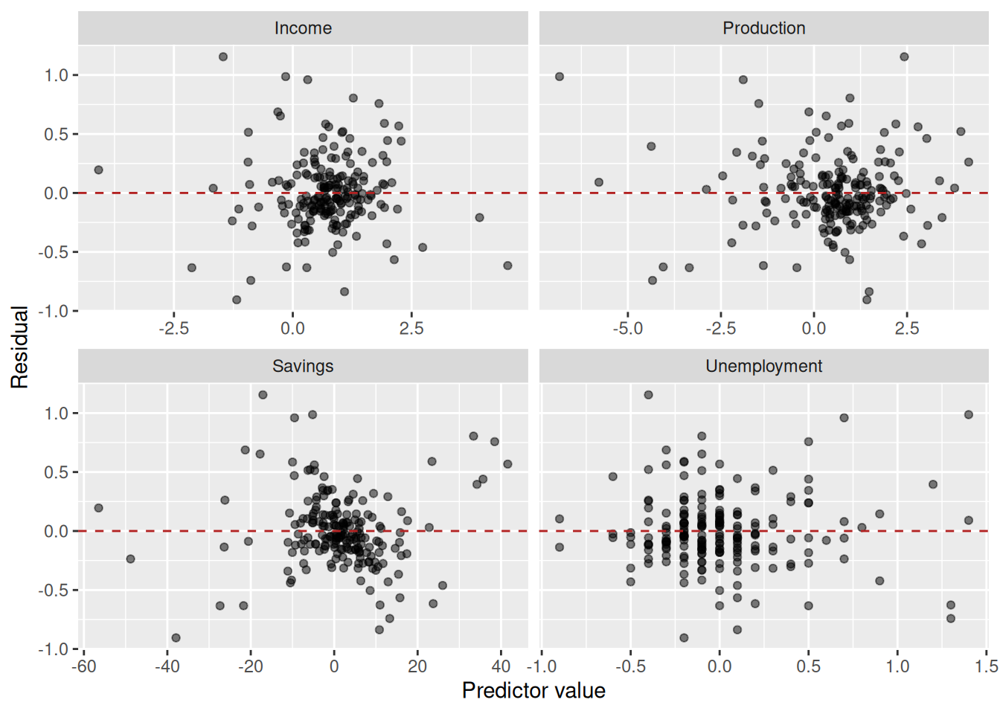](regression_files/figure-html/us-change-resid-pred-1.png "Residuals from the multiple model vs. each predictor. No strong patterns suggest the linear specification is adequate.")

Residuals from the multiple model vs. each predictor. No strong patterns suggest the linear specification is adequate.

## Ljung-Box

Code

``` r
bind_rows(
  augment(us_change_fit_simple) |>
    features(.resid, ljung_box, lag = 10, dof = 2) |>
    mutate(.model = "Simple"),
  augment(us_change_fit_mult) |>
    features(.resid, ljung_box, lag = 10, dof = 5) |>
    mutate(.model = "Multiple")
) |>
  select(.model, lb_stat, lb_pvalue)
```

The multiple model substantially improves fit (\bar{R}^2 goes from ~0.15 to ~0.75) and the residuals look much closer to white noise.

> **TIP:**
>
> The **residuals vs. predictors** plot is a useful diagnostic specific to multiple regression. If any panel shows a systematic pattern (curve, fan shape), it suggests a missing nonlinear term or interaction involving that predictor.

# 5 Predictor Selection

With k potential predictors, there are 2^k possible models. We need a principled way to choose among them.

> **IMPORTANT:**
>
> **Do not use in-sample R^2 for selection.** Adding any predictor, even a random one, increases R^2. We need measures that penalize model complexity.

The three standard criteria available from `glance()` in `fable`:

- **Adjusted \bar{R}^2**: penalizes for additional parameters. Maximize it.
- **AIC** (Akaike Information Criterion): -2\log L + 2k. Minimize it. Optimizes predictive performance.
- **AICc**: AIC corrected for small samples. **Prefer this over AIC** for time series.
- **BIC** (Bayesian Information Criterion): -2\log L + k \log T. Minimize it. BIC penalizes complexity more heavily and tends to select smaller models than AICc.

Code

``` r
glance(us_change_fit_mult) |>
  select(adj_r_squared, AIC, AICc, BIC)
```

### 5.0.1 Search strategies

## All subsets (small k)

Fit all possible models and compare:

Code

``` r
us_change_fit_select <- us_change |>
  model(
    m1 = TSLM(Consumption ~ Income),
    m2 = TSLM(Consumption ~ Income + Production),
    m3 = TSLM(Consumption ~ Income + Savings),
    m4 = TSLM(Consumption ~ Income + Unemployment),
    m5 = TSLM(Consumption ~ Income + Production + Savings),
    m6 = TSLM(Consumption ~ Income + Production + Unemployment),
    m7 = TSLM(Consumption ~ Income + Savings + Unemployment),
    m8 = TSLM(Consumption ~ Income + Production + Savings + Unemployment)
  )

us_change_fit_select |>
  glance() |>
  select(.model, adj_r_squared, AIC, AICc, BIC) |>
  arrange(AICc)
```

## Backwards stepwise

Start with the full model and remove predictors one at a time:

Code

``` r
us_change |>
  model(
    full  = TSLM(Consumption ~ Income + Production + Savings + Unemployment),
    drop1 = TSLM(Consumption ~ Income + Production + Savings),
    drop2 = TSLM(Consumption ~ Income + Production + Unemployment),
    drop3 = TSLM(Consumption ~ Income + Savings + Unemployment),
    drop4 = TSLM(Consumption ~ Production + Savings + Unemployment)
  ) |>
  glance() |>
  select(.model, adj_r_squared, AICc, BIC) |>
  arrange(AICc)
```

## Forwards stepwise

Start with the intercept-only model and add predictors one at a time:

Code

``` r
# Step 1: which single predictor is best?
us_change |>
  model(
    f1 = TSLM(Consumption ~ Income),
    f2 = TSLM(Consumption ~ Production),
    f3 = TSLM(Consumption ~ Savings),
    f4 = TSLM(Consumption ~ Unemployment)
  ) |>
  glance() |>
  select(.model, AICc) |>
  arrange(AICc)
```

Code

``` r
# Step 2: add a second predictor to the best single-predictor model
us_change |>
  model(
    f1  = TSLM(Consumption ~ Savings),
    f12 = TSLM(Consumption ~ Savings + Income),
    f13 = TSLM(Consumption ~ Savings + Production),
    f14 = TSLM(Consumption ~ Savings + Unemployment)
  ) |>
  glance() |>
  select(.model, AICc) |>
  arrange(AICc)
```

> **TIP:**
>
> Both penalize model complexity, but differently:
>
> - **AICc** minimizes expected out-of-sample prediction error. It tends to select slightly larger models.
> - **BIC** is consistent: as T \to \infty, it will select the true model (if it’s in the candidate set). It penalizes more heavily and selects smaller models.
>
> In forecasting contexts, **AICc is generally preferred** because we care more about predictive accuracy than model parsimony per se. When they disagree, consider whether interpretability or predictive accuracy is the primary goal.

## 5.1 Multicollinearity

Predictor selection and multicollinearity are closely linked. Even after running all-subsets or stepwise search, the selected model may still include predictors that are highly correlated with each other — and that creates problems that no information criterion will automatically flag.

When two or more predictors are highly correlated, we have **multicollinearity**. It does not bias the OLS estimates, but it inflates the variance of the coefficients, making them unstable and hard to interpret.

- In the extreme case of **perfect collinearity** (x_1 = c \cdot x_2), the model is unidentified: infinitely many solutions minimize SSR.
- In practice, collinearity is a matter of degree, not a binary condition.
- Warning signs: coefficients with unexpected signs, large standard errors, a significant F-test alongside non-significant individual t-tests.

### 5.1.1 Detecting multicollinearity: VIF

The **Variance Inflation Factor (VIF)** measures how much the variance of \hat{\beta}\_j is inflated by its correlation with the other predictors:

\text{VIF}\_j = \frac{1}{1 - R_j^2}

where R_j^2 is the R^2 obtained by regressing x_j on all the *other* predictors — a measure of how well one predictor can be linearly predicted by the rest.

- \text{VIF} = 1: no collinearity with other predictors.
- \text{VIF} \in (1, 5): moderate — generally acceptable.
- \text{VIF} \> 5: concerning, examine carefully.
- \text{VIF} \> 10: severe — take action.

> **TIP:**
>
> A quick visual check: if the `ggpairs` scatter matrix shows strong correlations *between predictors* (not between a predictor and y), multicollinearity is likely present. The VIF quantifies exactly how severe that problem is.

### 5.1.2 What to do about multicollinearity

The answer depends critically on your goal.

- **If your goal is forecasting** — which is ours — multicollinearity is largely harmless. The individual \hat{\beta}’s may be unstable, but their *joint contribution* to \hat{y}\_t is still well estimated. The model can produce excellent forecasts even when coefficients are hard to interpret individually.

> **WARNING:**
>
> The one scenario where multicollinearity *does* hurt forecasting is if the correlation structure among predictors breaks down in the future — i.e., predictors that moved together historically start moving independently. In that case, the model never learned their individual effects well enough to adapt.

- **If your goal is inference** — understanding the isolated effect of each predictor — multicollinearity is a real problem and should be addressed:

1.  **Drop one of the correlated predictors** — keep the one with stronger theoretical justification or cleaner interpretability.
2.  **Combine them** — create a composite index, take a ratio, or use the first principal component of the correlated group.
3.  **Use penalized regression** (Ridge, Lasso) — these accept a small bias in exchange for substantially lower variance. Outside this course’s scope, but worth knowing.

# 6 Forecasting with Regression

Before we can forecast y_t with regression, we need to ask: *what do we do with the predictors?*

With univariate models, `forecast(h = n)` was sufficient — the model only needed its own history. Now the model needs **future values of x_t** to produce a forecast of y_t.

What changes across the three forecasting types is precisely **what values we assign to the predictors**:

- **Ex-ante**: we forecast the predictors first, then use those forecasts as inputs.
- **Ex-post**: we use the actual realized values of the predictors.
- **Scenario-based**: we construct hypothetical values for the predictors.

## 6.1 Three types of regression forecasts

## Ex-ante

**Ex-ante forecasts** use only information available at the time the forecast is made. The predictors must themselves be forecasted.

This is the “true” forecast — it is what you would actually produce in a real deployment.

Code

``` r
us_change_future <- us_change |>
  pivot_longer(-c(Quarter, Consumption), names_to = "variable") |> #<1>
  model(arima = ARIMA(value)) |> #<2>
  forecast(h = 8) |> #<3>
  as_tsibble() |> #<4>
  select(-c(.model, value)) |>
  pivot_wider(names_from = variable, values_from = .mean) #<5>

us_change_fit_mult |>
  forecast(new_data = us_change_future) |>
  autoplot(us_change |> filter_index("2010 Q1" ~ .)) +
  labs(title = "Ex-ante forecast: US Consumption",
       y = "% change", x = NULL)
```

1.  Pivot to long format — each predictor becomes a separate series keyed by `variable`.
2.  A single `model()` call fits an ARIMA to each predictor automatically.
3.  A single `forecast()` produces 8-step-ahead forecasts for all predictors simultaneously.
4.  Convert back to tsibble — required by `forecast()` when passed as `new_data`.
5.  Pivot back to wide so each predictor has its own column, matching the structure expected by the regression model.

[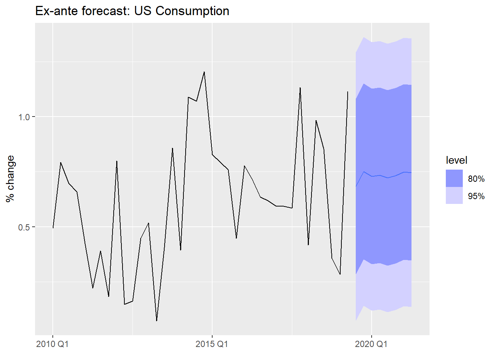](regression_files/figure-html/us-change-exante-1.png)

## Ex-post

**Ex-post forecasts** use *actual* realized values of the predictors. The forecast variable y_t is still unknown, but we feed in the true future x_t values.

These are not “real” forecasts — they are used to **evaluate the regression model in isolation**, removing predictor forecast error from the evaluation.

Code

``` r
# Use filter_index to create a train/test split
us_change_train <- us_change |>
  filter_index(. ~ "2017 Q4")

us_change_test <- us_change |>
  filter_index("2018 Q1" ~ .)

us_change_fit_expost <- us_change_train |>
  model(
    multiple = TSLM(Consumption ~ Income + Production + Savings + Unemployment)
  )

# Ex-post: we supply actual future predictor values
us_change_fit_expost |>
  forecast(new_data = us_change_test) |>
  autoplot(us_change |> filter_index("2014 Q1" ~ .)) +
  labs(title = "Ex-post forecast: actual predictor values used",
       y = "% change", x = NULL)
```

[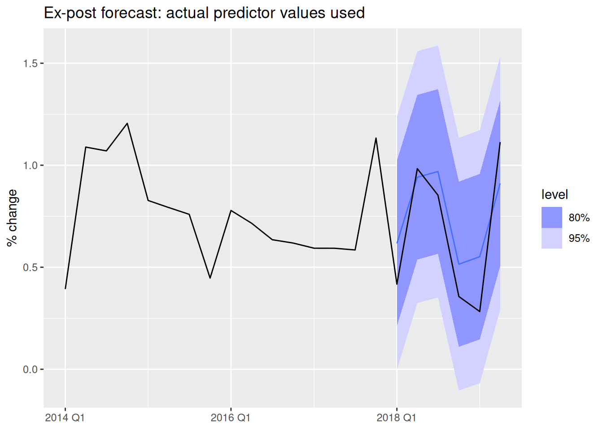](regression_files/figure-html/us-change-expost-1.png)

## Scenario-based

**Scenario-based forecasts** construct hypothetical future values for the predictors and ask: *what would consumption look like under each scenario?*

These are especially useful for stress-testing and strategic planning.

Code

``` r
us_change_fit_scen <- us_change |>
  model(TSLM(Consumption ~ Income + Savings + Unemployment)) #<1>

us_change_scenarios <- scenarios(
  optimistic = new_data(us_change, 4) |>
    mutate(Income = c(0.5, 0.8, 0.6, 1.0),          #<2>
           Savings = c(0.1, -0.2, 0.1, -0.1),        #<2>
           Unemployment = -0.1),                      #<2>
  pessimistic = new_data(us_change, 4) |>
    mutate(Income = -0.5,                             #<3>
           Savings = -0.4,                            #<3>
           Unemployment = 0.2),                       #<3>
  names_to = "Scenario"                               #<4>
)

us_change |>
  autoplot(Consumption) +
  autolayer(forecast(us_change_fit_scen, new_data = us_change_scenarios)) + #<5>
  labs(title = "Scenario-based forecast: US Consumption",
       y = "% change", x = NULL)
```

1.  We fit a simpler model using only the three predictors with clearest economic interpretation.
2.  Optimistic scenario: income grows steadily, savings fluctuate mildly, unemployment falls slightly.
3.  Pessimistic scenario: income contracts, savings decline, unemployment rises.
4.  `names_to` labels each scenario in the output, making it easy to distinguish them in the plot.
5.  `autolayer()` overlays the scenario forecasts on the historical series without requiring matching key structures.

[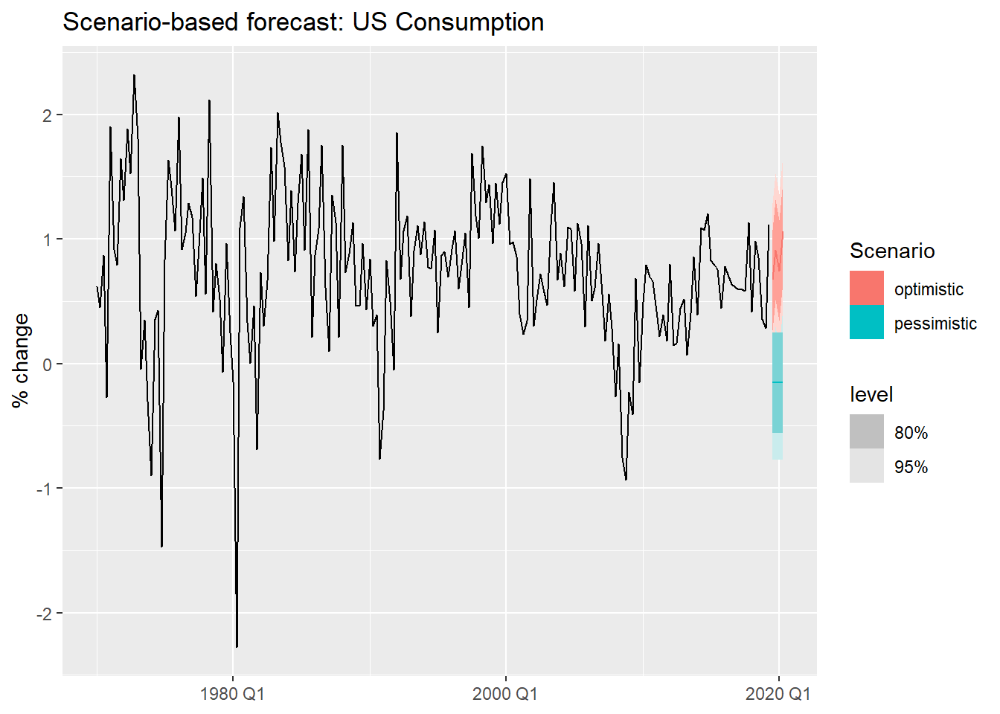](regression_files/figure-html/us-change-scenarios-1.png)

# 7 Useful Predictors

We have seen regression with exogenous variables. But can `TSLM()` also handle the patterns we identified in Module 1 — **trend** and **seasonality**?

**Yes** — through specially constructed predictors built directly into the formula.

We will illustrate with quarterly beer production in Australia.

Code

``` r
beer <- aus_production |>
  filter(year(Quarter) >= 1992) |>
  select(Quarter, Beer)
```

[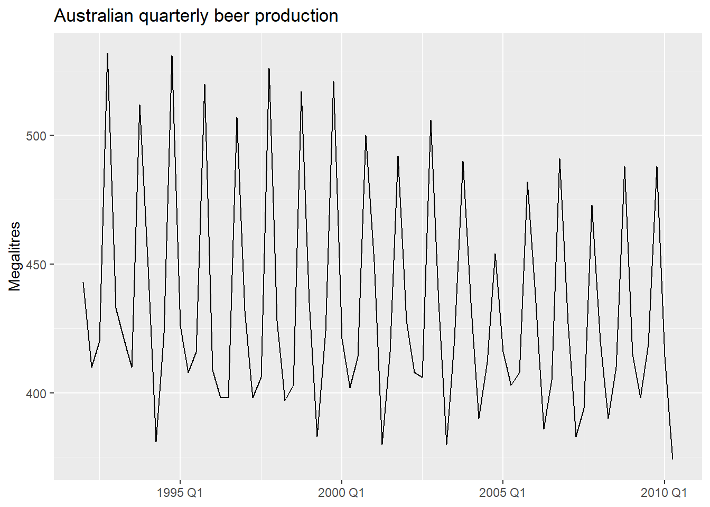](regression_files/figure-html/beer-plot-1.png)

## 7.1 Seasonal dummy variables

To capture seasonality in a regression, we use **dummy variables** — binary indicators that take the value 1 for a specific season and 0 otherwise.

- A quarterly series has 4 seasons. How many dummies do we need?
- **Not 4 — only 3.** One season is left as the baseline (absorbed into the intercept).
- Including all 4 would create perfect collinearity with the intercept: the **dummy variable trap**.

This is analogous to a cross-sectional dummy: to distinguish male/female, you only need *one* binary variable — one category is always implicit in the intercept.

### 7.1.1 What the dummies look like

Code

``` r
beer |>
  mutate(
    t  = row_number(),
    Q2 = if_else(quarter(Quarter) == 2, 1L, 0L),
    Q3 = if_else(quarter(Quarter) == 3, 1L, 0L),
    Q4 = if_else(quarter(Quarter) == 4, 1L, 0L)
  ) |>
  head(8)
```

> **WARNING:**
>
> **The dummy variable trap:** if you create dummies for all m seasons and include an intercept, you have perfect multicollinearity. Always use m - 1 dummies. `TSLM()` handles this automatically with `season()`.

## 7.2 Trend and seasonal dummies in R

`TSLM()` provides two built-in terms:

- `trend()` — a deterministic linear trend: \beta_1 t where t = 1, 2, \ldots, T.
- `season()` — m - 1 seasonal dummy variables, with the first season as baseline.

Code

``` numberSource
beer_fit <- beer |>
  model(
    TSLM(Beer ~ trend() + season()) #<1>
  )
 
report(beer_fit)
```

1.  `trend()` adds a linear time index; `season()` adds quarterly dummies automatically.

    Series: Beer 
    Model: TSLM 

    Residuals:
         Min       1Q   Median       3Q      Max 
    -42.9029  -7.5995  -0.4594   7.9908  21.7895 

    Coefficients:
                   Estimate Std. Error t value Pr(>|t|)    
    (Intercept)   441.80044    3.73353 118.333  < 2e-16 ***
    trend()        -0.34027    0.06657  -5.111 2.73e-06 ***
    season()year2 -34.65973    3.96832  -8.734 9.10e-13 ***
    season()year3 -17.82164    4.02249  -4.430 3.45e-05 ***
    season()year4  72.79641    4.02305  18.095  < 2e-16 ***
    ---
    Signif. codes:  0 '***' 0.001 '**' 0.01 '*' 0.05 '.' 0.1 ' ' 1

    Residual standard error: 12.23 on 69 degrees of freedom
    Multiple R-squared: 0.9243, Adjusted R-squared: 0.9199
    F-statistic: 210.7 on 4 and 69 DF, p-value: < 2.22e-16

> **NOTE:**
>
> For series with multiple seasonal periods or very long seasons (daily, hourly data), `season()` becomes impractical — the number of dummies grows too large. An alternative is **Fourier terms**: pairs of sine and cosine waves that approximate the seasonal pattern with far fewer parameters.
>
> `TSLM()` supports this via `fourier(K)`, where K controls how many Fourier pairs are included. We will cover this properly in Module 4 when we deal with complex seasonality.

## Fitted vs. actual

Code

``` r
beer_fit |>
  gg_tsresiduals()
```

[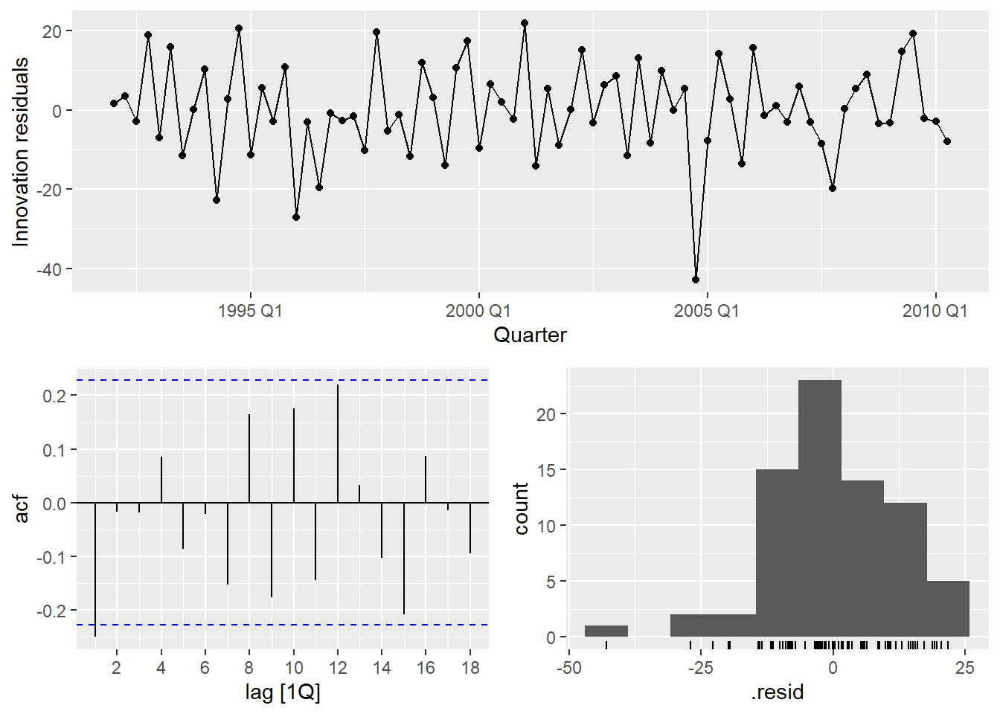](regression_files/figure-html/beer-resid-1.png)

## Residual diagnostics

There is a notable outlier in Q2 1994. We can detect it formally and then handle it with an intervention variable.

## 7.3 Intervention Variables and Outliers

Rather than eyeballing the residual plot, we can detect outliers formally — the same way we did in the practical issues document. The key idea is that applying the IQR rule directly to the raw series does not work in time series: a series with trend has naturally increasing values, so later observations always look “large” even when they are perfectly normal.

The fix: **decompose first, then apply IQR to the remainder**. For `beer`, which has strong known seasonality, we use a full STL decomposition — including the seasonal component — so only genuine anomalies end up in the remainder[^1].

Code

``` r
beer_dcmp <- beer |>
  model(
    stl = STL(Beer ~ trend() + season(), robust = TRUE) #<1>
  ) |>
  components()
 
beer_outliers <- beer_dcmp |>
  select(Quarter, remainder) |>
  mutate(
    Q1  = quantile(remainder, 0.25),
    Q3  = quantile(remainder, 0.75),
    IQR = Q3 - Q1,
    lower_15 = Q1 - 1.5 * IQR,  #<2>
    upper_15 = Q3 + 1.5 * IQR,
    lower_3  = Q1 - 3   * IQR,  #<3>
    upper_3  = Q3 + 3   * IQR,
    outlier_15 = remainder < lower_15 | remainder > upper_15,
    outlier_3  = remainder < lower_3  | remainder > upper_3
  )
 
beer_outliers |>
  filter(outlier_15) |>
  select(Quarter, remainder, outlier_15, outlier_3)
```

1.  Full STL with both trend and season — for a strongly seasonal series like `beer`, this prevents normal seasonal variation from being flagged as anomalies.
2.  Standard threshold (c = 1.5): flags moderate outliers.
3.  Stricter threshold (c = 3): flags only extreme observations. Use this when you want to be conservative.

[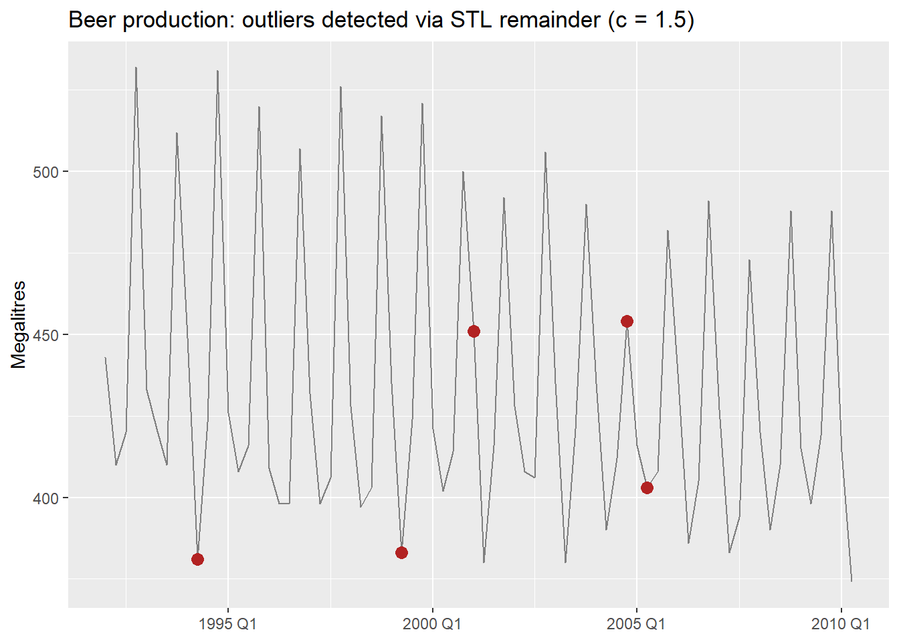](regression_files/figure-html/beer-outlier-plot-1.png)

### 7.3.1 Types of intervention variables

In regression, rather than removing the outlier and imputing, we **model it explicitly** with a dummy variable. This keeps all observations and lets the model account for the anomaly without distorting the other coefficients.

- **Spike variable**: 1 for a single anomalous period, 0 everywhere else. Captures a one-off shock.
- **Level shift variable**: 0 before an event, 1 from the event onward. Captures a permanent change in level.
- **Ramp variable**: 0 before an event, then increasing linearly. Captures a gradual structural shift.

Code

``` numberSource
beer_interv <- beer |>
  mutate(
    spike_Q2_1994 = if_else(Quarter == yearquarter("1994 Q2"), 1L, 0L), #<1>
    level_2000    = if_else(year(Quarter) >= 2000, 1L, 0L)              #<2>
  )
 
beer_fit_interv <- beer_interv |>
  model(
    TSLM(Beer ~ trend() + season() + spike_Q2_1994 + level_2000)
  )
 
report(beer_fit_interv)
```

1.  Spike: 1 only in 1994 Q2, captures the single anomalous quarter.
2.  Level shift: 1 from year 2000 onward, allows a different intercept from that point.

    Series: Beer 
    Model: TSLM 

    Residuals:
         Min       1Q   Median       3Q      Max 
    -42.7196  -6.9594  -0.7748   8.0050  21.5292 

    Coefficients:
                  Estimate Std. Error t value Pr(>|t|)    
    (Intercept)   442.6530     3.8050 116.336  < 2e-16 ***
    trend()        -0.3730     0.1285  -2.902  0.00501 ** 
    season()year2 -33.3328     3.9745  -8.387 4.84e-12 ***
    season()year3 -17.8072     3.9716  -4.484 2.95e-05 ***
    season()year4  72.8436     3.9773  18.315  < 2e-16 ***
    spike_Q2_1994 -24.5904    12.5547  -1.959  0.05432 .  
    level_2000      0.6182     5.5264   0.112  0.91127    
    ---
    Signif. codes:  0 '***' 0.001 '**' 0.01 '*' 0.05 '.' 0.1 ' ' 1

    Residual standard error: 12.07 on 67 degrees of freedom
    Multiple R-squared: 0.9284, Adjusted R-squared: 0.922
    F-statistic: 144.9 on 6 and 67 DF, p-value: < 2.22e-16

> **TIP:**
>
> We will revisit outlier handling in Module 4, where we cover robust methods and automatic outlier detection. Intervention variables are the regression-world equivalent of those techniques — explicit rather than automatic.

# 8 Nonlinear Regression

We established earlier that **linear in the parameters** does not mean a straight line. Here are the three most practically useful nonlinear forms — all estimable by OLS.

## 8.1 Log Transformations

What changes relative to a standard linear regression is not the estimation method — it is the **interpretation of the coefficients**.

| Model | Equation | Interpretation of \hat{\beta}\_1 |
|----|----|----|
| **Lin-lin** (standard) | y_t = \beta_0 + \beta_1 x_t + \varepsilon_t | 1-unit \uparrow x → \hat{\beta}\_1-unit change in y |
| **Log-log** (elasticity) | \log y_t = \beta_0 + \beta_1 \log x_t + \varepsilon_t | 1% \uparrow x → \hat{\beta}\_1% change in y |
| **Log-lin** (semi-elasticity) | \log y_t = \beta_0 + \beta_1 x_t + \varepsilon_t | 1-unit \uparrow x → 100\hat{\beta}\_1% change in y |
| **Lin-log** | y_t = \beta_0 + \beta_1 \log x_t + \varepsilon_t | 1% \uparrow x → \hat{\beta}\_1/100-unit change in y |

> **NOTE:**
>
> These interpretations hold cleanly **only for the natural logarithm** (\ln). Two common alternatives:
>
> - **Logarithm in a different base** (e.g., \log\_{10}): the coefficient is scaled by \ln(b) where b is the base. The elasticity interpretation is preserved in shape but the numeric value changes — an unnecessary complication. Stick with \ln.
>
> - **Box-Cox** (\lambda \neq 0, 1): the response is on the scale \frac{y^\lambda - 1}{\lambda}, which has no clean verbal interpretation. Box-Cox is better used as a pre-processing transformation to stabilize variance before modeling (as in Module 1) than inside a regression model where you need to interpret the coefficients.

## 8.2 Piecewise Linear Trends

When the trend changes slope at one or more points in time, a **piecewise linear model** fits separate linear segments joined at **knots**.

We use the Boston Marathon winning times — a series with clear structural breaks.

Code

``` r
boston_men <- boston_marathon |>
  filter(Event == "Men's open division") |>
  mutate(Minutes = as.numeric(Time) / 60)
 
boston_men |>
  autoplot(Minutes) +
  labs(title = "Boston Marathon: men's open division winning times",
       y = "Minutes", x = NULL)
```

[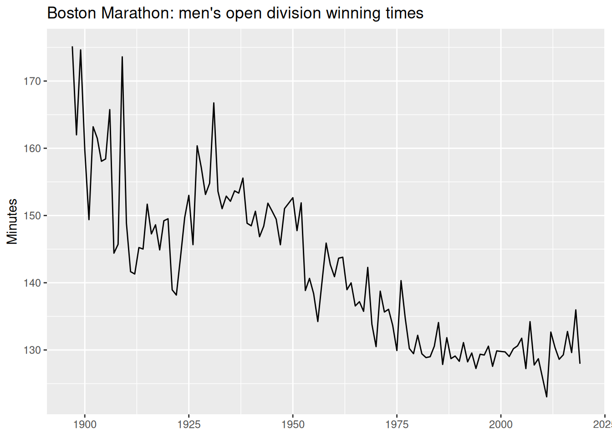](regression_files/figure-html/boston-data-1.png)

### 8.2.1 A linear trend first

What does a single linear trend produce on this data?

Code

``` r
boston_fit_linear <- boston_men |>
  model(linear = TSLM(Minutes ~ trend()))
 
boston_men |>
  autoplot(Minutes, color = "grey60") +
  geom_line(
    data = fitted(boston_fit_linear),
    aes(y = .fitted), color = "#0072B2"
  ) +
  autolayer(forecast(boston_fit_linear, h = 10),
            alpha = 0.5, level = 95) +
  labs(title = "Boston Marathon: linear trend",
       y = "Minutes", x = NULL)
```

[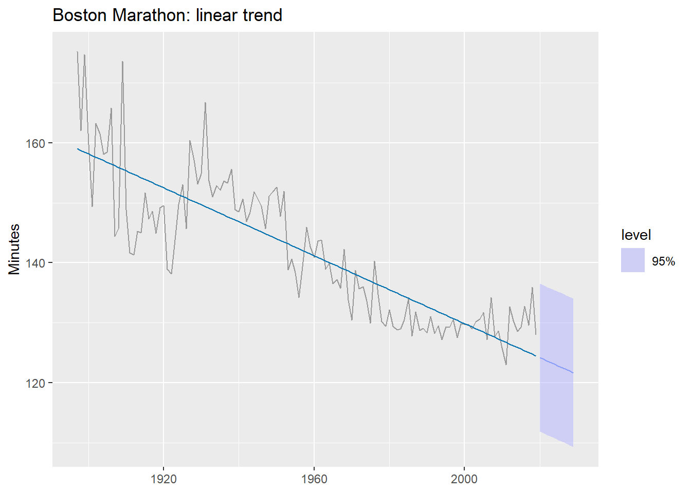](regression_files/figure-html/boston-linear-only-1.png)

The forecast predicts times will keep falling indefinitely — eventually reaching zero. A single linear trend is the wrong functional form here.

### 8.2.2 Three functional forms

Code

``` numberSource
boston_fit <- boston_men |>
  model(
    linear      = TSLM(Minutes ~ trend()),
    exponential = TSLM(log(Minutes) ~ trend()),                #<1>
    piecewise   = TSLM(Minutes ~ trend(knots = c(1940, 1980))) #<2>
  )
 
boston_men |>
  autoplot(Minutes, color = "grey60") +
  geom_line(
    data = fitted(boston_fit),
    aes(y = .fitted, color = .model)
  ) +
  autolayer(forecast(boston_fit, h = 10),
            alpha = 0.4, level = 95) +
  labs(title = "Boston Marathon: three functional forms",
       y = "Minutes", x = NULL, color = "Model") +
  theme(legend.position = "top")
```

1.  Log-transformed response: assumes times decrease at a declining rate.
2.  `knots` specify the years where the slope is allowed to change.

[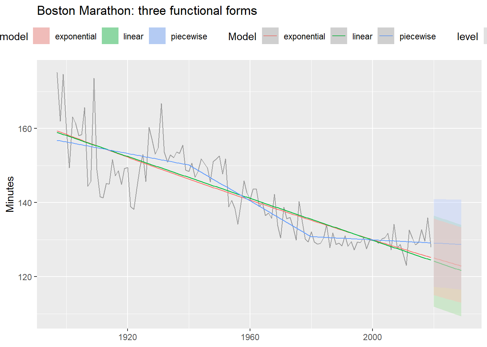](regression_files/figure-html/boston-fit-1.png)

Code

``` r
accuracy(boston_fit) |>
  select(.model, RMSE, MAE, MAPE) |>
  arrange(MAPE)
```

### 8.2.3 The knot selection problem

A key limitation of piecewise regression: **we must choose the knots ourselves**. Different choices can produce very different forecasts, even when in-sample fit looks similar.

Code

``` numberSource
boston_fit_knots <- boston_men |>
  model(
    k1 = TSLM(Minutes ~ trend(knots = c(1940, 1980))),
    k2 = TSLM(Minutes ~ trend(knots = c(1915, 1950))),
    k3 = TSLM(Minutes ~ trend(knots = c(1950, 1970, 1990)))
  )
 
boston_men |>
  autoplot(Minutes, color = "grey60") +
  geom_line(
    data = fitted(boston_fit_knots),
    aes(y = .fitted, color = .model)
  ) +
  autolayer(forecast(boston_fit_knots, h = 10),
            alpha = 0.4, level = 95) +
  labs(title = "Different knots → very different forecasts",
       y = "Minutes", x = NULL, color = "Model") +
  theme(legend.position = "top")
```

[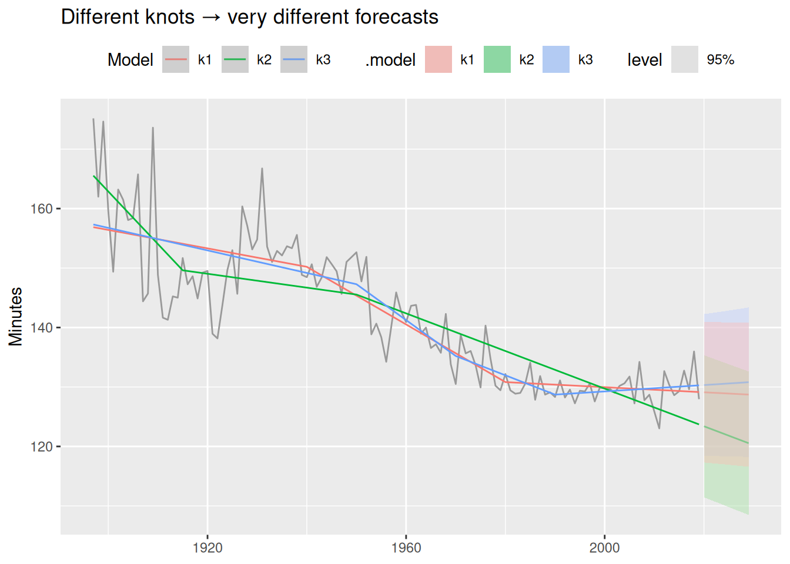](regression_files/figure-html/boston-knots-1.png)

> **WARNING:**
>
> These models fit the historical data similarly well — but their forecasts diverge dramatically. **Always inspect the forecast, not just the in-sample fit.** This is one motivation for Prophet (Module 4), which detects changepoints automatically from the data rather than requiring manual specification.

# 9 Summary

| Model | Formula | When to use |
|----|----|----|
| **Simple TSLM** | `TSLM(y ~ x)` | One meaningful exogenous predictor; baseline |
| **Multiple TSLM** | `TSLM(y ~ x1 + x2 + ...)` | Several predictors; check multicollinearity |
| **Trend + season** | `TSLM(y ~ trend() + season())` | Deterministic trend and/or fixed seasonality |
| **Interventions** | `TSLM(y ~ ... + spike + shift)` | Known outliers or structural breaks |
| **Log-log** | `TSLM(log(y) ~ log(x))` | Elasticity relationships |
| **Log-lin** | `TSLM(log(y) ~ trend())` | Exponential growth/decay |
| **Piecewise** | `TSLM(y ~ trend(knots = c(...)))` | Trend with known structural breaks |

**Key takeaways:**

- Regression adds *external context* that purely univariate models cannot capture.
- Correlation ≠ causality — always.
- Residual diagnostics are not optional: autocorrelated residuals invalidate inference.
- Multicollinearity hurts interpretation, but usually not forecast accuracy.
- For forecasting with regression you must decide what to do with future predictor values: ex-ante, ex-post, or scenario-based.
- More flexible functional forms improve fit but require careful inspection of the forecasts.

> **NOTE:**
>
> **Coming up in 3.3:** Dynamic regression — what happens when we let the error term \varepsilon_t follow an ARIMA process instead of assuming white noise. This directly addresses the residual autocorrelation we saw in the simple model.

Back to top

## Footnotes

[^1]: When seasonality is weak or absent, `season(period = 1)` can be used to extract only the trend. See [Practical Forecasting Issues](../../../../docs/modules/module_3/01_practical_issues/practical_issues.llms.md) for the full workflow including NA imputation.
