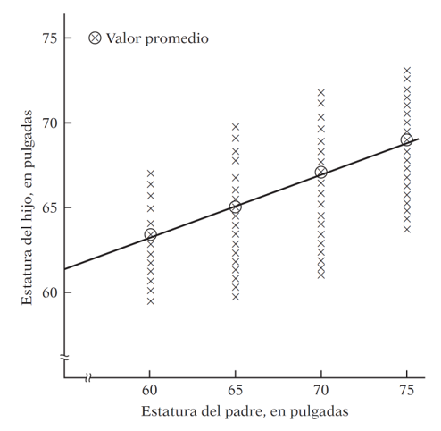
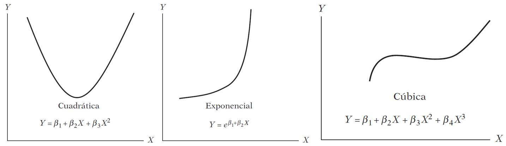

```{r}
#| label: pkgs
#| message: false
#| include: false

library(tidyverse)
library(fpp3)
```

:::{.content-visible unless-format="revealjs"}

```{r}
#| label: pkgs_special
#| message: false

library(plotly) #<1>
library(car)    #<2>
```

1. For interactive plots.
2. For the `vif()` function used in the multicollinearity section.

:::

# From Univariate to Multivariate Models

:::{.content-hidden unless-format="revealjs"}

##

:::

Every model we have built so far shares one fundamental characteristic: it is **univariate**. Whether it was STL decomposition, ETS, or ARIMA, we only looked inward — we used the history of $y_t$ itself to forecast its future.

:::{.fragment}

That approach has taken us surprisingly far. But it ignores the **outside world** entirely.

:::


- A retailer's sales are not just a function of past sales — they depend on promotions, competitor prices, and economic conditions.
- Energy demand depends on temperature, not just its own history.
- Mexico's retail trade index (`mexretail`) reflects consumer purchasing power, employment, and credit conditions — none of which appear in the series itself.


:::{.content-hidden unless-format="revealjs"}

##

:::

:::{.content-visible unless-format="revealjs"}

## Why exogenous variables?

:::

The question we are addressing now is: **what if we gave our model access to external information?**

:::{.incremental}

- In Modules 1–2, our model improved by getting smarter about the *structure* of $y_t$ (trend, seasonality, autocorrelation).
- In Module 3, we improve by adding *context*: variables from outside the series that help explain its movement.
- This is the transition from filtering to **causal modeling** — at least in the predictive, not necessarily structural, sense.

:::

:::{.content-visible unless-format="revealjs"}

:::{.callout-note collapse="true"}
## Where we've been and where we're going

| Module | What we modeled | Tool |
|--------|----------------|------|
| 1 | Trend + seasonality via decomposition | STL + SNAIVE/Drift |
| 2 | Autocorrelation structure of the signal | ETS, ARIMA |
| **3** | **Relationship with external variables** | **TSLM, dynamic regression** |
| 4 | Complex seasonality, robustness | Prophet, bootstrapping |

Each module has asked: *what does my current model fail to capture?* The answer now is: information from other series.
:::

:::

# The Linear Regression Model

:::{.content-hidden unless-format="revealjs"}

## The linear model

:::

The simplest case is the **simple linear regression model**:

$$
y_t = \beta_0 + \beta_1 x_t + \varepsilon_t
$$

where:

:::{.incremental}

- $\beta_0$ is the **intercept**: the predicted value of $y$ when $x = 0$.
- $\beta_1$ is the **slope**: the average change in $y$ for a one-unit change in $x$.
- $\varepsilon_t$ is the **error term**: captures all other influences on $y_t$ not explicitly modeled.

:::

*](linreg.PNG)

:::{.callout-tip collapse="true"}
## How are the $\beta$'s estimated? Ordinary Least Squares (OLS)

We cannot observe the $\beta$'s directly — we estimate them from data. The **Ordinary Least Squares (OLS)** method chooses the estimates $\hat{\beta}_0, \hat{\beta}_1, \ldots, \hat{\beta}_k$ that minimize the **sum of squared residuals**:

$$
\min_{\hat{\boldsymbol{\beta}}} \sum_{t=1}^{T} \hat{\varepsilon}_t^2 = \sum_{t=1}^{T} \left(y_t - \hat{\beta}_0 - \hat{\beta}_1 x_{1t} - \cdots - \hat{\beta}_k x_{kt}\right)^2
$$

For the simple case ($k = 1$), taking partial derivatives and setting them to zero yields closed-form solutions:

$$
\hat{\beta}_1 = \frac{\sum x_t y_t - T\bar{x}\bar{y}}{\sum x_t^2 - T\bar{x}^2}, \qquad \hat{\beta}_0 = \bar{y} - \hat{\beta}_1 \bar{x}
$$

For the general case with $k$ predictors, the solution extends naturally to matrix form:

$$
\hat{\boldsymbol{\beta}} = (\mathbf{X}^\top \mathbf{X})^{-1} \mathbf{X}^\top \mathbf{y}
$$

where $\mathbf{X}$ is the **design matrix** — a column of ones (for the intercept) plus one column per predictor — and $\mathbf{y}$ is the vector of observed responses.

In practice, R handles all of this internally. But knowing the objective function matters: OLS penalizes **large** residuals more than small ones (because of the square), and under the classical assumptions the Gauss-Markov theorem guarantees the estimates are **BLUE** (Best Linear Unbiased Estimators) — regardless of whether we have one predictor or twenty.

:::


:::{.content-hidden unless-format="revealjs"}

## Real examples

:::

:::{.content-visible unless-format="revealjs"}

## Some motivating examples

:::

:::{.incremental}

- **Ice cream sales** ($y$) and **daily temperature** ($x$).
- **Nike revenue** ($y$) and **marketing spend** ($x$).
- **US consumption growth** ($y$) and **income growth** ($x$).
- **Mexico retail trade** ($y$) and **consumer confidence index** ($x$).

:::

:::{.callout-note collapse="true"}
## Terminology: many names for $y$ and $x$

The same concept appears under different names depending on the discipline:

| $y$ (forecast variable) | $x$ (predictor variables) |
|:-----------------------:|:-------------------------:|
| Dependent | Independent |
| Explained | Explanatory |
| Regressand | Regressor |
| Response | Stimulus / Covariate |
| Endogenous | Exogenous |

In time series forecasting, FPP3 uses **forecast variable** and **predictor variables**.
:::

:::{.callout-note collapse="true"}
## The origin of "regression" — Galton, 1886

The term was coined by Francis Galton while studying the relationship between parents' height and their children's height.



His finding: tall parents tend to have tall children, but on average their children are *not as tall as them*. Short parents tend to have children *taller than themselves*. There is a tendency to **regress toward the mean**.

Without this regression to the mean, the distribution of heights across generations would diverge — we would eventually have people of Hobbit stature and people of giant stature, with nothing in between.

Modern regression analysis generalizes this idea: studying the dependence of one variable on one or more others to predict its **average value**.
:::


## Regression and Causality


> *"A statistical relationship, however strong and suggestive, can never establish causal connexion: our ideas of causality must come from outside statistics, ultimately from some theory or other."*
>
> — Kendall & Stuart (1961)

:::{.fragment}
$$\text{Regression} \neq \text{Causality} \qquad \text{Correlation} \neq \text{Causality}$$
:::

:::{.content-hidden unless-format="revealjs"}

##

:::

This is not a technicality — it is one of the most practically important ideas in data science:

:::{.incremental}

- People who carry lighters have higher rates of lung cancer. Does carrying a lighter *cause* cancer?
- Ice cream sales and drowning rates are correlated. Should we ban ice cream?
- Homeopathic treatments show improvements. Does the remedy *work*, or did patients improve on their own?
- Casually: "every time I hiccup and hold my breath, it goes away." Does holding your breath cure hiccups, or would they have stopped anyway?

:::

:::{.content-hidden unless-format="revealjs"}

## 

<iframe src="https://www.tylervigen.com/spurious-correlations" width="100%" height="500px" style="border:none;">
</iframe>

:::

:::{.content-visible unless-format="revealjs"}

### Spurious correlations

The web is full of striking examples where two completely unrelated time series happen to move together — these are called **spurious correlations**.

<iframe src="https://www.tylervigen.com/spurious-correlations" width="100%" height="600px" style="border:1px solid #ddd; border-radius:4px;">
</iframe>

:::


:::{.callout-important}
A regression model would happily fit a line through any of those charts. The model does not know the relationship is nonsense — **you** have to know. Causal direction requires theory, domain knowledge, or experimental design, not statistical strength alone.
:::


## What Does "Linear" Mean?

:::{.content-hidden unless-format="revealjs"}

##

:::


*Are these models linear?*




:::{.content-hidden unless-format="revealjs"}

## Linearity can be defined in two senses:

:::

::: {.content-visible unless-format="revealjs"}

Linearity can be defined in two senses:

:::

:::{.incremental}

1. **Linearity in the variables** — $E(y \mid x)$ is a linear function of $x$. This is the restrictive sense: only straight lines.

2. **Linearity in the parameters** — $E(y \mid x)$ is linear in the $\beta$'s. 

:::

:::{.fragment}

The three models above are all **nonlinear in $x$** but **linear in $\beta$**. A linear regression model can produce a straight line, a parabola, an exponential curve, or a piecewise function, depending on the **functional form** chosen.

:::

# Regression in R: `us_change`

:::{.content-hidden unless-format="revealjs"}

## The dataset

:::

We will use `us_change` — quarterly percentage changes in US macroeconomic variables. Our forecast variable is **Consumption**.

```{r}
#| label: us-change-glimpse

us_change
```

:::{.content-hidden unless-format="revealjs"}

## Exploratory analysis

:::

:::{.content-visible unless-format="revealjs"}

## Exploratory analysis

:::

Before fitting any model, we look at the data.

:::{.panel-tabset}

### All series over time

```{r}
#| label: us-change-time
#| echo: false

p <- us_change |>
  pivot_longer(-Quarter) |>
  ggplot(aes(x = Quarter, y = value, color = name)) +
  geom_line() +
  facet_wrap(~name, scales = "free_y", ncol = 2) +
  theme(legend.position = "none") +
  labs(y = "% change", x = NULL)

ggplotly(p, dynamicTicks = TRUE)
```

### Scatter matrix

```{r}
#| label: us-change-pairs
#| message: false
#| warning: false

us_change |>
  as_tibble() |>
  select(-Quarter) |>
  GGally::ggpairs()
```

:::

:::{.callout-warning appearance="simple"}
The scatter matrix shows correlations between all pairs of variables. Notice that some predictors are correlated with each other — we will return to this when we discuss multicollinearity.
:::

## Simple Linear Regression

We start with the simplest possible model: **Consumption as a function of Income only**.

$$
y_{t, \text{Consumption}} = \beta_0 + \beta_1 x_{t, \text{Income}} + \varepsilon_t
$$

In `fable`, time series linear models use `TSLM()`:

```{r}
#| label: us-change-simple-fit
#| echo: true

us_change_fit_simple <- us_change |>                   #<1>
  model(
    simple = TSLM(Consumption ~ Income)                #<2>
  )

report(us_change_fit_simple)                           #<3>
```

1. Start with the `us_change` tsibble.
2. `TSLM()` fits a **T**ime **S**eries **L**inear **M**odel using OLS. The formula syntax is identical to `lm()`.
3. `report()` prints the full regression output.

:::{.content-hidden unless-format="revealjs"}

## Reading the regression output

:::

:::{.content-visible unless-format="revealjs"}

### Reading the regression output

:::

The output has two main parts:

:::{.incremental}

**Individual significance** — each coefficient has a $t$-test:
$$H_0: \beta_i = 0 \qquad H_1: \beta_i \neq 0$$
The stars (`*`, `**`, `***`) indicate $p < 0.05$, $p < 0.01$, $p < 0.001$.

**Joint significance** — the F-test asks whether *any* predictor is useful:
$$H_0: \beta_1 = \beta_2 = \cdots = \beta_k = 0$$
A significant F-test does not mean all individual coefficients are significant.

:::

:::{.fragment}

The estimated model is:
$$\hat{y}_{t, \text{Consumption}} = 0.545 + 0.272 \cdot x_{t, \text{Income}}$$

For every 1 percentage point increase in income growth, consumption growth increases by 0.272 percentage points on average.

:::

## Residual Diagnostics

:::{.content-hidden unless-format="revealjs"}

### Gauss-Markov assumptions and why they matter in time series

:::

:::{.content-visible unless-format="revealjs"}

### Gauss-Markov assumptions

:::

OLS produces BLUE estimators only if the classical assumptions hold. The one most frequently violated in time series is **no autocorrelation in the errors**:

$$\text{cov}(\varepsilon_t, \varepsilon_s) = 0 \quad \forall \; t \neq s$$

:::{.fragment}

If residuals are autocorrelated, OLS estimates are still unbiased but **no longer efficient** — standard errors are wrong, $p$-values are wrong, and forecast intervals are wrong. This is why we always check the residuals.

:::

::: {.fragment}

:::{.panel-tabset}

### Time series vs. fitted

```{r}
#| label: us-change-simple-aug
#| echo: false

p <- augment(us_change_fit_simple) |>
  ggplot(aes(x = Quarter)) +
  geom_line(aes(y = Consumption, color = "Actual")) +
  geom_line(aes(y = .fitted, color = "Fitted")) +
  labs(y = "% change", x = NULL, color = NULL,
       title = "US Consumption: actual vs. fitted") +
  theme(legend.position = "top")

ggplotly(p, dynamicTicks = TRUE)
```

### Fitted vs. actual (45° line)

```{r}
#| label: us-change-simple-scatter
#| echo: false

augment(us_change_fit_simple) |>
  ggplot(aes(x = Consumption, y = .fitted)) +
  geom_point(alpha = 0.6) +
  geom_abline(intercept = 0, slope = 1, color = "firebrick") +
  labs(x = "Actual", y = "Fitted",
       title = "Points close to the 45° line = good fit")
```

### Residual diagnostics

```{r}
#| label: us-change-simple-resid

us_change_fit_simple |>
  gg_tsresiduals()
```

### Ljung-Box test

```{r}
#| label: us-change-simple-lb

us_change_dof_simple <- us_change_fit_simple |>    #<1>
  tidy() |>
  nrow()

augment(us_change_fit_simple) |>
  features(.resid, ljung_box,
           lag = 10,
           dof = us_change_dof_simple)             #<2>
```

1. Extract the number of estimated parameters to use as degrees of freedom correction.
2. A significant $p$-value indicates autocorrelated residuals — a sign the model is missing structure.

:::

:::

::: {.fragment}
The residuals show clear autocorrelation. The simple model is not capturing all the dynamics of consumption. Let's improve it.

:::

# Multiple Linear Regression

:::{.content-hidden unless-format="revealjs"}

## The multiple model

:::

In practice, one predictor is rarely sufficient. The **multiple linear regression model** is:

$$
y_t = \beta_0 + \beta_1 x_{1t} + \beta_2 x_{2t} + \cdots + \beta_k x_{kt} + \varepsilon_t
$$

For `us_change`, a natural extension is:

$$
y_{t, \text{Cons.}} = \beta_0 + \beta_1 x_{t, \text{Inc.}} + \beta_2 x_{t, \text{Prod.}} + \beta_3 x_{t, \text{Sav.}} + \beta_4 x_{t, \text{Unemp.}} + \varepsilon_t
$$

```{r}
#| label: us-change-multiple-fit
#| echo: true

us_change_fit_mult <- us_change |>
  model(
    multiple = TSLM(Consumption ~ Income + Production + Savings + Unemployment) #<1>
  )

report(us_change_fit_mult)
```
1. The formula syntax is the same as the simple linear regression: just add more predictors with `+`.

:::{.content-hidden unless-format="revealjs"}

## Comparing simple vs. multiple

:::

:::{.content-visible unless-format="revealjs"}

### Comparing simple vs. multiple

:::

```{r}
#| label: us-change-compare-setup
#| echo: false

us_change_aug_simple <- augment(us_change_fit_simple) |>
  mutate(.model = "Simple")

us_change_aug_mult <- augment(us_change_fit_mult) |>
  mutate(.model = "Multiple")

us_change_aug_both <- bind_rows(us_change_aug_simple, us_change_aug_mult) |>
  mutate(.model = factor(.model, levels = c("Simple", "Multiple")))
```

:::{.panel-tabset}

### Time series vs. fitted

:::{.content-visible unless-format="revealjs"}
```{r}
#| label: us-change-compare-time-html
#| echo: false
#| fig-cap: "Grey line = actual consumption; colored line = fitted values. The multiple model tracks the data much more closely."
#| lightbox:
#|   group: comparing-models

p <- us_change_aug_both |>
  ggplot(aes(x = Quarter)) +
  geom_line(aes(y = Consumption), color = "grey50") +
  geom_line(aes(y = .fitted, color = .model)) +
  facet_wrap(~.model, ncol = 2) +
  labs(y = "% change", x = NULL) +
  theme(legend.position = "none")

ggplotly(p, dynamicTicks = TRUE)
```

:::

:::{.content-hidden unless-format="revealjs"}
```{r}
#| label: us-change-compare-time-revealjs
#| echo: false
#| fig-width: 10
#| fig-height: 4
#| fig-cap: "Grey line = actual consumption; colored line = fitted values. The multiple model tracks the data much more closely."
#| lightbox:
#|   group: comparing-models

us_change_aug_both |>
  ggplot(aes(x = Quarter)) +
  geom_line(aes(y = Consumption), color = "grey50") +
  geom_line(aes(y = .fitted, color = .model)) +
  facet_wrap(~.model, ncol = 2) +
  labs(y = "% change", x = NULL) +
  theme(legend.position = "none")
```

:::

### Fitted vs. actual

:::{.content-visible unless-format="revealjs"}
```{r}
#| label: us-change-compare-scatter-html
#| echo: false
#| fig-cap: "Points closer to the 45° line indicate better fit. The multiple model shows a much tighter cloud."
#| lightbox:
#|   group: comparing-models

p <- us_change_aug_both |>
  ggplot(aes(x = Consumption, y = .fitted, color = .model)) +
  geom_point(alpha = 0.6) +
  geom_abline(intercept = 0, slope = 1, color = "grey30") +
  facet_wrap(~.model, ncol = 2) +
  labs(x = "Actual", y = "Fitted") +
  theme(legend.position = "none")

ggplotly(p)
```

:::

:::{.content-hidden unless-format="revealjs"}
```{r}
#| label: us-change-compare-scatter-revealjs
#| echo: false
#| fig-width: 10
#| fig-height: 4
#| fig-cap: "Points closer to the 45° line indicate better fit. The multiple model shows a much tighter cloud."
#| lightbox:
#|   group: comparing-models

us_change_aug_both |>
  ggplot(aes(x = Consumption, y = .fitted, color = .model)) +
  geom_point(alpha = 0.6) +
  geom_abline(intercept = 0, slope = 1, color = "grey30") +
  facet_wrap(~.model, ncol = 2) +
  labs(x = "Actual", y = "Fitted") +
  theme(legend.position = "none")
```

:::

### Residual diagnostics
```{r}
#| label: us-change-resid-simple
#| echo: false
#| fig-cap: "Simple model residuals: significant ACF spikes indicate remaining autocorrelation."
#| lightbox:
#|   group: comparing-models

us_change_fit_simple |>
  gg_tsresiduals() +
  labs(title = "Simple model")
```
```{r}
#| label: us-change-resid-mult
#| echo: false
#| fig-cap: "Multiple model residuals: ACF spikes are much reduced and the distribution is closer to normal."
#| lightbox:
#|   group: comparing-models

us_change_fit_mult |>
  gg_tsresiduals() +
  labs(title = "Multiple model")
```

### Residuals vs. predictors
```{r}
#| label: us-change-resid-pred
#| echo: false
#| fig-cap: "Residuals from the multiple model vs. each predictor. No strong patterns suggest the linear specification is adequate."
#| lightbox:
#|   group: comparing-models

left_join(
  us_change,
  residuals(us_change_fit_mult),
  by = "Quarter"
) |>
  pivot_longer(Income:Unemployment, names_to = "predictor") |>
  ggplot(aes(x = value, y = .resid)) +
  geom_point(alpha = 0.5) +
  geom_hline(yintercept = 0, color = "firebrick", linetype = "dashed") +
  facet_wrap(~predictor, scales = "free_x") +
  labs(x = "Predictor value", y = "Residual")
```

### Ljung-Box
```{r}
#| label: us-change-lb-both

bind_rows(
  augment(us_change_fit_simple) |>
    features(.resid, ljung_box, lag = 10, dof = 2) |>
    mutate(.model = "Simple"),
  augment(us_change_fit_mult) |>
    features(.resid, ljung_box, lag = 10, dof = 5) |>
    mutate(.model = "Multiple")
) |>
  select(.model, lb_stat, lb_pvalue)
```

:::

The multiple model substantially improves fit ($\bar{R}^2$ goes from ~0.15 to ~0.75) and the residuals look much closer to white noise.

:::{.callout-tip appearance="simple"}
The **residuals vs. predictors** plot is a useful diagnostic specific to multiple regression. If any panel shows a systematic pattern (curve, fan shape), it suggests a missing nonlinear term or interaction involving that predictor.
:::

# Predictor Selection

:::{.content-hidden unless-format="revealjs"}

## The problem

:::

With $k$ potential predictors, there are $2^k$ possible models. We need a principled way to choose among them.

:::{.callout-important appearance="simple"}
**Do not use in-sample $R^2$ for selection.** Adding any predictor, even a random one, increases $R^2$. We need measures that penalize model complexity.
:::

The three standard criteria available from `glance()` in `fable`:

:::{.incremental}

- **Adjusted $\bar{R}^2$**: penalizes for additional parameters. Maximize it.
- **AIC** (Akaike Information Criterion): $-2\log L + 2k$. Minimize it. Optimizes predictive performance.
- **AICc**: AIC corrected for small samples. **Prefer this over AIC** for time series.
- **BIC** (Bayesian Information Criterion): $-2\log L + k \log T$. Minimize it. BIC penalizes complexity more heavily and tends to select smaller models than AICc.

:::

:::{.fragment}

```{r}
#| label: us-change-glance
#| echo: true

glance(us_change_fit_mult) |>
  select(adj_r_squared, AIC, AICc, BIC)
```

:::

:::{.content-hidden unless-format="revealjs"}

## Search strategies

:::

:::{.content-visible unless-format="revealjs"}

### Search strategies

:::

:::{.panel-tabset}

### All subsets (small $k$)

Fit all possible models and compare:

```{r}
#| label: us-change-allsubsets
#| echo: true

us_change_fit_select <- us_change |>
  model(
    m1 = TSLM(Consumption ~ Income),
    m2 = TSLM(Consumption ~ Income + Production),
    m3 = TSLM(Consumption ~ Income + Savings),
    m4 = TSLM(Consumption ~ Income + Unemployment),
    m5 = TSLM(Consumption ~ Income + Production + Savings),
    m6 = TSLM(Consumption ~ Income + Production + Unemployment),
    m7 = TSLM(Consumption ~ Income + Savings + Unemployment),
    m8 = TSLM(Consumption ~ Income + Production + Savings + Unemployment)
  )

us_change_fit_select |>
  glance() |>
  select(.model, adj_r_squared, AIC, AICc, BIC) |>
  arrange(AICc)
```

### Backwards stepwise

Start with the full model and remove predictors one at a time:

```{r}
#| label: us-change-backward
#| echo: true

us_change |>
  model(
    full  = TSLM(Consumption ~ Income + Production + Savings + Unemployment),
    drop1 = TSLM(Consumption ~ Income + Production + Savings),
    drop2 = TSLM(Consumption ~ Income + Production + Unemployment),
    drop3 = TSLM(Consumption ~ Income + Savings + Unemployment),
    drop4 = TSLM(Consumption ~ Production + Savings + Unemployment)
  ) |>
  glance() |>
  select(.model, adj_r_squared, AICc, BIC) |>
  arrange(AICc)
```

### Forwards stepwise

Start with the intercept-only model and add predictors one at a time:

```{r}
#| label: us-change-forward
#| echo: true

# Step 1: which single predictor is best?
us_change |>
  model(
    f1 = TSLM(Consumption ~ Income),
    f2 = TSLM(Consumption ~ Production),
    f3 = TSLM(Consumption ~ Savings),
    f4 = TSLM(Consumption ~ Unemployment)
  ) |>
  glance() |>
  select(.model, AICc) |>
  arrange(AICc)
```

```{r}
#| label: us-change-forward2
#| echo: true

# Step 2: add a second predictor to the best single-predictor model
us_change |>
  model(
    f1  = TSLM(Consumption ~ Savings),
    f12 = TSLM(Consumption ~ Savings + Income),
    f13 = TSLM(Consumption ~ Savings + Production),
    f14 = TSLM(Consumption ~ Savings + Unemployment)
  ) |>
  glance() |>
  select(.model, AICc) |>
  arrange(AICc)
```

:::

::: {.fragment}
:::{.callout-tip collapse="true"}
## AICc vs. BIC: which one to use?

Both penalize model complexity, but differently:

- **AICc** minimizes expected out-of-sample prediction error. It tends to select slightly larger models.
- **BIC** is consistent: as $T \to \infty$, it will select the true model (if it's in the candidate set). It penalizes more heavily and selects smaller models.

In forecasting contexts, **AICc is generally preferred** because we care more about predictive accuracy than model parsimony per se. When they disagree, consider whether interpretability or predictive accuracy is the primary goal.
:::

:::

## Multicollinearity

:::{.content-hidden unless-format="revealjs"}

### What is it?

:::

Predictor selection and multicollinearity are closely linked. Even after running all-subsets or stepwise search, the selected model may still include predictors that are highly correlated with each other — and that creates problems that no information criterion will automatically flag.

When two or more predictors are highly correlated, we have **multicollinearity**. It does not bias the OLS estimates, but it inflates the variance of the coefficients, making them unstable and hard to interpret.

:::{.incremental}

- In the extreme case of **perfect collinearity** ($x_1 = c \cdot x_2$), the model is unidentified: infinitely many solutions minimize SSR.
- In practice, collinearity is a matter of degree, not a binary condition.
- Warning signs: coefficients with unexpected signs, large standard errors, a significant F-test alongside non-significant individual $t$-tests.

:::

:::{.content-hidden unless-format="revealjs"}

## Detecting multicollinearity: VIF

:::

:::{.content-visible unless-format="revealjs"}

### Detecting multicollinearity: VIF

:::

The **Variance Inflation Factor (VIF)** measures how much the variance of $\hat{\beta}_j$ is inflated by its correlation with the other predictors:

$$
\text{VIF}_j = \frac{1}{1 - R_j^2}
$$

where $R_j^2$ is the $R^2$ obtained by regressing $x_j$ on all the *other* predictors — a measure of how well one predictor can be linearly predicted by the rest.

:::{.incremental}

- $\text{VIF} = 1$: no collinearity with other predictors.
- $\text{VIF} \in (1, 5)$: moderate — generally acceptable.
- $\text{VIF} > 5$: concerning, examine carefully.
- $\text{VIF} > 10$: severe — take action.

:::

```{r}
#| label: us-change-vif
#| eval: false

us_change_fit_mult |>
  extract_fit_engine() |>   #<1>
  vif()                     #<2>
```

1. `extract_fit_engine()` retrieves the underlying `lm` object from the `fable` mable, allowing us to use base-R or `car` diagnostics.
2. `vif()` from the `car` package computes the VIF for each predictor.

:::{.content-hidden unless-format="revealjs"}

### What to do about it

:::

:::{.content-visible unless-format="revealjs"}

### What to do about multicollinearity

:::

If VIF values are large, you have several options:

:::{.incremental}

1. **Drop one of the correlated predictors** — if two predictors carry nearly the same information, keep the one with stronger theoretical justification or cleaner interpretability. This is often the right call during selection anyway.
2. **Combine them** — create a composite index, take a ratio, or use the first principal component of the correlated group.
3. **Use a penalized regression** (Ridge, Lasso) — these methods tolerate collinearity better than OLS by accepting a small bias in exchange for substantially lower variance. Outside this course's scope, but worth knowing.
4. **Do nothing, intentionally** — if your goal is *prediction accuracy* rather than coefficient interpretation, multicollinearity may be acceptable. Forecasts can still be good even when individual $\hat{\beta}$'s are unstable.

:::

:::{.callout-warning appearance="simple"}
If you have a large number of potential predictors with substantial collinearity among them, consider dimensionality reduction (e.g., PCA) before fitting. That is outside this course's scope, but it is a common preprocessing step in production forecasting systems.
:::

# Forecasting with Regression

:::{.content-hidden unless-format="revealjs"}

## The core challenge

:::

Before we can forecast $y_t$ with regression, we need to ask: *what do we do with the predictors?*

With univariate models, `forecast(h = n)` was sufficient — the model only needed its own history. Now the model needs **future values of $x_t$** to produce a forecast of $y_t$.

:::{.fragment}

This is not a trivial problem. It creates three distinct forecasting scenarios:

:::

:::{.content-hidden unless-format="revealjs"}

## Three types of forecasts

:::

:::{.content-visible unless-format="revealjs"}

## Three types of regression forecasts

:::

:::{.panel-tabset}

### Ex-ante

**Ex-ante forecasts** use only information available at the time the forecast is made. The predictors must themselves be forecasted.

This is the "true" forecast — it is what you would actually produce in a real deployment.

```{r}
#| label: us-change-exante

# Step 1: forecast each predictor independently
us_change_fc_income <- us_change |>
  model(ARIMA(Income)) |>
  forecast(h = 8)

us_change_fc_prod <- us_change |>
  model(ARIMA(Production)) |>
  forecast(h = 8)

us_change_fc_sav <- us_change |>
  model(ARIMA(Savings)) |>
  forecast(h = 8)

us_change_fc_unemp <- us_change |>
  model(ARIMA(Unemployment)) |>
  forecast(h = 8)

# Step 2: construct future data with forecasted predictor values
us_change_future <- new_data(us_change, 8) |>
  mutate(
    Income       = us_change_fc_income |> pull(.mean),
    Production   = us_change_fc_prod   |> pull(.mean),
    Savings      = us_change_fc_sav    |> pull(.mean),
    Unemployment = us_change_fc_unemp  |> pull(.mean)
  )

# Step 3: forecast consumption using the projected predictors
us_change_fit_mult |>
  forecast(new_data = us_change_future) |>
  autoplot(us_change |> filter_index("2010 Q1" ~ .)) +
  labs(title = "Ex-ante forecast: US Consumption",
       y = "% change", x = NULL)
```

### Ex-post

**Ex-post forecasts** use *actual* realized values of the predictors. The forecast variable $y_t$ is still unknown, but we feed in the true future $x_t$ values.

These are not "real" forecasts — they are used to **evaluate the regression model in isolation**, removing predictor forecast error from the evaluation.

```{r}
#| label: us-change-expost
#| message: false

# Use filter_index to create a train/test split
us_change_train <- us_change |>
  filter_index(. ~ "2017 Q4")

us_change_test <- us_change |>
  filter_index("2018 Q1" ~ .)

us_change_fit_expost <- us_change_train |>
  model(
    multiple = TSLM(Consumption ~ Income + Production + Savings + Unemployment)
  )

# Ex-post: we supply actual future predictor values
us_change_fit_expost |>
  forecast(new_data = us_change_test) |>
  autoplot(us_change |> filter_index("2014 Q1" ~ .)) +
  labs(title = "Ex-post forecast: actual predictor values used",
       y = "% change", x = NULL)
```

### Scenario-based

**Scenario-based forecasts** construct hypothetical future values for the predictors and ask: *what would consumption look like under each scenario?*

These are especially useful for stress-testing and strategic planning.

```{r}
#| label: us-change-scenarios
#| eval: false

us_change_fit_scen <- us_change |>
  model(TSLM(Consumption ~ Income + Savings + Unemployment))

us_change_scenarios <- scenarios(
  optimistic = new_data(us_change, 4) |>
    mutate(Income = c(0.5, 0.8, 0.6, 1.0),
           Savings = c(0.1, -0.2, 0.1, -0.1),
           Unemployment = -0.1),
  pessimistic = new_data(us_change, 4) |>
    mutate(Income = -0.5,
           Savings = -0.4,
           Unemployment = 0.2),
  names_to = "Scenario"
)

us_change_fit_scen |>
  forecast(new_data = us_change_scenarios) |>
  autoplot(us_change |> filter_index("2014 Q1" ~ .)) +
  labs(title = "Scenario-based forecast: US Consumption",
       y = "% change", x = NULL)
```

:::

# Useful Predictors

:::{.content-hidden unless-format="revealjs"}

## Beyond exogenous variables

:::

`TSLM()` provides built-in terms that are particularly useful when working with time series:

:::{.incremental}

- `trend()` — a deterministic linear trend ($t = 1, 2, \ldots, T$).
- `season()` — seasonal dummy variables (one per season, with one omitted as baseline to avoid perfect collinearity).
- `fourier(K)` — Fourier terms for flexible seasonality (covered in Module 4).

:::

We will illustrate with quarterly beer production in Australia.

```{r}
#| label: beer-data

beer <- aus_production |>
  filter(year(Quarter) >= 1992) |>
  select(Quarter, Beer)

beer |>
  autoplot(Beer) +
  labs(title = "Australian quarterly beer production",
       y = "Megalitres", x = NULL)
```

## Trend and Seasonal Dummies

```{r}
#| label: beer-tslm

beer_fit <- beer |>
  model(
    TSLM(Beer ~ trend() + season())  #<1>
  )

report(beer_fit)
```

1. `trend()` adds a linear time index; `season()` adds quarterly dummy variables.

:::{.content-visible unless-format="revealjs"}

### What the dummies actually look like

:::

:::{.content-hidden unless-format="revealjs"}

## Under the hood: seasonal dummies

:::

Seasonal dummies are created automatically by `season()`, but it helps to see them explicitly:

```{r}
#| label: beer-dummies-manual
#| code-fold: true

beer |>
  mutate(
    t   = row_number(),
    Q2  = if_else(quarter(Quarter) == 2, 1L, 0L),
    Q3  = if_else(quarter(Quarter) == 3, 1L, 0L),
    Q4  = if_else(quarter(Quarter) == 4, 1L, 0L)
  ) |>
  head(8)
```

:::{.callout-warning appearance="simple"}
**The dummy variable trap:** if you create dummies for all $m$ seasons and include an intercept, you have perfect multicollinearity. Always use $m - 1$ dummies. `TSLM()` handles this automatically.
:::

:::{.panel-tabset}

### Fitted vs. actual

```{r}
#| label: beer-fitted
#| echo: false

p <- augment(beer_fit) |>
  ggplot(aes(x = Quarter)) +
  geom_line(aes(y = Beer, color = "Actual")) +
  geom_line(aes(y = .fitted, color = "Fitted")) +
  labs(y = "Megalitres", color = NULL,
       title = "Beer production: actual vs. fitted") +
  theme(legend.position = "top")

ggplotly(p, dynamicTicks = TRUE)
```

### Residual diagnostics

```{r}
#| label: beer-resid

beer_fit |>
  gg_tsresiduals()
```

:::

There is a notable outlier in Q2 1994. We can handle it with an **intervention variable**.

## Intervention Variables (Dummies)

Dummy variables are not limited to capturing seasonality. They can capture specific events:

:::{.incremental}

- **Spike variable**: a 1 for a single anomalous period, 0 everywhere else. Captures a one-off shock.
- **Level shift variable**: 0 before an event, 1 from the event onward. Captures a permanent change in level.
- **Ramp variable**: 0 before an event, then increasing linearly. Captures a gradual structural shift.

:::

```{r}
#| label: beer-intervention

beer_interv <- beer |>
  mutate(
    spike_Q2_1994 = if_else(Quarter == yearquarter("1994 Q2"), 1L, 0L), #<1>
    level_2000    = if_else(year(Quarter) >= 2000, 1L, 0L)              #<2>
  )

beer_fit_interv <- beer_interv |>
  model(
    TSLM(Beer ~ trend() + season() + spike_Q2_1994 + level_2000)
  )

report(beer_fit_interv)
```

1. Spike: captures the single anomalous quarter.
2. Level shift: allows a different intercept from year 2000 onward.

```{r}
#| label: beer-intervention-plot
#| echo: false

p <- augment(beer_fit_interv) |>
  ggplot(aes(x = Quarter)) +
  geom_line(aes(y = Beer, color = "Actual")) +
  geom_line(aes(y = .fitted, color = "Fitted")) +
  labs(y = "Megalitres", color = NULL,
       title = "Beer production: model with intervention variables") +
  theme(legend.position = "top")

ggplotly(p, dynamicTicks = TRUE)
```

:::{.callout-tip appearance="simple"}
Intervention variables in `TSLM()` are the same mechanism used in Module 4 for outlier handling — they give the model a way to account for known anomalies without distorting the other coefficient estimates.
:::

# Nonlinear Regression

:::{.content-hidden unless-format="revealjs"}

## When a straight line isn't enough

:::

We established earlier that **linear in the parameters** does not mean a straight line. Three practically useful forms:

## Log Transformations

:::{.incremental}

- **Log-log** (constant elasticity): $\log y_t = \beta_0 + \beta_1 \log x_t + \varepsilon_t$. Coefficients are elasticities: a 1% change in $x$ corresponds to a $\beta_1$% change in $y$.
- **Log-lin** (exponential growth): $\log y_t = \beta_0 + \beta_1 t + \varepsilon_t$. Trend coefficient is the constant growth rate.
- **Lin-log**: $y_t = \beta_0 + \beta_1 \log x_t + \varepsilon_t$. A 1% change in $x$ changes $y$ by $\beta_1 / 100$ units.

:::

## Piecewise Linear Trends

When the trend changes direction or slope at one or more points, a **piecewise linear model** (also called a *broken stick*) can be appropriate.

We use the Boston Marathon winning times as an example — a series with clear structural breaks.

```{r}
#| label: boston-data

boston_men <- boston_marathon |>
  filter(Event == "Men's open division") |>
  mutate(Minutes = as.numeric(Time) / 60)

boston_men |>
  autoplot(Minutes) +
  labs(title = "Boston Marathon: men's open division winning times",
       y = "Minutes", x = NULL)
```

```{r}
#| label: boston-fit

boston_fit <- boston_men |>
  model(
    linear      = TSLM(Minutes ~ trend()),
    exponential = TSLM(log(Minutes) ~ trend()),              #<1>
    piecewise   = TSLM(Minutes ~ trend(knots = c(1940, 1980))) #<2>
  )

boston_fc <- boston_fit |>
  forecast(h = 10)

boston_men |>
  autoplot(Minutes, color = "grey60") +
  geom_line(data = fitted(boston_fit),
            aes(y = .fitted, color = .model)) +
  autolayer(boston_fc, alpha = 0.4, level = 95) +
  labs(title = "Boston Marathon: three functional forms",
       y = "Minutes", x = NULL, color = "Model") +
  theme(legend.position = "top")
```

1. Log-transformed response: assumes exponentially declining times.
2. `knots` specify the breakpoints where the slope is allowed to change.

```{r}
#| label: boston-accuracy

accuracy(boston_fit) |>
  select(.model, RMSE, MAE, MAPE) |>
  arrange(MAPE)
```

:::{.callout-warning appearance="simple"}
The piecewise model fits the historical data well, but notice what happens to the forecasts — particularly the linear and piecewise models. **Always inspect the forecast, not just the in-sample fit.** A model can fit the past perfectly and produce absurd predictions for the future.
:::
