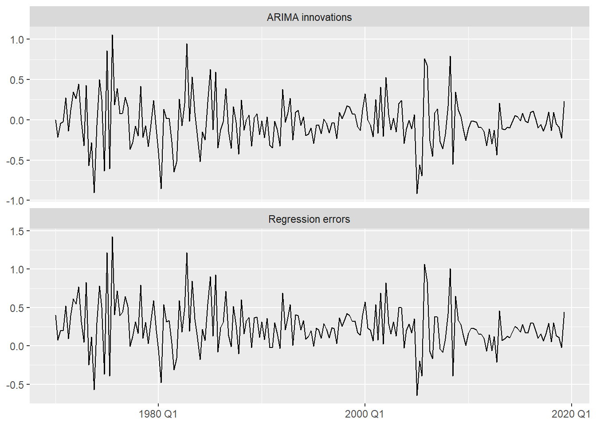
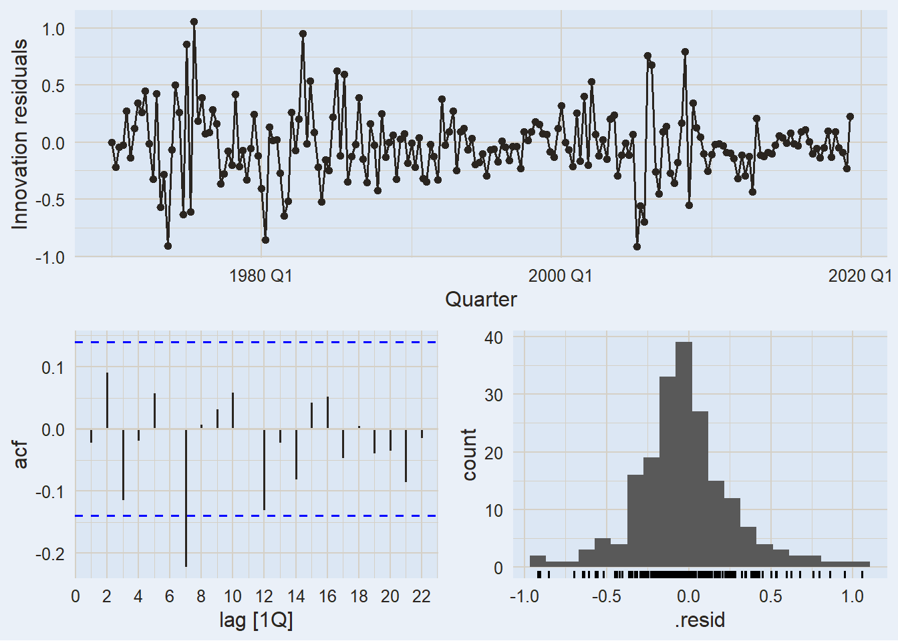
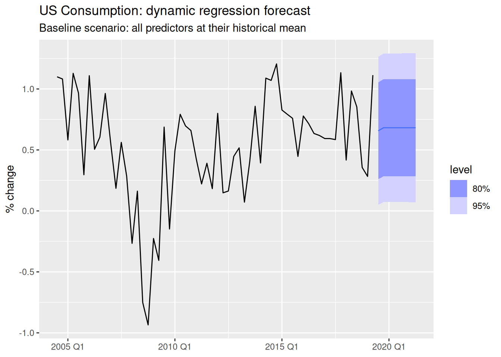
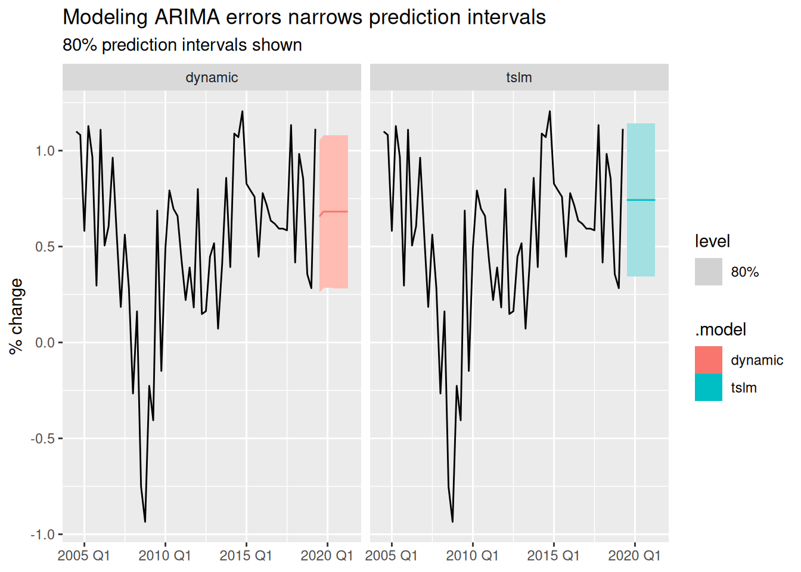
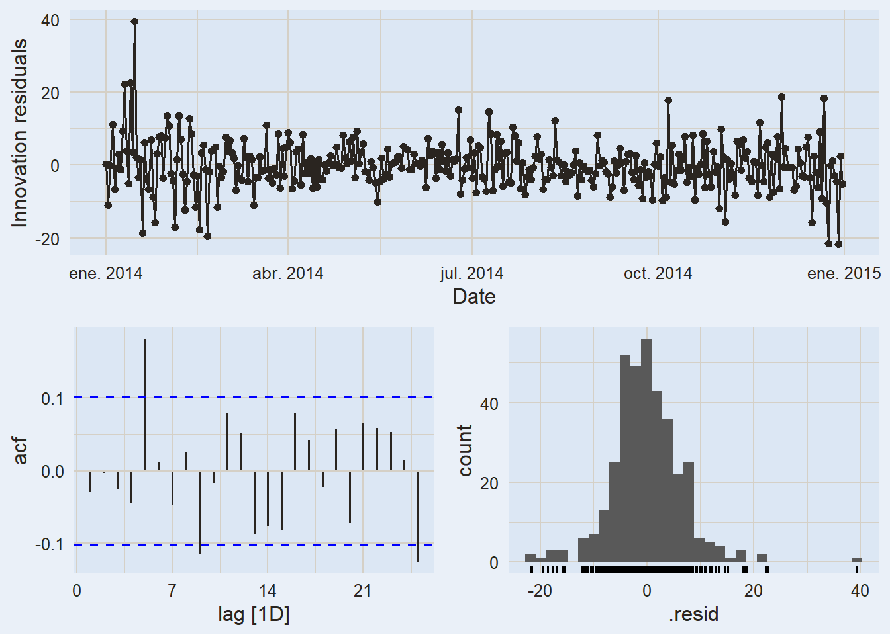
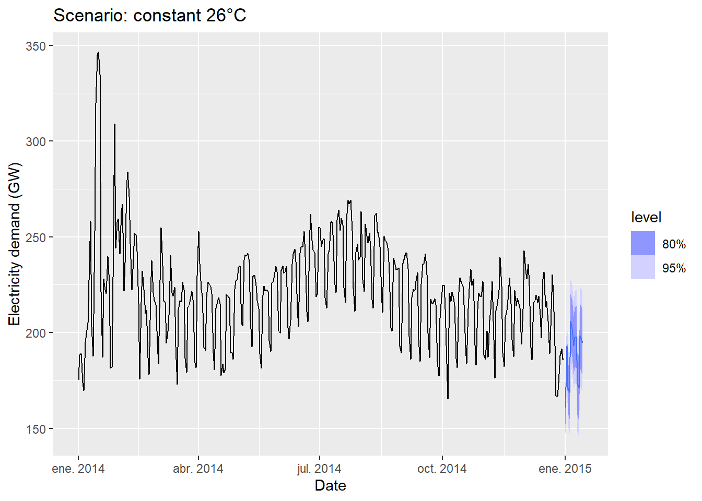
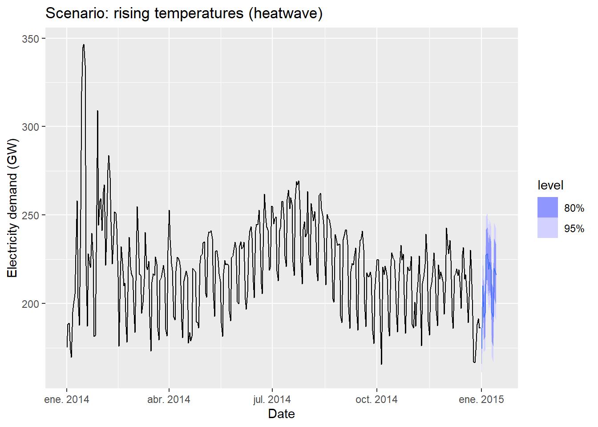
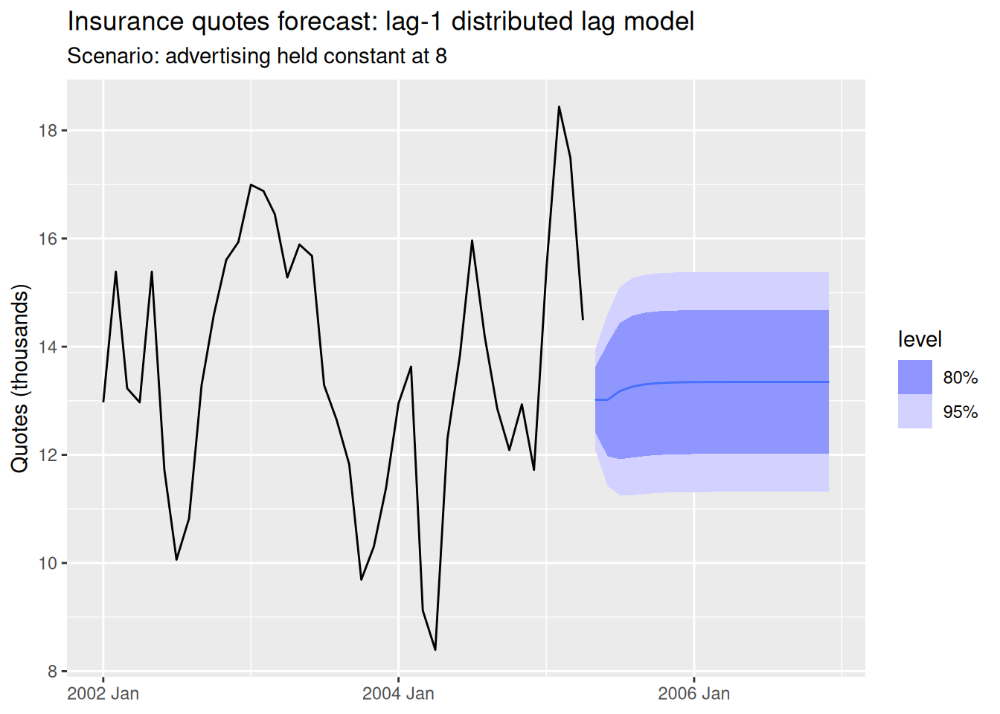
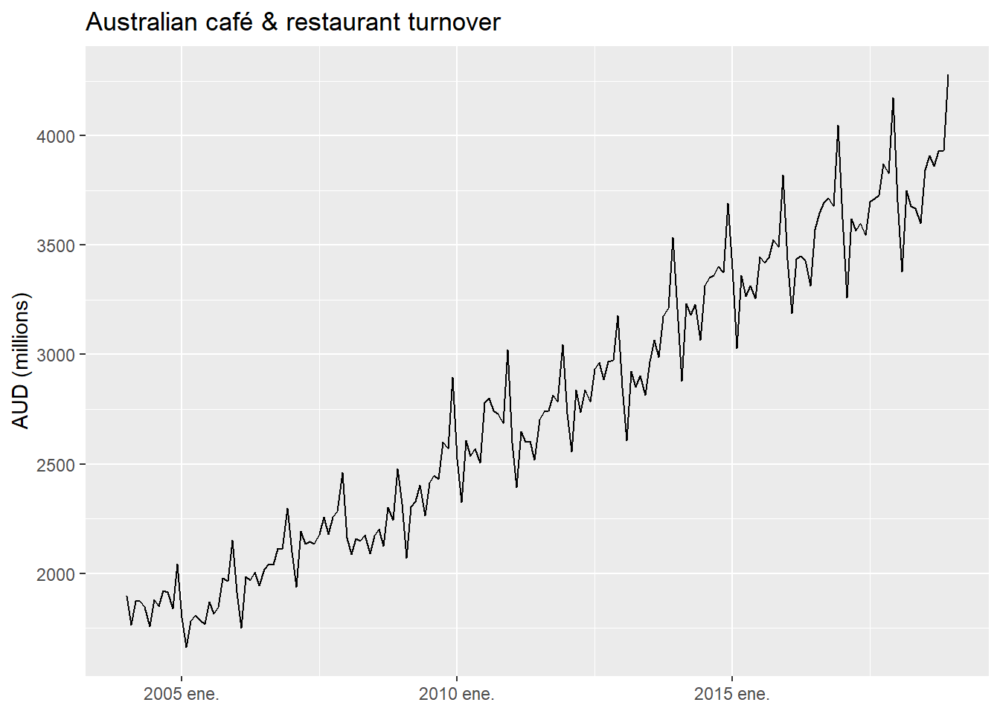
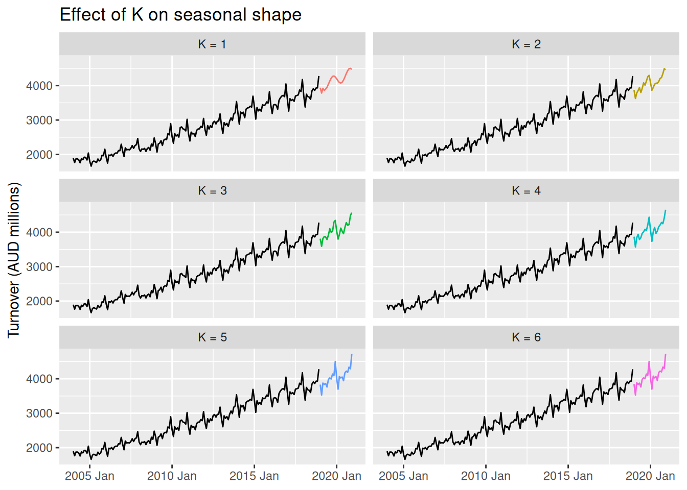

# Dynamic & Harmonic Regression

Modified

June 9, 2026

Code

``` r
library(plotly) #<1>
```

1.  In addition to the regular packages, here we’ll use `plotly` for interactive plots.

In the [previous session](../../../../docs/modules/module_3/02_regression/regression.llms.md), we built a multiple regression model for US consumption:

y\_{t,\text{Cons.}} = \beta_0 + \beta_1 x\_{t,\text{Inc.}} + \beta_2 x\_{t,\text{Prod.}} + \beta_3 x\_{t,\text{Sav.}} + \beta_4 x\_{t,\text{Unemp.}} + \varepsilon_t

The model improved substantially over the simple version — \bar{R}^2 went from ~0.15 to ~0.75, and the residuals looked much closer to white noise.

But “much closer” is not the same as “white noise.” Let’s check:

Code

``` r
us_change_fit_mult |>
  augment() |>
  features(.resid, ljung_box, lag = 10, dof = 5)
```

The p-value is not zero, but in practice with real data there is nearly always *some* residual autocorrelation left after TSLM. And that matters:

> **WARNING:**
>
> If \varepsilon_t is autocorrelated, OLS is still unbiased — but standard errors are wrong, confidence intervals are wrong, and **prediction intervals are wrong**. The model is leaving structure on the table that could be captured.

The culprit is the **white noise assumption** on \varepsilon_t:

\varepsilon_t \overset{\text{iid}}{\sim} N(0, \sigma^2)

What if instead of forcing this, we *modeled* whatever autocorrelation remains?

> **NOTE:**
>
> | Model | Error term |
> |:---|:---|
> | TSLM | \varepsilon_t \overset{\text{iid}}{\sim} N(0,\sigma^2) — must be white noise |
> | **Dynamic regression** | \eta_t \sim \text{ARIMA}(p,d,q) — **can be autocorrelated** |
>
> Same predictors. Same regression structure. One assumption relaxed.

# 1 Dynamic Regression

## 1.1 The Model

The dynamic regression model replaces the white noise error \varepsilon_t with \eta_t, which is allowed to follow an ARIMA process:

y_t = \beta_0 + \beta_1 x\_{1,t} + \cdots + \beta_k x\_{k,t} + \eta_t

\eta_t \sim \text{ARIMA}(p, d, q)(P, D, Q)\_m

The model still has white noise — it just lives one level deeper. There are now **two distinct error terms**:

> **NOTE:**
>
> - \eta_t — the **regression error**: how far y_t is from the regression surface. Still autocorrelated, now modeled explicitly.
> - \varepsilon_t — the **ARIMA innovation**: the white noise that drives \eta_t. This is the only truly random component.
>
> We diagnose the model using \hat{\varepsilon}\_t, not \hat{\eta}\_t.

### 1.1.1 Stationarity: Models in Levels vs. in Differences

> **WARNING:**
>
> Dynamic regression requires that both y_t and all predictors x\_{k,t} are stationary. Check each variable with unit root tests before fitting.

When differencing is needed, there are two natural cases:

- **Model in levels** — no variable requires differencing. The regression is fitted directly on the original (or transformed) series. This is the most common case when all variables are already stationary, as in `us_change`.

- **Model in differences** — one or more variables need differencing to achieve stationarity. In this case, **all variables are differenced simultaneously** to keep the model internally consistent. Specifying `pdq(d = 1)` in `ARIMA()` does this automatically.

> **NOTE:**
>
> A closely related question is whether a trend in the data is **deterministic** (captured by a `trend()` term in TSLM — predictable, fixed slope) or **stochastic** (captured by differencing in ARIMA — the trend wanders randomly over time). In practice, stochastic trends are far more common in economic and business data. See [FPP3 §10.1](https://otexts.com/fpp3/stochastic-and-deterministic-trends.html) for a detailed comparison with forecasting implications.

### 1.1.2 Fitting in R

`ARIMA()` handles dynamic regression by simply adding predictors to the right-hand side of the formula — the same syntax as `TSLM()`:

Code

``` r
# TSLM — white noise errors assumed
TSLM(y ~ x1 + x2)

# Dynamic regression — ARIMA errors, order chosen automatically
ARIMA(y ~ x1 + x2)

# Model in differences: force differencing on all variables
ARIMA(y ~ x1 + x2 + pdq(d = 1))
```

## 1.2 Example: US Consumption

### 1.2.1 Fitting the Dynamic Regression

Code

``` r
us_change_fit_dyn <- us_change |>
  model(
    tslm    = TSLM(Consumption ~ Income + Production +      #<1>
                     Savings + Unemployment),
    dynamic = ARIMA(Consumption ~ Income + Production +     #<2>
                      Savings + Unemployment)
  )

us_change_fit_dyn |>
  select(dynamic) |>
  report()
```

1.  Our previous model — kept here for direct comparison.
2.  Same predictors, same formula structure. `ARIMA()` selects the error order automatically via AIC\_c.

    Series: Consumption 
    Model: LM w/ ARIMA(0,1,2) errors 

    Coefficients:
              ma1     ma2  Income  Production  Savings  Unemployment
          -1.0882  0.1118  0.7472      0.0370  -0.0531       -0.2096
    s.e.   0.0692  0.0676  0.0403      0.0229   0.0029        0.0986

    sigma^2 estimated as 0.09588:  log likelihood=-47.13
    AIC=108.27   AICc=108.86   BIC=131.25

### 1.2.2 Two Types of Residuals

We can extract both error types from the fitted model:

Code

``` r
bind_rows(
  `Regression errors` = as_tibble(                               #<1>
    residuals(us_change_fit_dyn |> select(dynamic),              #<1>
              type = "regression")),                             #<1>
  `ARIMA innovations` = as_tibble(                               #<2>
    residuals(us_change_fit_dyn |> select(dynamic),              #<2>
              type = "innovation")),                             #<2>
  .id = "type"
) |>
  ggplot(aes(x = Quarter, y = .resid)) +
  geom_line() +
  facet_wrap(~ type, nrow = 2, scales = "free_y") +
  labs(y = NULL, x = NULL)
```

1.  `type = "regression"` → \hat{\eta}\_t: the regression residuals. These still have autocorrelation structure, now captured by the ARIMA component.
2.  `type = "innovation"` → \hat{\varepsilon}\_t: what should be white noise. This is what we diagnose.

[](dynamic_regression_files/figure-html/us-two-residuals-1.png)

### 1.2.3 Residual Diagnostics

Code

``` r
us_change_fit_dyn |>
  select(dynamic) |>
  gg_tsresiduals()
```

[](dynamic_regression_files/figure-html/us-diagnostics-1.png)

Code

``` r
us_change_fit_dyn |>
  select(dynamic) |>
  augment() |>
  features(.innov, ljung_box,
           lag = 10,
           dof = us_change_fit_dyn |>                   #<1>
                   select(dynamic) |>
                   coefficients() |>
                   filter(str_detect(term, "^ar|^ma")) |>
                   nrow())
```

1.  `dof` is computed dynamically as the number of estimated AR and MA coefficients — always matches the fitted model regardless of order selected.

### 1.2.4 Does It Actually Improve Things?

Let’s compare the two models side by side on a held-out test set:

Code

``` r
us_change_train <- us_change |> filter_index(. ~ "2015 Q4")
us_change_test  <- us_change |> filter_index("2016 Q1" ~ .)

us_change_fit_cv <- us_change_train |>
  model(
    tslm    = TSLM(Consumption ~ Income + Production + Savings + Unemployment),
    dynamic = ARIMA(Consumption ~ Income + Production + Savings + Unemployment)
  )

us_change_fit_cv |>
  forecast(new_data = us_change_test) |>
  accuracy(us_change_test) |>
  select(.model, RMSE, MAE, MAPE)
```

> **IMPORTANT:**
>
> The dynamic regression model passes the Ljung-Box test — something the TSLM could not. By modeling the residual autocorrelation explicitly with ARIMA, we get **valid standard errors**, **correct prediction intervals**, and typically better out-of-sample accuracy.

## 1.3 Forecasting

Forecasting works exactly as in [Session 3.2](../../../../docs/modules/module_3/02_regression/regression.llms.md#forecasting-with-regression) — you still need future values of the predictors, and the same three strategies apply (ex-ante, ex-post, scenario-based).

The only practical difference: you use `new_data()` to build the future dataset and pass it to `forecast()`. The ARIMA component of the errors is projected forward automatically.

### 1.3.1 Scenario Forecast

Code

``` r
us_change_future <- us_change |>
  pivot_longer(-c(Quarter, Consumption),      #<1>
               names_to = "variable") |>
  model(MEAN(value)) |>                       #<2>
  forecast(h = 8) |>                          #<3>
  as_tsibble() |>
  select(-c(.model, value)) |>
  pivot_wider(names_from  = variable,         #<4>
              values_from = .mean)

us_change_fit_dyn |>
  select(dynamic) |>
  forecast(new_data = us_change_future) |>
  autoplot(tail(us_change, 60)) +
  labs(
    title    = "US Consumption: dynamic regression forecast",
    subtitle = "Baseline scenario: predictors forecast with MEAN",
    y = "% change", x = NULL
  )
```

1.  Pivot the four predictor columns to long format — each variable becomes its own series, identified by `variable`.
2.  A single `model()` call fits `MEAN` to each predictor simultaneously.
3.  A single `forecast()` produces 8-step-ahead forecasts for all predictors at once.
4.  Pivot back to wide format so each predictor has its own column, matching the structure that `forecast()` expects in `new_data`.

[](dynamic_regression_files/figure-html/us-forecast-full-1.png)

> **TIP:**
>
> Because the predictors go through a proper `model() |> forecast()` pipeline, changing the scenario is a one-word edit:
>
> Code
>
> ``` r
> model(MEAN(value))          # flat forecast at the historical mean
> model(NAIVE(value))         # last observed value carried forward
> model(RW(value ~ drift()))  # linear extrapolation of the recent trend
> model(ARIMA(value))         # best ARIMA for each predictor
> ```
>
> `MEAN` is appropriate here because all `us_change` variables are stationary percentage changes — the historical mean is a reasonable “neutral” projection. For predictors with trend, `RW(drift)` or `ARIMA` would be more honest.

### 1.3.2 TSLM vs. Dynamic: Prediction Intervals

Code

``` r
us_change_fit_dyn |>
  forecast(new_data = us_change_future) |>
  autoplot(tail(us_change, 60), level = 80, alpha = 0.6) +   #<1>
  labs(
    title = "Modeling ARIMA errors narrows prediction intervals",
    subtitle = "80% prediction intervals shown",
    y = "% change", x = NULL
  )
```

1.  Both models are overlaid on the same axes. The difference in interval width is immediately visible.

[](dynamic_regression_files/figure-html/us-interval-compare-1.png)

> **WARNING:**
>
> Dynamic regression intervals assume future predictor values are **known exactly**. When they are estimated (as in the scenario above), true uncertainty is larger than what the intervals show. This applies equally to TSLM — dynamic regression does not make this problem worse, it just fixes the autocorrelation problem.

## 1.4 Example: Electricity Demand

The `us_change` example was clean: stationary series, linear relationship. Electricity demand pushes two things further:

- A **nonlinear** relationship between the predictor and the response
- A **categorical** predictor (day type) alongside a continuous one

### 1.4.1 The Data

Daily electricity demand in Victoria, Australia (2014):

Two patterns are immediately clear:

1.  **U-shaped (quadratic) relationship** with temperature — both very hot and very cold days increase demand.
2.  **Day type** matters: weekdays \> weekends \> holidays.

This gives us the model:

y_t = \beta_0 + \beta_1 T_t + \beta_2 T_t^2 + \beta_3 D\_{\text{day type}} + \eta_t, \quad \eta_t \sim \text{ARIMA}

### 1.4.2 Fitting the Model

Code

``` r
vic_elec_fit <- vic_elec_daily |>
  model(
    dynamic = ARIMA(Demand ~ Temperature + I(Temperature^2) +  #<1>
            (Day_Type == "Weekday"))                            #<2>
  )

report(vic_elec_fit)
```

1.  `I(Temperature^2)` adds the quadratic term. The `I()` wrapper is required to protect arithmetic inside the formula.
2.  A logical expression that becomes a binary indicator: `TRUE` (1) for weekdays, `FALSE` (0) otherwise.

    Series: Demand 
    Model: LM w/ ARIMA(2,1,2)(2,0,0)[7] errors 

    Coefficients:
              ar1     ar2      ma1      ma2    sar1    sar2  Temperature
          -0.1093  0.7226  -0.0182  -0.9381  0.1958  0.4175      -7.6135
    s.e.   0.0779  0.0739   0.0494   0.0493  0.0525  0.0570       0.4482
          I(Temperature^2)  Day_Type == "Weekday"TRUE
                    0.1810                    30.4040
    s.e.            0.0085                     1.3254

    sigma^2 estimated as 44.91:  log likelihood=-1206.11
    AIC=2432.21   AICc=2432.84   BIC=2471.18

> **TIP:**
>
> The choice of how to encode day type depends on the question you want to answer:
>
> - **Binary** — `Day_Type == "Weekday"`: distinguishes working days from non-working days (weekends + holidays collapsed together). Simpler, fewer parameters, often sufficient.
> - **Two dummies** — `Day_Type == "Weekday"` and `Day_Type == "Weekend"` (holidays as baseline): allows weekends and holidays to have different demand profiles. Useful if your data shows a meaningful difference between the two.
>
> Neither is universally better — let residual diagnostics and AIC\_c guide the choice.

### 1.4.3 Diagnostics & Scenario Forecast

Code

``` r
vic_elec_fit |> gg_tsresiduals()
```

[](dynamic_regression_files/figure-html/elec-diagnostics-1.png)

Code

``` r
vic_elec_fit |>
  augment() |>
  features(.innov, ljung_box, dof = 8, lag = 14)
```

> **NOTE:**
>
> Variance is higher during January–February (Australian summer peak). Point estimates remain valid, but prediction intervals may be too narrow for extreme temperature periods.

## Conservative (26°C)

Code

``` r
vic_elec_future_26 <- new_data(vic_elec_daily, 14) |>
  mutate(
    Temperature = 26,
    Holiday     = c(TRUE, rep(FALSE, 13)),
    Day_Type    = case_when(
      Holiday              ~ "Holiday",
      wday(Date) %in% 2:6  ~ "Weekday",
      TRUE                 ~ "Weekend"
    )
  )
```

[](dynamic_regression_files/figure-html/elec-forecast-conservative-plot-1.png)

## Heatwave

Code

``` r
vic_elec_future_hw <- new_data(vic_elec_daily, 14) |>
  mutate(
    Temperature = c(seq(31, 34), 33, rep(34, 3), rep(33, 6)), #<1>
    Holiday     = c(TRUE, rep(FALSE, 13)),
    Day_Type    = case_when(
      Holiday              ~ "Holiday",
      wday(Date) %in% 2:6  ~ "Weekday",
      TRUE                 ~ "Weekend"
    )
  )
```

1.  A realistic meteorological forecast — considerably hotter than 26°C.

[](dynamic_regression_files/figure-html/elec-forecast-heatwave-plot-1.png)

## 1.5 Lagged Predictors

So far we have assumed that the predictor x_t affects y_t **at the same point in time**. But many real-world relationships have a **delay**: the cause happens now, the effect shows up later.

- **Advertising** spend in month t drives sales in months t, t+1, t+2, … as the message reaches new customers gradually.
- **Interest rate** changes take months to affect housing starts or consumer credit.
- **Rainfall** in January affects agricultural output in March or April.
- **Hiring** a new employee today affects productivity in weeks t+4, t+5, … after onboarding.

Models that include x_t at multiple lags are called **distributed lag models**:

y_t = \beta_0 + \delta_0 x_t + \delta_1 x\_{t-1} + \delta_2 x\_{t-2} + \cdots + \delta_k x\_{t-k} + \eta_t

Each \delta_j captures the effect of x that occurs j periods after the predictor.

### 1.5.1 Example: Advertising and Sales

The `fpp3` package includes the `insurance` dataset: monthly US insurance quotes (a proxy for sales) and TV advertising expenditure:

### 1.5.2 Fitting Distributed Lag Models

We fit four models with increasing lag depth to find how long the advertising effect persists:

Code

``` r
insurance_fit <- insurance |>
  model(
    lag0 = ARIMA(Quotes ~ pdq(d = 0) +                        #<1>
                   TVadverts),
    lag1 = ARIMA(Quotes ~ pdq(d = 0) +
                   TVadverts + lag(TVadverts)),                 #<2>
    lag2 = ARIMA(Quotes ~ pdq(d = 0) +
                   TVadverts + lag(TVadverts) +
                   lag(TVadverts, 2)),                         #<3>
    lag3 = ARIMA(Quotes ~ pdq(d = 0) +
                   TVadverts + lag(TVadverts) +
                   lag(TVadverts, 2) + lag(TVadverts, 3))
  )

glance(insurance_fit) |>
  select(.model, AICc) |>
  arrange(AICc)
```

1.  `pdq(d = 0)` fixes the differencing order to zero — both series are stationary.
2.  `lag(TVadverts)` is x\_{t-1}: advertising from the previous month.
3.  `lag(TVadverts, 2)` is x\_{t-2}: advertising from two months ago.

### 1.5.3 Best Model & Interpretation

Code

``` r
insurance_fit |>
  select(lag1) |>
  report()
```

    Series: Quotes 
    Model: LM w/ ARIMA(1,0,2) errors 

    Coefficients:
             ar1     ma1     ma2  TVadverts  lag(TVadverts)  intercept
          0.5123  0.9169  0.4591     1.2527          0.1464     2.1554
    s.e.  0.1849  0.2051  0.1895     0.0588          0.0531     0.8595

    sigma^2 estimated as 0.2166:  log likelihood=-23.94
    AIC=61.88   AICc=65.38   BIC=73.7

> **NOTE:**
>
> The coefficient on `TVadverts` (\delta_0) is the **immediate effect**: one unit increase in advertising this month increases quotes by \delta_0 units *this* month.
>
> The coefficient on `lag(TVadverts)` (\delta_1) is the **one-period carry-over**: the additional effect that arrives one month later.
>
> Together, the **total effect** of a sustained 1-unit increase in advertising is \delta_0 + \delta_1 + \cdots — the sum of all lag coefficients.

### 1.5.4 Forecasting with Lagged Predictors

When forecasting, you need future values of x_t *and* the most recent observed values of x to fill in the lags:

Code

``` r
insurance_future <- new_data(insurance, 20) |>
  mutate(TVadverts = 8)                                        #<1>

insurance_fit |>
  select(lag1) |>
  forecast(new_data = insurance_future) |>
  autoplot(insurance) +
  labs(title = "Insurance quotes forecast: lag-1 distributed lag model",
       subtitle = "Scenario: advertising held constant at 8",
       y = "Quotes (thousands)", x = NULL)
```

1.  We assume a constant advertising level of 8 for the forecast horizon — a simple scenario.

[](dynamic_regression_files/figure-html/insurance-forecast-1.png)

> **TIP:**
>
> | Situation | Prefer |
> |:---|:---|
> | Effect is immediate (prices, temperature) | Current x_t |
> | Effect has a known delay (advertising, policy) | x_t + lags |
> | Delay length is unknown | Fit models with 0, 1, 2, … lags and compare with AIC\_c |
> | Predictor is hard to forecast | Lags are known at forecast time — a practical advantage |
>
> The last point is important: if x_t is hard to forecast, using x\_{t-k} instead means the predictor is already observed when you need to make the forecast. Lags can turn an ex-ante problem into an ex-post one.

# 2 Harmonic Regression

## 2.1 When Seasonal Dummies Aren’t Enough

The electricity demand example above used **daily** data. Demand has an obvious **annual** seasonal pattern (m = 365). If we wanted to capture it with dummy variables, we would need 364 of them.

That is impractical. The same problem appears with:

| Data frequency            | Seasonal period |
|:--------------------------|:---------------:|
| Daily (annual cycle)      |     m = 365     |
| Weekly                    |     m = 52      |
| Half-hourly (daily cycle) |     m = 48      |

> **TIP:**
>
> We first saw Fourier terms mentioned as a footnote in `regression.qmd` — they were promised as the solution for large m. This is where we deliver on that promise.

### 2.1.1 Fourier Terms

Any periodic pattern can be approximated by a sum of sine and cosine waves:

S_K(t) = \sum\_{k=1}^{K} \left\[ a_k \cos\\\left(\frac{2\pi k t}{m}\right) + b_k \sin\\\left(\frac{2\pi k t}{m}\right) \right\]

- m — seasonal period
- K — number of Fourier pairs (controls flexibility)

> **IMPORTANT:**
>
> - **Small K** → smooth, slowly-varying seasonal pattern
> - **Large K** → complex, flexible seasonal pattern (but more parameters)
> - **K = m/2** → identical to using m - 1 seasonal dummies
>
> Choose K by minimizing AIC\_c.

### 2.1.2 Advantages and Limitations

**Advantages over seasonal dummies:**

- Works for **any** m, no matter how large
- Handles **multiple seasonalities** simultaneously
- Smooth patterns with small K → fewer parameters
- Short-run dynamics handled by ARIMA errors

**Limitations:**

- Seasonal pattern assumed **fixed** over time
- Requires choosing K
- Less intuitive than dummies for small m

## 2.2 Example: Australian Café Spending

Monthly retail turnover for cafés and restaurants in Australia (2004–2018). A clean example of a monthly series with strong, stable seasonality — ideal for comparing values of K:

Code

``` r
aus_cafe <- aus_retail |>
  filter(
    Industry == "Cafes, restaurants and takeaway food services",
    year(Month) %in% 2004:2018
  ) |>
  summarise(Turnover = sum(Turnover))
```

[](dynamic_regression_files/figure-html/cafe-plot-1.png)

### 2.2.1 Fitting Multiple Values of K

Code

``` r
cafe_fit <- aus_cafe |>
  model(
    `K = 1` = ARIMA(log(Turnover) ~ fourier(K = 1) + PDQ(0, 0, 0)), #<1>
    `K = 2` = ARIMA(log(Turnover) ~ fourier(K = 2) + PDQ(0, 0, 0)),
    `K = 3` = ARIMA(log(Turnover) ~ fourier(K = 3) + PDQ(0, 0, 0)),
    `K = 4` = ARIMA(log(Turnover) ~ fourier(K = 4) + PDQ(0, 0, 0)),
    `K = 5` = ARIMA(log(Turnover) ~ fourier(K = 5) + PDQ(0, 0, 0)),
    `K = 6` = ARIMA(log(Turnover) ~ fourier(K = 6) + PDQ(0, 0, 0))  #<2>
  )

glance(cafe_fit) |>
  select(.model, AICc, BIC) |>
  arrange(AICc)
```

1.  `PDQ(0,0,0)` suppresses seasonal ARIMA terms — Fourier handles the seasonality entirely.
2.  For monthly data (m = 12), K = 6 is exactly equivalent to using 11 seasonal dummies.

### 2.2.2 Comparing Forecasts Across K

[](dynamic_regression_files/figure-html/cafe-forecast-comparison-1.png)

> **NOTE:**
>
> - **K = 1–2**: Very smooth, nearly sinusoidal — misses the multi-peak retail calendar
> - **K = 3–4**: Usually the AIC\_c winner; captures the main features of Australian retail seasonality
> - **K = 6**: Reproduces seasonal dummies exactly — can overfit the historical pattern

## 2.3 What Comes Next?

The café example had one seasonal period (m = 12, monthly). But what if a series has **more than one**?

Consider electricity demand measured every **30 minutes**:

> **NOTE:**
>
> How would you model this series with the tools you have now? What would happen if you tried `season()` dummies? What about Fourier terms — how many `period` arguments would you need, and how would you choose K for each one?
>
> We will answer these questions in **Module 4.1: Complex Seasonality**.

# 3 Summary

## 3.1

- The TSLM from Session 3.2 had one remaining weakness: **autocorrelated residuals**. Dynamic regression fixes this by letting the error term follow an ARIMA process instead of assuming white noise.

- The model has two error terms: regression errors \eta_t (modeled by ARIMA) and innovations \varepsilon_t (white noise). **Diagnose using \hat{\varepsilon}\_t** — the innovations, not the regression residuals.

- When differencing is needed, a **model in differences** applies it to all variables simultaneously. When no differencing is needed, the model is fitted **in levels**. Stochastic trends are handled by differencing; deterministic trends by `trend()`.

- Forecasting still requires **future values of the predictors** — the same ex-ante / ex-post / scenario strategies from Session 3.2 apply. **Lagged predictors** are a practical advantage when the predictor is hard to forecast: the lag is already observed at forecast time.

- **Harmonic regression** extends the framework to large or multiple seasonal periods using Fourier terms. Choose K by minimizing AIC\_c.

> **TIP:**
>
> | Session | Model | What was added |
> |:---|:---|:---|
> | 3.1 | Practical issues | Transformations, outliers, cross-validation |
> | 3.2 | TSLM | External predictors; \varepsilon_t white noise (required) |
> | **3.3** | **ARIMA(y ~ x)** | **Same predictors; \eta_t \sim ARIMA (relaxed)** |
> | 3.4 | Prophet | Automatic changepoints, complex seasonality |

Back to top
