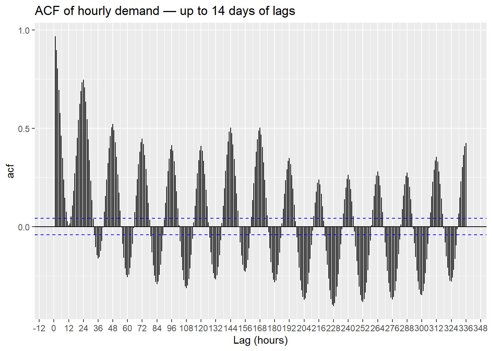
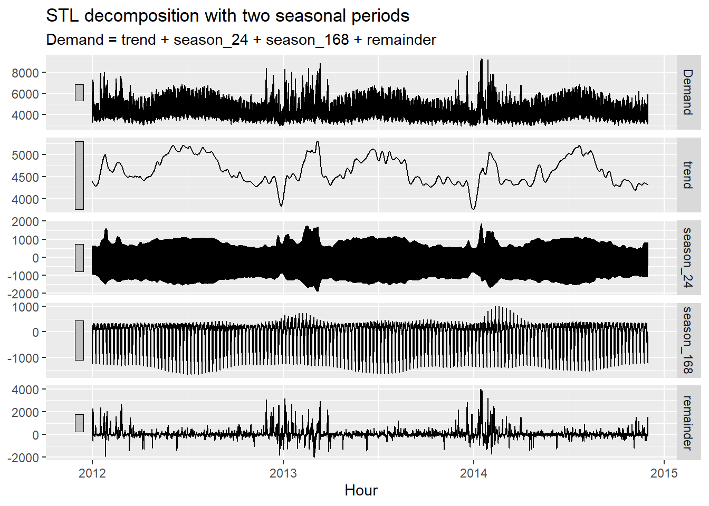
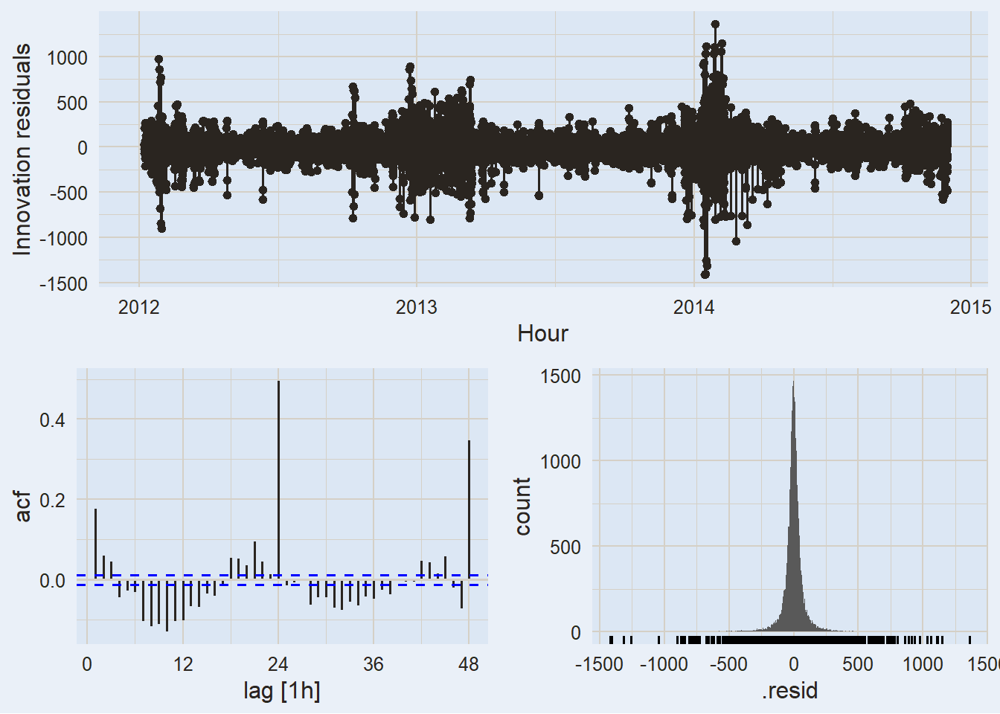
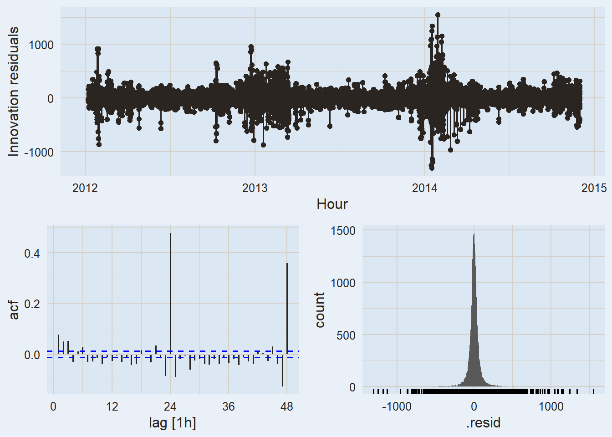
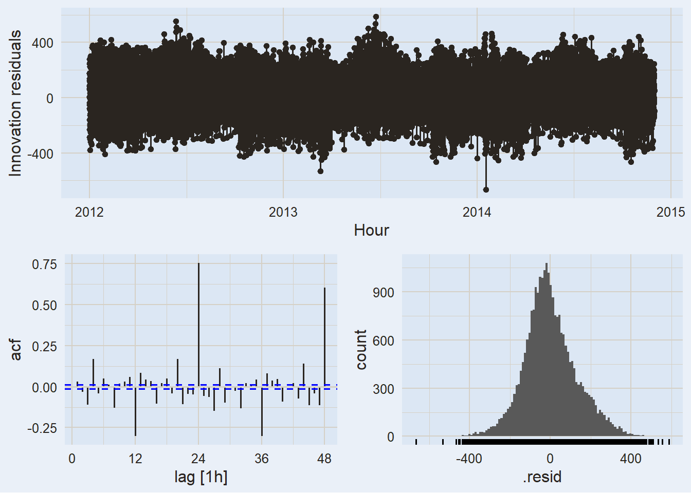

# Complex Seasonality

Modified

June 9, 2026

Code

``` r
library(plotly) #<1>
```

1.  For interactive plots with dynamic ticks and range sliders.

Back in [Module 3.3](../../../../docs/modules/module_3/03_dynamic/dynamic_regression.llms.md), we modeled electricity demand using daily aggregated data. Temperature explained the U-shaped relationship with demand, and day-type dummies captured the weekday/weekend pattern.

That model worked reasonably well — **but it swept a fundamental problem under the rug**: by aggregating to daily, we collapsed two distinct intra-day and intra-week cycles into a single, blunt average.

> **WARNING:**
>
> Daily demand is the *sum* of 48 half-hourly observations. When we aggregate, we lose:
>
> - The **within-day** pattern: morning ramp-up, midday plateau, evening peak, overnight trough
> - The **within-week** pattern: systematic differences across the seven days of the week
>
> These are not noise — they are real, structured, forecastable signal.

# 1 The Data

## 1.1 From half-hourly to hourly

The `vic_elec` dataset records electricity demand in Victoria, Australia at **30-minute intervals**, from 2012 to 2014. We aggregate to hourly to preserve meaningful temporal structure while keeping computation manageable:

Code

``` numberSource
vic_elec_hourly <- vic_elec |>
  index_by(Hour = floor_date(Time, "hour")) |>        #<1>
  summarise(
    Demand      = mean(Demand),                        #<2>
    Temperature = mean(Temperature),                   #<2>
    Holiday     = any(Holiday)                         #<3>
  ) |>
  mutate(
    WorkDay = !Holiday & wday(Hour) %in% 2:6          #<4>
  )
```

1.  `floor_date(..., "hour")` truncates each timestamp to the nearest hour, creating the grouping key.
2.  Demand and temperature are averaged within the hour.
3.  An hour is marked as a holiday if *any* of its component half-hours were a holiday.
4.  `WorkDay` is `TRUE` for non-holiday weekdays — our main day-type predictor.

> **NOTE:**
>
> At half-hourly granularity, STL would estimate a “sub-hourly” seasonal component — a systematic difference between, say, 10:00 and 10:30. There is no physical or economic justification for that pattern. **Hourly is the minimum granularity with a meaningful interpretation**: the hour of the day captures real behavioral patterns (commutes, business hours, sleep cycles).

## 1.2 Exploratory analysis

Key things to point out when exploring this plot:

- Zoom into a single week: the daily within-day cycle is immediately clear (demand drops at night, peaks in the morning and evening).
- Zoom out to a month: the weekly cycle emerges — weekends are consistently different from weekdays.
- Zoom to the full series: a mild annual pattern is visible (Australian summer in December–February shows high peaks due to air conditioning load).

Use the slider to zoom in on a single week. Two patterns emerge immediately:

- **Daily cycle** (m_1 = 24): demand falls overnight, ramps up in the morning, peaks in the evening, and repeats every 24 hours.
- **Weekly cycle** (m_2 = 24 \times 7 = 168): weekdays and weekends follow systematically different profiles — the weekday morning ramp is sharper, the weekend midday plateau is flatter.

> **IMPORTANT:**
>
> Every model we have built so far assumes **one** seasonal period. STL takes a single `season()` call. `ARIMA()` with `PDQ()` handles one seasonal lag. `season()` dummies work for one cycle.
>
> With m_1 = 24 and m_2 = 168, we need something different.

# 2 Identifying Multiple Seasonality

## 2.1 Seasonal plots

We can make both cycles visible using seasonal plots at each period:

## Daily pattern (24h)

[](complex_seasonality_files/figure-html/acf-plot-1.png)

## Weekly pattern (168h)

## ACF

> **NOTE:**
>
> The ACF shows sharp peaks at multiples of **24** (daily cycle) and secondary peaks at multiples of **168** (weekly cycle). Both structures are strong enough to dominate the autocorrelation. A single-period ARIMA would capture at most one of them.

## 2.2 Train / test split

Code

``` r
vic_elec_train <- vic_elec_hourly |>
  filter_index(~ "2014-11-30 23:00")           #<1>

vic_elec_test <- vic_elec_hourly |>
  filter_index("2014-12-01 00:00" ~
               "2014-12-14 23:00")             #<2>
```

1.  Training set: all data through November 30, 2014.
2.  Test set: the first two weeks of December 2014 — 14 \times 24 = 336 hourly observations.

December in Victoria is early summer (Southern Hemisphere), meaning air conditioning load is ramping up — a genuinely challenging period to forecast and a more informative evaluation than a quiet shoulder season.

# 3 Approach 1 — STL with Multiple Seasonal Periods

## 3.1 Extending STL to multiple seasons

In Module 1, we used `STL()` to separate a single seasonal component from the trend-cycle. The same function supports **multiple seasonal periods** by stacking more than one `season()` call inside the formula:

Code

``` r
STL(Demand ~ season(period = 24) + season(period = 168))
```

Each seasonal component is estimated in sequence, holding the others fixed, until all converge. The result is one trend-cycle, one component per period, and a remainder.

## 3.2 Decomposition

Code

``` r
vic_elec_dcmp <- vic_elec_train |>
  model(
    STL(Demand ~                           #<1>
          season(period = 24)  +           #<2>
          season(period = 168),            #<3>
        robust = TRUE)
  ) |>
  components()

vic_elec_dcmp
```

1.  Standard `STL()` — the same function used in Module 1, now with two `season()` calls.
2.  Daily seasonal component: repeating every 24 hours.
3.  Weekly seasonal component: repeating every 168 hours.

[](complex_seasonality_files/figure-html/stl-decomp-plot-1.png)

> **NOTE:**
>
> - **Trend**: smooth multi-month movement — higher in summer (Dec–Jan) and winter (Jun–Aug) due to heating and cooling loads.
> - **Season 24** (daily): the within-day cycle, repeating every 24 hours.
> - **Season 168** (weekly): the within-week modulation — weekdays vs. weekends.
> - **Remainder**: what is left after extracting all components. If the model is well-specified, this should look like noise with no remaining structure.

## 3.3 Forecasting with `decomposition_model()`

Once we have the decomposition, we attach any univariate model to forecast the seasonally adjusted series — exactly as in Module 2:

Code

``` r
stl_spec <- STL(Demand ~                       #<1>
                  season(period = 24) +
                  season(period = 168),
                robust = TRUE)

stl_fit <- vic_elec_train |>
  model(
    STL_ETS = decomposition_model(             #<2>
      stl_spec,
      ETS(season_adjust ~ season("N"))
    ),
    STL_ARIMA = decomposition_model(           #<3>
      stl_spec,
      ARIMA(season_adjust ~ PDQ(0, 0, 0))
    )
  )
```

1.  We define the STL spec once and reuse it in both models.
2.  ETS models the seasonally adjusted trend-cycle. `season("N")` suppresses any additional seasonal term — STL already removed both seasonal components.
3.  Same structure with ARIMA. `PDQ(0,0,0)` suppresses seasonal ARIMA terms for the same reason.

Code

``` r
stl_fc <- stl_fit |>
  forecast(h = nrow(vic_elec_test))
```

    Warning in geom2trace.default(dots[[1L]][[2L]], dots[[2L]][[1L]], dots[[3L]][[1L]]): geom_GeomLineribbon() has yet to be implemented in plotly.
      If you'd like to see this geom implemented,
      Please open an issue with your example code at
      https://github.com/ropensci/plotly/issues
    Warning in geom2trace.default(dots[[1L]][[2L]], dots[[2L]][[1L]], dots[[3L]][[1L]]): geom_GeomLineribbon() has yet to be implemented in plotly.
      If you'd like to see this geom implemented,
      Please open an issue with your example code at
      https://github.com/ropensci/plotly/issues

# 4 Approach 2 — Harmonic Regression with Covariates

## 4.1 Why go beyond STL?

STL is a powerful univariate tool. But electricity demand has an obvious external driver that STL cannot see: **temperature**. On hot days, air conditioning pushes demand up. On cold days, heating does the same. The U-shaped relationship we found in Module 3.3 is real and strong.

> **IMPORTANT:**
>
> Harmonic regression (Fourier terms + ARIMA errors) can incorporate **external predictors** alongside the seasonal patterns. STL cannot. This is the key advantage when meaningful covariates are available.

## 4.2 Fourier terms for multiple periods

Recall from [Module 3.3](../03_dynamic/dynamic_regression.qmd#harmonic-regression) that Fourier terms approximate a seasonal pattern with K pairs of sine and cosine waves. For **multiple seasonalities**, we add one set per period:

y_t = \underbrace{S\_{K_1}(t)}\_{\text{daily, } m=24} + \underbrace{S\_{K_2}(t)}\_{\text{weekly, } m=168} + \beta^\top \mathbf{x}\_t + \eta_t, \quad \eta_t \sim \text{ARIMA}

In `fable`, `fourier()` accepts a `period` argument and can be called multiple times in the same formula:

Code

``` r
ARIMA(Demand ~
        fourier(period = 24,  K = K1) +
        fourier(period = 168, K = K2) +
        PDQ(0, 0, 0))
```

### 4.2.1 Choosing K

The key parameter for each Fourier term is K — the number of sine/cosine pairs. A larger K produces a more flexible seasonal shape but adds more parameters. The standard approach is to minimize AIC\_c.

> **NOTE:**
>
> The principled approach is to search over a grid of (K_1, K_2) combinations. This is computationally expensive for hourly data and is best run offline or with `freeze: auto` active. The code below illustrates the approach — it is not evaluated during render:
>
> Code
>
> ``` r
> expand_grid(K1 = c(6, 8, 10, 12),
>             K2 = c(2, 4, 6, 8)) |>
>   mutate(
>     fit  = map2(K1, K2, \(k1, k2)
>       vic_elec_train |>
>         model(ARIMA(Demand ~
>                       fourier(period = 24,  K = k1) +
>                       fourier(period = 168, K = k2) +
>                       PDQ(0, 0, 0),
>                     stepwise = TRUE, approximation = TRUE))
>     ),
>     aicc = map_dbl(fit, \(m) glance(m)$AICc)
>   ) |>
>   select(K1, K2, aicc) |>
>   arrange(aicc)
> ```
>
> For `vic_elec` hourly data, K_1 = 10 and K_2 = 6 consistently perform well — they capture the main features of both seasonal patterns without overfitting. We use these values throughout.

## 4.3 Adding temperature and WorkDay

Following FPP3, we model temperature with a **piecewise linear** function: a linear term plus a hockey-stick that activates above 18°C:

\text{Temp effect} = \beta_1 T_t + \beta_2 \max(T_t - 18,\\ 0)

The intuition: below 18°C, demand increases as temperature falls (heating load). Above 18°C, demand increases as temperature rises (cooling load). The slope changes at the **knot** at 18°C.

Code

``` r
fourier_fit <- vic_elec_train |>
  model(
    fourier_only = ARIMA(                         #<1>
      Demand ~
        fourier(period = 24,  K = 10) +
        fourier(period = 168, K = 6)  +
        PDQ(0, 0, 0),
      stepwise = TRUE, approximation = TRUE
    ),
    fourier_cov = ARIMA(                          #<2>
      Demand ~
        fourier(period = 24,  K = 10) +
        fourier(period = 168, K = 6)  +
        Temperature +
        I(pmax(Temperature - 18, 0)) +            #<3>
        WorkDay +                                 #<4>
        PDQ(0, 0, 0),
      stepwise = TRUE, approximation = TRUE
    )
  )
```

1.  Baseline harmonic model — Fourier terms only, no external predictors.
2.  Full model: Fourier terms + piecewise temperature + WorkDay indicator.
3.  `pmax(Temperature - 18, 0)` equals zero below 18°C and T - 18 above — the hockey-stick knot. `I()` protects the arithmetic inside the formula.
4.  `WorkDay` captures the weekday demand premium beyond what the weekly Fourier terms already model.

> **NOTE:**
>
> 18°C is a typical *thermal comfort threshold* for Melbourne’s climate — roughly the temperature above which mechanical cooling becomes widespread. FPP3 uses this same knot. It has a clear physical interpretation and works well empirically.

## 4.4 The temperature forecasting problem

Adding temperature as a predictor immediately raises the challenge we faced in Module 3.3: **to forecast demand, we need future temperature values**.

- If we use observed future temperatures (ex-post), the model looks better than it would in real deployment.
- If we use a meteorological forecast, we inherit all the uncertainty from that forecast.
- Temperature is hard to forecast reliably beyond a few days ahead — and errors compound.

> **WARNING:**
>
> Even with the piecewise linear temperature term, residuals of `fourier_cov` will show some remaining pattern linked to temperature extremes — particularly during heatwaves. The linear + hockey-stick approximation captures the *average* relationship but misses **nonlinear tail behavior** during extreme events.
>
> This is a known limitation acknowledged in FPP3: electricity demand models with temperature covariates rarely achieve white-noise residuals. The residuals still carry information we have not fully captured.

For the forecast we use a **scenario approach** — constant temperature at 25°C (a mild early-summer day in Victoria):

Code

``` r
vic_elec_future <- new_data(vic_elec_train, nrow(vic_elec_test)) |>
  mutate(
    Temperature = 25,                              #<1>
    Holiday     = FALSE,                           #<2>
    WorkDay     = wday(Hour) %in% 2:6
  )
```

1.  Conservative scenario: constant 25°C throughout the two-week horizon.
2.  No public holidays in the first two weeks of December in Victoria.

Code

``` r
fourier_fc <- fourier_fit |>
  forecast(new_data = vic_elec_future)
```

    Warning in geom2trace.default(dots[[1L]][[2L]], dots[[2L]][[1L]], dots[[3L]][[1L]]): geom_GeomLineribbon() has yet to be implemented in plotly.
      If you'd like to see this geom implemented,
      Please open an issue with your example code at
      https://github.com/ropensci/plotly/issues
    Warning in geom2trace.default(dots[[1L]][[2L]], dots[[2L]][[1L]], dots[[3L]][[1L]]): geom_GeomLineribbon() has yet to be implemented in plotly.
      If you'd like to see this geom implemented,
      Please open an issue with your example code at
      https://github.com/ropensci/plotly/issues

# 5 Model Comparison

## 5.1 Accuracy

Code

``` r
bind_rows(stl_fc, fourier_fc) |>
  accuracy(vic_elec_hourly) |>
  select(.model, RMSE, MAE, MAPE, MASE) |>
  arrange(RMSE)
```

## 5.2 Residual diagnostics

## STL + ETS

Code

``` r
stl_fit |>
  select(STL_ETS) |>
  gg_tsresiduals(lag_max = 48)
```

    Warning: Removed 168 rows containing missing values or values outside the scale range
    (`geom_line()`).

    Warning: Removed 168 rows containing missing values or values outside the scale range
    (`geom_point()`).

    Warning: Removed 168 rows containing non-finite outside the scale range
    (`stat_bin()`).

    Warning: Removed 168 rows containing missing values or values outside the scale range
    (`geom_rug()`).

[](complex_seasonality_files/figure-html/resid-stl-ets-1.png)

## STL + ARIMA

Code

``` r
stl_fit |>
  select(STL_ARIMA) |>
  gg_tsresiduals(lag_max = 48)
```

    Warning: Removed 168 rows containing missing values or values outside the scale range
    (`geom_line()`).

    Warning: Removed 168 rows containing missing values or values outside the scale range
    (`geom_point()`).

    Warning: Removed 168 rows containing non-finite outside the scale range
    (`stat_bin()`).

    Warning: Removed 168 rows containing missing values or values outside the scale range
    (`geom_rug()`).

[](complex_seasonality_files/figure-html/resid-stl-arima-1.png)

## Fourier + Covariates

Code

``` r
fourier_fit |>
  select(fourier_cov) |>
  gg_tsresiduals(lag_max = 48)
```

[](complex_seasonality_files/figure-html/resid-fourier-cov-1.png)

## 5.3 When to use each approach

> **TIP:**
>
> | Situation | Recommended approach |
> |:---|:---|
> | No external predictors available | **STL** — clean, fast, interpretable decomposition |
> | External predictors available and forecastable | **Fourier + covariates** — captures more signal |
> | Predictors hard to forecast (e.g., spot temperatures) | **STL** or **Fourier-only** — avoid inheriting predictor uncertainty |
> | Need interpretable components for stakeholders | **STL** — the decomposition plot is self-explanatory |
> | Complex, irregular seasonality with holiday effects | Consider **Prophet** (Module 3.4) |

> **NOTE:**
>
> FPP3 mentions **TBATS** (Trigonometric seasonality, Box-Cox transformation, ARMA errors, Trend, Seasonal components) as another approach for complex seasonality. TBATS handles multiple seasonal periods and non-integer periods automatically.
>
> However, TBATS is implemented in the older `forecast` package (`forecast::tbats()`), not in `fable`. Since we work exclusively within the `fable` / `tidyverts` ecosystem, we do not cover it in this course. The STL + Fourier combination achieves comparable results with a more transparent and modular workflow.
>
> Curious? See `?forecast::tbats` and FPP3 §12.1 for details.

# 6 In-Class Exercise: Call Centre Demand

## 6.1 The dataset

The `bank_calls` dataset records the number of calls arriving at a North American commercial bank call centre, measured at **5-minute intervals** over 33 weeks. This is a classic complex seasonality dataset with within-day and within-week structure — and an important twist: the call centre is **closed overnight and on weekends**.

Code

``` r
bank_calls
```

## 6.2 Exercise 1 — Exploratory Analysis

> **IMPORTANT:**
>
> Begin by exploring `bank_calls` visually.
>
> **a)** Use the plot above — zoom in on a single week and describe what you see in terms of daily and weekly patterns.
>
> **b)** Create seasonal plots using `gg_season()` for the daily and weekly periods. What are the dominant features of each?
>
> **c)** Plot the ACF up to at least 7 days of lags. At which lags do you see the strongest spikes?

> **TIP:**
>
> At 5-minute intervals, one day has 12 \times 24 = 288 observations and one week has 288 \times 7 = 2{,}016 observations. Both should be visible in the ACF.
>
> Note that the call centre is **closed overnight and on weekends** — this creates blocks of zeros that will dominate the decomposition if not handled carefully.

## 6.3 Exercise 2 — Data Preparation

> **IMPORTANT:**
>
> The 5-minute granularity is too fine for practical modeling.
>
> **a)** Aggregate `bank_calls` to **half-hourly** frequency using `index_by()` and `summarise()`. Use `sum()` for calls.
>
> **b)** Handle the overnight and weekend gaps. Are they true zeros (call centre closed) or missing values? Use `fill_gaps()` if needed and decide how to treat them in the model.
>
> **c)** Create a train/test split reserving the **last 2 weeks** as the test set.

> **TIP:**
>
> `bank_calls` has implicit gaps for overnight hours and weekends. Use `fill_gaps(Calls = 0)` before aggregating to make them explicit. Think carefully about whether your model should learn from these zeros or whether filtering them out makes more sense.

## 6.4 Exercise 3 — Model Fitting

> **IMPORTANT:**
>
> Fit at least two models to your training data:
>
> **a)** An **STL-based model** with two `season()` calls for the daily and weekly periods. Use either ETS or ARIMA for the seasonally adjusted component.
>
> **b)** A **harmonic regression model** (Fourier terms + ARIMA errors) with both periods. Start with K_1 = 6 for the daily period and K_2 = 3 for the weekly period, adjusting by AIC\_c if you want to explore further.
>
> **c)** Inspect residuals from both models using `gg_tsresiduals()`. Is there remaining autocorrelation? What does the ACF look like around lags 48 and 336?

> **TIP:**
>
> For half-hourly data, the daily period is m_1 = 48 and the weekly period is m_2 = 336. Start with small K values and use `stepwise = TRUE, approximation = TRUE` inside `ARIMA()` — exact search over periods this large is very slow.

## 6.5 Exercise 4 — Forecast Evaluation

> **IMPORTANT:**
>
> **a)** Generate 2-week-ahead forecasts from both models and compute accuracy metrics on the test set. Which model performs better?
>
> **b)** Plot the forecasts overlaid on the test set. Does the model correctly capture the overnight shutdown and weekend pattern? What happens if it does not?
>
> **c)** Reflection: `bank_calls` has no obvious external covariate like temperature. Does that make STL the natural choice here, or can you think of predictors that might be useful in a real deployment?

> **TIP:**
>
> If your model produces non-zero forecasts during overnight and weekend hours, it does not know the call centre is closed. Consider adding an `IsOpen` binary indicator as a predictor, or filter out closed hours before modeling and evaluate only on open hours.

# 7 Summary

## 7.1

- When a series has **multiple seasonal periods**, standard STL, ETS, and ARIMA models are not sufficient — they can handle at most one seasonal cycle cleanly.

- **STL with multiple `season()` calls** extends the decomposition to an arbitrary number of periods, each estimated in sequence. Forecasting uses `decomposition_model()` with any univariate model for the seasonally adjusted series.

- **Harmonic regression** (Fourier terms + ARIMA errors) handles multiple periods by including one set of Fourier terms per period in the formula. Its key advantage: **external predictors** can be added directly alongside the Fourier terms — something STL cannot do.

- For electricity demand, temperature enters as a **piecewise linear** function with a knot at 18°C. Residuals may still carry temperature-linked structure near extremes — a known limitation of linear covariate approximations in demand modeling.

- Choosing K for each Fourier period is done by **AIC\_c comparison**. For long seasonal periods, use `stepwise = TRUE, approximation = TRUE` inside `ARIMA()` to keep computation manageable.

> **TIP:**
>
> | Session | What we added | Key tool |
> |:---|:---|:---|
> | **4.1 (now)** | **Multiple seasonal periods** | **STL + multiple seasons, Fourier terms** |
> | 4.2 | Robustness and forecast combinations | Bootstrapping, bagging |
> | 4.3 | Robust evaluation | Time series cross-validation |
> | 4.4 | Hierarchical structure | Reconciliation |

Back to top
