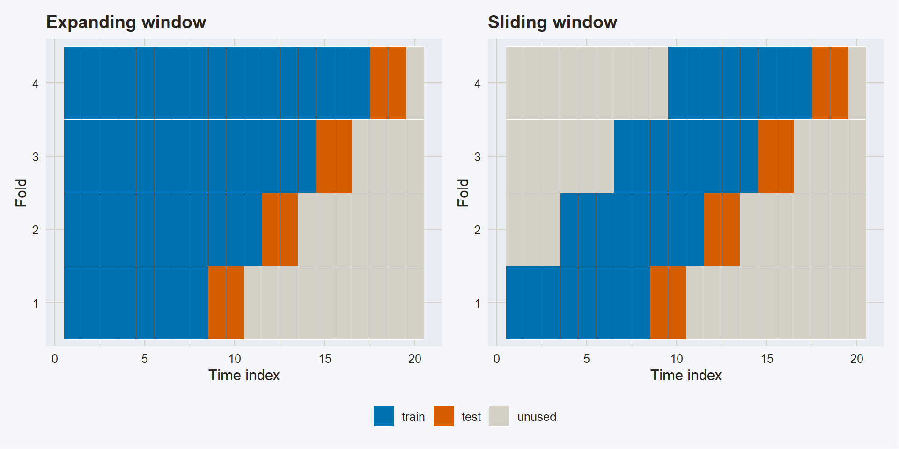
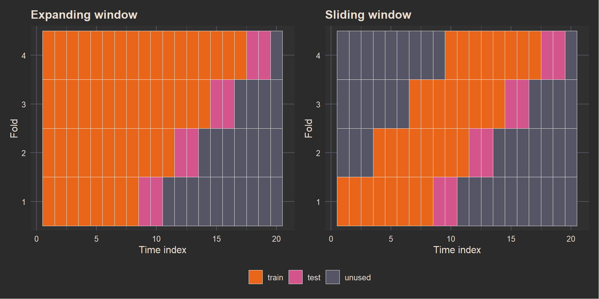

# Time Series Cross-Validation

Modified

August 20, 2026

Code

``` r
library(plotly)        #<1>
library(tidyquant)     #<2>
library(fable.prophet) #<3>
```

1.  For interactive plots.
2.  For retrieving `mexretail` from FRED.
3.  Needed to fit `prophet()` models later in the document.

# 1 The Cost of One Split

Every model built this semester — decomposition benchmarks, ETS, ARIMA, TSLM, dynamic regression, Prophet — has been evaluated with a single train/test split.

## 1.1 Same Models, Two Cutoffs, Two Winners

We fit the same two models on `canadian_gas`, changing only where the training set ends. `canadian_gas` is monthly, January 1960 through February 2005, with a well-documented change in seasonal strength through the 1990s — Cutoff A sits before it, Cutoff B after.

Code

``` r
cutoff_a_train <- canadian_gas |>
  filter_index(. ~ "1995 Dec")                     #<1>

cutoff_a_fit <- cutoff_a_train |>
  model(ets = ETS(Volume), arima = ARIMA(Volume))

cutoff_a_fc <- cutoff_a_fit |>
  forecast(h = 24)                                 #<2>

cutoff_a_accu <- cutoff_a_fc |>
  accuracy(canadian_gas) |>
  select(.model, RMSE, MAE, MAPE, MASE) |>
  arrange(RMSE)
```

1.  Training set: January 1960 through December 1995.
2.  Two years ahead: January 1996 through December 1997.

Code

``` r
cutoff_b_train <- canadian_gas |>
  filter_index(. ~ "1999 Dec")                     #<1>

cutoff_b_fit <- cutoff_b_train |>
  model(ets = ETS(Volume), arima = ARIMA(Volume))

cutoff_b_fc <- cutoff_b_fit |>
  forecast(h = 24)                                 #<2>

cutoff_b_accu <- cutoff_b_fc |>
  accuracy(canadian_gas) |>
  select(.model, RMSE, MAE, MAPE, MASE) |>
  arrange(RMSE)
```

1.  Training set: January 1960 through December 1999 — four years further than Cutoff A.
2.  Two years ahead: January 2000 through December 2001.

## Cutoff A: train through 1995

Code

``` r
cutoff_a_accu
```

## Cutoff B: train through 1999

Code

``` r
cutoff_b_accu
```

Move the training cutoff by four years and the ranking flips. Under Cutoff A, `ETS()` wins — RMSE 0.511 against ARIMA’s 0.673 — with an `ETS(M,A,M)` beating an `ARIMA(2,1,2)(0,1,1)[12]`. Under Cutoff B, `ARIMA()` wins — RMSE 0.362 against ETS’s 0.383 — the very same `ETS(M,A,M)` specification, now beaten by a different fitted order, `ARIMA(1,1,1)(0,1,2)[12]`. One split would have crowned a permanent winner. Two splits show there isn’t one.

# 2 Rolling-Origin Evaluation

Chronological train/test ordering — training data always earlier, test data always later, never shuffled — was established in [Module 1.3](../../../../docs/modules/module_1/03_fcst/forecasting.llms.md#train-test-split). Rolling-origin evaluation keeps that rule intact; it just repeats the split many times, sliding the origin forward through the series instead of fixing it once.

## 2.1 Expanding Windows

Code

``` r
canadian_gas_stretch <- canadian_gas |>
  stretch_tsibble(.step = 12, .init = 120, .id = ".id") #<1>

canadian_gas_stretch |>
  as_tibble() |>
  count(.id, name = "n_obs") |>
  slice(1, 2, n())                                       #<2>
```

1.  `.init = 120` — the first fold trains on 120 months (10 years). `.step = 12` — each following fold adds 12 more months before forecasting again.
2.  Fold 1 has 120 observations, fold 2 has 132, and the last fold — fold 36 — has 540, nearly the entire 542-month series.

## 2.2 Sliding Windows

Code

``` r
canadian_gas_slide <- canadian_gas |>
  slide_tsibble(.size = 120, .step = 12, .id = ".id")    #<1>

canadian_gas_slide |>
  as_tibble() |>
  count(.id, name = "n_obs") |>
  slice(1, 2, n())                                        #<2>
```

1.  `.size = 120` fixes every training window at 120 months. `.step = 12` shifts the window forward one year at a time.
2.  Every fold — first, second, and last (fold 36) — has exactly 120 observations.

## 2.3 Expanding vs. Sliding: A Quick Comparison

|  | **Expanding** (`stretch_tsibble`) | **Sliding** (`slide_tsibble`) |
|----|----|----|
| Training set size | Grows every fold | Fixed (`.size`) |
| Uses full history? | Yes, always from the start | No — drops the oldest observations |
| Cost per fold | Increases over time | Constant |
| Robust to regime changes | No — keeps carrying stale data | Yes — “forgets” the distant past |
| Good when… | Series is short, stable, no structural breaks, and you want to use all available data | Series is long, has structural changes, or compute is limited |
| Main risk | Early folds are unstable (little training data) | Choosing `.size` poorly (too small → unstable; too large → doesn’t adapt) |

[](ts_cv_files/figure-revealjs/fold-diagram-render-1.png)

[](ts_cv_files/figure-revealjs/fold-diagram-render-2.png)

On a toy 20-point index, four expanding folds train on 8, 11, 14, then 17 points before testing on the next 2; four sliding folds always train on exactly 8.

# 3 Evaluating Across the Horizon

## 3.1 From Folds to a Forecast-Horizon Curve

Using the expanding folds already built in `canadian_gas_stretch`, fit both models on every fold and forecast:

Code

``` r
canadian_gas_cv_fc <- canadian_gas_stretch |>
  model(ets = ETS(Volume), arima = ARIMA(Volume)) |>
  forecast(h = 12) |>
  group_by(.id, .model) |>          #<1>
  mutate(h = row_number()) |>
  ungroup() |>
  as_fable(response = "Volume", distribution = Volume)

canadian_gas_cv_accu <- canadian_gas_cv_fc |>
  accuracy(canadian_gas, by = c("h", ".model"))

canadian_gas_cv_accu
```

1.  Group by `.id` **and** `.model` before numbering the horizon. Grouping by `.id` alone lets the row counter run across both models inside a fold — every `arima` row would silently pick up horizons 13–24 instead of 1–12.

`ARIMA()` sits below `ETS()` at every one of the 12 horizons, both curves rising through mid-horizon and easing off by month 12 as the seasonal cycle comes back around.

> **NOTE:**
>
> Scale-dependent measures like RMSE can’t be used to compare *different* series — that’s why we used MASE to compare Cement, Beer, mexretail, and NSW in Module 4.2. Cross-validation compares models on the *same* series, fold after fold, so scale is never an issue here.
>
> RMSE also matches what most of our models are built to do: ETS, ARIMA, and TSLM are fitted by least squares or Gaussian likelihood, which targets the conditional mean — the point forecast that minimizes *squared* error. Grading that forecast with an absolute-error measure evaluates it against a different target (the median). RMSE is the measure that matches the model’s own fitting objective.
>
> One caveat: because it squares errors, RMSE is dominated by a handful of bad folds. A single structural break sitting inside a few folds can outweigh good performance everywhere else.

# 4 The Real Cost of Cross-Validating Every Model

## 4.1 Why This Gets Expensive Fast

Code

``` r
mexretail_full_cv <- mexretail_train |>
  stretch_tsibble(.step = 1, .init = 120, .id = ".id") |> #<1>
  model(
    ets     = ETS(log(y)),
    arima   = ARIMA(log(y)),
    stlf    = stlf_spec,
    tslm    = tslm_spec,
    prophet = prophet_spec
  ) |>
  forecast(h = 12)
```

1.  `.step = 1` on 384 monthly observations with `.init = 120` produces 264 folds — every one of the five models below gets refit from scratch, 264 times.

`mexretail_train` has 384 monthly observations. With `.init = 120`, `.step = 1` produces 264 folds. Five models per fold, each re-running its own search from scratch every time — ARIMA’s stepwise order selection, ETS’s state-space search, Prophet’s changepoint and seasonality fitting. That is 264 × 5 = 1,320 independent model fits for one series, before combinations or a second series enter the picture.

Code

``` r
canadian_gas_recent <- canadian_gas |>
  filter_index("1988 Jan" ~ .)                                        #<1>

cg_stretch_step1  <- canadian_gas_recent |>
  stretch_tsibble(.step = 1,  .init = 100, .id = ".id")                #<2>
cg_stretch_step12 <- canadian_gas_recent |>
  stretch_tsibble(.step = 12, .init = 100, .id = ".id")                #<2>

time_step1  <- system.time(cg_stretch_step1  |> model(ets = ETS(Volume)) |> forecast(h = 12)) #<3>
time_step12 <- system.time(cg_stretch_step12 |> model(ets = ETS(Volume)) |> forecast(h = 12)) #<3>

tibble(
  step        = c(1, 12),
  n_folds     = c(max(cg_stretch_step1$.id), max(cg_stretch_step12$.id)),
  elapsed_sec = c(time_step1[["elapsed"]], time_step12[["elapsed"]])
)                                                                       #<4>
```

1.  A shorter 206-month window — long enough to show the cost multiplier, short enough to keep this comparison quick.
2.  Same data, same `.init`, only `.step` changes — isolates the effect of fold count on runtime.
3.  `system.time()` wraps the full fit-and-forecast step for a single model (`ETS()`), so the comparison reflects fold count alone, not model complexity.
4.  Fold counts come straight from the max `.id` in each stretched tsibble, not a manual calculation — if the window or `.init` changes later, this table stays correct.

Cutting `.step` from 1 to 12 drops the fold count from over a hundred to single digits, and the runtime falls by more than 10×, for a single ETS model on a 206-month window. Scale that to five heavier models across the full 384 months of `mexretail_train`, and `.step = 1` easily crosses the hour mark.

## 4.2 Making It Feasible

**Larger `.step`.** The timing chunk above already made the case: fewer folds means proportionally less fitting.

Code

``` r
canadian_gas |> stretch_tsibble(.step = 12, .init = 120, .id = ".id") #<1>
canadian_gas |> stretch_tsibble(.step = 1,  .init = 120, .id = ".id") #<2>
```

1.  36 folds.
2.  423 folds.

**Freezing the ARIMA order.** Instead of re-running automatic order search on every fold, fix the order found once on the full training set:

Code

``` r
ARIMA(Volume ~ pdq(1, 1, 1) + PDQ(0, 1, 2)) #<1>
```

1.  The order found for Cutoff B in the opening demo (`ARIMA(1,1,1)(0,1,2)[12]`), fixed instead of re-searched from scratch on every fold.

**Screening with a single split first.** Module 4.2 already ran this exact comparison for `mexretail`; we reuse its setup and its seven-model roster through one `mable_spec()` function:

Code

``` r
mexretail <- tq_get(
  "MEXSLRTTO01IXOBM",
  get  = "economic.data",
  from = "1985-01-01",
  to   = "2019-12-31"
) |>
  mutate(date = yearmonth(date)) |>
  rename(y = price) |>
  as_tsibble(index = date)

mexretail_train <- mexretail |> filter(year(date) <= 2017) #<1>
mexretail_test  <- mexretail |> filter(year(date) >  2017)
```

1.  Same split as [Module 4.2](../../../../docs/modules/module_4/02_bootstrap_combinations/bootstrap_combinations.llms.md): training through 2017, the last two years held out.

Code

``` r
tslm_spec  <- TSLM(log(y) ~ trend() + season())
ets_spec   <- ETS(log(y))
arima_spec <- ARIMA(log(y))
stlf_spec  <- decomposition_model(
  STL(log(y) ~ trend(window = NULL) + season(window = "periodic"), robust = TRUE),
  ETS(season_adjust ~ season("N"))
)
prophet_spec <- prophet(y)                                    #<1>

comb_equal_spec <- combination_ensemble(
  tslm_spec, ets_spec, arima_spec, stlf_spec, prophet_spec,
  weights = "equal"
)
comb_inv_var_spec <- combination_ensemble(
  tslm_spec, ets_spec, arima_spec, stlf_spec, prophet_spec,
  weights = "inv_var"
)                                                               #<2>

mable_spec <- function(.train_tsb) {   #<3>
  .train_tsb |>
    model(
      tslm         = tslm_spec,
      ets          = ets_spec,
      arima        = arima_spec,
      stlf         = stlf_spec,
      prophet      = prophet_spec,
      comb_equal   = comb_equal_spec,
      comb_inv_var = comb_inv_var_spec
    )
}
```

1.  The same five base specs from Module 4.2, all on `log(y)` — nothing changes about the models themselves, only how often they get refit.
2.  Two combinations of the five base specs: equal weights, and weights inversely proportional to each model’s variance.
3.  Same seven-model roster as Module 4.2, wrapped in a function so it can be refit on any training tsibble — the single split now, the CV folds below.

Code

``` r
mexretail_fit <- mexretail_train |> mable_spec()          #<1>

mexretail_fc <- mexretail_fit |>
  forecast(h = nrow(mexretail_test))                       #<2>

mexretail_accu <- mexretail_fc |>
  accuracy(mexretail) |>
  select(.model, RMSE, MAE, MAPE, MASE) |>
  arrange(RMSE)

mexretail_accu
```

1.  All seven specs fit once, on the full 2017-and-earlier training set — this is exactly Module 4.2’s comparison, reused rather than redone.
2.  Horizon matches the held-out test set exactly, so every model forecasts the same 24 months.

`arima`, `comb_inv_var`, `prophet`, and `ets` all land under RMSE 2.5. `stlf` (3.72) and `tslm` (11.3) are well behind — in a CV run built purely for speed, those two would be the first cut, which alone would trim the fold × model workload by nearly a third. The run below keeps all seven anyway: the question driving this section is whether the *entire* 4.2 leaderboard holds up under CV, not just its front-runners, so trimming it here would answer a different question than the one being asked.

**Caching.** Every chunk above that fits a model across folds carries `#| cache: true` — recomputing hundreds of fits on every render would defeat the purpose of `freeze: auto`.

**Parallelization.** For CV runs too large even after screening, `future`/`furrr` can distribute folds across cores: a `plan(multisession)` call before the fitting step parallelizes fold-level computation without touching the modeling code itself.

## 4.3 mexretail: Does the 4.2 Winner Still Win?

Code

``` r
mexretail_stretch <- mexretail_train |>
  stretch_tsibble(.step = 12, .init = 264, .id = ".id") #<1>

mexretail_cv_fc <- mexretail_stretch |>
  mable_spec() |>
  forecast(h = 12)                                        #<2>

mexretail_cv_accu <- mexretail_cv_fc |>
  accuracy(mexretail_train) |>
  select(.model, RMSE, MAE, MAPE, MASE) |>
  arrange(RMSE)

mexretail_cv_accu
```

1.  `.init = 264` (22 years) keeps every fold’s training window long enough for `ARIMA()` and `prophet()` to fit reliably; `.step = 12` yields 11 folds, one year apart, instead of 264.
2.  All seven specs, refit on every fold — kept intact so the comparison below covers the full 4.2 leaderboard, not a pre-trimmed one.

`arima` wins under both evaluations — RMSE 2.07 in the single split, RMSE 2.77 averaged over the 11 CV folds. The winner doesn’t change. What does change is the order behind it: `ets` moves from fourth place in the single split to second place under CV, while `prophet` drops from third to fifth. A single split can get the runner-up ranking wrong even when it gets the winner right.

# 5 A Different Kind of CV

## 5.1 Leave-One-Out CV for Selecting Predictors

FPP3 §7.5 uses “CV” for something narrower than everything above: classical leave-one-out cross-validation, applied inside a single `TSLM()` fit to decide which predictors belong in the model.

Code

``` r
canadian_gas_tslm_fit <- canadian_gas |>
  model(
    full       = TSLM(Volume ~ trend() + season()), #<1>
    trend_only = TSLM(Volume ~ trend())              #<2>
  )

canadian_gas_tslm_fit |>
  glance() |>
  select(.model, CV, AICc, adj_r_squared)
```

1.  Trend plus monthly seasonal dummies.
2.  Trend only — the seasonal predictors are dropped.

Dropping the seasonal dummies raises the CV statistic from 1.53 to 1.94 — lower is better, so the seasonal predictors earn their place by this measure too.

> **NOTE:**
>
> This `CV` column evaluates predictor subsets on one fitted model over the whole sample. It is not the rolling-origin evaluation covered everywhere else in this document — no forecasts are made against genuinely future, unseen observations here.

# 6 Key Takeaways

## 6.1 What to Remember

> **IMPORTANT:**
>
> - A single train/test split is one draw from many possible outcomes: the `canadian_gas` demo flipped the `ETS()` vs. `ARIMA()` ranking just by moving the cutoff from 1995 to 1999.
> - Expanding windows (`stretch_tsibble()`) keep all history but drag stale pre-regime-shift data through every fold; sliding windows (`slide_tsibble()`) fix the window size and forget the distant past, at the cost of choosing `.size` deliberately.
> - RMSE fits cross-validation because every fold compares models on the *same* series — scale is never an issue — and because it matches the squared-error objective that ETS, ARIMA, and TSLM are fitted to minimize in the first place.
> - Cross-validation gets expensive by multiplication: folds × models × any per-fold order search. Moving from `.step = 1` to `.step = 12` cut this document’s own timing test by more than 10×; freezing ARIMA orders and screening with a single split first cut it further.
> - On `mexretail`, `ARIMA()` won both the single split (RMSE 2.07) and the 11-fold CV (RMSE 2.77) — the winner from Module 4.2 didn’t change, though the order of the runners-up did.

> **TIP:**
>
> | Session | What we added | Key tool |
> |:---|:---|:---|
> | 4.1 | Multiple seasonal periods | STL + multiple seasons, Fourier terms |
> | 4.2 | Robustness and forecast combinations | Bootstrapping, bagging |
> | **4.3 (now)** | **Robust evaluation** | **Time series cross-validation** |
> | 4.4 | Hierarchical structure | Reconciliation |

**FPP3 references:** [§5.10 Time series cross-validation](https://otexts.com/fpp3/tscv.html) · [§7.5 Selecting predictors](https://otexts.com/fpp3/selecting-predictors.html)

Back to top
