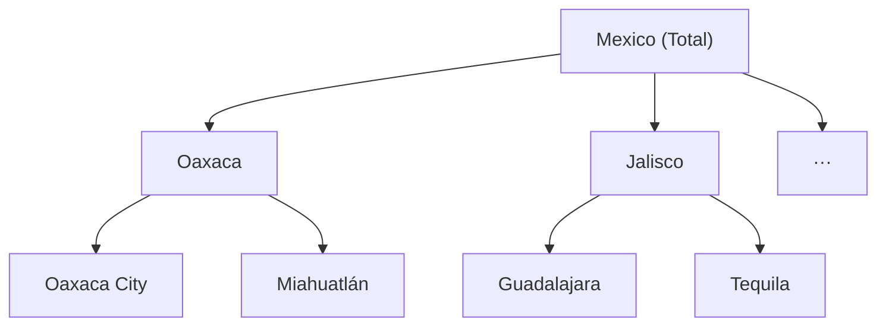
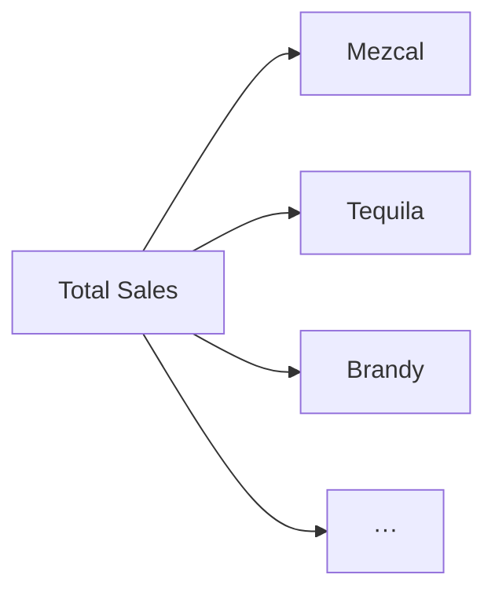
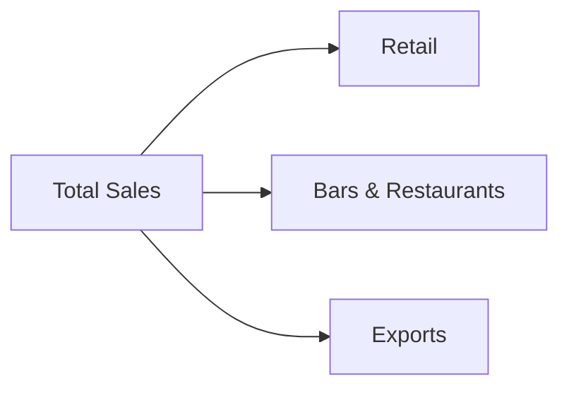
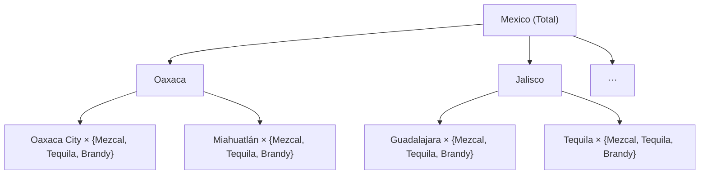
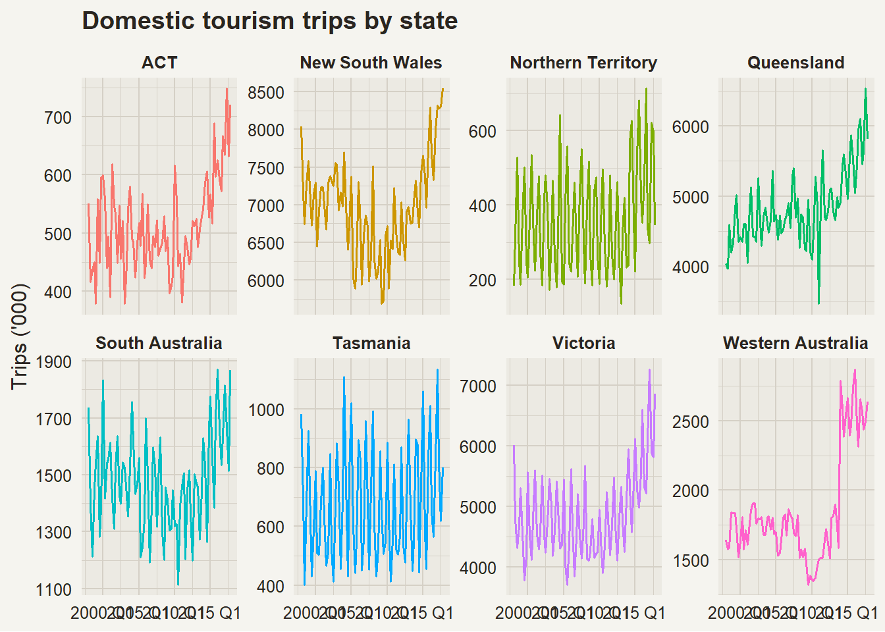
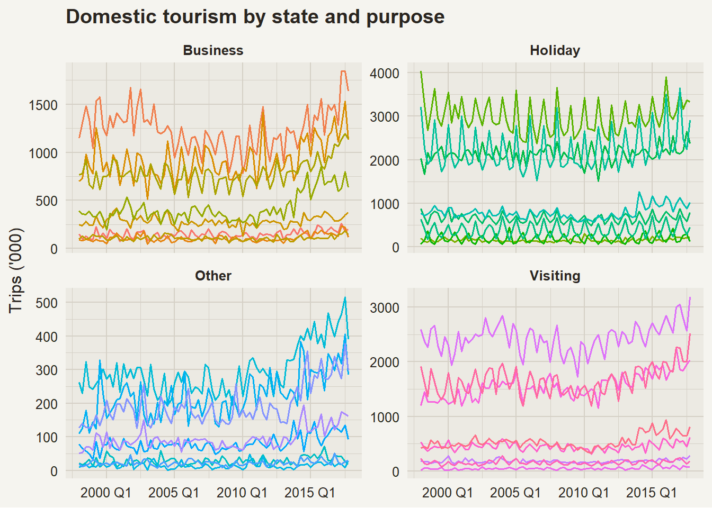
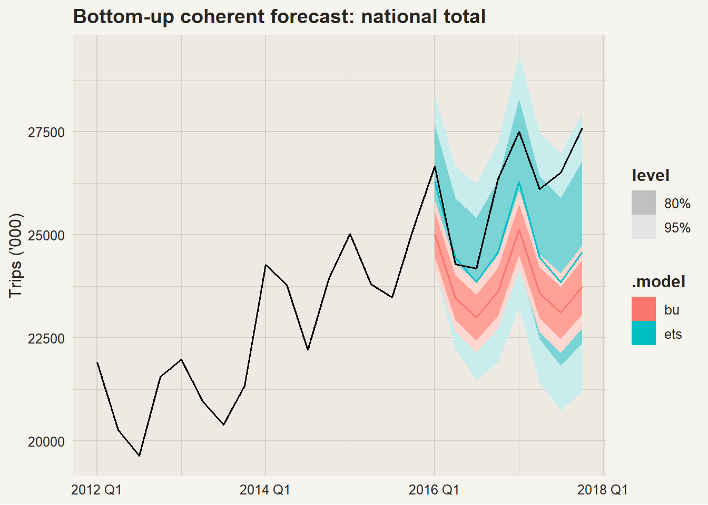
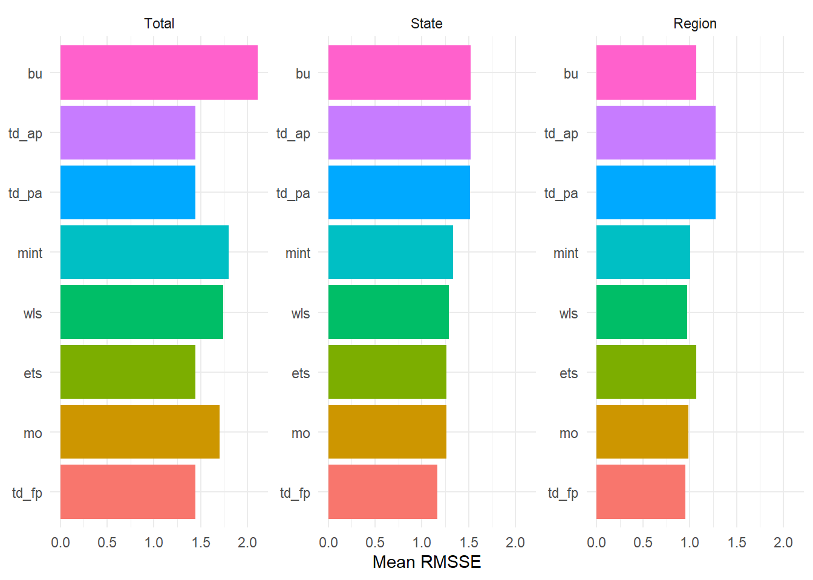
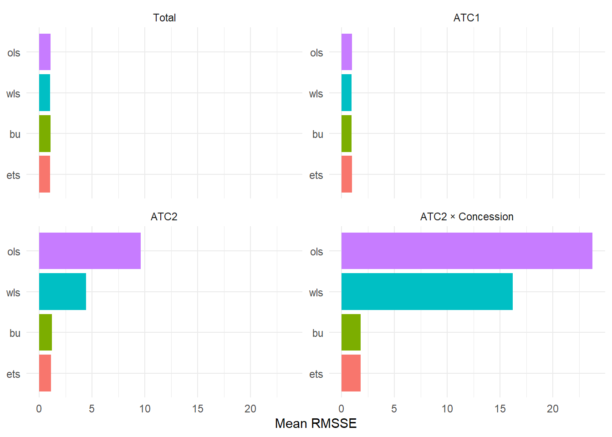

# Hierarchical & Grouped Forecasting

Modified

June 9, 2026

Code

``` r
library(plotly) #<1>
```

1.  For interactive plots in the HTML version.

# 1 Forecast Structures

Real-world data rarely comes as a single series. Sales, tourism demand, energy consumption, and public health metrics are all naturally organized into hierarchies or groups. Forecasting these structures naively — one series at a time — leads to numbers that don’t add up.

Three structures to understand before forecasting them properly.

------------------------------------------------------------------------

### 1.0.1 Hierarchical: Mezcal Sales

In a **hierarchical** structure, every series at a lower level belongs to exactly one series at the level above. The structure is a unique tree.

Code

``` default
graph TD
    MX["Mexico (Total)"]
    OAX["Oaxaca"]
    JAL["Jalisco"]
    ETC["···"]
    OJ["Oaxaca City"]
    MH["Miahuatlán"]
    GDL["Guadalajara"]
    TQ["Tequila"]

    MX --> OAX
    MX --> JAL
    MX --> ETC
    OAX --> OJ
    OAX --> MH
    JAL --> GDL
    JAL --> TQ
```



------------------------------------------------------------------------

### 1.0.2 Grouped: Spirits Sales

In a **grouped** structure, the same set of series can be disaggregated by more than one attribute, none of which nests inside the other.

## By Product Type

Code

``` default
graph LR
    T["Total Sales"]
    M["Mezcal"]
    TQ["Tequila"]
    B["Brandy"]
    E["···"]

    T --> M
    T --> TQ
    T --> B
    T --> E
```



## By Distribution Channel

Code

``` default
graph LR
    T["Total Sales"]
    R["Retail"]
    BR["Bars & Restaurants"]
    EX["Exports"]

    T --> R
    T --> BR
    T --> EX
```



Both diagrams represent the **same total sales**. A bottle of mezcal sold in retail is simultaneously in the “Mezcal” group and the “Retail” group. There is no single unique tree.

------------------------------------------------------------------------

### 1.0.3 Mixed: Alcohol Sales

A **mixed** structure combines a geographic hierarchy (Mexico → State → City) with a grouping attribute (Product type). The most granular series live at the intersection of the hierarchy path and the grouping value.

Code

``` default
graph TD
    T["Mexico (Total)"]
    OAX["Oaxaca"]
    JAL["Jalisco"]
    ETC["···"]
    OJ["Oaxaca City × {Mezcal, Tequila, Brandy}"]
    MH["Miahuatlán × {Mezcal, Tequila, Brandy}"]
    GDL["Guadalajara × {Mezcal, Tequila, Brandy}"]
    TQ_["Tequila × {Mezcal, Tequila, Brandy}"]

    T --> OAX
    T --> JAL
    T --> ETC
    OAX --> OJ
    OAX --> MH
    JAL --> GDL
    JAL --> TQ_
```



# 2 Working with Hierarchical Data in R

The `fpp3` ecosystem (specifically `fabletools`) provides `aggregate_key()` to define hierarchical and grouped structures directly on a `tsibble`.

The `tourism` dataset — quarterly domestic travel in Australia disaggregated by State, Region, and Purpose — is the canonical example in FPP3 Chapter 11.

Code

``` r
tourism
```

------------------------------------------------------------------------

## 2.1 `aggregate_key()`: Defining the Structure

A pure hierarchy uses `/` to denote nesting. A grouped or mixed structure uses `*` to cross attributes.

Code

``` r
tourism_hts <- tourism |>
  aggregate_key(State / Region, Trips = sum(Trips)) #<1>

tourism_hts
```

1.  `State / Region` means *Region is nested within State*. All aggregations — State totals and the national total — are computed and appended automatically.

Code

``` r
tourism_full <- tourism |>
  aggregate_key(State / Region * Purpose, Trips = sum(Trips)) #<1>
```

1.  `* Purpose` crosses the hierarchy with the Purpose grouping. The result includes every combination of (State, Region, Purpose) plus all marginal and total aggregations.

------------------------------------------------------------------------

## 2.2 Visualizing Aggregated Series

`autoplot()` on an aggregated `tsibble` works as usual. Use `filter()` with `is_aggregated()` to select a specific level.

Code

``` numberSource
p <- tourism_hts |>
  filter(!is_aggregated(State), is_aggregated(Region)) |>
  autoplot(Trips) +
  facet_wrap(~ as.character(State), scales = "free_y", ncol = 4) +
  labs(title = "Domestic tourism trips by state", y = "Trips ('000)", x = NULL) +
  theme(legend.position = "none")

p
```

[](hierarchical_files/figure-html/hts-state-plot-1.png "Quarterly domestic trips by Australian state.")

Quarterly domestic trips by Australian state.

------------------------------------------------------------------------

## 2.3 Filtering with `is_aggregated()`

`is_aggregated()` returns `TRUE` for the synthetic aggregation rows created by `aggregate_key()`. Use it inside `filter()` to navigate any level of the hierarchy.

## National Total

Code

``` r
tourism_hts |>
  filter(is_aggregated(State), is_aggregated(Region)) #<1>
```

1.  Both key columns are aggregated → single row per quarter.

## State Level

Code

``` r
tourism_hts |>
  filter(!is_aggregated(State), is_aggregated(Region)) #<1>
```

1.  State is specific but Region is still aggregated → one row per State per quarter.

## Region Level

Code

``` r
tourism_hts |>
  filter(!is_aggregated(State), !is_aggregated(Region)) #<1>
```

1.  Neither column is aggregated → most granular level.

------------------------------------------------------------------------

## 2.4 Mixed Structure: Hierarchy + Grouping

With `tourism_full`, the Purpose grouping is crossed with the State/Region hierarchy:

Code

``` numberSource
p <- tourism_full |>
  filter(!is_aggregated(State), is_aggregated(Region), !is_aggregated(Purpose)) |>
  autoplot(Trips) +
  facet_wrap(~ as.character(Purpose), scales = "free_y") +
  labs(title = "Domestic tourism by state and purpose",
       y = "Trips ('000)", x = NULL) +
  theme(legend.position = "none")

p
```

[](hierarchical_files/figure-html/full-hts-plot-1.png "State-level trips split by purpose of travel.")

State-level trips split by purpose of travel.

# 3 Coherent Forecasts

> **IMPORTANT:**
>
> A set of forecasts is **coherent** if every aggregate-level forecast equals the sum of its component forecasts.
>
> If \hat{y}\_{NSW} and \hat{y}\_{VIC} are state-level forecasts, then the national forecast must satisfy \hat{y}\_{Total} = \hat{y}\_{NSW} + \hat{y}\_{VIC} + \cdots

**Why does this matter?** If you give a retailer a national forecast of 1,000 units and regional forecasts that sum to 850, purchasing, logistics, and budgeting decisions made at different levels of the organization will not align.

------------------------------------------------------------------------

## 3.1 Independent Forecasts Break Coherence

Fitting a model independently to every series — including the aggregated ones — almost never produces coherent forecasts.

Code

``` r
incoherent_fit <- tourism_hts |>
  filter_index(. ~ "2015 Q4") |>
  model(ets = ETS(Trips))

incoherent_fit |>
  forecast(h = 4) |>
  filter(Quarter == yearquarter("2016 Q1")) |>
  filter(
    is_aggregated(State) |
    (!is_aggregated(State) & is_aggregated(Region))
  ) |>
  as_tibble() |>
  select(State, Region, .mean) |>
  mutate(State = as.character(State), Region = as.character(Region))
```

The national ETS forecast will not equal the sum of the state ETS forecasts. This is the incoherence problem that reconciliation methods solve.

# 4 Single-Level Approaches

Single-level approaches fix the coherence problem by choosing **one level as the source of truth** and deriving all other levels from it.

All three methods share the same interface: `reconcile()` takes the fitted mable and wraps the base model with a reconciliation strategy.

------------------------------------------------------------------------

## 4.1 Bottom-Up

Forecast the most disaggregated series, then aggregate up.

Code

``` r
tourism_fit <- tourism_train |>
  model(ets = ETS(Trips))

tourism_fit
```

Code

``` r
tourism_bu <- tourism_fit |>
  reconcile(bu = bottom_up(ets)) #<1>

tourism_bu |>
  forecast(h = "2 years") |>
  filter(is_aggregated(State)) |>
  autoplot(tourism_hts |> filter_index("2012 Q1" ~ .)) +
  labs(title = "Bottom-up coherent forecast: national total",
       y = "Trips ('000)", x = NULL)
```

1.  `bottom_up(ets)` takes the Region-level ETS forecasts as given and sums up. The national and state ETS forecasts are replaced by aggregations of the Region forecasts.

[](hierarchical_files/figure-html/reconcile-bu-1.png)

At the Region level, BU coherent forecasts are identical to the original ETS forecasts — nothing changes there.

------------------------------------------------------------------------

### 4.1.1 Pros and Cons: Bottom-Up

|  |  |
|:---|:---|
| ✅ | Captures disaggregate dynamics. Best when bottom-level series have strong patterns. |
| ✅ | No need to forecast aggregate totals. |
| ❌ | Aggregate-level models are never used — wasteful if the total is well-behaved. |
| ❌ | Bottom-level series can be noisy; aggregating noisy forecasts amplifies errors. |

------------------------------------------------------------------------

## 4.2 Top-Down: Three Methods

Forecast the top level (total), then **disaggregate** using historical proportions.

Three variants differ in how the proportions p_j are estimated:

1.  **Average historical proportions**: p_j = \frac{1}{T}\sum\_{t=1}^{T} \frac{y\_{j,t}}{y\_{\text{Total},t}} — time-average of per-period ratios.

2.  **Proportions of historical averages**: p_j = \frac{\bar{y}\_j}{\bar{y}\_{\text{Total}}} — ratio of long-run averages. Less sensitive to periods with small totals than Method 1.

3.  **Forecast proportions**: p_j computed from base forecasts at each level, not from history — adapts to structural changes.

------------------------------------------------------------------------

### 4.2.1 Top-Down in `reconcile()`

Code

``` r
tourism_td <- tourism_fit |>
  reconcile(
    td_ap = top_down(ets, method = "average_proportions"),    #<1>
    td_pa = top_down(ets, method = "proportion_averages"),    #<2>
    td_fp = top_down(ets, method = "forecast_proportions")    #<3>
  )
```

1.  Average of y\_{j,t}/y\_{Total,t} over time.
2.  \bar{y}\_j / \bar{y}\_{Total} — ratio of long-run averages.
3.  Forward-looking: proportions come from base forecasts rather than history.

------------------------------------------------------------------------

### 4.2.2 Pros and Cons: Top-Down

|  |  |
|:---|:---|
| ✅ | Aggregate model benefits from richer data. |
| ✅ | Simple to implement and explain to stakeholders. |
| ❌ | Historical proportions may not reflect future changes in mix. |
| ❌ | Bottom-level disaggregations lose any local dynamic not visible in the total. |

------------------------------------------------------------------------

## 4.3 Middle-Out

Choose a **middle level** as the anchor: aggregate upward (bottom-up logic), disaggregate downward (top-down logic).

Code

``` r
tourism_mo <- tourism_fit |>
  reconcile(
    mo = middle_out(ets, split = 1) #<1>
  )
```

1.  `split = 1` anchors on the level immediately below the total (State). State forecasts are taken as given; the national total aggregates up, and Region forecasts disaggregate down proportionally.

------------------------------------------------------------------------

### 4.3.1 Pros and Cons: Middle-Out

|  |  |
|:---|:---|
| ✅ | Middle level often has the richest signal: less noisy than the bottom, less aggregated than the top. |
| ✅ | Good compromise when the top-level series is hard to forecast. |
| ❌ | Choice of middle level is subjective and problem-dependent. |
| ❌ | Disaggregation below the middle level inherits the limitations of top-down proportions. |

------------------------------------------------------------------------

### 4.3.2 Comparing Single-Level Approaches

| Method | Truth source | What changes? | Best when… |
|:---|:---|:---|:---|
| Bottom-Up | Bottom level | Top levels re-aggregated | Bottom series are informative and relatively clean |
| Top-Down | Top level | Bottom levels re-proportioned | Top-level dynamics dominate, bottom is too noisy |
| Middle-Out | Middle level | Top aggregated, bottom disaggregated | Middle level has the strongest signal |

> **IMPORTANT:**
>
> All three methods treat one level as infallible and discard information from all others. No forecast level is truly noise-free — and that is exactly the gap that reconciliation methods fill.

# 5 The Forecasting Pipeline

### 5.0.1 The Complete Workflow

Code

``` r
data |>                  #<1>
  aggregate_key(...) |> #<2>
  model(...) |>         #<3>
  reconcile(...) |>     #<4>
  forecast(h = ...)     #<5>
```

1.  A standard `tsibble`.
2.  Define the hierarchy and compute all aggregations automatically.
3.  Fit base models at **every** level.
4.  Wrap base models with reconciliation strategies.
5.  Generate coherent forecasts for all levels and all methods.

# 6 Forecast Reconciliation

Single-level approaches all share the same flaw: they assume one level’s forecasts are perfect and correct all others accordingly. In practice, every level has forecast errors.

**MinT** (Minimum Trace reconciliation) adjusts **all levels simultaneously**, using the statistical structure of forecast errors to find the best coherent set.

> **IMPORTANT:**
>
> | Method                | Who changes?                           |
> |:----------------------|:---------------------------------------|
> | Bottom-Up             | Top levels only                        |
> | Top-Down / Middle-Out | Bottom levels only                     |
> | **MinT**              | **Every level — including the bottom** |
>
> MinT borrows information across levels: a reliable national forecast pulls state forecasts toward proportional shares of the total. A well-forecasted state informs both the national aggregate and its sub-regions.

------------------------------------------------------------------------

## 6.1 The MinT Estimator

All reconciliation methods can be written as a linear transformation of the base forecasts:

\tilde{\mathbf{y}}\_h = \mathbf{S}(\mathbf{S}'\mathbf{W}\_h^{-1}\mathbf{S})^{-1}\mathbf{S}'\mathbf{W}\_h^{-1}\hat{\mathbf{y}}\_h

where:

- \hat{\mathbf{y}}\_h — base forecasts at horizon h, stacked for all levels
- \mathbf{S} — **summing matrix**: encodes the hierarchy. Entry (i,j) = 1 if bottom series j feeds into aggregate series i.
- \mathbf{W}\_h — covariance matrix of h-step-ahead forecast errors across all levels
- \tilde{\mathbf{y}}\_h — the reconciled, coherent forecasts

The different `min_trace()` methods correspond to different estimators of \mathbf{W}\_h.

> **NOTE:**
>
> For a three-series hierarchy (Total → A, B):
>
> \mathbf{S} = \begin{pmatrix} 1 & 1 \\ 1 & 0 \\ 0 & 1 \end{pmatrix}
>
> Row 1 (Total) = A + B. Row 2 (A) = A only. Row 3 (B) = B only. The solution \mathbf{P} = (\mathbf{S}'\mathbf{W}\_h^{-1}\mathbf{S})^{-1}\mathbf{S}'\mathbf{W}\_h^{-1} is the GLS estimator projected back through \mathbf{S}. Single-level approaches are special cases where \mathbf{W}\_h assigns infinite weight to one level.

------------------------------------------------------------------------

### 6.1.1 Weighting the Reconciliation

> **NOTE:**
>
> **OLS** minimizes squared errors treating all series equally — it ignores the fact that some series are more reliably forecast than others.
>
> **WLS** assigns each series a weight inversely proportional to its forecast uncertainty. Series with smaller errors contribute more to the reconciled estimate. In the MinT framework, weights come from the diagonal of \mathbf{W}\_h: higher variance → lower weight.
>
> If the national total is much easier to forecast than any individual region, WLS pulls regional forecasts toward proportions of the reliable national forecast. OLS ignores this entirely.

------------------------------------------------------------------------

## 6.2 Methods in `min_trace()`

| Method | `method =` | \mathbf{W}\_h estimator | Notes |
|:---|:---|:---|:---|
| OLS | `"ols"` | \mathbf{I} | Equal weights. Baseline. |
| WLS structural | `"wls_struct"` | \text{diag}( series count ) | Weights from tree structure only — no data needed. |
| WLS variance | `"wls_var"` | \text{diag}(\hat{\sigma}^2_j) | Weights from in-sample residual variances. |
| MinT sample | `"mint_sample"` | Full sample covariance | Captures correlations. Unstable with many series. |
| **MinT shrink** | **`"mint_shrink"`** | **Regularized covariance** | **Recommended. Robust to limited data.** |

`"mint_shrink"` applies a Ledoit-Wolf shrinkage estimator — regularizing toward a diagonal to avoid overfitting when the number of series is large relative to the number of observations.

------------------------------------------------------------------------

## 6.3 Tourism: All Methods

Code

``` r
tourism_rec <- tourism_fit |>
  reconcile(
    bu    = bottom_up(ets),
    td_ap = top_down(ets, method = "average_proportions"),
    td_pa = top_down(ets, method = "proportion_averages"),
    td_fp = top_down(ets, method = "forecast_proportions"),
    mo    = middle_out(ets, split = 1),
    wls   = min_trace(ets, method = "wls_struct"),
    mint  = min_trace(ets, method = "mint_shrink")
  )

tourism_fc <- tourism_rec |>
  forecast(h = "2 years")
```

------------------------------------------------------------------------

### 6.3.1 Accuracy by Level

Code

``` r
tourism_fc |>
  accuracy(data = tourism_hts, measures = list(RMSSE = RMSSE)) |>
  mutate(
    Level = case_when(
      is_aggregated(State)                           ~ "Total",
      !is_aggregated(State) & is_aggregated(Region)  ~ "State",
      TRUE                                           ~ "Region"
    )
  ) |>
  group_by(.model, Level) |>
  summarise(RMSSE = mean(RMSSE, na.rm = TRUE), .groups = "drop") |>
  mutate(Level  = factor(Level, levels = c("Total", "State", "Region")),
         .model = fct_reorder(.model, RMSSE)) |>
  ggplot(aes(x = .model, y = RMSSE, fill = .model)) +
  geom_col(show.legend = FALSE) +
  facet_wrap(~ Level, scales = "free_y") +
  coord_flip() +
  labs(x = NULL, y = "Mean RMSSE") +
  theme_minimal()
```

[](hierarchical_files/figure-html/accuracy-all-1.png "Mean RMSSE by reconciliation method and aggregation level.")

Mean RMSSE by reconciliation method and aggregation level.

> **TIP:**
>
> Single-level methods tend to perform best at their “home” level (BU at Region, TD at Total) and worse elsewhere. MinT shrink typically does well across all levels because it does not privilege any single level.

# 7 Mixed Structure in Practice: PBS

The `PBS` dataset records monthly Medicare Australia pharmaceutical prescriptions. It has a natural mixed structure: drug categories nest hierarchically (ATC1 → ATC2), and the Concession type (Concessional / General) is an independent grouping attribute.

Code

``` r
pbs_hts <- PBS |>
  filter(ATC1 %in% c("A", "C", "G", "N")) |>       #<1>
  aggregate_key(ATC1 / ATC2 * Concession,           #<2>
                Cost = sum(Cost) / 1e6)

pbs_hts
```

1.  Restrict to four ATC1 categories to keep the example manageable.
2.  `ATC1 / ATC2` is the hierarchy; `* Concession` crosses it with the grouping attribute. Cost is scaled to millions.

------------------------------------------------------------------------

### 7.0.1 PBS: Reconciliation

Code

``` r
pbs_fit <- pbs_train |>
  model(ets = ETS(Cost))

pbs_rec <- pbs_fit |>
  reconcile(
    bu   = bottom_up(ets),
    ols  = min_trace(ets, method = "ols"),
    wls  = min_trace(ets, method = "wls_struct")
  )

pbs_fc <- pbs_rec |>
  forecast(h = "2 years")
```

------------------------------------------------------------------------

### 7.0.2 PBS: Accuracy

Code

``` r
pbs_fc |>
  accuracy(data = pbs_hts, measures = list(RMSSE = RMSSE)) |>
  mutate(
    Level = case_when(
      is_aggregated(ATC1)                                                     ~ "Total",
      !is_aggregated(ATC1) & is_aggregated(ATC2) & is_aggregated(Concession)  ~ "ATC1",
      !is_aggregated(ATC2) & is_aggregated(Concession)                        ~ "ATC2",
      TRUE                                                                     ~ "ATC2 × Concession"
    )
  ) |>
  group_by(.model, Level) |>
  summarise(RMSSE = mean(RMSSE, na.rm = TRUE), .groups = "drop") |>
  mutate(
    Level  = factor(Level, levels = c("Total", "ATC1", "ATC2", "ATC2 × Concession")),
    .model = fct_reorder(.model, RMSSE)
  ) |>
  ggplot(aes(x = .model, y = RMSSE, fill = .model)) +
  geom_col(show.legend = FALSE) +
  facet_wrap(~ Level, scales = "free_y") +
  coord_flip() +
  labs(x = NULL, y = "Mean RMSSE") +
  theme_minimal()
```

[](hierarchical_files/figure-html/pbs-accuracy-1.png "Mean RMSSE for the PBS mixed hierarchy by method and aggregation level.")

Mean RMSSE for the PBS mixed hierarchy by method and aggregation level.

# 8 Summary

| Topic | Key takeaway |
|:---|:---|
| **Structures** | Hierarchical nests; grouped crosses; mixed combines both. |
| **`aggregate_key()`** | Defines the structure and computes all aggregations automatically. |
| **Coherence** | Forecasts that don’t add up create operational inconsistencies. |
| **Bottom-Up** | Safe default when bottom-level series are informative. |
| **Top-Down** | Three variants; forecast proportions is usually preferable. |
| **Middle-Out** | Useful when the middle level has the strongest signal. |
| **MinT** | Adjusts all levels jointly. `mint_shrink` is the recommended default. |

> **TIP:**
>
> 1.  Use `bottom_up()` as your baseline.
> 2.  Fit `min_trace(method = "mint_shrink")` alongside it.
> 3.  Compare with `accuracy()` faceted by aggregation level.

Back to top
