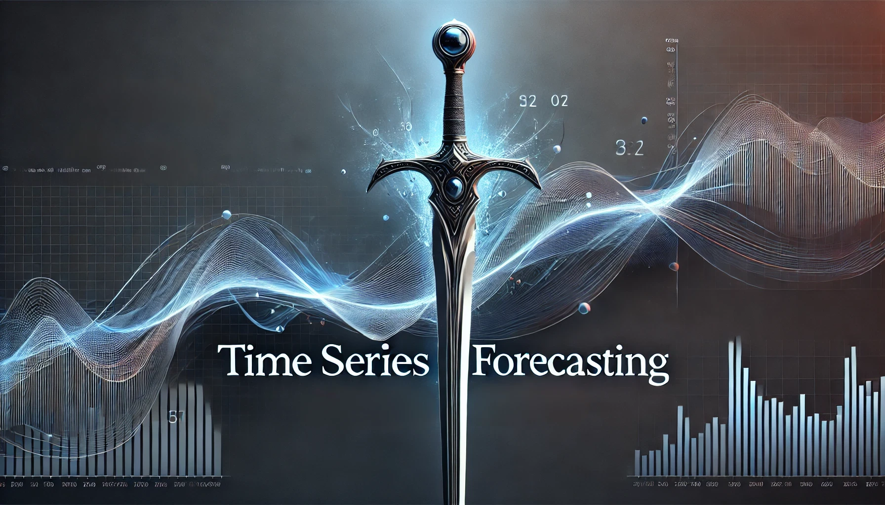

[](images/narsil_cover.webp)

Welcome to the Time Series Forecasting course at ITESO. Here you will find all the materials and resources needed for the course.

# 1 Time Series Forecasting with R

Modern forecasting workflows using [**tidy data principles**](https://r4ds.hadley.nz/data-tidy.html#sec-tidy-data) with the **tidyverts** ecosystem.

## 1.1 What you’ll learn

- Build tidy time series with [**tsibble**](https://tsibble.tidyverts.org) and modern data pipelines
- Create forecasts with **ETS**, **ARIMA**, and regression-based models via [**fable**](https://fable.tidyverts.org/)
- Engineer time features and diagnose models with [**feasts**](https://feasts.tidyverts.org/))
- Evaluate with time-aware resampling and communicate uncertainty
- Scale to multiple series and hierarchies when needed

> **TIP:**
>
> Forecasting improves with *iteration*: start simple, validate honestly, and refine. Keep a tight loop of **fit → diagnose → evaluate → communicate**.

## 1.2 Start here

> **NOTE:**
>
> **New to the site?** Use the links below to jump in.

- [Modules](docs/modules/index.llms.md)
- [In-class exercises](docs/exercises/index.llms.md)

------------------------------------------------------------------------

## 1.3 Course map

### 1.3.1 1. Foundations

- tidy data + time indexes
- `tsibble` keys, gaps, and intervals

### 1.3.2 2. Patterns & features

- seasonality, trend, decomposition
- diagnostics and features (`feasts`)

### 1.3.3 3. Core forecasting models

- ETS + ARIMA
- model comparison and selection

### 1.3.4 4. Regression workflows

- time features, events, and covariates
- forecast reconciliation ideas

### 1.3.5 5. Evaluation & communication

- time series CV and backtesting
- uncertainty, intervals, and narratives

### 1.3.6 6. Multiple series

- grouped models
- hierarchies and reconciliation

------------------------------------------------------------------------

## 1.4 Quick setup check

Run this once after installing packages to confirm your environment.

Code

``` r
library(tidyverse)
library(tsibble)
library(fable)
library(feasts)

sessionInfo()
```

> **WARNING:**
>
> - **Data leakage**: don’t let future information sneak into features.
> - **Random CV**: use **time-aware** resampling/backtesting.
> - **Overfitting**: a more complex model isn’t automatically better.

------------------------------------------------------------------------

## 1.5 Primary toolchain

We’ll use a tidy workflow centered on:

- **tidyverse** for data wrangling
- **tsibble** for time-aware tibbles
- **fable** for modeling and forecasting
- **feasts** for decomposition, features, and diagnostics

Recommended reading: [*Forecasting: Principles and Practice*](https://otexts.com/fpp3/) (free online).

------------------------------------------------------------------------

Back to top
