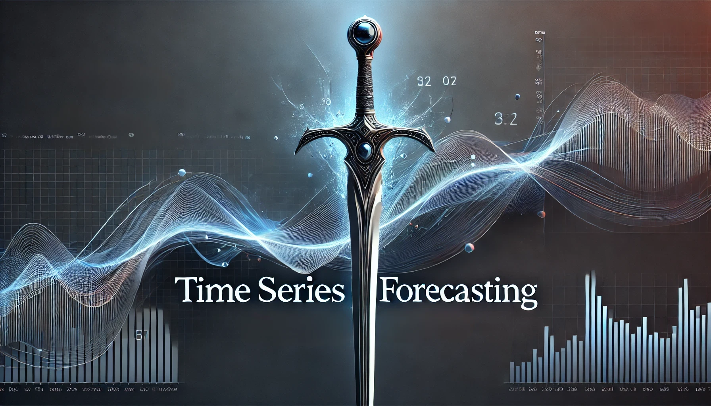

Course materials for **Time Series Forecasting** at ITESO. Everything you need to follow the course lives here: lessons, in-class exercises, and reference material.

Grades, deadlines, and submissions live in Canvas.

## How the course is built

This course is not a catalogue of forecasting methods. You build **one model** and improve it across four modules, and every new technique has to earn its place by beating what you already had.

### Module 1 — Decomposition baseline

Understand the series, split it into components, and produce your first honest forecast: `STL + SNAIVE + Drift`. Simple, interpretable, and hard to beat.

### Module 2 — ETS & ARIMA filters

Replace the naive pieces with statistical filters. Same architecture, smarter trend-cycle: `STL + ETS` or `STL + ARIMA`.

### Module 3 — Exogenous variables

Your model starts to know what is happening outside the series: predictors, events, and regression with ARIMA errors.

### Module 4 — Robustness and scale

Real data is messy. Multiple seasonalities, outliers, bootstrapping, combinations, and forecasting hundreds of series at once.

[Browse the modules →](docs/modules/index.llms.md)

## Start here

> **NOTE:**
>
> 1.  Work through [Setup](docs/more/r-tools/setup.llms.md) — install R and Positron, and get your packages ready.
> 2.  Start with [Module 1.0 — Introduction](docs/modules/module_1/00_intro/intro.llms.md).
> 3.  Practice with the [Exercises](docs/exercises/index.llms.md).

## What you will learn

- Build tidy time series with [tsibble](https://tsibble.tidyverts.org) and reproducible data pipelines
- Decompose series into trend-cycle, seasonal, and remainder components
- Fit and compare **benchmark**, **ETS**, **ARIMA**, **regression**, and **Prophet** models with [fable](https://fable.tidyverts.org/)
- Diagnose models honestly: residual analysis, information criteria, and time-aware evaluation
- Forecast at scale: multiple seasonalities, model combinations, and hierarchical structures

> **TIP:**
>
> Forecasting improves with *iteration*: start simple, validate honestly, refine. Keep a tight loop of **fit → diagnose → evaluate → communicate**.

> **WARNING:**
>
> - **Data leakage** — future information sneaking into your predictors.
> - **Random cross-validation** — time series need time-aware resampling.
> - **Complexity worship** — a more elaborate model is not automatically better. Sometimes the baseline wins, and that is a result, not a failure.

## Tools we use

|  |  |
|----|----|
| **Language** | R, with the native pipe `\|>` |
| **Editor** | [Positron](https://positron.posit.co/) — the IDE we use in class |
| **Packages** | [tidyverse](https://www.tidyverse.org/) for wrangling, [fpp3](https://github.com/robjhyndman/fpp3-package) for the whole tidyverts stack (`tsibble`, `fable`, `feasts`) |
| **Documents** | [Quarto](https://quarto.org/), bundled with Positron |
| **Textbook** | [*Forecasting: Principles and Practice* (3rd ed.)](https://otexts.com/fpp3/) — free online |

Installation instructions are in [Setup](docs/more/r-tools/setup.llms.md).

## Using AI in this course

AI assistants are part of this course by design. **Elendil TA** exists so you have course-aware help: it knows the syllabus, the notation, and the `fable` workflow we use.

Use it to debug errors, understand a concept, or review your code. The line is simple:

> **IMPORTANT:**
>
> You must be able to **explain, defend, and modify** anything you submit. If you cannot, it is not yours.

Get Elendil TA as a [Claude Skill](docs/more/elendil-ta/index.llms.md) or as a [Custom GPT](https://chatgpt.com/g/g-68e6907c12a48191a07fb0888500a7fa-elendil-ta).

Back to top
