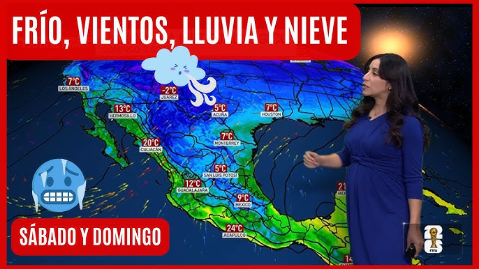
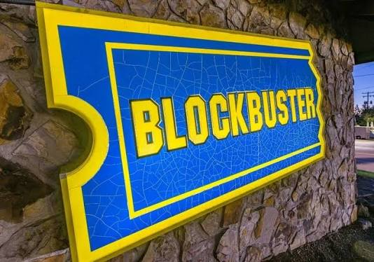
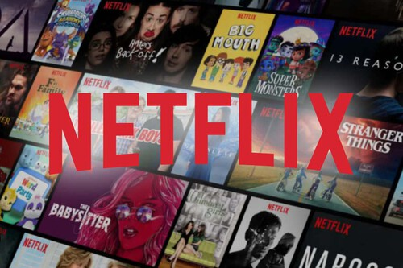

```{r}
#| label: setup
#| include: false

library(tidyverse)
library(tsibble)
library(fable)
library(ggtime)
```

```{r}
#| label: narsil-setup
#| include: false

source(here::here("R/narsil_theme.R"))
theme_set(theme_narsil())
```

```{r}
#| label: data-mundiales
#| include: false

mundiales <- tibble(
  anio = c(1994, 1998, 2002, 2006, 2010, 2014, 2018, 2022, 2026),
  ronda = c("Octavos", "Octavos", "Octavos", "Octavos", "Octavos",
            "Octavos", "Octavos", "Fase de grupos", "Octavos")
) |>
  mutate(
    ronda = factor(
      ronda,
      levels = c("Fase de grupos", "Octavos", "Cuartos", "Semifinal", "Final", "Campeón")
    ),
    destacar = anio %in% c(2022, 2026)
  )
```

```{r}
#| label: mundiales-render
#| echo: false
#| include: false

mundiales_p <- mundiales |>
  ggplot(aes(x = anio, y = ronda, group = 1)) +
  geom_line(linewidth = 1, colour = "grey60") +
  geom_point(aes(colour = destacar), size = 5) +
  scale_x_continuous(breaks = mundiales$anio) +
  scale_colour_manual(values = c(`TRUE` = "#D55E00", `FALSE` = "grey40"), guide = "none") +
  labs(
    title = "México en los Mundiales desde 1994",
    x = NULL, y = NULL
  )

mundiales_p + theme_narsil()
```

```{r}
#| label: data-paleteria
#| include: false

set.seed(2026)

paleteria <- tibble(
  mes = yearmonth("2024 Jan") + 0:35
) |>
  mutate(
    mes_num = month(mes),
    tendencia = 300 + 6 * row_number(),
    estacionalidad = 130 * sin(2 * pi * (mes_num - 5) / 12),
    ventas = round(tendencia + estacionalidad + rnorm(36, sd = 12))
  ) |>
  select(mes, ventas) |>
  as_tsibble(index = mes)

# Lo que el grupo ve primero: solo hasta junio 2026
paleteria_visible <- paleteria |>
  filter(mes <= yearmonth("2026 Jun"))

# Los 6 meses que se ocultan para la actividad (incluye el pico de agosto)
paleteria_oculto <- paleteria |>
  filter(mes > yearmonth("2026 Jun"))
```

```{r}
#| label: paleteria-oculto-render
#| echo: false
#| include: false

paleteria_visible |>
  autoplot(ventas) +
  geom_point(size = 1.5) +
  labs(
    title = "Ventas mensuales — Paletería (ilustrativo)",
    x = NULL,
    y = "Paletas vendidas"
  ) +
  theme_narsil()
```


```{r}
#| label: paleteria-revelado-render
#| echo: false
#| include: false

paleteria |>
  autoplot(ventas) +
  geom_point(aes(colour = mes > yearmonth("2026 Jun")), size = 1.5) +
  geom_label(
    data = paleteria |> filter(mes > yearmonth("2026 Jun")),
    aes(label = ventas),
    nudge_y = 25,
    size = 5,
    fontface = "bold",
    colour = "#D55E00",
    fill = "white"
  ) +
  scale_colour_manual(
    values = c(`TRUE` = "#D55E00", `FALSE` = "grey30"),
    guide = "none"
  ) +
  labs(
    title = "Y lo que pasó después...",
    x = NULL,
    y = "Paletas vendidas"
  ) +
  theme_narsil()
```

# El arte de anticipar el futuro {background-color="black"}

::: {.notes}
⏱ 0:00. Preséntate en 30 segundos. No arranques con la carrera, arranca con la pregunta.
:::

## ¿Quién de aquí es adivino? 🔮

- Manos arriba quien sepa exactamente qué va a pasar mañana...
- ... ¿va a llover?, con el tráfico, con tu antojo de comida
- ¿Hoy gana Egipto o Argenfifa?

::: {.notes}
Pausa real, espera que casi nadie levante la mano (o que lo hagan de broma). Deja que se rían un poco.
:::

## Pero el domingo todos fuimos adivinos


- ¿Cuántos aquí dijeron "hoy le ganamos" antes del partido contra Inglaterra?

:::{.fragment}
{fig-align="center"}
:::

- México compitió de tú a tú contra una potencia — con hombre de más, hasta se puso el marcador cerca

::: {.notes}
Tono: cálido, no burlón. Es una herida fresca (fue ayer). No te quedes mucho tiempo aquí — 1 minuto máximo, valida el orgullo del equipo, y sigue.
Si notas que el tema sigue muy sensible, salta directo al siguiente slide sin profundizar.
:::

## Spoiler: eso que hicimos todos tiene nombre

::: {.callout-important appearance="simple"}
Calcular quién va a ganar, cuánto va a subir la gasolina, o si va a llover — es hacer **pronósticos**. Y sí, se puede aprender a hacerlo mejor que "a ojo".
:::

{fig-align="center"}

::: {.notes}
Esta es la frase-ancla de toda la sesión. Repítela más adelante casi textual.
:::

# ¿Qué es una serie de tiempo? {background-color="black"}

::: {.notes}
⏱ 0:10
:::

## Cualquier cosa que se mide a través del tiempo

- El precio de la gasolina, mes a mes
- Los streams de tu canción favorita, día a día
- Los goles de tu equipo, partido a partido
- Cuánta gente viaja en avión de GDL a CDMX
- Literal cualquier número que cambia con el tiempo

## Ejemplo 1 — Un patrón que se repite

```{r}
#| label: mundiales-slide-render
#| echo: false
#| ref-parent: mundiales-render

mundiales_p + theme_narsil()
```

- Cada punto es un Mundial. Cada altura, hasta dónde llegó México
- 2022 rompió el patrón... y 2026 lo regresó

::: {.notes}
Aquí es donde el dato "cae bien": no estamos criticando al equipo, estamos mostrando que hay un patrón estadístico real (7 de 9 veces, mismo resultado). Esto es honestamente fascinante, no doloroso, si lo enmarcas así.
Alternativa si el grupo sigue sensible: sustituir por "cuántas veces nieva en Guadalajara" (spoiler: nunca) como ejemplo de patrón perfecto.
:::

## Ejemplo 2 — Algo bien cotidiano

- Ventas de una paletería, mes con mes

:::{.fragment}
```{r}
#| label: paleteria-slide-1
#| echo: false
#| ref-parent: paleteria-oculto-render

paleteria_visible |>
  autoplot(ventas) +
  geom_point(size = 1.5) +
  labs(title = "Ventas mensuales — Paletería (ilustrativo)", x = NULL, y = "Paletas vendidas") +
  theme_narsil()
```
:::

::: {.notes}
Guárdate esta gráfica — la vamos a volver a usar en la actividad. No reveles nada todavía.
:::

## En resumen

::: {.callout-note appearance="simple"}
**Serie de tiempo** = cualquier variable que va cambiando, medida en orden, a través del tiempo.
:::

# ¿Por qué es tan difícil predecir el futuro? {background-color="black"}

::: {.notes}
⏱ 0:20
:::

## Señal vs. ruido

- **Señal**: lo que sí sigue un patrón (las estaciones del año)
- **Ruido**: lo que es pura casualidad (un rebote de balón, un )

## Lo predecible

- El estado del tiempo de mañana (con margen de error, pero se acerca)
- Que en diciembre bajan las ventas de helado
- Que noviembre trae Buen Fin
- Que se agotan las flores y chocolates el 14 de febrero

## Lo impredecible

- Un sismo
- Un penal fallado en el último minuto
- Cuándo tu mamá se va a dar cuenta de que llegaste tarde

::: {.notes}
El chiste de la mamá siempre funciona con este público. Pausa para la risa.
:::

## Hasta los expertos se equivocan

- Empresas enteras no vieron venir cambios grandes 

:::{.fragment}

::: {layout-ncol=2}

{width="50%"}

{width="50%"}

:::

:::

- No se trata de tener la bola de cristal perfecta

:::{.fragment}
::: {.callout-important appearance="simple"}
Se trata de **leer patrones mejor que la persona de al lado** — no de adivinar sin margen de error.
:::
:::

# Los 3 patrones que todo pronosticador busca {background-color="black"}

::: {.notes}
⏱ 0:35
:::

## Tendencia 📈

- La dirección general, a largo plazo
- Ejemplo: las ventas de la paletería suben poco a poco cada año
- La población crece año con año
- Las ventas de discos (físicos) caen cada año

## Estacionalidad 🌞❄️

- Lo que se repite cada cierto periodo fijo (cada año, cada semana)
- Ejemplos: 
    - la paletería vende más en verano, siempre
    - Se venden más juguetes en diciembre cada año
    - más gente va al cine en fin de semana
    - hay más tráfico a las 8am que a las 4am 

## Ciclos 🔁

- Patrones que se repiten, pero sin un periodo fijo exacto
- Ejemplos: 
    - México llegando a octavos casi cada Mundial — con una excepción en 2022
    - Crisis financieras

:::{.fragment}
```{r}
#| label: mundiales-slide-2
#| echo: false
#| ref-parent: mundiales-render

mundiales_p + theme_narsil()
```
:::

::: {.notes}
Este es el mismo dato de antes, pero ahora con vocabulario técnico encima. El punto pedagógico: un patrón se puede romper (2022) y regresar (2026) — eso también es parte de la ciencia, no invalida el patrón.
:::

## ¿Entonces ya sabemos qué pasará en 2030?

- No con certeza — pero el patrón nos da una **apuesta informada**, no una adivinanza a ciegas
- Eso es literalmente lo que hace un modelo de pronóstico

# Actividad: Forecast Battle ⚔️ {background-color="black"}

::: {.notes}
⏱ 0:50. Este es el bloque más importante — dale el tiempo que pida, aunque recortes el cierre.
:::

## Las reglas

- Van a ver una gráfica con los últimos meses **ocultos**
- En equipos (o individualmente) escriban su **predicción de los siguientes 6 meses**
- El que se acerque más, gana

::: {.notes}
Con menos de 20, mejor individual o parejas — más participación real que en equipos grandes.
:::

## Ronda 1 — el reto

```{r}
#| label: paleteria-slide-2
#| echo: false
#| ref-parent: paleteria-oculto-render

paleteria_visible |>
  autoplot(ventas) +
  geom_point(size = 1.5) +
  labs(title = "¿Qué va a pasar en los próximos 6 meses?", x = NULL, y = "Paletas vendidas") +
  theme_narsil()
```

- ¿Sube, baja, o se mantiene? ¿Cuánto?

::: {.notes}
Da 2-3 minutos. Pide que griten o levanten su número en papel. Si tienes Menti a la mano, este es el único momento del día para usarlo (una sola pregunta, para no gastar tu plan gratis).
:::

## ¡Revelación! 🎉

```{r}
#| label: paleteria-slide-3
#| echo: false
#| ref-parent: paleteria-revelado-render

paleteria |>
  autoplot(ventas) +
  geom_point(aes(colour = mes > yearmonth("2026 Jun")), size = 1.5) +
  geom_label(
    data = paleteria |> filter(mes > yearmonth("2026 Jun")),
    aes(label = ventas),
    nudge_y = 25,
    size = 5,
    fontface = "bold",
    colour = "#D55E00",
    fill = "white"
  ) +
  scale_colour_manual(values = c(`TRUE` = "#D55E00", `FALSE` = "grey30"), guide = "none") +
  labs(title = "Y lo que pasó después...", x = NULL, y = "Paletas vendidas") +
  theme_narsil()
```

- ¿Quién le atinó? ¿En qué se fijaron para adivinar?

::: {.notes}
Casi siempre alguien dice "porque en verano se vende más" — ahí conectas: "eso que acabas de decir se llama estacionalidad, y ya lo entendiste sin que te lo explicara."
Reparte el premio/dulce aquí.
:::

## Las ventas reales

```{r}
paleteria |> filter(mes > yearmonth("2026 Jun"))
```

## Bonus — ahora que México ya salió...

- ¿A quién le va tu corazón para quedarse con la Copa?
- Vota levantando la mano

::: {.notes}
Cierre emocional positivo del tema mundialista: no se resuelve hoy, pero deja el sabor de "seguimos viendo el torneo con ganas", no de derrota. No uses Menti aquí, solo mano levantada — rápido y ligero.
:::

# Así lo hacen los profesionales {background-color="black"}

::: {.notes}
⏱ 1:10
:::

## Nombres que vas a escuchar en la carrera

- **ETS**, **ARIMA** — métodos estadísticos clásicos
- **Prophet** — creado por Meta (sí, la misma empresa de Facebook)
- Todo esto se enseña con **R** y Python en Ingeniería Financiera

## ¿Quién usa esto en la vida real?

- Uber calculando cuántos coches va a necesitar
- Walmart decidiendo cuánto surtir cada tienda
- Bancos midiendo riesgo antes de dar un crédito
- Netflix, prediciendo cuántos servidores necesita para el viernes de estreno

## Un vistazo real

```{r}
#| label: demo-codigo

fit <- paleteria_visible |> model(ETS(ventas ~ error("A") + trend("Ad") + season("A")))
fc <- fit |> forecast(h = 6)
fc |> autoplot(paleteria_visible)
```

```{r}
fc |> 
    pull(.mean)
```
::: {.notes}
Este chunk SÍ va con echo:true — es el único momento "con código" de toda la sesión. Dilo en voz alta: "esto que tardamos 10 minutos adivinando entre todos, la computadora lo hace con 3 líneas."
:::

## La computadora, contra nosotros

```{r}
#| label: demo-render
#| echo: false

fc |>
  autoplot(paleteria) +
  labs(
    title = "El modelo vs. lo que realmente pasó",
    x = NULL, y = "Paletas vendidas"
  ) +
  theme_narsil()
```

- La zona sombreada es la incertidumbre del modelo — ni la máquina promete certeza absoluta

# ¿Por qué estudiar esto en Ingeniería Financiera? {background-color="black"}

::: {.notes}
⏱ 1:20
:::

## No es solo "contar dinero"

- Es entender riesgo, patrones, y tomar mejores decisiones con datos
- Las finanzas modernas son, en buena parte, ciencia de datos aplicada

## Lo que te llevas de la carrera

- Programación en R, Python (y en otras herramientas)
- Pensamiento estadístico — para no dejarte engañar por coincidencias
- Casos reales: bancos, fintechs, mercados, empresas

## A dónde puede llevarte

- Banca y análisis de riesgo
- Fintech y startups
- Ciencia de datos y consultoría

::: {.notes}
Aquí entra tu anécdota personal — corta, real, no de venta. 1-2 minutos.
:::

# El futuro no se adivina, se lee {background-color="black"}

::: {.notes}
⏱ 1:30. Cierre.
:::

## La frase que se llevan a casa

::: {.callout-important appearance="simple"}
Nadie tiene bola de cristal. Pero quien sabe leer patrones, le atina más seguido que quien solo adivina.
:::

## ¿Preguntas?

## Gracias 🙌

- [pbenavidesh.github.io/narsil](https://pbenavidesh.github.io/narsil/)
- pbenavides@iteso.mx